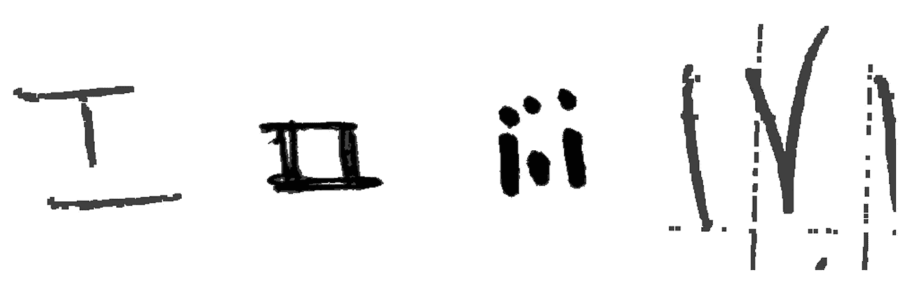
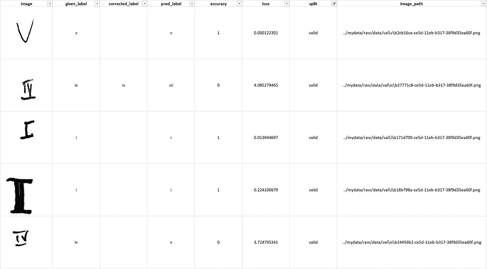
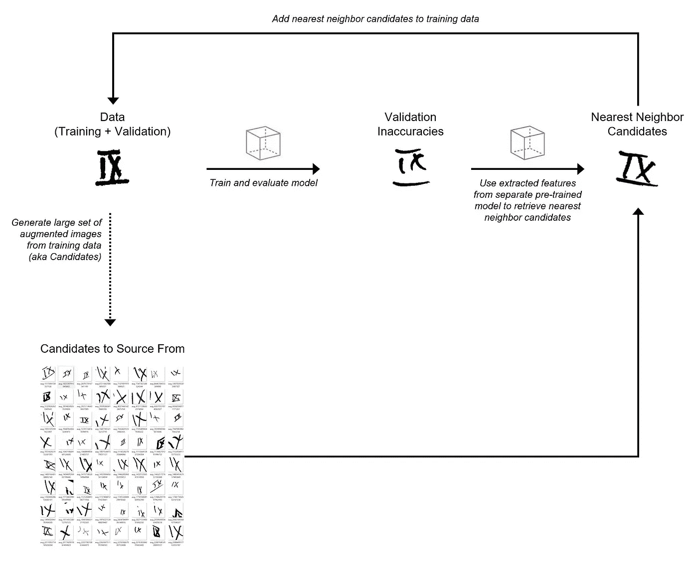
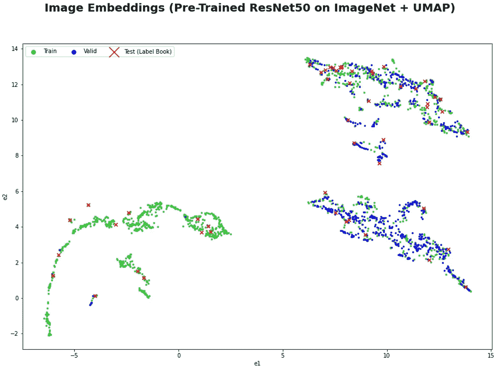
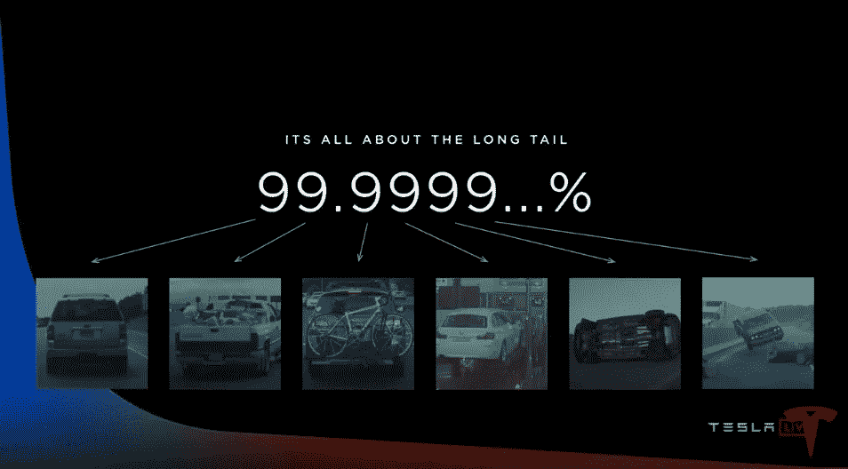

# 我是如何赢得吴恩达首届以数据为中心的人工智能竞赛的

> 原文：<https://towardsdatascience.com/how-i-won-andrew-ngs-very-first-data-centric-ai-competition-e02001268bda?source=collection_archive---------8----------------------->

## “数据增强”技术最具创新奖

推特上的公告

# 介绍

在过去的几个月里，我有巨大的机会参加了[吴恩达](https://medium.com/u/592ce2a67248?source=post_page-----e02001268bda--------------------------------)的首届以数据为中心的人工智能竞赛。我很高兴也很感激能分享我是如何因为我的“数据提升”技术获得最具创新性的奖项的。

这场[竞赛](https://worksheets.codalab.org/worksheets/0x7a8721f11e61436e93ac8f76da83f0e6)确实是独一无二的，不同于传统的人工智能竞赛，因为它严格地专注于如何改进数据，而不是模型，根据我自己的经验，模型通常是改进人工智能系统的最佳方式。

鉴于开源机器学习模型库的丰富性(包括预先训练的深度学习模型)，模型方面或多或少是大多数商业应用程序的已解决问题。我们需要的是新的工具和创新技术来系统地改进数据，Andrew 将其称为[烹饪一顿饭的高质量原料](https://www.deeplearning.ai/wp-content/uploads/2021/06/MLOps-From-Model-centric-to-Data-centric-AI.pdf)(训练一个模型)。

这篇博文的其余部分将由三个主要部分组成:

1.  比赛概述
2.  我的“数据提升”技术解决方案
3.  这项技术的动机以及它如何推广到不同的应用

# 比赛概述

在这个竞赛中，参与者被给予从 1 到 10 的手写罗马数字的～3K 图像，我们的任务是优化模型在罗马数字分类中的性能。我们还得到一本包含 52 幅图像的标签书，作为我们自己实验的小测试集。本标签簿不用于最终评估。

模型结构保持固定(截止 ResNet50)并训练 100 个时期，而模型权重基于验证集的准确性在时期中选择。

虽然模型和训练过程是固定的，但我们可以自由地改进数据集，改变训练和验证数据的分割。我们也可以添加新的图像，但提交必须少于训练和验证分裂的 10K 图像组合。

在提交我们改进的数据集后，参与者将根据一组隐藏的测试图像进行评估。

给定训练数据集中的示例

鉴于只允许少于 10K 图像的关键约束，参与者必须专注于在缺乏“大数据”的情况下获得“好数据”，根据 Andrew 的说法，这在更传统行业(例如，制造业、农业和医疗保健)的人工智能应用中非常常见。

点击[此处](https://worksheets.codalab.org/worksheets/0x7a8721f11e61436e93ac8f76da83f0e6)了解竞赛规则的全部详情。

# 我的“数据提升”技术解决方案

在进入我的解决方案的关键之前，我做的第一件事是遵循修复标签和删除坏数据的常见做法。

为了简化这个工作流程，我编写了一个 Python 程序来评估一个给定的数据集(在将它输入到固定模型和训练过程中之后)，并生成一个电子表格，其中包含每个图像的记录指标。

该电子表格包含每个图像的给定标签、预测标签(使用固定模型)和损失，这对于隔离不准确和边缘情况非常有用。下面的例子。

Python 生成的数据评估电子表格示例，用于简化以数据为中心的人工智能工作流

我最初使用这个电子表格来识别错误标记的图像和明显不是从 1 到 10 的罗马数字的图像(例如，在原始训练集中有一个心脏图像)。

现在来看一下**“数据增强”**技术。以下是高级步骤:

1.  从训练数据中生成一个非常大的随机增强图像集(将这些图像视为“候选”图像源)。
2.  训练初始模型并在验证集上进行预测。
3.  使用另一个预训练模型从验证图像和增强图像中提取特征(也称为嵌入)。
4.  对于每个错误分类的验证图像，使用提取的特征从增强图像集中检索最近的邻居(基于余弦相似性)。将这些最近邻增强图像添加到训练集中。我将把这个过程称为“数据提升”。
5.  使用添加的增强图像重新训练模型，并在验证集上进行预测。
6.  重复步骤 4-6，直到我们达到 10K 图像的极限。

参见下图中的迭代程序:

将来自训练集的增强图像作为来源的候选的“数据提升”过程

在上面的过程中需要注意一些事情:

*   虽然我在这次比赛中使用了增强图像，但实际上我们可以使用任何大型图像集作为来源。
*   我从训练集中生成了大约 100 万张随机增强图像，作为候选来源
*   数据评估电子表格用于跟踪不准确性(错误分类的图像)和注释数据。或者，我也用 PostgreSQL 后端创建了一个 [Label Studio](https://labelstud.io/) 的实例，但是由于不必要的开销，我决定不在这次比赛中使用它。
*   对于预训练的模型，我使用了在 ImageNet 上训练的 ResNet50。
*   我使用了[骚扰](https://github.com/spotify/annoy)包来执行近似最近邻搜索。
*   每个错误分类验证图像要检索的最近邻的数量是一个超参数。

从图像中提取特征的一个很酷的事情是，我们可以在 2D 用 [UMAP](https://umap-learn.readthedocs.io/en/latest/) 将它们可视化，以更好地理解训练和验证集的特征空间。在下面的可视化中，我们可以看到有趣的是，给定的训练数据分布与给定的验证数据不匹配。在特征空间的左下角有一个区域，我们没有验证图像。这表明，在运行上面的“数据提升”过程之前，有机会对训练和验证数据拆分进行重新洗牌。

由 ImageNet 上预训练的 ResNet50 提取的特征(又名嵌入)的 UMAP 2D 可视化

# 这项技术的动机以及它如何推广到不同的应用

举个例子，我的方法是由四件事激发和启发的:

1.  我在[的原创工作这篇博文](/how-to-build-a-simple-movie-recommender-system-with-tags-b9ab5cb3b616)来自 2019 年，在那里我通过从关键词标签中提取电影嵌入，并使用余弦相似性来找到彼此相似的电影，从而构建了一个电影推荐系统。
2.  我之前使用预先训练的深度学习模型将图像表示为嵌入的经验。
3.  [Andrej Karpathy](https://medium.com/u/ac9d9a35533e?source=post_page-----e02001268bda--------------------------------) 的[演讲](https://www.youtube.com/watch?v=FnFksQo-yEY&t=1316s)在 2019 年，他描述了如何有效地从特斯拉车队收集大量数据，并对其进行标记，以解决经常是边缘情况(分布的长尾)的不准确性。
4.  我想开发一种以数据为中心的推进算法(类似于梯度推进)，其中模型预测中的不准确性在每一步中通过自动获取与这些不准确性相似的数据来迭代解决。这就是为什么我称这种方法为“数据提升”。

当我最初考虑这种“数据提升”方法时，我需要弄清楚如何自动生成大量新的候选图像作为来源。我决定尝试随机扩充原始训练数据，以生成一大组扩充图像作为来源候选。

下一步，我利用预先训练的模型提取图像嵌入，用于计算图像之间的余弦相似性，以自动获取与验证集中错误分类的图像相似的增强图像。

这里，使用预训练模型进行一般特征提取是一种类型的[迁移学习](https://en.wikipedia.org/wiki/Transfer_learning)方法。我假设，通过以这种方式获取增强图像，我们可以提高模型从分布的长尾中学习模式的机会。正如 [Andrej Karpathy](https://medium.com/u/ac9d9a35533e?source=post_page-----e02001268bda--------------------------------) 在 2019 年特斯拉自主日的演讲中所指出的:

> “这都是关于长尾的”

幻灯片由[安德烈·卡帕西](https://medium.com/u/ac9d9a35533e?source=post_page-----e02001268bda--------------------------------)

此外，由于比赛有 10K 图像的数据大小限制，这种“数据增强”方法是一种在给定限制的情况下确定哪些随机增强图像最好包括在训练集中的方法。

我可以看到这种技术被推广到机器学习的不同应用中，我们可以访问:

1.  预训练模型，用于提取实体的嵌入内容(例如图像、文本文档)
2.  可供选择的大量候选数据(例如，特斯拉车队、网络上的大量文本、合成数据)

例如，我可以想象将这种技术推广到文本分类，其中我们使用预先训练的转换器模型(例如 Bert)来提取文本的嵌入。然后，我们可以从特定领域的验证集中找到与不准确相似的文本(假设在线上有大量可用的语料库)。

# 展望未来

我希望这篇博文能说服你加入这场以数据为中心的人工智能运动。未来有许多令人兴奋的工作来推动人工智能的更广泛采用，我相信对人工智能系统数据管理的一致关注将使我们实现这一目标。

如有任何问题或希望合作，请随时联系我们。你可以在 [LinkedIn](https://www.linkedin.com/in/johnsonkuan/) 或者 [Twitter](https://twitter.com/JohnsonHKuan) 上找到我。

特别感谢传奇[吴恩达](https://medium.com/u/592ce2a67248?source=post_page-----e02001268bda--------------------------------)发起本次比赛。