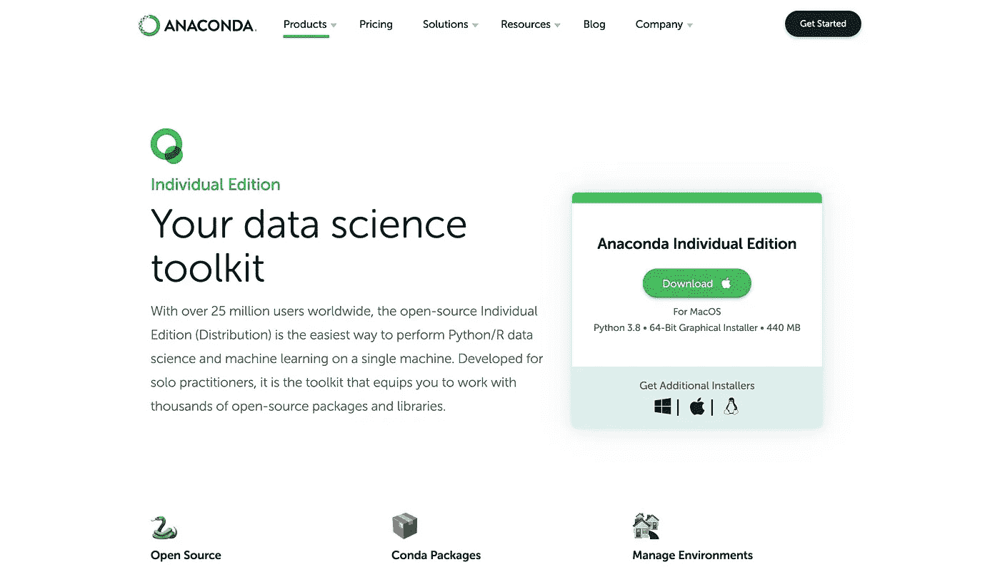
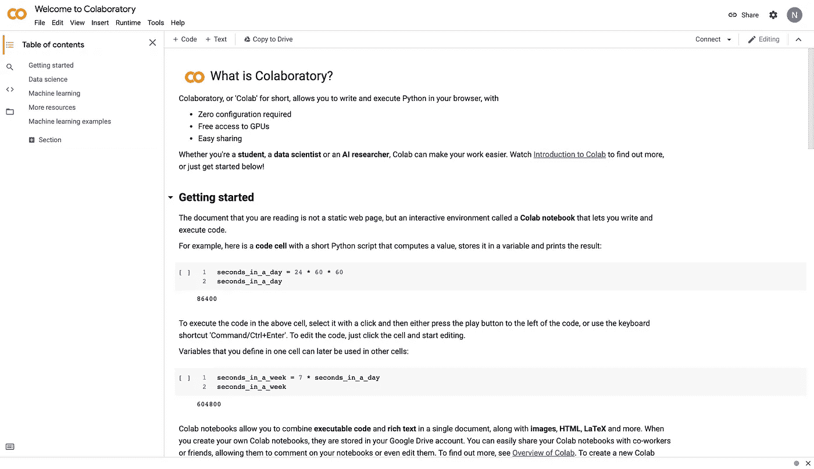
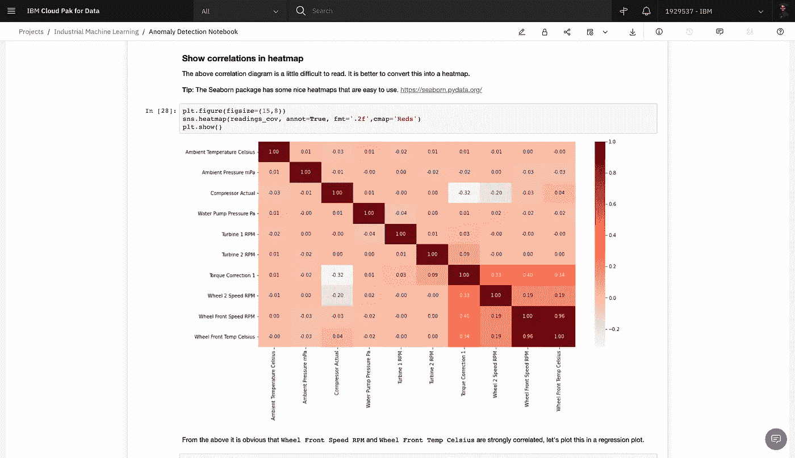

# 如果我必须重新开始，我将如何学习数据科学的 Python

> 原文：<https://towardsdatascience.com/how-i-would-learn-python-for-data-science-if-i-had-to-start-over-83fc40ab93ba?source=collection_archive---------0----------------------->

## [入门](https://towardsdatascience.com/tagged/getting-started)

## 另外 3 个技巧可以帮助你避免犯同样的错误


由[内森·齐曼斯基](https://unsplash.com/@nathanziemanski?utm_source=unsplash&utm_medium=referral&utm_content=creditCopyText)在 [Unsplash](https://unsplash.com/s/photos/diving?utm_source=unsplash&utm_medium=referral&utm_content=creditCopyText) 上拍摄的照片

我伸手去抓我的红牛又喝了一口。

我的眼睛因长时间盯着屏幕而布满血丝。

我筋疲力尽。但我必须这么做，我必须想清楚。

所以我翻了一页。

然后在我的笔记本上又写了几行。

‎….我又做了一次。

………………再来一遍。

…………………..再次。

我已经在悉尼科技大学 11 号楼黑暗的角落里坐了 9 个小时了。

我面前的 MacBook。

Python 速成班在我右边。

在 Chrome 中打开了大约 87 个不同的标签

拼命想掌握 Python。

我太想得到它了。我想快速地学习它(不可否认，比可能的实际速度要快)。

我在研究我的硕士学位，并试图在工作中给我的客户带来一些硕士学位。却不知道自己到底在做什么。谈到数据科学和 ML，要学的东西实在太多了，更不用说 Python 了。

一定有更好的方法。

不幸的是，那时候，我什么都不知道。

三年过去了，有很多事情我会用完全不同的方式去做。在那段时间里，我成功地建立了大量的模型，启动(和崩溃)了一家初创公司，并成为了 IBM 的一名数据科学家，与一些令人惊叹的客户一起工作。

但是我总是回想起我花在自学编程上的那些周末。现在回想起来，是的，这是值得的…但我本可以用更有效的方式去做。

这正是我今天想和你谈的。

如果我必须重新开始的话，我会再次使用这个策略来学习机器学习和数据科学的 Python。

如果你更喜欢视频，我还做了一个 5 小时左右的速成课程，把所有这些都浓缩下来，但请继续关注我，我希望我能分享一些金块。

我认为，在开始学习之前，有 3 个关键因素是很重要的。

首先是 CRUD。

# 1.了解 CRUD


来源:尼古拉斯·雷诺特

CRUD 代表创建、读取、更新和删除。这是一个通常与 SQL 联系在一起的概念。它指的是处理数据库记录所必需的核心操作。

然而！

同样的概念在编程时也很有用。如果你能理解如何用 Python 创建、读取、更新和删除一个对象，你就已经很好地理解了这个组件。我对此的唯一反对意见是，理解如何循环遍历组件也很重要，所以也许 CRUDL 是更好的初始化？我跑题了。

理解 CRUD 很重要，因为它为您应该能够应用于 Python 中的组件的操作奠定了基础。比方说，你想对列表应用 CRUD。

我们知道我们可以使用方括号中的序列**创建**列表。

```
# Creating a list
names = [‘neil armstrong’, ‘buzz aldrin’, ‘sally ride’, ‘yuri gagarin’, ‘elon musk’]
```

我们可以使用索引或打印功能**阅读**

```
# Printing a list
print(names)# Reading the first value
names[0]# Slicing a range
names[1:3]
```

为了让**更新**，你可以重新赋值，使用 insert 方法或者 append 方法。

```
# Update a single value
names[-1] = 'nicholas renotte'# Update by adding to the end of the list
names.append('elon musk')# Update by inserting at the start of the list
names.insert(0, 'richard branson')
```

最后但同样重要的是，它有助于理解如何**删除**。

```
# Delete components from a list
**del** names[-2]
```

理解 CRUD 为您应该理解的每种数据类型的组件建立了一个心理框架。

# 2.习惯使用 Jupyter

当我刚开始用 Python 编程时，有很多 IDE 可供选择。但我希望我知道的一件事是，Jupyter 笔记本可能是开始时使用的最佳界面，尤其是在数据科学工作负载方面。

*为什么？*

它们为您提供了一个交互式环境来构建、探索和建模您的数据。我要大胆地说，没有什么比得上。还有其他选择，但 Jupyter 让它变得简单得可笑。

我发现为 Jupyter 提供一个稳定的操作环境的最简单的方法是使用 [Anaconda](https://www.anaconda.com/products/individual) 。



来源:Anaconda

Jupyter 也有很多风格，它们都提供了相似的工作界面，但也有一些优缺点。为了一个允许你使用 GPU 和 TPU 的免费环境。看看[谷歌 Colab](https://colab.research.google.com/notebooks) :



来源:谷歌

但是，当你最终得到那份甜蜜的数据科学工作时，也要做好灵活变通的准备。许多企业组织正在转向数据科学平台。我在日常工作中使用的是[沃森工作室](https://dataplatform.cloud.ibm.com/)。



来源:IBM

# 3.在你认为自己准备好之前就开始做项目

**太容易掉进教程陷阱了！**

做辅导，一次又一次辅导，但从来没有真正开始做建筑材料。

我去过那里。你去过那里。我们都经历过！

打破常规的最好方法是开始用 Python 制作和打破东西。找一个简单到超出你技能范围的教程，试一试。

我一直想在无障碍领域做点什么，并决定在我的旅程中尽早尝试解决手语识别问题。

我觉得我还没到那一步。也就是说，处理超出你技能范围的事情会比其他任何事情都更有助于你加速！

好了，说够了“提示”。让我们来看本质。

# 你应该学什么？

下面的代码块突出显示了每个子主题的关键组件。在 YouTube 视频和这个 [GitHub 报告](https://github.com/nicknochnack/PythonForDataScience/blob/main/Python%20Basics.ipynb)中，它们都有大量的细节解释！

## 变量

将变量视为值和数据的占位符。它们使得在整个代码中重复引用可能需要的数据或值变得容易。

## 数据类型

Python 中有许多不同的数据类型。了解它们的属性有助于您 1)设置正确的数据类型，2)导航其属性，3)利用附加的方法。

## 条件和循环

条件是重要的，它们允许你运行你的数据通过门和检查，以确定值是否满足某些条件。循环帮助您遍历序列，以便您可以重复执行某些操作。

## 数学运算符

理解基本的数学运算符是很有用的，但是请注意，您会发现自己使用的许多常见的包(例如 Numpy 和 Pandas)也有本地数学运算符。

## 功能

将你的代码包装在一个函数中允许你将事情模块化，这意味着你不需要经常重写相同的代码。我发现自己写了很多函数，尤其是在数据预处理工作流方面。

## 班级

老实说，在我的日常工作中，我并不需要用到太多的类。然而，我发现在构建定制神经网络模型和层时，它们几乎无处不在，尤其是那些具有多个输入和预测头的模型和层。

## 模块和包

啊，模块和包。*这些允许你利用全世界 Python 开发者的集体智慧。*你会发现自己使用的一些最常见的包是[请求](https://docs.python-requests.org/en/master/)、[熊猫](https://pandas.pydata.org/)、 [Numpy](https://numpy.org/) 、 [Scikit-Learn](https://scikit-learn.org/) 、 [TensorFlow](https://www.tensorflow.org/) 和 [NLTK](https://www.nltk.org/) 。

## 文件和错误处理

将数据写到磁盘或将数据保存到文件中尤其有用，尤其是在自然语言处理领域。错误处理在任何地方都很方便，尤其是在编写生产级代码的时候。

# 感谢阅读

仅此而已。

我祈祷你会发现这很有用，如果你有任何关于学习 DS、ML 或 DL 的建议，我很乐意听听！关键是开始，不要害怕迈出第一步。

我每周都会在我的 YouTube 频道[上发布一些新的 ML 和 DS 内容，希望能和你们大家联系。](https://www.youtube.com/c/NicholasRenotte)