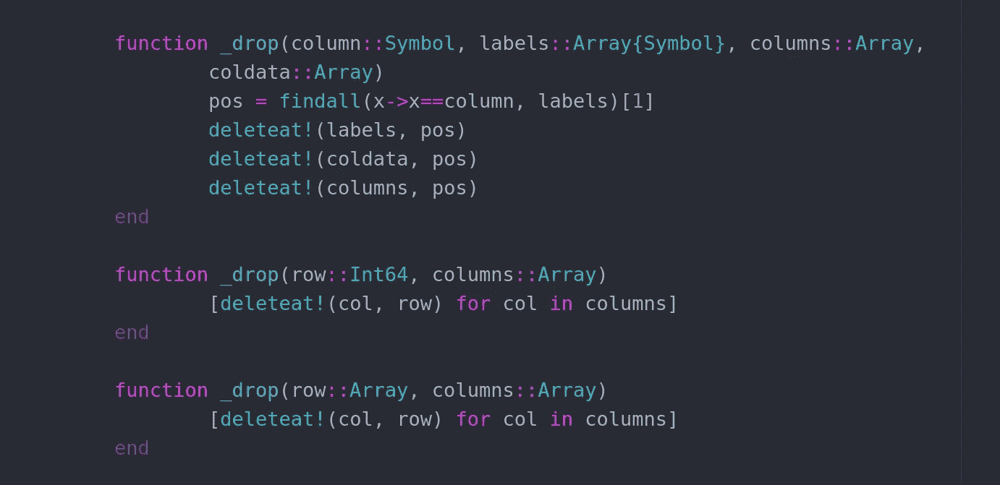
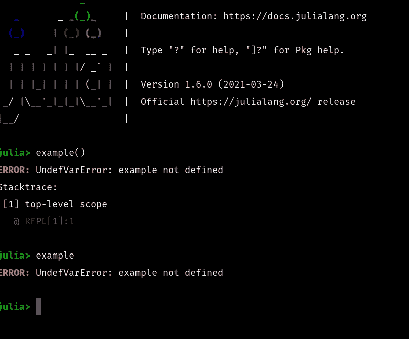

# 朱莉娅如何完善多重派遣

> 原文：<https://towardsdatascience.com/how-julia-perfected-multiple-dispatch-16675db772c2?source=collection_archive---------19----------------------->

## 让我们看看 Julia 语言是如何让多重调度变得完美的



(图片由作者提供)

# 介绍

虽然 Julia 编程语言是新的，而且不太受欢迎，但至少现在，这并不妨碍该语言取得一些相当惊人的成就。Julia 编程语言比许多用户或观众所理解的要独特得多，因为它有自己的范例。在我看来，这种范式棒极了，我真的爱上了编程语言中奇妙的类型系统和参数多态性。朱莉娅计算公司称这种模式为

> “多种调度模式”

好吧，这不是*最有创意的*命名，但有很多很好的理由使用这种范式，以及随之而来的 Julia 编程语言。对我来说，多重分派是一种非常自然的编程方式，尤其是在科学计算方面。除此之外，这种语言还做了几件事情，使得多重分派比以前任何语言都要好。在我们进入多重分派之前，还有一件事；本文中的所有示例都来自我目前正在发布的一个包，它是一个面向对象的 DataFrames 包，在 Julia 中的 DataFrames.jl 和 Pandas.py 等选项之间架起了一座桥梁。如果您想了解更多关于这个包的信息，贡献或支持它(谢谢)，您可以在这里查看这个包:

[](https://github.com/ChifiSource/OddFrames.jl) [## GitHub-chifi source/odd frames . JL:面向对象的、基于 dict 的 DataFrames 包！

### jl 是 Julia 的一种新的数据管理和操作包。然而，许多类似的软件包…

github.com](https://github.com/ChifiSource/OddFrames.jl) 

# 关于多重分派的更多信息

在我们讨论 Julia 语言全面扩展并与多重分派协同工作的伟大之处之前，让我们先来了解一下多重分派到底是什么。多重分派是一个通用的编程概念，最初是为了解决函数式编程范例中的一个问题而引入的。这个问题就是有太多的方法名，当方法不是我们正在处理的类型的私有方法时，我们必须对每种类型有一个单独的调用，即使这些函数做同样的事情。

例如，假设我们有自己的函数式编程语言，我们想得到一个可迭代数组的长度，我们可以调用:

```
length(array)
```

现在让我们假设我们也想获得字符串中字符的长度——因为函数式编程主要关注声明式编程，更重要的是——全局编程，我们只能有一个长度的定义。因为我们已经在阵列上使用了这个定义，所以我们需要更改这个函数的别名:

```
length_str(string)
```

不用说，在方法调用中指定要传递什么类型只是程序员、方法和类型之间一种单调乏味的交互。这就是多重调度的用武之地。对于多重分派，可以专门定义方法来处理所提供的参数类型，就像我们前面的例子一样:

```
length(array)
length(string)
```

我们需要做的就是将我们要写入的特定类型添加到我们的方法定义中，以便于实现这一点。如果你想更多地了解为什么多重派遣如此酷，以及关于这个主题的更多技术细节，我有一篇更详细的文章，你可以在这里阅读:

[](/parametric-polymorphism-is-really-cool-e6ac25f0fa53) [## 参数多态真的很酷

### 永远塑造了函数式编程的概念。

towardsdatascience.com](/parametric-polymorphism-is-really-cool-e6ac25f0fa53) 

> 此外，那是两年前发表的——为什么。

# 单行定义

一行定义无疑使多重分派变得很方便。在 Julia 中，功能键是可选的。每当我们在别名后面加上括号时，Julia 就能看出我们在调用一个方法，例如

```
example()
```

如果我们运行这个函数，我们会得到与没有括号时相同的错误，但是会有一个堆栈跟踪，因为 Julia 编译器现在已经注意到我们不一定是在全局范围内工作，因为它已经评估出我们是在使用一个有自己范围的函数。这是一个有趣的区别，看看这个:



(图片由作者提供)

所有这些不仅可以在一行中快速创建函数，还可以在一行中更改函数调用。考虑 OddFrames.jl 中的以下示例，其中定义了将成为我们的类型的子代的函数:

```
head(x::Int64) = _head(labels, columns, coldata, x)head() = _head(labels, columns, coldata, 5)# Dropdrop(x) = _drop(x, columns)drop(x::Symbol) = _drop(x, labels, columns, coldata)drop(x::String) = _drop(Symbol(x), labels, columns, coldata)dropna() = _dropna(columns)dtype(x::Symbol) = typeof(coldata[findall(x->x == x, labels)[1]][1])dtype(x::Symbol, y::Type) = _dtype(columns[findall(x->x == x,labels)[1]], y)
```

在许多这样的例子中，我们看到论点从第一个到第二个定义发生了变化。在第一个实例中，我们将数据从类型提供给函数，同时提供值。在第二个实例中，我们为 x 提供了一个默认值，所以没有输入参数。这些例子的可贵之处在于，在我们实际提供它们之前，有些输入参数甚至需要更改。例如，考虑 dtype()函数。

```
dtype(x::Symbol) = typeof(coldata[findall(x->x == x, labels)[1]][1])
```

在这个例子中，如果我们简单地提供符号来获取数据类型，我们将会遇到一个巨大的问题。因为我们需要的符号不仅在不同的数据数组中，而且我们也不知道在哪个数组中！幸运的是，我们可以在一行中完成所有的编写工作，最终的代码看起来非常干净！

# 构造器

在 Julia 编程语言中，我最喜欢的多重分派实现可能是 dispatch。考虑我们的不可变 OddFrame 的构造函数(我选择它是因为它要短得多。)

```
struct ImmutableOddFrame <: AbstractOddFramelabels::Array{Symbol}columns::Array{Any}coldata::Array{Pair}head::Function
```

这就是所谓的外部构造函数。我们可以直接调用这个外部构造函数，返回的将始终是 ImmutableOddFrame 类型。但是，为了进行这样的调用，我们需要提供

*   标签
*   列
*   科尔达塔
*   头

全靠我们自己。我们到底该怎么做？特别是考虑到 head()是一个函数。为了使用这种类型，我们真的要编写自己的函数吗？当然不是。此外，这种类型内部的数据本质上只供实际模块以这种方式使用，而不是供最终用户使用。最终用户只需要提供一些更高级的声明性数据。例如，他们希望从中加载数据的文件的文件路径:

```
function OddFrame(file_path::String)# Labels/Columnsextensions = Dict("csv" => read_csv)extension = split(file_path, '.')[2]labels, columns = extensions[extension](file_path)
```

这都是通过分派完成的，内部构造函数和外部构造函数的调用本质上是相同的——只是传递的类型不同。不用说，这将构造函数带到了一个全新的水平！如果你想了解更多关于构造函数的知识，你可以阅读这篇文章或者观看这个视频:

[](/an-advanced-look-at-constructors-in-julia-5b428882dde8) [## Julia 中构造函数的高级视图

### 用 Julia 完整地看一下如何创建复杂的构造函数。

towardsdatascience.com](/an-advanced-look-at-constructors-in-julia-5b428882dde8) 

# 结论

不用说，Julia 已经完全改变了游戏，不仅仅是在软件的多个调度应用程序的小得多的世界里，而且是在整个编程的世界里！多分派范式确实将多分派编程带到了一个全新的水平。随着构造者能力的提高，这一概念得到了极大的发展。从整篇文章来看，在这里影响最大的可能是构造函数。非常感谢你的阅读，它对我来说真的很重要！我希望这篇文章有意思，并让您对多分派范例有更多的了解——这太棒了！