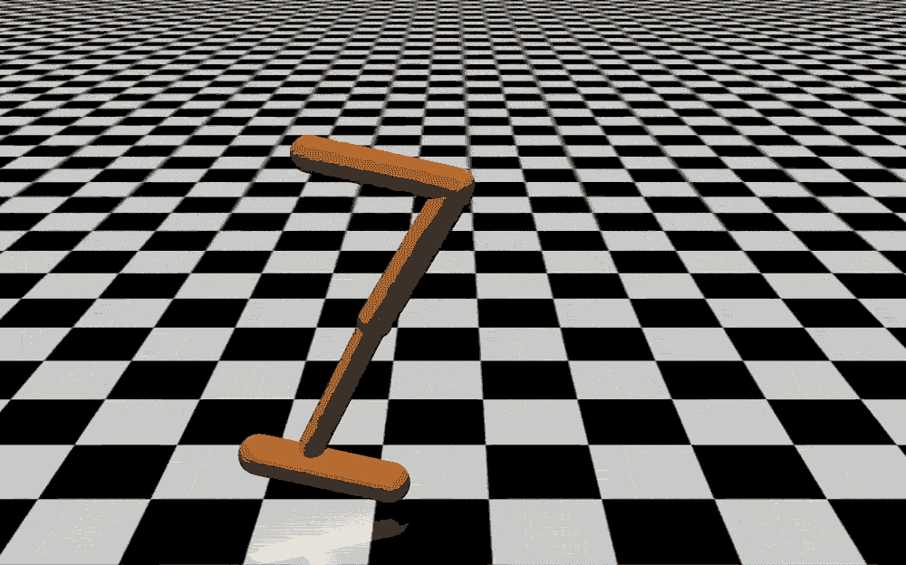
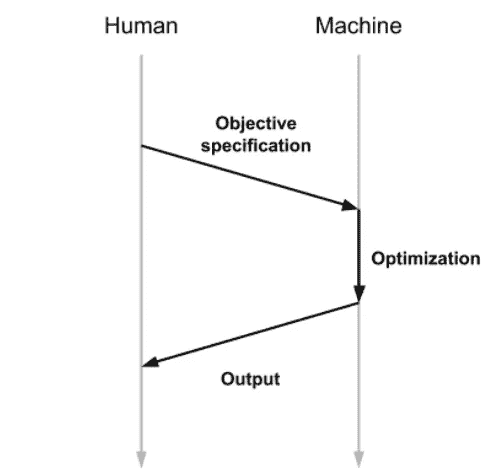
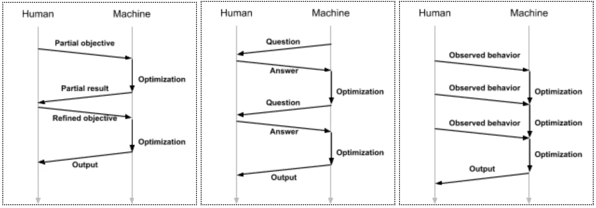
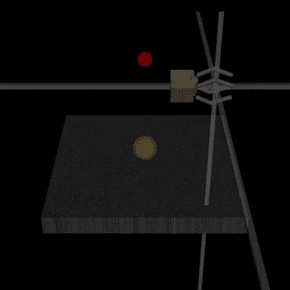
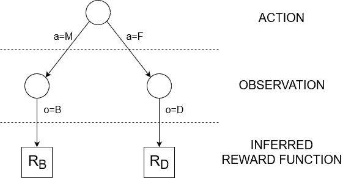
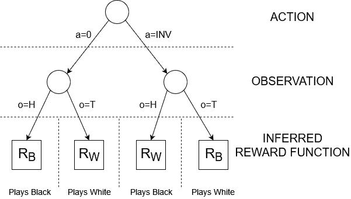

# 学习奖励功能是如何出错的

> 原文：<https://towardsdatascience.com/how-learning-reward-functions-can-go-wrong-6e794e42f4fc?source=collection_archive---------16----------------------->

## 从人工智能安全的角度看强化学习主体学习奖励函数的风险

强化学习(RL)是人工智能最有前途的子领域之一，其应用范围从自动驾驶汽车到股票交易，不一而足。RL 方法的一个众所周知的弱点是，研究人员必须定义一个对应于代理目标的奖励函数。对于复杂的目标，这可能很难，错误的奖励不仅会导致糟糕的表现，还会导致不安全的行为。因此，从 Google 的 DeepMind over OpenAI 到斯坦福大学的 CHAI，各种组织都致力于将奖励功能作为学习过程的一部分，而不是在训练前指定的超参数。然而，仅仅因为学习了一个目标并不意味着它与人类的意图一致。

本文将总结一些目前关于奖励函数学习过程及其安全性的研究。我将首先回顾一下指定报酬函数的传统方法的已知风险和局限性。然后，我将简要介绍一些通过学习奖励函数来克服这些挑战的方法。随着这些预备工作的进行，我将讨论学习奖励函数是如何出错的，并解释学习奖励函数过程的理想属性，这些属性是由 FHI、MIRI 和 DeepMind 的研究人员在最近的工作中定义的。随后，我将把这样的过程称为“奖励学习过程”。

本文假设读者对强化学习有基本的了解。如果你是这个领域的新手，可以在 [OpenAI 的 Spinning Up](https://spinningup.openai.com/en/latest/spinningup/rl_intro.html)【1】上找到一个很好的介绍。

# 1.动机:规范游戏

特别是在机器学习和强化学习(RL)中，解决问题的典型工作流包括两个阶段。首先，程序员定义目标。然后，优化算法试图找到最佳可能的解决方案。在 RL 的情况下，目标和解决方案由奖励函数和策略给出。这种方法带来的风险是，目标的定义可能无法准确地捕捉人的意图。这可能会导致一个满足目标的人工智能系统以不良的方式行为，即使训练它的算法实现得完美无缺。在人工智能安全社区，这样的系统会被称为“错位”。

根据奖励函数得分很高但与程序员的意图不一致的代理行为通常被称为“[规范游戏](https://deepmind.com/blog/article/Specification-gaming-the-flip-side-of-AI-ingenuity)”[14]。规范博彩【9】有[许多著名的例子](https://russell-davidson.arts.mcgill.ca/e706/gaming.examples.in.AI.html)。在[的一个例子](https://openai.com/blog/faulty-reward-functions/)，OpenAI 的研究人员在关于摩托艇比赛的游戏《CoastRunners》上训练了一个 RL 代理。在一个错误指定奖励的教科书例子中，游戏不奖励沿着轨迹前进的代理人，而是奖励击中沿着轨迹布置的目标。代理人利用了这一点，找到了一种在不完成比赛的情况下达到目标的策略。

规范游戏不仅是性能问题，也是安全问题，因为模型误解人类意图是人工智能对齐问题的核心。

# 2.奖励学习

至少从 90 年代开始，随着[逆向强化学习](https://ai.stanford.edu/~ang/papers/icml00-irl.pdf)【15】的引入，研究人员已经在寻求更好的方法来指定目标。就像一般的人工智能研究一样，自 2010 年代初以来，人工智能研究正在经历复兴，对学习奖励功能的探索也是如此。最近获得大量关注的一大类方法利用了“人在回路中”的思想。潜在的想法很简单:评估观察到的行为是否正确(大概)比明确指出正确的行为看起来像什么更容易。因此，有理由预期，由人类对代理行为的评估比由奖励函数对代理行为的评估更不容易出错。此外，可以在训练过程中使用人的反馈来调整目标，而不是在训练过程之前且独立于训练过程的阶段中指定目标。

多个研究议程集中在这个想法的不同的、更具体的实现上。在 DeepMind 的[奖励模型](https://deepmindsafetyresearch.medium.com/scalable-agent-alignment-via-reward-modeling-bf4ab06dfd84)【13】研究方向中，目标采取奖励模型的形式。这个模型是用人工评估代理行为的监督学习来训练的。奖励模型的早期成功之一包括使用 900 条人类反馈训练一个代理做后空翻。

一个训练有素的代理人使用人类反馈和奖励模型做后空翻。来源:[【2】](https://openai.com/blog/deep-reinforcement-learning-from-human-preferences/)

从长远来看，DeepMind 希望能够以一种[迭代放大](https://openai.com/blog/amplifying-ai-training/)【7】的形式递归应用奖励模型。这个想法是重复使用在之前的迭代中训练过的模型和人类反馈来训练一个更好的模型。

其他研究调查了代理人和人类之间更复杂的相互作用。除了接收人类的反馈，代理可能被允许提问，或者人类可能展示期望的行为。允许这种互动的形式主义的一个例子是[合作逆向强化学习](https://arxiv.org/abs/1606.03137)【12】。这里的目标是一个奖励函数，关键是，只有人知道，而代理人不知道。反过来，人类被建模为环境的一部分，代理可以与它进行交互，以做出关于奖励的推断。代理保持一定程度的不安全感，这种不安全感只能通过与人类互动来降低。因此，代理人被激励采取减少不确定性的行动，如询问澄清性问题，避免可能伤害人类或导致低回报的鲁莽行动。

将所有这些研究方向与传统培训范式区分开来的因素是，不再有两个截然不同的阶段:首先指定目标，然后优化以解决它。相反，有各种各样的互动模式:对环境起作用的时期可能穿插着调整目标的行动，如提问或观察人类行为。柴创造了一个统称为“辅助游戏”的术语，用来描述允许这种交互模式的问题公式。

人工智能标准模型中的交互模式。来源:[【10】](https://www.alignmentforum.org/posts/qPoaA5ZSedivA4xJa/our-take-on-chai-s-research-agenda-in-under-1500-words)

辅助游戏中可能的互动模式。来源:[【10】](https://www.alignmentforum.org/posts/qPoaA5ZSedivA4xJa/our-take-on-chai-s-research-agenda-in-under-1500-words)

# 3.学习奖励函数的风险

当然，辅助游戏并不是解决人工智能定位问题的灵丹妙药。在 DeepMind 的《从人类偏好中学习》一文中，研究人员发现，智能体可能会学习只在人类观察者看来正确的行为。例如，一个应该学会抓住一个物体的智能体反而学会了把它的手臂放在相机和物体之间，这样它就看起来只是在抓住它[【2】](https://openai.com/blog/deep-reinforcement-learning-from-human-preferences/)。

一个特工学会了看起来像是在抓一个物体。来源:[【2】](https://openai.com/blog/deep-reinforcement-learning-from-human-preferences/)

研究人员通过添加视觉线索来帮助人类确定物体是否被抓住，从而解决了这个问题。然而，一般来说，代理人操纵他们的奖励学习过程的结果的可能性仍然是一个问题。问题归结为一个简单的事实，即代理人必须从它可以操纵的环境中推断出它的回报函数。正如人工智能安全研究员斯图亚特·阿姆斯特朗所说，将奖励功能作为学习过程的一部分是一个巨大的变化，类似于从“如果你不知道什么是对的，就在这个只读列表中查找”到“如果你不知道什么是对的，就在这个读写列表中查找”[【5】](https://www.lesswrong.com/posts/55hJDq5y7Dv3S4h49/reward-function-learning-the-value-function)。

我们如何更正式地推理奖励学习的风险？理想情况下，我们希望有一个通用的数学模型，用学习奖励函数的过程来扩展普通 RL 框架。幸运的是，这正是阿姆斯特朗等人在他们 2020 年的论文“[在线学习奖励函数的陷阱](https://arxiv.org/abs/2004.13654)”[3]中所做的。最简单的形式是，他们的形式主义将奖励学习过程建模为一个简单的函数，从行为和状态的历史到奖励函数的概率分布。换句话说，一个奖励学习过程给出了一个规则，通过这个规则，代理形成了它对正确的奖励函数的信念，给定了它已经采取的行动和迄今为止它已经观察到的关于环境的情况。阿姆斯特朗等人谈到“在线”学习，因为奖励功能是在学习策略的同时学习的，就像在援助博弈框架中一样，而不像传统的范式。利用他们的形式主义，他们得出了学习过程的两个重要性质:“可触发性”和“影响性”。

## 可装配性

可触发性的概念来自于我们不希望代理能够影响学习过程的结果。代理人影响学习过程的结果意味着什么，可以用“父母职业指导游戏”的例子来说明。在这个游戏中，代理人扮演一个决定走哪条职业道路的孩子的角色。要做到这一点，它可以要求它的母亲或父亲告诉它要么成为一名银行家或医生。有两个潜在的奖励函数:R[B]将奖励代理成为银行家，R[D]将奖励它成为医生。代理可以采取行动 M 询问母亲或 F 询问父亲。对于父母中的任何一方，环境决定了他们告诉代理人是医生(状态 D)还是银行家(状态 B)。反过来，这会使代理人采用相应的奖励函数。换句话说，历史 MD 和 FD 将使代理 100%确定 R[D]是正确的奖励函数，而历史 MB 和 FB 导致对 R[B]的 100%信任。如果代理人不能影响它对奖励函数的最终信念，这个博弈就是可触发的。然而，正如许多读者所注意到的那样，他们可能在孩童时期就有操纵父母的行为，但事实可能并非如此。作为一个简单的例子，考虑这样一种情况，即母亲总是回答 B，父亲总是回答 d。代理人的行动将导致对其奖励功能的不同最终信念。形式上，回报函数 R 的期望值取决于代理采取的行动 a:E[R | a = M]= R[B]和 E[R | a=F] = R[D]。对于可装配性，我们希望这种期望独立于代理的策略。

“职业指导”游戏中学习过程的可能结果。来源:作者生成

> 如果期望得到的奖励函数独立于代理的策略，那么奖励学习过程是不可触发的。

值得注意的是，奖励函数的期望值与代理人的信念有关。最终，代理人将根据其对奖励函数的信念采取行动。如果智能体不能将自己的信念推向 R[B]或 R[D]，那么学习过程就是不可触发的。

但是不可质疑就足够了吗？一个主体能影响一个学习过程而不操纵他对奖励函数分布的最终信念吗？事实证明它可以，这就是为什么我们需要更强的不可波动性！

## 影响力

和以前一样，我将用一个例子来解释影响的概念。在“国际象棋游戏”中，一个代理人将学习下一盘棋，并且必须弄清楚它希望白棋还是黑棋赢。对于它的奖励函数，代理可以采用 R[W]或 R[B],分别奖励白棋和黑棋的胜利。通过投掷一枚偶数硬币来决定代理人站在哪一边。如果结果是正面(状态 H)，则代理玩黑色，否则(状态 T)它玩白色。此外，在掷硬币之前，代理可以选择采取相反的行动 INV。如果它不采取相反的行动，那么在抛硬币之后，奖励函数就像人们所期望的那样:如果代理人出白牌，奖励函数为 R[W],如果代理人出黑牌，奖励函数为 R[B]。然而，如果它采取了相反的行动，那么奖励是反向的:代理人在玩黑色时将有奖励函数 R[W],反之亦然！只要我们假设硬币是偶数，这并不改变对奖励函数的期望:不管代理人是否拿了 INV，都有 50%的机会得到任一奖励函数。然而，采用 INV 将导致代理更容易满足的奖励函数，同时不会导致期望的行为。学习过程是可以影响的。

“棋局”的可能结果。来源:作者生成

> 如果代理人的行为对产生的奖励函数没有因果影响，奖励学习过程是不受影响的。奖励函数只取决于环境——取决于“世界上的事实”。

更正式地说，要使奖励学习过程不受影响，它必须以如下方式工作:主体对它所处的环境有初始信念(先验)。它还对奖励函数的形状有信念，这取决于它对环境的信念。给定历史，代理可以更新其关于环境的信念(产生后验分布)。这些更新的信念又可以用于计算关于奖励函数的更新的(后验)信念。因此，奖励函数不再是历史的直接函数，而是环境的函数。

## 从可触发到不可影响

显然，不可波动性和不可聚合性是奖励学习过程的理想属性。因此，很自然地要问它们是如何相关的，以及我们是否能从那些缺乏这些属性的过程中创造出不可影响或不可触发的过程。

幸运的是，这篇论文的一些主要结果是关于可触发过程和不可影响过程的关系。例如，他们证明了每个不可影响的偏好学习过程也是不可触发的。此外，一个不可触发的学习过程是否不可影响取决于它对进一步信息的反应[【4】](https://www.lesswrong.com/posts/LpjjWDBXr88gzcYK2/learning-and-manipulating-learning)。

一个重要的结果是，通过使用反事实的方法，即使是可触发的学习过程也可以变得不受影响。例如，如果代理人的正确奖励是“一小时内在这张纸上写了什么”，那么这是有影响的:代理人本身可以在纸上写任何值。如果我们把奖励指定为“如果我们没有让你兴奋，一个小时内这张纸上会写些什么”，那么学习过程就变得不可影响。让一个人明白这是如何正式运作的并不是一件小事，我计划写一篇后续文章解释反事实方法的细节

## 不可流动性的极限

不可影响的学习过程可以总结为迫使主体真正了解外部世界。然而，这并不意味着使每个学习过程不受影响就解决了对齐问题。当设计一个学习过程时，你应该记住两个限制。

首先，仅仅因为一个学习过程不受影响并不意味着它是好的。举一个简单的例子，如果一个学习过程是恒定的，并且总是返回相同的回报函数，这将使它不受影响。此外，你可以对一个合理的不可影响的学习过程应用某些排列，从而获得一个仍然不可影响但远不如人意的学习过程。因此，如果“弄清楚人类想要什么并去做”是不可改变的，那么“弄清楚人类想要什么并做相反的事情”也是如此。

相反，学习过程可能是好的，但不可能不受影响。这就是对齐税的概念发挥作用的地方，它描述了在使人工智能安全和健壮以及经济竞争力之间的权衡。在尊重人工智能安全最佳实践的同时改进当前最先进的人工智能技术可能是不可行的。例如，任何涉及人类反馈的东西通常都是可触发的。这包括我们前面讨论的“人在循环中”的方法！那么，为什么我在不可挑战性和不可波动性上花了这么多时间，而这些概念似乎并不适用于奖励学习中一些最有前途的方法呢？这是因为即使我们可能永远无法实现学习过程的完全不受影响，这个概念也不是没有价值的。如果进一步的研究侧重于量化和控制操纵，这将有助于减少对准税，并使人工智能研究人员处于更好的位置，使他们的人工智能既有竞争力又安全。

[1]阿奇姆·乔希，*RL 中的关键概念*，OpenAI Spinning Up，2018，[https://Spinning Up . open ai . com/en/latest/Spinning Up/RL _ intro . html](https://spinningup.openai.com/en/latest/spinningup/rl_intro.html)

[2] Amodei 等人，*从人类偏好中学习*，OpenAi，2017 年 6 月 13 日，[https://open ai . com/blog/deep-reinforcement-Learning-from-Human-Preferences/](https://openai.com/blog/deep-reinforcement-learning-from-human-preferences/)

[3] Armstrong 等人，*在线学习奖励函数的陷阱*，Arxiv，2020 年 4 月 28 日，[https://arxiv.org/abs/2004.13654](https://arxiv.org/abs/2004.13654)

[4]阿姆斯特朗·斯图尔特，*为什么不可质疑*几乎*意味着不可影响*，LessWrong，2021 年 4 月 9 日，[https://www . less wrong . com/posts/lpjjwdbxr 88 gzcyk 2/learning-and-manipulating-learning](https://www.lesswrong.com/posts/k3J3sYgmjMmpkzbbc/why-unriggable-almost-implies-uninfluenceable#Informal_definitions)

[5]阿姆斯特朗·斯图尔特，*奖励函数学习:价值函数*，LessWrong，2018 年 4 月 24 日，[https://www . less wrong . com/posts/55 hjdq 5y 7 dv 3s 4h 49/Reward-function-Learning-The-value-function](https://www.lesswrong.com/posts/55hJDq5y7Dv3S4h49/reward-function-learning-the-value-function)

[6]克里斯蒂安诺·保罗，*保罗·克里斯蒂安诺:人工智能校准中的当前工作*，有效利他主义论坛，2020 年 4 月 3 日，[https://Forum . Effective al truism . org/posts/63 STB tw 3 waw 6k 45 dy/Paul-Christiano-Current-work-in-AI-alignment](https://forum.effectivealtruism.org/posts/63stBTw3WAW6k45dY/paul-christiano-current-work-in-ai-alignment)

[7] Christiano Paul & Amodei Dario，*用迭代放大学习复杂目标【OpenAI.com ，2018 年 10 月 22 日，[https://openai.com/blog/amplifying-ai-training/](https://openai.com/blog/amplifying-ai-training/)*

[8] Clark Jack & Amodei Dario，*野外的错误奖励功能*，OpenAi.com，2016 年 12 月 21 日，[https://openai.com/blog/faulty-reward-functions/](https://openai.com/blog/faulty-reward-functions/)

[9] Davidson Russel，*规范 AI 中的游戏:主列表*，[https://Russell-Davidson . arts . mcgill . ca/e706/Gaming . examples . in . AI . html](https://russell-davidson.arts.mcgill.ca/e706/gaming.examples.in.AI.html)

[10]Flint Alex，*我们对柴 1500 字以下研究议程的看法*，AlignmentForum，2020 年 6 月 17 日，[https://www . alignment forum . org/posts/qpoa 5a zsediva 4x ja/Our-take-on-CHAI-s-research-agenda-in-under-1500 字](https://www.alignmentforum.org/posts/qPoaA5ZSedivA4xJa/our-take-on-chai-s-research-agenda-in-under-1500-words)

[12]Arxiv.org，2016 年 6 月 9 日，[https://arxiv.org/abs/1606.03137，](https://arxiv.org/abs/1606.03137)哈德菲尔德-梅内尔·迪伦等，*合作逆强化学习*

[13]雷科 1 月，*通过奖励建模的可扩展代理对齐*，DeepMind 安全研究@Medium，2018 年 11 月 20 日，[https://deepmindsafetyresearch . Medium . com/Scalable-agent-alignment-via-reward-modeling-BF 4 ab 06 DFD 84](https://deepmindsafetyresearch.medium.com/scalable-agent-alignment-via-reward-modeling-bf4ab06dfd84)

[14] Krakovna 等人，*规范游戏:人工智能独创性的另一面，*DeepMind.com，2020 年 4 月 21 日[https://deep mind . com/blog/article/Specification-gaming-the-flip-side of-AI-injury](https://deepmind.com/blog/article/Specification-gaming-the-flip-side-of-AI-ingenuity)

[15] Russel Stuart，*逆向强化学习算法，*第十七届机器学习国际会议论文集，2000，[https://ai.stanford.edu/~ang/papers/icml00-irl.pdf](https://ai.stanford.edu/~ang/papers/icml00-irl.pdf)