# 线性回归的实际工作原理——理论和实现

> 原文：<https://towardsdatascience.com/how-linear-regression-actually-works-theory-and-implementation-8d8dcae3222c?source=collection_archive---------33----------------------->

## 我们推导出最大似然估计并实现它

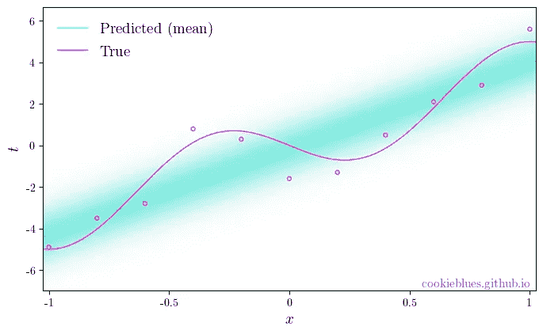

一条符合某些数据的直线，同时也显示了不确定性。图片作者。

# 内容

这篇文章是我将要发表的一系列文章的一部分。你可以通过点击[这里](https://cookieblues.github.io/guides/2021/03/22/bsmalea-notes-2/)在我的个人博客上阅读这篇文章的更详细版本。下面你可以看到该系列的概述。

## 1.机器学习导论

*   [(一)什么是机器学习？](/what-is-machine-learning-91040db474f9)
*   [(b)机器学习中的模型选择](/model-selection-in-machine-learning-813fe2e63ec6)
*   [(c)维度的诅咒](/the-curse-of-dimensionality-5673118fe6d2)
*   [(d)什么是贝叶斯推理？](/what-is-bayesian-inference-4eda9f9e20a6)

## **2。回归**

*   **(a)线性回归的实际工作原理**
*   [(b)如何使用基函数和正则化改进您的线性回归](/how-to-improve-your-linear-regression-with-basis-functions-and-regularization-8a6fcebdc11c)

## 3.分类

*   [(a)分类器概述](/overview-of-classifiers-d0a0d3eecfd1)
*   [(b)二次判别分析(QDA)](/quadratic-discriminant-analysis-ae55d8a8148a#204a-71584f33e137)
*   [(c)线性判别分析](/linear-discriminant-analysis-1894bbf04359)
*   [(d)(高斯)朴素贝叶斯](/gaussian-naive-bayes-4d2895d139a)

# 设置和目标

在这篇文章中，我们将学习**线性回归**，这对于很多机器学习来说是必不可少的**，因此理解起来会非常有益。**

给定一个具有相应目标变量 *t* 的 *N* 输入变量 **x** 的训练数据集，线性回归的目标是构造一个函数 *h* ( **x** )，该函数为 **x** 的新值产生 *t* 的预测值。

用于回归的最简单的线性模型被称为*线性回归*，其中的预测是由

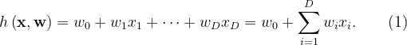

第一项通常称为**截距**或**偏差**参数，并允许 *h* 适应数据中的固定偏移。如果我们引入 1 作为每个输入变量 **x** 的第一个元素，我们可以用向量符号重写(1)

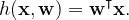

在本系列的第一篇文章[中，我们回顾了带有一维输入变量的多项式回归。现在，我们只是做线性回归(不是多项式)，但我们允许我们的输入变量是 D 维的，因此它成为一个向量，而不是一个标量。然而，为了直观起见，让我们坚持使用同一个示例数据集:](/what-is-machine-learning-91040db474f9)

```
import numpy as npx = np.array([-1, -0.8, -0.6, -0.4, -0.2, 0, 0.2, 0.4, 0.6, 0.8, 1])
t = np.array([-4.9, -3.5, -2.8, 0.8, 0.3, -1.6, -1.3, 0.5, 2.1, 2.9, 5.6])N = len(x)
```

因为我们的输入变量是一维的，我们的参数向量 **w** 是二维的，因为它有一个偏差权重和一个输入变量权重。

为了确保我们也能找到偏差参数，我们必须在 **x** 中引入一列 1。我们可以通过下面的代码片段做到这一点

```
X = np.column_stack([np.ones(N), x])
```

# 衍生和培训

那么，**我们如何训练模型呢？**我们将研究两种不同的方法来推导训练该模型的方法。

回想一下**训练**(或**学习**)指的是**估计我们模型的参数**的过程，所以当我们问如何训练模型的时候，就和问如何估计 **w** 的值是一样的。

## 普通最小二乘法

就像我们在第一篇文章的[中所做的那样，我们定义了一个**目标函数**，它根据误差来计算我们的模型的性能，然后我们根据我们的参数来最小化这个误差。](/what-is-machine-learning-91040db474f9)

这意味着**我们会找到导致误差最小的参数**。我们将使用相同的目标函数，误差平方和(SSE)，定义为

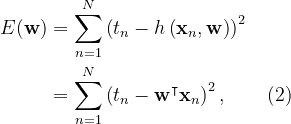

我们希望找到使 *E* 最小的 **w** 的值

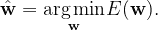

注意(2)是参数 **w** 的二次函数。因此，它相对于 **w** 的偏导数在 **w** 中是线性的，这意味着存在唯一的最小值。这是**凸函数**的一个性质。

如果我们评估网格中参数 **w** 的值的目标函数，那么我们可以用等高线图说明我们的目标函数具有唯一的最小值。如下所示。

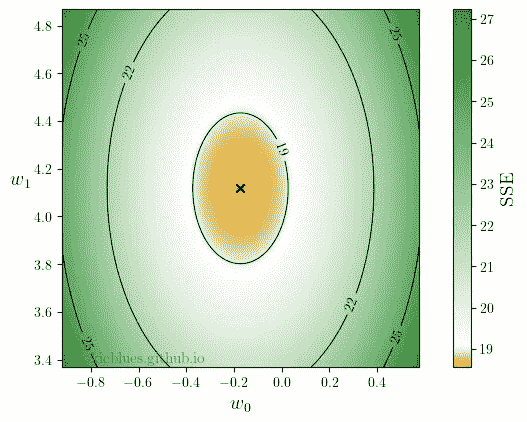

十字位于我们的目标函数的最小值——这个坐标对应于为我们的数据集产生最小 SSE 的参数值。图片作者。

但是我们如何找到最小的 T2 呢？

我们通过求导，设置导数等于 0，并求解函数变量来找到函数的最小值。为了便于记法，让我们所有的输入变量都用 **X** 表示，具有 *N* 行(每个输入变量一行)和 *D* +1 列(每个特征一行，偏差一行)，即，

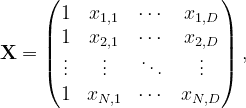

并且让 **t** 表示我们的目标变量的列向量。我们现在可以将(2)改写为

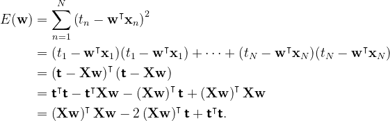

如果我们现在对 **w** 求导，我们得到

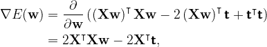

将这个值设为 0，我们就可以解出 **w**

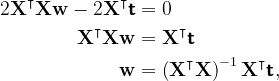

这是我们对参数的估计值

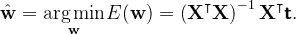

## 最大概似法

然而，选择 SSE 作为目标函数似乎有点武断——例如，为什么不直接选择误差的总和呢？为什么我们要把它们弄成方形？

为了说明为什么这是一个好的选择，以及为什么这个解决方案是有意义的，我们将从概率的角度**使用[最大似然估计(MLE)](https://en.wikipedia.org/wiki/Maximum_likelihood_estimation) 导出同样的解决方案**。

为了做到这一点，我们假设目标变量 *t* 是由我们的函数 *h* ( **x** ， **w** )加上一点噪声给出的

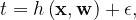

其中我们假设 *ϵ* 正态分布，均值为 0，标准差 *σ* 。

这就让我们说，给定一个输入变量 **x** ，对应的目标值 *t* 正态分布，均值 *h* ( **x** ， **w** )，标准差 *σ* ，即:

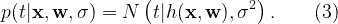

**让我们花点时间了解一下到底是怎么回事。**

下图说明了(3)告诉我们的内容。我们正在估计一些参数 **w** ，因此我们的目标变量 *t* 遵循围绕 *h* 输出值的正态分布。

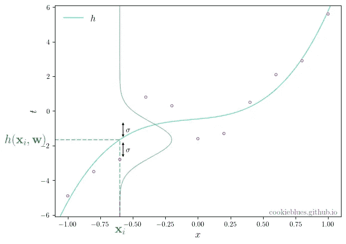

目标变量如何遵循估计函数周围的正态分布的图示。图片作者。

我们现在可以使用整个数据集， **X** 和 **t** ，通过假设我们的数据点是独立于(3)得出的，来写出似然函数。然后，对于所有输入和目标变量对，似然函数变成(3)的乘积，并且是 **w** 和 *σ* 的函数

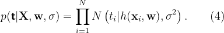

现在**我们想要最大化可能性**，这意味着我们想要确定使(4)最大化的参数 **w** 和 *σ* 的值。这看起来很难，但是我们可以用一个小技巧让它变得更简单。由于对数是单调递增的函数，**对数似然性最大化等价于似然性最大化**。

取可能性的对数给了我们

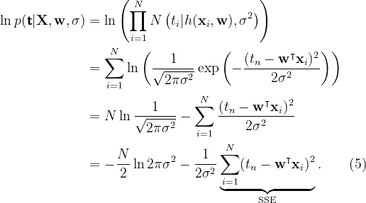

现在很明显为什么 SSE 目标函数是一个好的选择——( 5)的最后一项是唯一依赖于 **w** 的部分，并且与 SSE 相同。

由于第一项不依赖于 **w** ，我们可以省略它，并且由于关于 **w** 的似然函数的最大值不会随着正常数的缩放而改变，那么我们看到**最大化似然等价于最小化 SSE 目标函数**。

因此， **w** 的最大似然估计与我们之前的推导相同

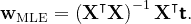

我们可以使用 **w** 的最大似然解的结果来找到噪声参数 *σ* 的值。如果我们在对数似然中插入对 **w** 的最大似然估计，求导数，并将其设为 0，那么我们可以求解 *σ*

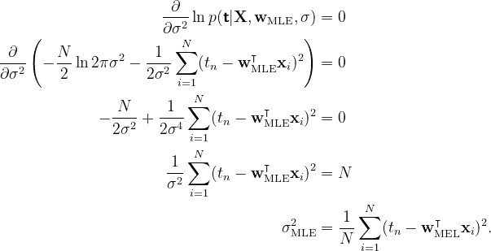

## Python 实现

因为我们现在有了一个概率模型，我们做出的预测是在 *t* 上的概率分布，而不仅仅是点估计。这是通过将最大似然解中的 **w** 和 *σ* 代入(3)来完成的

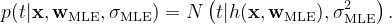

我们可以用下面的代码片段找到 **w** 和 *σ*

```
w = np.linalg.inv(X.T @ X) @ X.T @ t
sigma_sq = sum((t - X @ w)**2) / len(t)
```

下面是我们根据 **w** 以及不确定性参数 *σ估算的直线图。*


由我们的估计参数和不确定性生成的线图。图片作者。

# 摘要

*   我们可以通过**普通最小二乘法**或**最大似然估计**找到**线性回归**的参数。
*   通常在**线性回归**中，我们有一个不与输入相乘的标量参数，称为**截距**或**偏差**。
*   估计参数的值的**过程被称为**训练或学习**过程。**
*   由于对数是一个**单调递增的**函数，因此**最大化似然函数与最大化对数似然函数**相同。