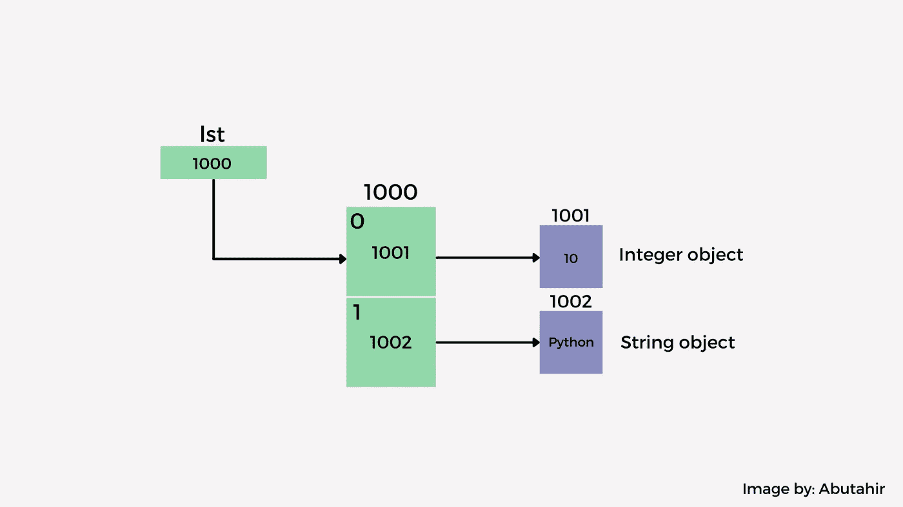
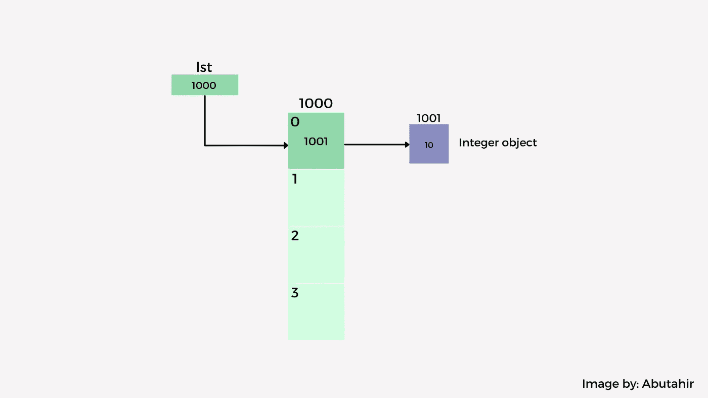
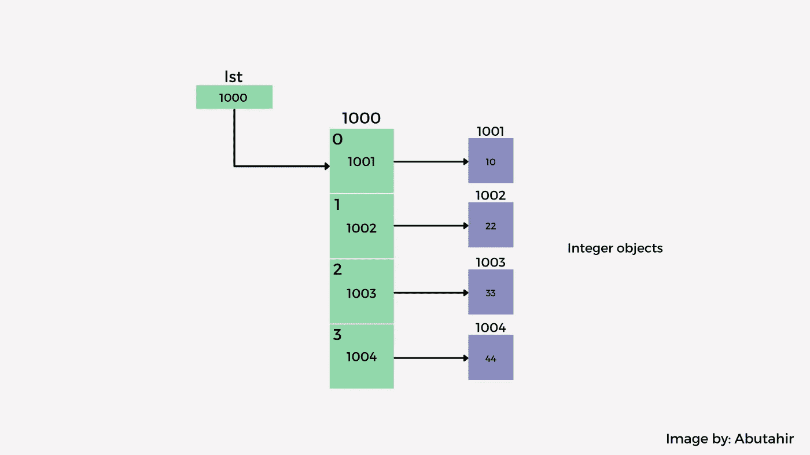

# Python 中的列表如何在内部优化以获得更好的性能

> 原文：<https://towardsdatascience.com/how-lists-in-python-are-optimised-internally-for-better-performance-847c8123b7fa?source=collection_archive---------13----------------------->

## python 内部实现及其优化的精确指南

由[洛杉矶复活节](https://unsplash.com/@lastnameeaster?utm_source=medium&utm_medium=referral)在 [Unsplash](https://unsplash.com?utm_source=medium&utm_medium=referral) 拍摄的照片

> *本文为合著，*[*Muhammad Abutahir*](https://medium.com/u/2d93514313d?source=post_page-----847c8123b7fa--------------------------------)为*，你可以在*[*LinkedIn*](https://www.linkedin.com/in/abu-tahir-bb05741a2/)*和*[*insta gram*](https://www.instagram.com/learn_ai_stack_/)*上找到他。*

名单！python 编程语言中最常用的数据类型之一，也是每个 Python 爱好者最喜欢的数据类型之一。Python 列表的操作极其简单，而且本质上非常灵活。

Python 列表不像数组那样严格，列表是异构的，这意味着你可以在列表中存储不同数据类型的元素。列表的内部实现被设计成一种程序员友好的数据类型。原因是列表的可变性，因为它允许你对它们执行任何操作，比如添加单个元素、添加多个元素、删除操作等等！

## 列表在内部是如何工作的？

列表在后台使用可变长度数组，可变长度数组是数组的变体，其大小最初没有指定，或者其长度或大小是在运行时设置的，您也可以将它们称为自动数组。

这个实现是在 CPython 中完成的。还有其他变体，如 JPython 和 IronPython。就性能而言，它们之间可以有些许的差异，但是我要说的是 CPython。

让我们看看 CPython 中列表的基本结构。

这里的`PyObject **ob_item;`是指向列表元素的指针。这向我们解释了列表在内部存储指向元素的指针，而不是元素本身！这反过来又向我们解释了名单的异质性。也就是存储不同数据类型的元素，比如列表中的列表、字符串、数字以及任何你想到的东西。

如果我问你一个问题，比如‘空列表的大小是多少？’。最常见的答案是零！但是记住，大小和长度是两回事。如果我们检查一个空列表的大小，我马上会给你们看，结果是 40。这可能有多种原因，如变量的初始大小、垃圾收集选项的内存、内置函数的内存，尽管在调用它们时在堆栈内存中给了它们空间，但仍然有一些变量，等等。

创建一个名为 list 的空列表并检查其大小

这与我们使用内置的`list()`创建空列表的情况相同。`__sizeof__()`是一个以字节为单位返回对象大小的函数。

现在，如果我们通过将元素放在`[]`中直接创建一个列表，我们得到的大小是 8 个字节乘以元素总数，记住`PyObject **ob_item;`每次存储占用 8 个字节。这与您存储的元素的数据类型无关。

创建一个空列表和第二个列表来显示大小比较

在上面这段代码中，我创建了一个包含两个元素的列表，一个是数字，另一个是字符串，但是我们得到的是 56，即 **40+8+8。抽象地说，我们可以想象上面的代码是如何在内存中演示的，如下图所示。**

由作者 [Muhammad Abutahir](https://www.linkedin.com/in/abu-tahir-bb05741a2/) 创建的图像:显示列表的内存分配

然而，当我们尝试使用用于向列表添加单个元素的`append()`时，会发生一些不同的事情。看看这个。

在过度分配期间创建一个空列表并填充以显示大小

哇！72?所以我们只是添加了一个元素，它必须是 48 **40+8！**但为什么是 72？那就像 **40+32。**这个我们赶紧了解一下。

# 列表中的性能优化

CPython 实现了过度分配的概念，这仅仅意味着如果您使用`append()`或`extend()`或`insert()`向列表中添加元素，它会给您 4 个额外的分配空间，最初包括指定元素的空间。我们称之为列表的调整大小，它发生在运行时。最初分配了 4 个空间，包括用于元素的空间，并以模式 8、16、25、35…等等继续。这样调整大小是为了提高性能。稍后我将向您展示如何通过这样做来提高性能。

由作者 [Muhammad Abutahir](https://www.linkedin.com/in/abu-tahir-bb05741a2/) 创建的图像:显示列表中的超额分配

参考前面的代码，我们在其中使用`append()`向列表添加了一个元素。这是我们如何可视化 CPython 的过度分配概念。我已经展示了不可访问的浅绿色方框，虽然它们仍然存在，但是我们可以在`__sizeof__()`的帮助下看到内存，这就是我们得到 72 的原因，即 **40+8+8+8+8！**

现在，当我们追加更多的元素时，首先填充分配的空间，然后根据特定的模式调整大小。让我们看看同样的`extend().`

创建一个空列表并填充它以显示已填满的过量分配的内存

正如你所看到的，我添加了 3 个元素，但大小仍然是 72。这是因为已经分配的空间被填满了。

由作者 [Muhammad Abutahir](https://www.linkedin.com/in/abu-tahir-bb05741a2/) 创作的图片:展示如何填补过度分配

这种过度分配是有原因的。当使用内置函数将新元素添加到列表中时，函数`list_resize()`被隐式调用，该函数在 CPython 中实现，每次添加新元素时都必须调用该函数，为了避免调用太多次，指定了一个调整大小模式，该模式以`1.125 * new_size +3`的方式计算，当元素多于 9 个时，数字 3 增加到 6。

现在，如果你试图在列表中添加一个新元素，列表会再次被过度分配，你会得到一个新的大小，请看下面的代码。

附加的最后一个值根据大小模式增加大小

如您所见，前面的空间被填满了，当您创建一个新元素时，大小从 72 增加到 104。因此，通过避免重复调用`list_resize()`，我们降低了堆栈内存和时间方面的成本，因此这很重要。

# 结论

在本文中，我深入讨论了 Python 中列表的内部实现和优化。非常聪明的是，程序员在我们需要的地方使用惊人的想法来提高性能，因为 python 与其他编程语言相比非常慢，因此采取这些类型的步骤可以减少程序员的大量痛苦。

> *说完这些，感谢大家阅读本文，* ***快乐学习！***