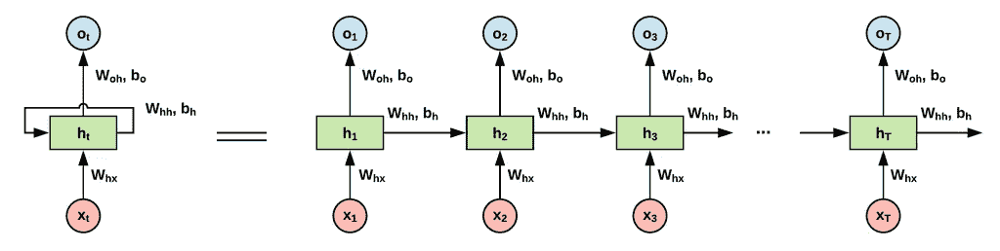
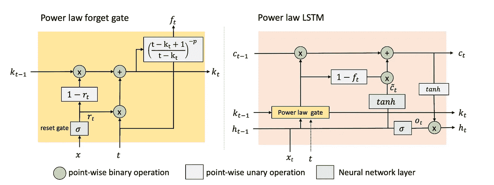
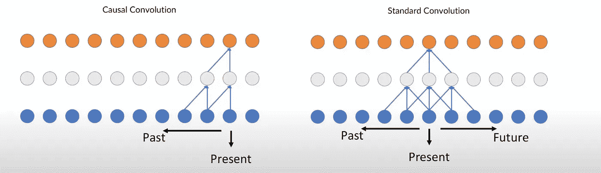
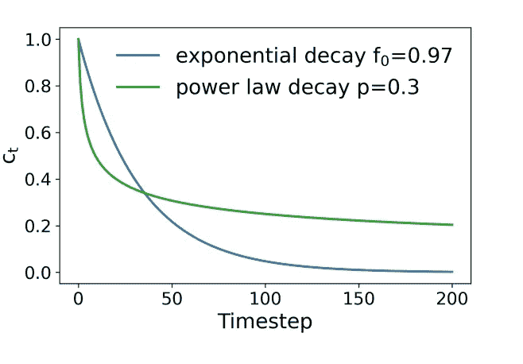

# LSTM & T-CNN 真正能记住的依赖长度是多少？

> 原文：<https://towardsdatascience.com/how-long-dependencies-can-lstm-t-cnn-really-remember-7095509afde8?source=collection_archive---------12----------------------->

## [提示和技巧](https://towardsdatascience.com/tagged/tips-and-tricks)

*免责声明:本文假设读者拥有 LSTM 和 CNN 神经网络的模型直觉和架构背后的初步知识。*

LSTMs 是广泛用于顺序建模任务的技术，例如语言建模和时间序列预测。这样的任务通常有长期模式和短期模式，因此学习这两种模式对于准确的预测和估计是很重要的。基于变压器的技术正在兴起，这种技术有助于对长期依赖关系进行建模，远远优于 LSTMs。然而，由于数据密集型培训要求和部署复杂性，变压器无法用于所有应用。在这篇文章中，我将比较 LSTM 和 T-CNN 在长期信息学习方面的差异。

让我们开始…

## **技术 TLDR**

**LSTM** 是一种长短期记忆神经网络，广泛用于学习序列数据(NLP，时间序列预测等..).由于递归神经网络( **RNN** )存在消失梯度问题，阻碍网络学习长时间尺度相关性，而 LSTM 通过引入遗忘门、输入门和输出门来减少这一问题。有了这些门，它就有了代表长期记忆的细胞状态，而隐藏状态则代表短期记忆。遗憾的是，LSTM 仍然不是保留长期信息的完美解决方案，因为遗忘之门倾向于从之前的步骤中移除这样的模式(信息衰减)——如果模式对于 50 步来说不重要，我为什么要保留它？

香草 LSTM。作者图片

**幂律遗忘门控 LSTM (pLSTM)** 是最近由英特尔和约翰·霍普斯金的研究人员开发的。尽管 LSTM 有所改进，但遗忘机制表现出信息的指数衰减，限制了他们捕捉长时间信息的能力。可以阅读 [***论文***](https://arxiv.org/pdf/2105.05944.pdf) 进行详细讲解。总之，由于信息衰减遵循 LSTM 的指数模式， **pLSTM** 给遗忘门增加了一个衰减因子 *p，这使得 LSTM 可以控制信息衰减速率，帮助它更好地学习长期依赖关系。*

pLSTM。图像 [src](https://arxiv.org/pdf/2105.05944.pdf)

**时间 CNN (T-CNN)** 是简单的 1D 卷积网络，可以应用于时间序列数据而不是图像数据。已知这些层具有时间属性，以学习数据中的全局和局部模式。卷积层还有助于改善模型延迟，因为预测可以并行化，不需要按顺序进行。由于 CNN 可能是因果性的，这意味着每个预测只能依赖于它以前的预测，因此没有来自未来的泄漏。使用深度神经网络和扩张卷积的组合，TCN 构成非常长的有效历史大小。T-CNN 有几种变体，如基于注意力的 CNN，将 LSTM 与 CNN 结合起来，融合其他类型的架构，然而，在这篇文章中，我将坚持使用普通的 T-CNN，以使它对我的读者简单，TCNN 的变体本身可以是一篇单独的博客文章。可以阅读 [***论文***](https://arxiv.org/pdf/1608.08242.pdf) 进行详细解释。

因果卷积与标准卷积构成了 T-CNN 的基础。作者图片

**合成数据**

让我们从一个简单的加法函数开始:

y = f(xⁿ)+ f(x)

人们可以设计他们自己的功能，但是现在，让我们用这个。我们的假设是，序列越长，LSTM 应该越难记住 X⁰值，例如，具有 2 的序列是第 1 和第 2 个元素的相加，而 100 的序列是第 1(0)和第 100(或-1)个元素的相加。序列越大，LSTM 需要携带信息的步骤就越多。

按作者分类的数据生成器

**LSTM 模型建筑**

我创建了一个香草 LSTM 架构，并用超参数和堆叠 LSTM 层进行实验，以验证我们的假设

香草 LSTM 建筑和作者培训

**CNN 模型架构**

我创建了一个普通的 T-CNN 架构，并用超参数如内核大小、过滤器和卷积数来验证我们的假设

作者的香草 T-CNN 架构和培训

**模型性能结果**

MSE 是评估非偏斜数据的一个很好的方法，但是不太容易解释(除了数学家可以！).为了简化，我们可以看一下当 X 中的一个改变时，Y 的百分比变化。由于合成函数是相加的，将 X 中的一个改变 N 个百分点，应该会有 y 的 N/2 个百分点的变化，其次我们可以看看 ***致盲*** 。当我们将任一个 X 设为 0 时，我们可以测量 Y 是否等于非零 X 的 MSE。理论上，MSE 应该是 0.0

按作者的度量

**结果和结论**

我分别对 X[0]和 X[-1]应用了 50%的变化，以了解 Y 中的变化，并计算第 0 个变化列和第-1 个变化列。高达 68 个序列长度 LSTM 能够记住从时间序列开始的先前信息，但最终在第 69 个序列长度时忘记，而 CNN 仍然能够做出准确的预测，这仅仅是因为我增加了内核大小，以便它有机会查看序列的初始和结束值。盲法显示了相同的结果。当序列长度 69 的第 0 个值设置为 0 时，MSE 跳到 0.251%。总的来说，LSTM 似乎对-1 的变化比对 0 的变化更敏感。[ *这些结果会随着不同的数据大小和函数而变化，但信息是明确的“LSTMs 并不真的长！”]*

按作者列出的结果

这些结果与 pLSTM 作者在他们的信息衰减部分描述的路径相同

pLSTM 的信息衰减[作者](https://arxiv.org/pdf/2105.05944.pdf)

*在本文中，我没有与 pLSTM 进行比较，因为目前还没有可用的开源实现，不过，我将在下一篇博客中跟进我自己的 pLSTM 实现。*

** [*在这里*](https://github.com/dwipam/medium-3) *，你可以找到**链接* *的完整代码。*