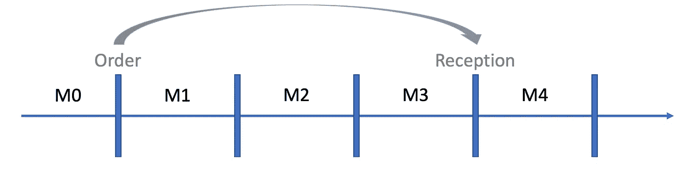
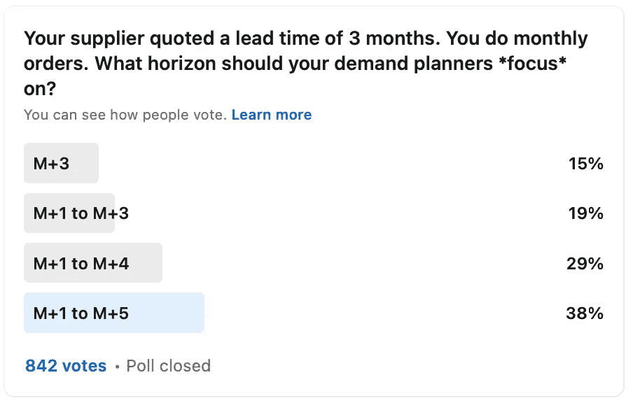
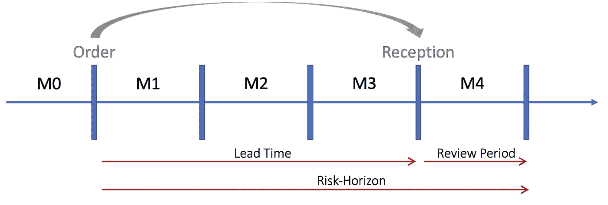
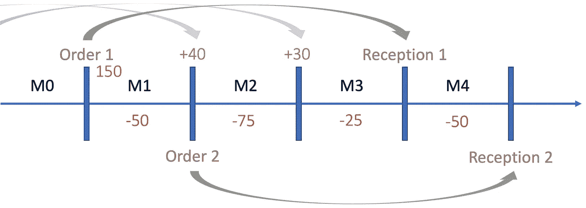
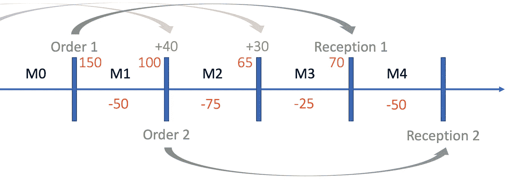
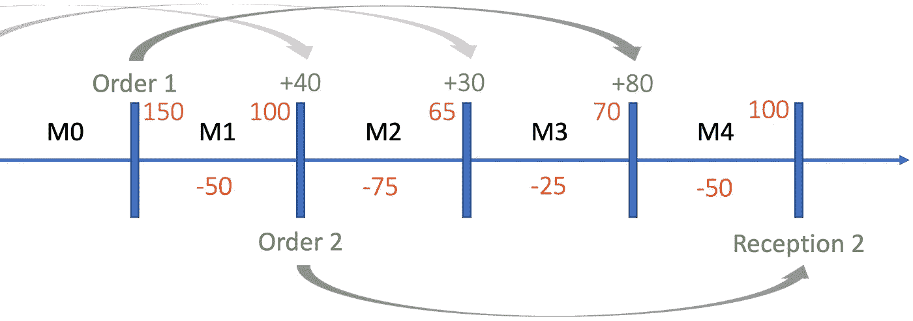
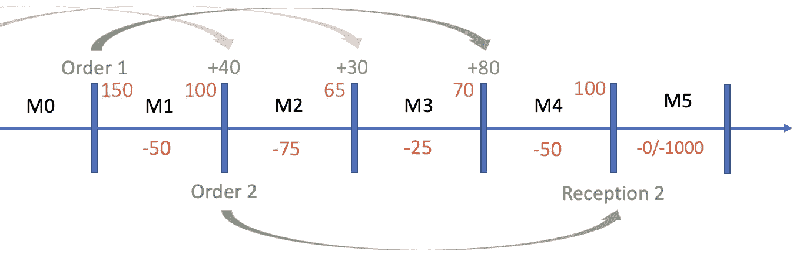
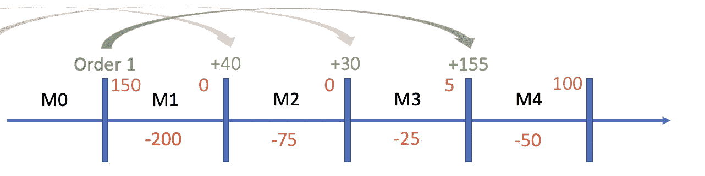
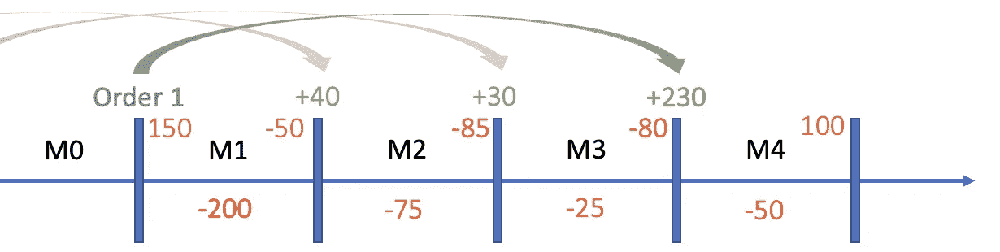

# 预测范围应该有多长？

> 原文：<https://towardsdatascience.com/how-long-should-the-forecast-horizon-be-2f24a6005b89?source=collection_archive---------10----------------------->

## 作为需求计划员，您只能关注有限的预测范围。应该是多长时间？

> 预测只能帮助你做出正确的供应链决策。

来源:[https://commons . wikimedia . org/wiki/File:Conquistadores _ 654 . jpg](https://commons.wikimedia.org/wiki/File:Conquistadores_654.jpg)

让我们假设你是一名供应计划员。您的主要供应商向您报价 3 个月的提前期，而您每月都下订单。

从技术上讲，你在当月的第一天下订单(这里是 M1)。订单接收发生在月初(它们不能用于履行前一个月的订单)。换句话说，你将在 M1 的第一天下订单，在 M4 的第一天收到订单。

你希望[供应链的需求规划人员通过提供有用的需求预测来支持你](/the-4-dimensions-forecasting-framework-f7884ec1472)。

你是否应该要求他们**关注**以下内容:

*   预测 M+1？
*   预测 M+2？
*   预测 M+3？
*   预测 M+4？
*   预测 M+1 到 M+3？
*   预测 M+1 到 M+4？
*   预测 M+1 到 M+6？

我在 LinkedIn 上做了一个[调查，得到了这些答案:](https://www.linkedin.com/in/vandeputnicolas/)

我同意 38%的投票者的观点:你应该着眼于 5 个月的时间范围(可能稍微长一点)。我想这个答案对许多规划者来说是违反直觉的，因为 34%的人只对 M3 最大值感兴趣。

为了解释我对地平线的选择(M1 对 M5)，让我们先来看看这个理论，然后用一个例子来说明它。

# 理论:库存优化、交付周期和审查周期

[库存优化理论](https://www.amazon.com/Inventory-Optimization-Simulations-Nicolas-Vandeput/dp/3110673916)告诉我们，定期库存补充策略应该在 L+R(提前期+审查期)的风险范围*内得到保护。

> *风险范围:收到订单(来自供应商)所需等待的最长时间。在此期间，您的库存有被耗尽的风险。在定期补货政策中，我们有风险期=提前期+审查期。我在我的书[库存优化](https://www.amazon.com/Inventory-Optimization-Simulations-Nicolas-Vandeput/dp/3110673916)中介绍了这个概念。

我们之前的例子是 4 个月:3 个月的交付周期加上 1 个月的评审期。

交付时间、审查期和风险范围

这是一个违反直觉的答案。大多数供应计划员会关注 M+3 预测或累计 M+1 到+3 预测，而不是累计 M+1 到+4 预测。

# 例子

让我们举个例子。我们稍后将讨论 M5 和 M6。

让我们想象一下下图中突出显示的订单和需求计划。绿色表示即将收到的订单，红色表示需求预测。在下订单时(就在 M1 刚开始的时候)，我们的库存水平是 150 件。

订单和需求计划

假设我们希望在收到新订单之前，每月以 100 件的库存水平完成。*通过这样定义我们的库存目标，它将对应于安全库存的定义。*

**举个例子。**在 M1 结束时，我们预计库存为 150–50 = 100 件(=起始位置-预期需求)。然后我们会收到之前 40 台的订单，达到 140 台，开始在 M2 生产。

查看下图，我们计算出，到 M3 结束时，我们预计库存为 70 件。这比我们 100 件的目标低了 30 件。

由于 3 个月的交付周期，订单 1(我们现在正在制作)将无法及时到达，无法在接下来的 3 个月内改变任何事情。我们唯一能影响的是 M4 年末的股票水平。

如下图所示，现在订购 80 件，我们将确保 M4 期末的库存为 100 件(起始= 70+80；消费= 50；剩余库存= 100)。

我们现在需要订购 80 台才能达到 M4 年底的库存目标。

## 哪个预测最重要？

看上面的图，我们意识到改变 M1 到 M4 的预测将会改变我们应该订购的数量。

**示例:**如果您的需求计划员通过将预期需求从 75 件更改为 100 件来更新 M2 预测，您也应该做出反应，将订单增加 25 件。

这意味着**从 M1 到 M4 的任何时期对确定您的订单金额**都同样重要。

# 展望未来

让我们回顾一下到目前为止的故事。

> 我们需要向我们的供应商发出月度订单，供应商的报价是提前 3 个月。我们意识到，为了决定现在订购多少，我们必须关注未来 4 个月的需求预测。

但是，实际上，这并不是全部情况。

## 最佳服务水平和风险

库存优化科学告诉我们，我们需要根据[盈利能力和风险](/a-framework-for-inventory-optimization-71d4496aec75)来优化服务水平。基本上，你需要平衡库存过多和不足的风险和成本。

让我们想象两个简单(极端)的场景:

*   案例# 1:M5 的预期需求为 1000 件。
*   方案# 2:M5 的预期需求为 0 件。

场景 1 和 2(看看 M5)

我们最初假设我们希望以 100 件的安全库存完成 M4。显然，如果我们不希望在 M4 之后有任何销售(场景 2)，以 100 件的库存结束 M4 将不是一个明智的决定。另一方面，如果我们预计在 M5 销售 1000 件(场景 1)，我们可以为 M4 留出更大的安全边际(因为过时或长期剩余的风险较低)。

## 合作

通过向您的供应商提供更长远的观点，您可以帮助他们缩短交货时间、降低成本并增加库存。

# 更进一步#1:提前期的概率预测

在最近的一篇文章中，我展示了概率预测比点预测(更)相关和**有用。**

*   **点预测**:将未来与单一预期结果联系起来，通常是一个平均预期值(不要与*最有可能的*结果混淆)。我们预测下个月会卖出 1000 件。
*   **概率预测**:分配不同事件发生的概率。

如果你想正确评估你需要多少库存(并[优化安全库存和服务水平](https://www.amazon.com/Inventory-Optimization-Simulations-Nicolas-Vandeput/dp/3110673916))，你需要得到一个在这个风险范围内会发生什么的概率视图。

基本上，我们应该着眼于 L+R 上的需求分布，而不仅仅是 L+R 上的点预测。

</probabilistic-forecasting-and-inventory-optimization-70edbb8f4a81>  

请注意，M1 到 M4 的需求分布通常不同于 M1、M2、M3 和 M4 的需求分布之和。但那是后话了。

# 更进一步#2:销售损失与延期交货

延期交货的库存策略(*所有超额需求都保留到有存货可用*)不同于销售损失的策略(*所有超额需求都损失*)。

*   **销售损失:**当你缺货时，你的客户(通常)会取消订单。你需要注意风险范围内可能发生的任何短缺。所以你需要对每个月的**期间可能发生的事情有一个详细的了解(除了对整个地平线有一个好的预测之外)。**

销售损失:如果 M1 需求增加 150 件(至 200 件)，对订单的影响只是增加+75 件，因为失去了 M1 和 M2 的过剩需求。

销售损失在 B2C/快速消费品中很常见，这使得需求规划者很难[估计*真实*需求](/capturing-unconstrained-demand-in-supply-chains-78b46bae1b28)。

</capturing-unconstrained-demand-in-supply-chains-78b46bae1b28>  

*   **延期交货**:在库存短缺的情况下，你的客户会保留他们的订单，等待再次有货。在这种情况下，如果您错过了风险范围内的任何库存，对订单需求没有影响:总需求不会受到影响。然后，您可以关注从 M1 到 M4 的累计预测，而不是每个月的单独预测。

延交订单:如果 M1 需求增加 150 件(达到 200 件)，对订单的影响是增加+150 件(80+150=230)，因为所有的过剩需求都延交了。

*   在大多数供应链中，一些客户会保留他们的订单(或再订购),而一些会直接去竞争。为了优化您的订单数量，您必须估计在风险范围内发生销售损失的可能性。

# 结论

总之，最佳实践是专注于在风险范围(交付周期加审查周期)加上几个周期内预测需求(以了解库存过多/过少以及与供应商合作的风险)。

## 行动呼吁

如果您正在管理需求规划流程，我建议您修改您正在跟踪的[预测 KPI](/forecast-kpi-rmse-mae-mape-bias-cdc5703d242d)。单纯看 M+1 或 M+2 是不够的。

## 👉[我们在 LinkedIn 上连线吧！](https://www.linkedin.com/in/vandeputnicolas/)

# 感谢

[斯蒂芬·德·科克](https://www.linkedin.com/in/wahupa/)

# 关于作者

icolas Vandeput 是一名供应链数据科学家，擅长需求预测和库存优化。他在 2016 年创立了自己的咨询公司 [SupChains](http://www.supchains.com/) ，并在 2018 年共同创立了 [SKU 科学](https://bit.ly/3ozydFN)——一个快速、简单、实惠的需求预测平台。尼古拉斯对教育充满热情，他既是一个狂热的学习者，也喜欢在大学教学:自 2014 年以来，他一直在比利时布鲁塞尔为硕士学生教授预测和库存优化。自 2020 年以来，他还在法国巴黎的 CentraleSupelec 教授这两门课程。他于 2018 年出版了 [*供应链预测的数据科学*](https://www.amazon.com/Data-Science-Supply-Chain-Forecasting/dp/3110671107)(2021 年第 2 版)和 2020 年出版了 [*库存优化:模型与模拟*](https://www.amazon.com/Inventory-Optimization-Simulations-Nicolas-Vandeput/dp/3110673916) 。

