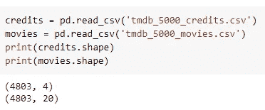

# 机器学习如何为你推荐电影

> 原文：<https://towardsdatascience.com/how-machine-learning-recommends-movies-for-you-6f418f26bcb2?source=collection_archive---------21----------------------->

## 以实用的方式介绍人口统计过滤、基于内容的过滤和协作过滤


图片由 [Unsplash](https://unsplash.com/photos/AWOl7qqsffM) 上的 [Thibault Penin](https://unsplash.com/@thibaultpenin) 拍摄

在本文中，我们来讨论一个项目，该项目阐述了机器学习算法如何通过使用推荐系统来推荐你可能想要观看的下一部电影。这种方法不仅可以用于电影内容，还可以用于为每个用户特别选择的其他数字对象，例如，书籍、网页、音乐、消息、产品、约会偏好，当然还有已经被几家公司广泛执行以改善其数字平台内的客户体验的电影。

本项目将实施三种类型的推荐系统，分别是:

*   **人口统计过滤**为具有相似人口统计背景的用户提供相似的电影，这些电影受欢迎且评价良好，而不考虑类型或任何其他因素。因此，由于它没有考虑每个人的个人爱好，所以它提供了一个简单但易于实现的结果。
*   **基于内容的过滤**考虑对象的内容，在电影的情况下，可以是演员、导演、描述、流派等。所以会给用户更贴近个人喜好的电影推荐。
*   **协同过滤**关注用户的偏好数据，并在此基础上通过与其他用户具有相似偏好的历史电影进行匹配来推荐电影，并且不需要电影元数据。

在了解了推荐系统的机制之后，让我们使用 TMDB 的电影数据集来启动我们的第一个推荐系统项目，该数据集可以通过 Kaggle [这里](https://www.kaggle.com/tmdb/tmdb-movie-metadata)下载。这个数据集包含两组文件，分别是演职员表文件和电影文件。演职员表文件大小为 38MB，具有 4 个特征，即电影 ID、标题、演职人员姓名(屏幕成员)和工作人员姓名(后台成员)。另一方面，大小为 5.4MB 的电影文件包含更多功能，即电影的预算、类型、主页、ID、关键字、原文、原标题、制作公司、制作国家、上映日期、收入、运行时间(分钟)、状态(已上映或传言)、标语、标题、平均投票和投票计数。

像往常一样，首先，我们需要导入几个启动库，如下所示:

```
import numpy as np
import pandas as pd
```

如果你正在使用 Google Colab，不要忘记将电影和演职员表文件上传到 Colab，如下所示:

```
from google.colab import files
uploaded = files.upload()
```

然后使用 Pandas 的 read 函数将这些文件分配给变量，并读取它们的大小:

```
credits = pd.read_csv('tmdb_5000_credits.csv')
movies = pd.read_csv('tmdb_5000_movies.csv')
print(credits.shape)
print(movies.shape)
```

正如我们在下面看到的，两个文件都有 4803 个数据，其中 4 个特征用于演职员表文件，20 个特征用于电影文件。



因为有两个文件，我们应该根据它们的电影 ID 合并这些文件。但是在合并之前，让我们将演职员表文件的“电影 ID”列更改为“ID ”,因此，当合并时，它们将具有相同的“ID”特征，然后检查新合并文件的大小。

```
credits.columns = ['id','tittle','cast','crew']
movies= movies.merge(credits,on='id')
print(movies.shape)
```

现在，我们新的合并文件包含 23 个特征，如下所示:


# **人口统计过滤**

据我们所知，人口统计过滤是最简单的推荐系统之一，它只为用户提供最好的评级和最受欢迎的电影。然而，虽然这可能很简单，但我们仍然需要适当的公式来计算最佳评级的电影，因为有些电影有 9.0 评级，但只有 5 票，所以对于其余评级略低但票数多得多的电影来说，这是不公平的。

IMDB 提供了计算电影分级的最佳公式，在这里[有明确的表述](https://help.imdb.com/article/imdb/track-movies-tv/ratings-faq/G67Y87TFYYP6TWAV#calculatetop)。它基本上考虑了投票数、需要考虑的最低投票数、平均投票数和平均评分，最终得出一个公式如下:


其中:

*   W =加权评级
*   v =电影的投票数
*   m =需要考虑的最低票数
*   R =电影评分的平均数
*   C =总体数据的平均票数

因此，我们需要确定这些元素中的每一个，以便获得 w。数据集中已经提供了投票数(v)和平均投票数(R ),因此，我们不需要进一步计算这些变量。接下来，我们需要找出 C，它是所有投票的平均值，可以通过以下函数确定:

```
C= movies['vote_average'].mean()
```

如果我们试着打印出 C 的值，我们会得到 6.092..如下所示:


接下来，我们需要确定 m，这是一部电影被认为是推荐所需的票数。我们可以将其设置为任何数字，但是，假设在我们的算法中，我们将它设置为 85%作为我们的截止值，这意味着要被考虑，该电影需要有超过整体电影 85%的票数。让我们来看看:

```
m= movies['vote_count'].quantile(0.85)
```

正如我们在下面看到的结果，为了让一部电影被推荐，它必须至少有 1301 票。


通过使用 m 的值，我们可以如下消除评级数量低于 1301 的电影:

```
demograph_movies = movies.copy().loc[movies['vote_count'] >= m]
```

现在我们可以看到 4803 部电影中只有 721 部的票数超过 1301。


找出所有元素后，让我们通过定义其函数来创建 IMDB 加权评级公式，如下所示:

```
def weighted_rating(a, m=m, C=C):
  v = a['vote_count']
  R = a['vote_average']
  return (v/(v+m) * R) + (m/(m+v) * C)
```

然后，我们可以通过创建一个名为“score”的新特性，将 IMDB 公式的结果插入到人口统计推荐文件中

```
demograph_movies['score'] = demograph_movies.apply(weighted_rating, axis=1)
```

之后，我们需要根据加权评分对电影进行降序排序。

```
demograph_movies = demograph_movies.sort_values('score', ascending=False)
```

现在，让我们通过使用我们刚刚构建的 IMDB 公式，根据我们的人口统计推荐算法来看看前 10 部电影是什么:

```
demograph_movies[['title', 'vote_count', 'vote_average', 'score']].head(10)
```


结果《肖申克的救赎》高居榜首，紧随其后的是《搏击俱乐部》和《低俗小说》。他们确实是伟大的电影，然而，这个推荐系统适用于所有人，不管用户的类型或其他因素偏好，因此，它被认为是远非完美的。

# 基于内容的过滤

与人口统计过滤不同，基于内容的过滤在向用户推荐电影之前会考虑电影中的每个元素，如电影的描述、类型、演员、工作人员等。这样，用户将更有可能收到与他们喜爱的电影更一致的推荐。

**基于电影描述的推荐**

让我们从提供具有相似描述的电影推荐开始，在电影数据集中，存储在“概览”功能中的数据可以通过这里找到:

```
movies['overview'].head(10)
```


因为我们在这里处理句子，所以采用一种叫做 TF-IDF 的 NLP(自然语言处理)技术是更明智的，TF-IDF 是术语频率-逆文档频率的简称。TF-IDF 所做的是，通过使用以下公式查找 TF 和 IDF 来分析每个单词的重要性:


然后 TF-IDF 可以通过简单地将 TF 和 IDF 的结果相乘得到，因此:

TF-IDF = TF*IDF

TF-IDF 计算由 Scikit-Learn 库提供，可通过以下代码导入:

```
from sklearn.feature_extraction.text import TfidfVectorizer
```

在执行 TF-IDF 之前，我们需要执行必要的 NLP 预处理任务，例如通过分配一个新变量来删除停用词(没有意义的词，例如，“a”、“the”、“but”、“what”、“or”、“how”和“and”)。

```
tfidf = TfidfVectorizer(stop_words='english')
```

我们还需要用一个空字符串替换 NaN:

```
movies['overview'] = movies['overview'].fillna('')
```

然后，我们可以将 TF-IDF 矢量化应用于电影概览，并检查其大小:

```
tfidf_overview = tfidf.fit_transform(movies['overview'])
tfidf_overview.shape
```


正如我们在上面看到的，在“概览”功能中有超过 20，000 个单词用于描述 4803 部电影。

因为我们已经为概览的句子计算了 TF-IDF 矢量化，所以我们现在可以找出两部电影之间的相似性，这实际上有几种方法，如欧几里德、皮尔逊相关和余弦相似性。但是考虑到简单性，我们会使用余弦相似度，余弦相似度可以通过使用 sklearn 库中的 linear_kernel()函数获得。

首先，我们需要从下面的 sklearn 导入线性内核:

```
from sklearn.metrics.pairwise import linear_kernel
```

然后我们可以通过它找出余弦相似度。

```
cos_sim = linear_kernel(tfidf_overview, tfidf_overview)
```

通过这种方式，我们发现了电影描述之间的相似性。然而，在我们创建一个基于描述的相似性返回电影推荐的函数之前，我们需要如下设置每个标题中的索引:

```
indices = pd.Series(movies.index, index=movies['title']).drop_duplicates()
```

然后，我们可以根据他们的描述开始构建电影推荐功能，如下所示:

```
def des_recommendations(title, cos_sim=cos_sim):
    idx = indices[title]
    sim_scores = list(enumerate(cos_sim[idx]))
    sim_scores = sorted(sim_scores, key=lambda x: x[1], reverse=True)
    sim_scores = sim_scores[1:16]
    movie_indices = [i[0] for i in sim_scores]
    return movies['title'].iloc[movie_indices]
```

在上面的基于描述的推荐算法中，首先，我们根据电影的标题获得电影的索引，然后收集具有相似余弦相似性结果的电影，然后按照降序对电影进行排序，然后将结果的数量设置为 15，然后获得推荐电影的索引，最后，根据所述方法向我们展示前 15 部电影。

来试试小黄人的电影推荐:

```
des_recommendations('Minions')
```

我们得到以下卡通/儿童电影作为推荐:


如果我们尝试黑暗骑士:

```
des_recommendations('The Dark Knight')
```

我们得到的推荐大多是另一部蝙蝠侠电影:


我认为这种类型的推荐系统将能够提供比人口统计过滤系统更相关的推荐。

# 协同过滤

与基于内容的过滤不同，基于内容的过滤只根据其他电影的元素为我们推荐电影，协同过滤将为用户提供更多的个人体验，因为它将用户的评级考虑在内。在继续之前，我们首先需要了解两种类型的协同过滤，即基于用户的过滤和基于项目的过滤。正如我们从他们的名字中看到的，基于用户的过滤基于用户评估评分的相似性，另一方面，基于项目的过滤基于项目评估他们评分之间的相似性。此外，用户和项目之间的相似性可以根据皮尔逊相关和余弦相似性公式来计算。

因此，CF 可以预测用户对某部电影的喜欢程度，即使用户尚未对其进行评级。接下来，为了开始 CF 项目，我们需要从 Kaggle [这里的](https://www.kaggle.com/rounakbanik/the-movies-dataset?select=ratings_small.csv)下载另一个数据集，特别是“ratings_small.csv”数据集，因为之前的数据集不包含用户 ID 功能，而这在 CF 项目中是必不可少的。

```
ratings = pd.read_csv('ratings_small.csv')
```

我们还需要导入 scikit-surprise 库来利用它的 SVD 和其他功能。如果你还没有安装惊喜，你可以运行下面的代码:

```
pip install surprise
```

然后，我们可以导入惊喜库:

```
from surprise import Reader, Dataset, SVD
from surprise.model_selection import cross_validate
```

因为我们正在处理大量基于用户和产品的数据，所以我们需要通过实施奇异值分解(SVD)来降低可扩展性和稀疏性问题的可能性，我们将能够通过评估 RMSE(均方根误差)和平均绝对误差(MAE)来检查数据集性能。注意:RMSE 和 MAE 的值越低，表明数据集的性能越好。

```
reader = Reader()
data = Dataset.load_from_df(ratings[['userId', 'movieId', 'rating']], reader)
svd = SVD()
cross_validate(svd, data, measures=['RMSE', 'MAE'], cv=5)
```

我们可以看到，实施奇异值分解后，MAE 和 RMSE 的结果都小于 1，在可接受的范围内:


既然它表现不错，那我们就来训练一下我们的数据:

```
train = data.build_full_trainset()
svd.fit(train)
```

让我们检查用户 ID 为 1:

```
ratings[ratings['userId'] == 1]
```


让我们用电影 ID 302 对用户 ID 1 进行预测:

```
svd.predict(1, 302, 3)
```

我们得到了 2.87 的评估评级预测


# 结论

人口统计、基于内容和协作是非常不同的推荐系统，它们通过考虑不同的元素来操作，然而，人口统计被认为是其他推荐系统中最简单的，但是基于内容和协作给出更个性化的电影推荐。

谢谢你的阅读，我希望你喜欢它。