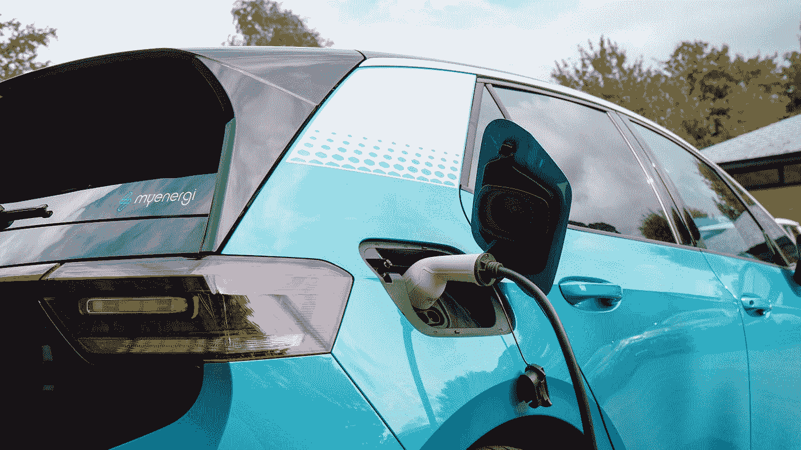
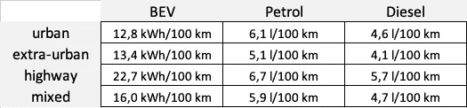
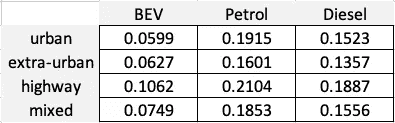
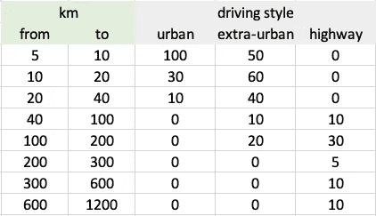
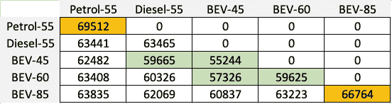
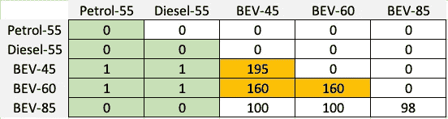
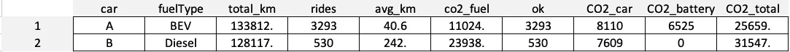

# 家庭——有什么比拥有两辆电动汽车更好？

> 原文：<https://towardsdatascience.com/how-many-electric-cars-should-a-family-own-aa7c146ebae4?source=collection_archive---------25----------------------->

## 我们展示了一个家庭如何优化 CO₂排放和车队的日常可用性。解决方案出人意料。


Denys Nevozhai 在 [Unsplash](https://unsplash.com?utm_source=medium&utm_medium=referral) 上拍摄的照片

已经有大量研究比较了电动汽车(也称为“BEV”)和内燃机汽车(ICE)的温室气体排放和成本。对于需要两辆车的**社区**(例如家庭或住户)**的问题的**优化**研究较少。**

为了填补这一空白，也出于自身利益，我们为这项研究详细模拟了一个**现实场景**。

我们优化以下两个**标准**以达成一个平衡可行的解决方案:

*   **气候足迹**。在整个生命周期中(包括汽车和电池生产、燃料供应等),CO₂的排放量应降至最低。).
*   **日常可用性**。充电和加油意味着时间和物流的损失。因此，我们的解决方案应该只需要每年几天的时间，就可以每天给车辆充电/加油一次以上。

由于整个研究有点复杂，我们将从头开始:首先是结果和影响，然后是假设和模拟的细节。

# 内容

*   **研究结果**
*   模拟:假设
*   模拟:细节
*   **模拟:结果**
*   **胜利者**
*   总结和展望

# 研究结果

正如所承诺的，我们从结果开始。细节和假设将随后。以下是主要发现:

*   在现实假设下，一个家庭/住户的**最佳**是**使用一辆电动车和一辆柴油车**。
*   如果**每天的距离很短**或者如果一次充电最多可以覆盖**的距离，那么**电动车**应该总是**首选**用于日常使用。**
*   由于电池是 CO₂-intensive 生产的，电动车应该有**而不是小电池**(例如 45 千瓦时)。
*   与使用两辆电动汽车相比，如果其中一辆汽车有内燃机，一天内第二次加油/充电的**需求**会大大减少**(减少到百分之一)。**

如果电动汽车主要用于短距离和中距离，大多数充电可以在家中自己的车库中进行。这样可以节省时间和金钱。对于私人光伏(PV)系统的所有者来说，CO₂可以降低得更多。

另一个有趣的发现是:

*   使用两辆电动汽车，都有一个大电池，导致我们的场景相当差的碳足迹。



夏洛特·斯托在 [Unsplash](https://unsplash.com?utm_source=medium&utm_medium=referral) 上的照片

你对我们如何得到这些结果感到好奇吗？接下来的部分将让您深入了解细节…

# 模拟:假设

对于我们的模拟，我们必须做一些假设。假设的一部分是基于文献研究，第二部分是关于被调查情景的定义。在任何情况下，仿真模型可以快速且容易地适应变化的参数。

为了获得可比较的结果，我们将我们的分析建立在紧凑型车的基础上。该级别还包括目前在欧洲占据最大市场份额的车型(大众高尔夫，大众 ID.3)。


我们已经为模拟程序编写了一些代码。将来更改参数可以不费吹灰之力。照片由[阿诺·弗朗西斯卡](https://unsplash.com/@clark_fransa?utm_source=medium&utm_medium=referral)在 [Unsplash](https://unsplash.com?utm_source=medium&utm_medium=referral) 拍摄

所以让我们一个一个地检查假设:

## 每单位能源的 CO₂排放量

*   每度电 0.468 千克 CO₂。
*   每升汽油含 3.140 千克 CO₂。
*   每升柴油含 3.310 千克 CO₂。

第一个假设基于欧洲电力组合“eu 2014”(1)。由于电动汽车在行驶过程中不会排放任何温室气体，因此排放的气体完全是用于提供能源的废气。为了公平的比较，这些不能被忽略。

在燃料生产过程中，内燃机的排放量也因 CO₂负荷而增加，以计算总排放量(2)。

## 汽车生产和处置的 CO₂排放

根据(1)，生产小型汽车的温室气体排放量如下:

*   一辆电动汽车(bev)8，110 公斤 CO₂。
*   汽油车 7，425 千克 CO₂
*   柴油车为 7，609 千克 CO₂

对于电动汽车，每千瓦时的电池尺寸增加了一个**额外的 145 公斤 CO₂。因此，容量为 50 千瓦时的电池需要额外的 7，250 千克 CO₂用于生产和处理电池。**

## 消费

对于油耗值，为了保持一致，我们使用了相同的来源(1)。以下是假设，通常单位为升或千瓦时每 100 公里:



根据 ifeu 模型(1)，紧凑型车辆的消耗量。电动车= BEV。混合类别对应于 30%的城市、40%的郊区和 30%的公路。

将每千瓦时或每公里的排放量数据乘以消耗量就可以得出每公里的 CO₂排放量。这样就可以很容易地比较不同使用领域的车型(“道路类型”):



不同车辆类别和道路类型的每公里 CO₂排放量。

## 场景的定义

我们模拟的场景大致代表了**一个家庭**典型的日常流动性。我们假设每年有几次长途旅行(如假期)和大量的短途旅行。

下表定义了这方面的详细信息。道路类型下面的数字就是所谓的“汽车日”。“城市”下方第一个单元格中的数字 100 被解释为每年有 100 天需要一辆行驶总距离为 5-10 公里的汽车，主要是“城市”。



每个路线区域和道路类型一年内的出行次数。例如，假设在 5 天内完成 200-300 公里的旅程，主要是在高速公路上。

总的来说，这意味着每年 385 个“汽车日”行驶 27，625 公里。如果无车日的数目作为进一步的参数被给定为 20，则恰好一辆车或两辆车都在使用的日子分别是 325 和 40。

快速检查显示正确:20 x 0+ 325 x 1 + 40 x 2= 385。

对于我们的模拟，我们当然可以根据需要调整该部分中的所有参数。

# 模拟:细节

为了得到可靠的结果，我们使用了所谓的“**蒙特卡罗”模拟**。基本上，在 10 年的时间里，我们每天随机确定是否有 0、1 或 2 辆车在使用，以及哪些日常路线必须行驶。

使用编程语言 **R** ，这可以通过使用:

```
## Decide on 0, 1, 2-car days by Monte Carlo. 
nDays = 365 * years
dayType = sample(
 0:2, size=nDays, replace=TRUE, 
 prob=carDayDistribution[c("zeroCarDays","oneCarDays","twoCarDays")]
)
```

例如，所谓的 2 辆车一天所需的日工作量可能如下所示:

*   路线 A: 7 公里，市区。
*   B 路线:980 公里，高速公路。

“随机”是指平均而言，场景部分中显示的表的分布是复制的。然而，10 年后，高速公路或城市出行仍然会更多甚至更少。

根据模拟运行的 2 种汽车类型(BEV、汽油、柴油),将在一天内选择使用其中一种汽车。
我们的决策标准(每天)如下:

*   如果只有一条路可走，我们选择 CO₂排放量最低的车。假设每天最多可以行驶 1 次充电/加油。
    否则，我们选择行驶里程更长的车辆。
*   如果有两条路线要行驶，我们选择的路线要使汽车每天的 CO₂排放量最小。如果其中一辆车需要充电或加油不止一次，我们会为行驶里程较长的车辆分配较长的距离。

顺便说一句，我们并不假设充值发生在 0%，但在 20%；)同样，我们使用矢量化代码:

```
**## 1-Car-Days.**
nOneCar = sum(dayType == 1) 
# Get n tracks as a data.frame including driveType and km. 
tracks = getTravelRequests(nOneCar, carDaysData) 
CO2_carA_track1 = CO2_per_km[tracks$driveType,fuelTypeA] * tracks$km
CO2_carB_track1 = CO2_per_km[tracks$driveType,fuelTypeB] * tracks$km
...
selected_car = ifelse(
  (CO2_carA_track1 <= CO2_carB_track1) & (tracks$km<=rangeA), "A", 
  ifelse(
    (CO2_carB_track1 <= CO2_carA_track1) & (tracks$km<=rangeB), "B",
    ifelse(
      rangeA >= rangeB, "A", 
      "B"
    )
  )
)**## 2-Car-Days.**
nTwoCars = sum(dayType == 2)
... 
```

因此，该规则是确定性的，并且相对简单。正如你所看到的:CO₂最小化的组合，但避免了“连续加油日”。

由于电池大小是决定性的，我们使用以下 5 种汽车类型:

*   45 千瓦时的 BEV
*   60 千瓦时的 BEV
*   85 千瓦时的 BEV
*   55 升油箱的汽油
*   带 55 升油箱的柴油发动机

顺便说一句，内燃机的油箱大小并不真正影响结果。

# 模拟:结果

对于两种车型的每种组合(甚至是两次相同的车型)，进行了 **50 次持续时间为 10 年的模拟**。该模拟为我们提供了车辆生产、使用和处置过程中 CO₂总消耗量的详细信息。它还给出了单次充电/加油不够用的“汽车日”数。

CO₂消耗量(整个汽车寿命)的表格有些令人惊讶。很明显 2 款汽油车表现很差(69.5t)。但是 2 个 2 个大电池的 bev 也远远落后(66.7t):



各种车辆组合的 CO₂排放量，单位为千克(50 次模拟的平均值，每次 10 年)。绿色表示 4 个最佳值(低于 60 吨 CO₂)，橙色表示 2 个最差值(高于 65 吨 CO₂).

如果电池容量保持较小(60 千瓦时，45 千瓦时更好)，那么 2 个 bev 的组合是环保的。但是，即使一辆 45 千瓦时的柴油 BEV 仍然低于 60 吨 CO₂.

但是哪些组合适合日常使用呢？这就是下表告诉我们的。实际上，包括至少一个柴油或汽油发动机的所有组合将在 10 年内管理最多一次需要不止一次充电/加油的行程:



需要多次充电/加油的行程次数(平均 50 次模拟，每次 10 年)。如果<10, in orange if > 150 显示为绿色。

如果你选择两杯饮料，情况就完全不同了。在这种情况下，需要更频繁地充电，在 10 个模拟年内平均 100 到 200 次，也就是说每年 10 到 20 次。

# 获胜者

我们的获胜者就这样被确定了。两个表中只有一个组合显示绿灯:

> 如果你正在寻找一个实用的解决方案，你的车队中应该有一辆带小电池(例如 45kWh)的 **BEV 以及一辆**内燃机** **车辆**(例如柴油)。**

为了获得最佳值，BEV 的范围足够的所有路线当然应该用 BEV 驱动。

对于获胜的解决方案，我们自然希望更详细一些，并给出 50 次模拟运行之一的额外关键数字。在下表中，第 1 行显示了汽车“A”(BEV)的汇总，第 2 行显示了汽车“B”(diesel)的汇总。



“成功解决方案”的详细信息。汽车类型，燃料类型，总公里数，汽车天数，平均。每辆车每天行驶的公里数，燃油消耗量和燃油产量的 CO₂，最大行驶天数。1 充电/燃料，CO₂用于汽车生产，CO₂用于电池生产，CO₂总排放量。

可以看出，BEV 行驶了 3293 次，行程 40.6 公里，而 diesel 平均行驶了 530 次，行程 242 公里。

**BEV** 产生 8.1 吨 CO₂用于汽车生产，6.5 吨用于电池，11.0 吨用于能源供应。总计**25.7 吨**。
**柴油**则需要 7.6t CO₂用于汽车的生产，尾气和能源供应共 24.0t，总计 **31.5t** 。

两个值之和甚至低于 50 次模拟的平均值(59.7t)。这是因为模拟的本质也考虑了散射。


瑞尼尔·卡尔在 [Unsplash](https://unsplash.com?utm_source=medium&utm_medium=referral) 上拍摄的照片

# 摘要

我个人从这项研究中的收获是:

*   就气候平衡和日常使用的适宜性而言，电动和柴油车辆的组合为我们的场景实现了最佳结果。
*   100%电动或 100%内燃机都不会产生好的结果。
*   必须批判地看待大电池的趋势。如果你拥有一个不止一辆车的车队，你有很多优化的选择。装有小电池的 BEV 通常能显著改善气候平衡。

# 观点

许多参数，如使用的电力组合、燃料消耗等。，可以快速改变。我们不排除在不久的将来用修改的参数更新现有模拟的可能性。

我们还考虑将模拟**在线**作为一个小型网络应用程序，这样每个人都可以模拟他们自己的**场景**——从而为他们自己和环境得出最佳的行动建议。

> 来源
> 
> (1)Agora Verkehrswende(2019):*Klimabilanz von elektroautoos。einflussfaktoren und Verbesserungspotenzial。*
> 
> (2) Auke Hoekstra，innovationorigins (2020 年):*汽油和柴油的二氧化碳排放量将增加*。