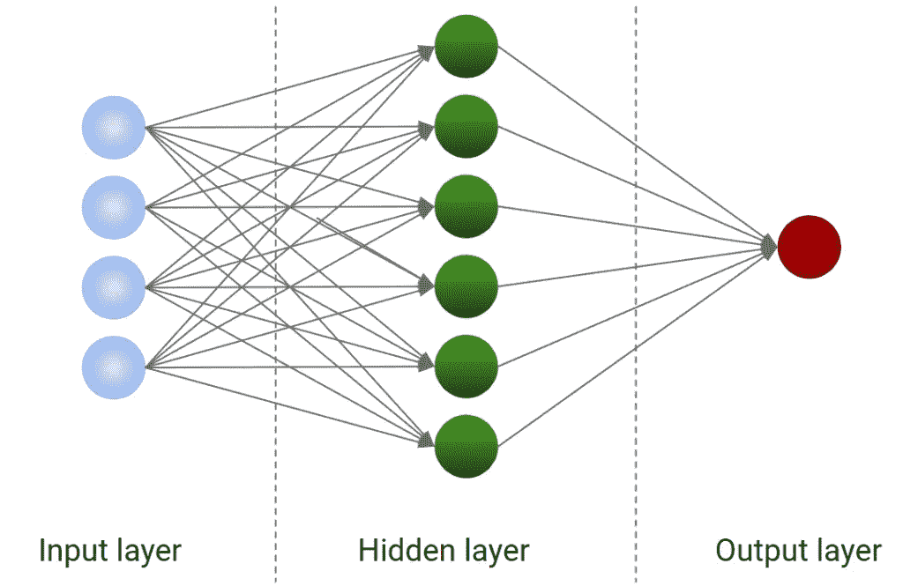

# 一个神经网络有多少个神经元？

> 原文：<https://towardsdatascience.com/how-many-neurons-for-a-neural-network-2107627f7869?source=collection_archive---------28----------------------->

## 让我们看看如何找到神经网络的最佳神经元数量



作者图片

神经网络是机器学习的一个迷人领域，但它们有时很难优化和解释。事实上，他们有几个超参数。要调整的最常见的超参数是隐藏层中神经元的数量。让我们看看如何为我们的数据集找到神经网络的最佳神经元数量。

# 什么是神经网络？

神经网络是一种特殊的模型，它试图捕捉特征和目标之间的相关性，根据神经元层转换数据集。有几本书是围绕神经网络写的，给你一个这种模型的完整概述不在本文的范围之内。我只能说，神经网络是由几层神经元组成的。每个神经元获得一些输入，转换它们并返回一个输出。一个神经元的输出可以成为下一层神经元的输入，以此类推，构建越来越复杂的体系结构。

第一层称为输入层，由神经元构成，它返回特性本身的值。然后，第一层的每个神经元与隐含层的所有神经元相连，隐含层负责网络的学习能力。隐藏层之后可以是其他几个隐藏层，这是典型的深度学习网络。最后，将最后一个隐藏层的输出提供给给出结果(即目标变量的值)的输出层。

从最简单的形式来看，神经网络只有一个隐藏层，如下图所示。


作者图片

输入层的神经元数量等于特征的数量。根据目标变量定义输出层的神经元数量。这就出现了为隐藏层找到正确数量的神经元的问题。

少数可能会产生欠拟合，因为网络可能无法正确学习。高数值可能会产生过度拟合，因为网络从训练数据中学到了太多东西，而没有进行归纳。因此，必须有一个中间数量的神经元来确保良好的训练。

# 如何优化神经元的数量

程序非常简单，它使用交叉验证:

*   设置若干神经元
*   在 k 倍交叉验证中计算某些性能指标的平均值
*   用不同数量的神经元重复这个过程
*   选择在 k 倍交叉验证中使平均值最大化的神经元数量

交叉验证很重要，因为使用它我们可以确保模型不会过拟合或欠拟合。

这个过程非常类似于超参数调整，因为隐藏层中的神经元数量实际上是要调整的超参数。

现在让我们看看如何在 Python 中应用这个过程。

# Python 中的示例

在这个例子中，我将展示如何使用 scikit-learn 库优化 Python 中的神经元数量。在现实生活的例子中，您可能会使用 Keras 来构建您的神经网络，但概念是完全相同的。你可以在我的 [GitHub 库](https://github.com/gianlucamalato/machinelearning/blob/master/Best_number_of_neurons.ipynb)中找到代码。

我将使用 scikit-learn 中包含的*乳腺癌*示例数据集。

首先，我们来导入一些有用的库。

```
import numpy as np
from sklearn.preprocessing import StandardScaler
from sklearn.neural_network import MLPClassifier
from sklearn.datasets import load_breast_cancer
from sklearn.model_selection import train_test_split, GridSearchCV
from sklearn.pipeline import Pipeline
from sklearn.metrics import roc_auc_score
```

然后，我们可以加载数据集，并将其分成训练集和测试集。

```
X,y = load_breast_cancer(return_X_y=True)
X_train, X_test, y_train, y_test = train_test_split(X, y, test_size=0.33, random_state=42)
```

现在，我们必须定义我们的模型。对于这个例子，我将使用一个简单的多层感知器，只有一个隐藏层。为了简单起见，构造函数的所有参数都保持标准值。我只是设置了随机状态，以保证结果的重现性。

在将数据集提供给神经网络之前，不要忘记缩放您的要素。为了简单起见，我将使用 scikit-learn 中的 Pipeline 对象，然后应用标准化。关于缩放技术的更多信息，你可以参考我之前的[博客文章](https://www.yourdatateacher.com/2021/03/22/scaling-of-the-numerical-variables/)和我的[预处理课程](https://yourdatateacher.teachable.com/p/data-pre-processing-for-machine-learning-in-python)。

```
model = Pipeline([
                  ('scaler',StandardScaler()),
                  ('model',MLPClassifier(random_state=0))
])
```

现在，我们必须通过搜索最佳数量的神经元来优化我们的网络。请记住，我们会尝试几种可能的数字，并在交叉验证中计算绩效指标的平均值。最大化这样一个值的神经元的数量就是我们正在寻找的数量。

为此，我们可以使用 GridSearchCV 对象。由于我们正在处理一个二元分类问题，我们要最大化的度量是 AUROC。我们将以 2 为步长从 5 个神经元跨越到 100 个神经元。

```
search = GridSearchCV(model,
   {'model__hidden_layer_sizes':[(x,) for x in np.arange(5,100,2)]},
   cv = 5, scoring = "roc_auc", verbose=3, n_jobs = -1

)
```

最后，我们可以搜索神经元的最佳数量。

```
search.fit(X_train, y_train)
```

搜索结束后，我们得到最好的平均分数，即:

```
search.best_score_# 0.9947175348495965
```

神经元的最佳数量是:

```
search.best_params_# {'model__hidden_layer_sizes': (75,)}
```

最后，我们可以在测试数据集上计算这种模型的 AUROC，以确保我们没有过度拟合我们的数据集。

```
roc_auc_score(y_test,search.predict_proba(X_test)[:,1])# 0.9982730973233008
```

我们获得的值仍然很高，因此我们非常确定优化的模型已经从它携带的信息中学习了训练数据集。

# 结论

优化神经网络可能是一项复杂的任务。在本文中，我解释了一种优化神经元数量的可能方法，但同样的概念甚至可以应用于其他超参数(如激活函数、最小批量、时期数、学习速率)。请记住，超参数的数量越多，优化速度越慢。

如果你想了解更多关于神经网络的知识，加入我的 Python 在线课程[监督机器学习。](https://yourdatateacher.teachable.com/p/supervised-machine-learning-with-python)

*原载于 2021 年 5 月 10 日 https://www.yourdatateacher.com**的* [*。*](https://www.yourdatateacher.com/2021/05/10/how-many-neurons-for-a-neural-network/)