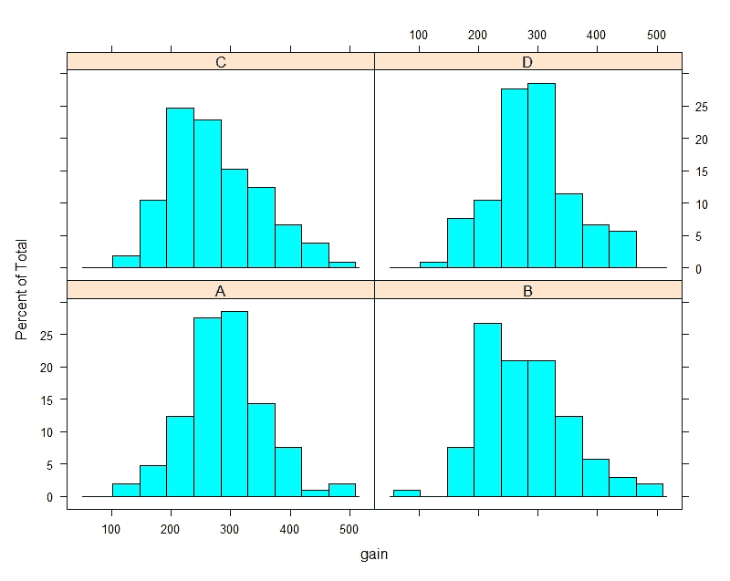
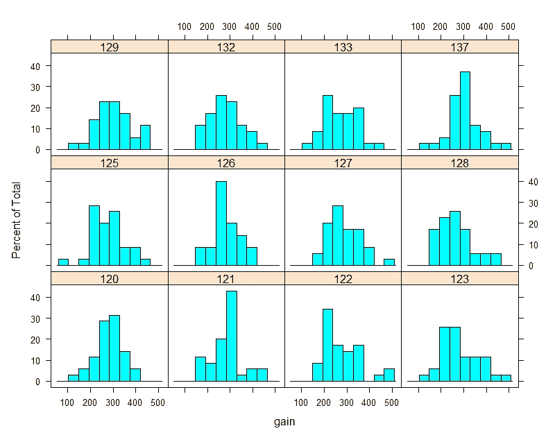
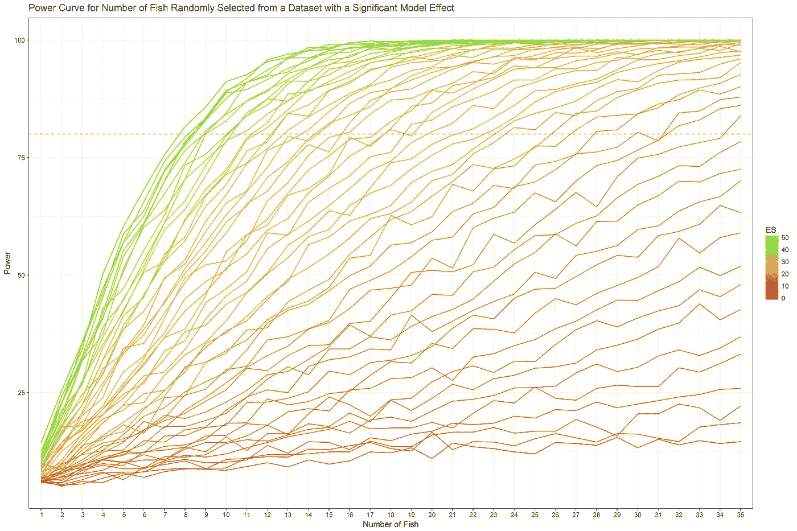

# 你需要多少样品？

> 原文：<https://towardsdatascience.com/how-many-samples-do-you-need-simulation-in-r-a60891a6e549?source=collection_archive---------23----------------------->

## R 中的模拟

在水产养殖中，实验是在装有鱼的水槽中进行的。这些鱼是单独测量的，这是一项乏味而又紧张的工作。我被要求*计算一个人需要采集多少鱼的样本才能维持相当于一个完整样本实验的能量*。

为了检测整体效果，我使用了来自 **ANOVA** 的 **F 值**。从这种模型中获得的任何 p 值表明，在包含多个处理的实验中，任何处理之间是否存在任何'**显著性**'差异。“显著性”的极限通常设置为 0.05，这意味着我们接受每 20 次重复试验中 1 次的 5%**1 型错误**或**假阳性率**(这里不深入探讨 Frequentist 理论)。

为了尝试回答最初的问题，我收到了一个数据集，其中包含了对各种处理的每缸鱼的观察结果。根据频率理论，我们知道获得显著 p 值的能力——如果真的存在的话——取决于均值、标准差和样本大小。平均值和标准差用于计算处理内的变异系数，以及处理间的效应大小。在这个例子中，效果大小是处理之间的差异，通过标准偏差进行校正。

对于这个练习，我使用了 **R** 编程语言，但它可以很容易地在 **SAS** 、 **Python** 或任何其他选择的编程语言中复制。

让我们加载我认为我会需要的库。

然后，让我们导入数据并查看一下。



在这里，您可以看到按治疗和按坦克划分的数据分布。下面的代码显示每个容器包含 35 个观察值。

```
# A tibble: 12 x 2
   Tank  no_rows
   <fct>   <int>
 1 120        35
 2 121        35
 3 122        35
 4 123        35
 5 125        35
 6 126        35
 7 127        35
 8 128        35
 9 129        35
10 132        35
11 133        35
12 137        35
```

用于测试当前功率(事后)的模型和度量分别是 ANOVA 和 f 检验。f 检验寻找所有处理之间的差异，以说明在给定假阳性率的情况下，它们是处理之间的差异。

结果、显著性和 F 值显示在下面的代码中。

```
Call:
lm(formula = gain ~ Diet, data = ARCdata)Residuals:
     Min       1Q   Median       3Q 
-204.067  -48.865   -4.894   45.291 
     Max 
 213.933Coefficients:
            Estimate Std. Error
(Intercept) 290.7048     6.9934
DietB       -12.6381     9.8901
DietC       -15.9836     9.9139
DietD         0.2087     9.9139
            t value Pr(>|t|)    
(Intercept)  41.569   <2e-16 ***
DietB        -1.278    0.202    
DietC        -1.612    0.108    
DietD         0.021    0.983    
---
Signif. codes:  
  0 ‘***’ 0.001 ‘**’ 0.01 ‘*’ 0.05
  ‘.’ 0.1 ‘ ’ 1Residual standard error: 71.66 on 414 degrees of freedom
  (2 observations deleted due to missingness)
Multiple R-squared:  0.01037, Adjusted R-squared:  0.003198 
F-statistic: 1.446 on 3 and 414 DF,  p-value: 0.2289[1] 0.2288678
[1] 1.445967
```

为了获得**事后功耗分析**，我需要查看获得有效 p 值的概率(p < =0.05)。我应用了 bootstrapping(替换重采样)来估计总体均值和标准差(sd)。一旦我有了总体均值和标准差，我就可以模拟 1000 次试验，并观察总体中达到的“功效”。

在下面的代码中，您可以看到**总体均值**和**标准差**与样本均值和标准差之间的差异结果。这通常被称为“**偏差**”，给出了样本数据对模拟有用程度的一个很好的近似值。

```
 120          121          122          123          125 
 0.020574286 -0.086813862  0.085062857 -0.243245714  0.185080000 
         126          127          128          129          132 
-0.052434286  0.195677143 -0.005534286 -0.153240000  0.114102857 
         133          137 
 0.044703253  0.031260000 120       121       122       123       125       126       127 
-1.318715 -1.472052 -1.720122 -1.763247 -1.601380 -1.356375 -1.600663 
      128       129       132       133       137 
-1.624573 -1.583112 -1.250887 -1.307703 -1.889067
```

然后，我开始模拟 10k 新试验，使用总体均值和标准差，寻找每罐使用 35 个样本时的功效。

```
apply(x, 2, FUN = power)
V1                39.21
```

正如你所看到的，结果并不是很好，根据人口值显示了 39%的事后权力。这意味着，在当前实验中发现的效应大小不允许每个鱼缸取样少于 35 条鱼。不会，除非我们能增加差异的影响大小。

为了模拟这种情况，我们需要使用总体平均值、标准偏差、变异系数，并通过增加单次治疗的平均值来扩大效应大小。在这里，我选择了治疗 D(及其坦克 121，126，129)。

```
print(popcv<-(popsd/popmean))
      120       121       122       123       125 
0.2036404 0.2273521 0.2912939 0.2887722 0.2576816 
      126       127       128       129       132 
0.2100662 0.2421316 0.2734029 0.2557708 0.2290366 
      133       137 
0.2546334 0.2381327
```

上面的代码很难理解，但是我主要做的是让 R 创建一个数组，在这个数组中，当改变一个效果大小和每个鱼缸中鱼的数量的矩阵时，F 值和 p 值被存储。

上面是一些数据争论，以产生我想要的图表，使用变量'权力'，' N '，和' es '。下面是生成图表的代码，如果您看到图表，它应该是不言自明的。



显示模拟结果的图表。变化的变量是影响大小和鱼的数量。曲线并不平滑，因为仅使用了 1000 个样本，这在 i7 上花费了大约 60 分钟。

上图清楚地显示了功效是效果大小和鱼样本数量的函数。为了达到 80%的力量，你需要有一个特定的效果大小，没有多少鱼可以抵消这一点。因此，当设计一个实验时，你需要尽你所能创造必要的效果来从噪音中检测信号。