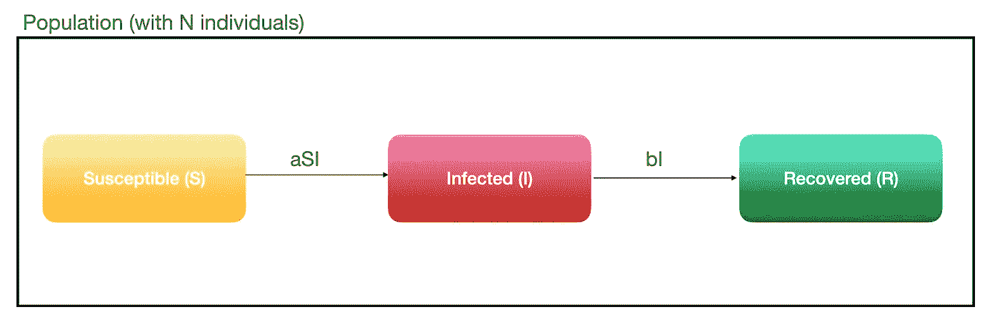
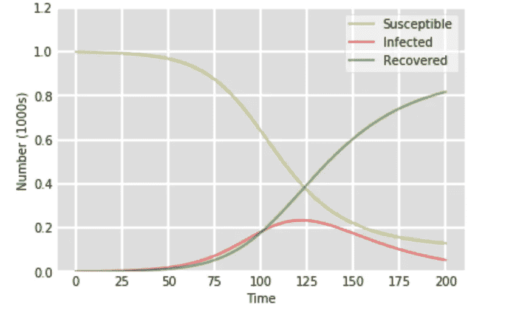
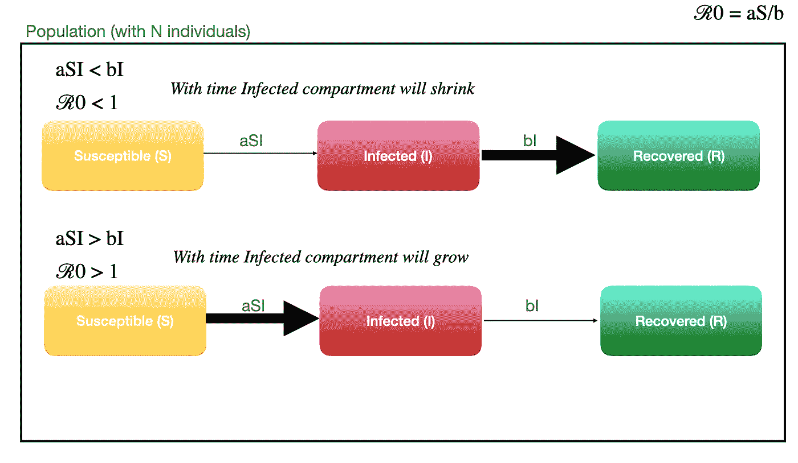
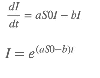
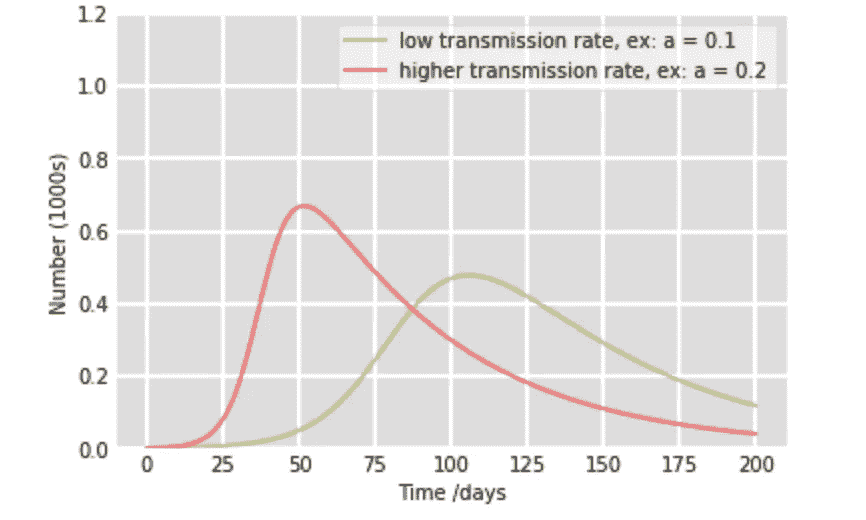

# 数学如何帮助控制流行病

> 原文：<https://towardsdatascience.com/how-mathematics-can-aid-in-controlling-epidemics-1dfe986fa806?source=collection_archive---------22----------------------->

分室模型

来源:Fusion Medical Animation 的 Unplash

> 这总是一个不确定性。我们总是在传染病轮盘赌桌上(威廉·沙夫纳博士)

有了现在的 Covid 19 疫情，我们可以看到沙夫纳博士的上述引用是多么准确。不确定我们什么时候会处于疫情。自古以来，人们就知道传染病会使人虚弱和死亡。霍乱、麻疹、疟疾、埃博拉、登革热和当前的 Covid 19 只是几个例子。

虽然一些疾病可以通过药物、疫苗、减少病媒数量或行为改变来治疗，但找到正确的控制策略来控制问题同样至关重要。当科学家不知疲倦地努力寻找治疗方法时，数学可以在各种情况下提供帮助。了解疾病的传播并控制它是这些领域之一。

本文的重点将放在一个非常基本的模型上，它被称为 SIR。SIR 模型是一种描述传染病动力学的房室模型。

## 背景

根据维基百科，对房室模型的研究始于二十世纪初，Ross 和 Hudson(1916-17)、Kermack 和 McKendrik (1927)以及 Kendall (1956)在该领域做了大量的关键工作。

与任何其他数学模型一样，在开发基础模型时使用了假设和限制。看到如何从数学上描述这种差异，并用来理解面临约束时的差异，这很有意思。正如我之前所说，这是一个基本模型，许多其他科学家和研究人员在 SIR 的基础上创建了复杂的架构模型，使限制更接近现实。然而，要理解其他模型，需要对这种范式有一个基本的理解。

## 数学建模

整个种群首先被分成三个部分，称为“可接受的”、“不传染的”、“不传染的”、“被发现的”,这也是这个模型名字的由来。假设该人口规模稳定，没有出生、死亡或移民等事件。

资料来源:作者- SIR 模型

*   所有可能被这种疾病感染的人。通常在开始的时候，每个人都会受到影响。
*   **I** 易感染者:
    所有被疾病感染并有能力感染易感者的人。这些人会在特定的时期内康复
*   发现:
    这些人对疾病产生了免疫力，不再易感。免疫力是由康复的人获得的，他们没有再次脆弱的前景。

我们先定义一些变量。

*   s，I，R :
    分别在易感、感染和恢复隔室中的个体数量
*   a : a > 0
    一个参数，表示一种疾病可以通过一个感染者传播到什么程度。这可以使用诸如接触的可能性、疾病传播的可能性等因素来计算。
*   b : b >0
    一个参数，表明个人在给定的时间范围内，从给定的疾病中恢复的程度。

因为人口在任何给定的时间都是固定的，我们可以说三个隔间里的总人数等于时间 t 时的人口数量。

***S(t) + I(t) +R(t) = N***

为了更好地了解疾病的动态，正在检查每个房室的变化速度。三个简单的微分方程可以用来表达这一点。

1.  **dS/dt = -aSI** 因此，我们将 **S** 乘以 **I** ，然后乘以上述反映感染率的正常数 a。这个术语变成了负面的，因为随着时间的推移，人们会被感染，S 区会缩小。
2.  **dI/dt = aSI — bI** 这里增加了从易感人群中以 **a** 的比率转移出来的新感染者，当他们康复后，由于不能再传染他人而离开感染区。受感染人数越多，离开隔离室的人就越多，所以我们用常数 **b** 乘以 I，该常数描述了恢复率。当它们离开感染区室时，第二项为阴性。
3.  **dR/dt = bI**

来源:作者图片:疾病动态图解

如果我们用图表来检验，我们可以观察到，在开始时，每个人都属于易感群体。然后，当他们被感染时，黄色图形开始变淡，红色图形表示受感染人数开始增加。随着人们从感染进展到康复，随着易感人数的减少，感染人数曲线开始下降。

如上所述，疾病传播的动力学可以用数学方法解释和描述。现在让我们来看看在了解动力学之后我们可以推导出的一些信息。

## 新出现的感染会在人群中传播吗？

答案在第二个等式中，

**dI/dt = aSI — bI**

为了阻止扩散，第二隔间中的人数应该随着时间的推移而减少。这意味着随着时间的推移，离开第二隔间的人数应该高于进入第二隔间的人数，这意味着即使新的一群人被感染，他们也应该很快离开系统。

来源:作者——传染性是会增强还是减弱

如图所示，如果传染性要降低，ℛ0 应该小于 1。如果不这样，感染将会在人群中传播，人们将不会很快康复。

此外，如果随着时间的推移，易感人群的人数没有减少，疾病就有可能爆发。让我们将易感人群的数量定义为常数 S0。然后，

来源:作者

当微分方程如上求解时，将显示感染计数随着时间呈指数增长。那么这种疾病爆发的可能性很大。

## **基本复制号**

我们上面讨论过的ℛ0，实际上被称为基本再生产数。

**ℛ0 = as/b；**其中 a —传输速率，b —恢复速率

在易感人群中，它被定义为受一个感染者影响的预期人数。因此，如果 R0 小于 1，疾病将不复存在；否则，可能会爆发疾病或流行病。R0 越低越好。

## 根据 **ℛ0** 如何采取行动控制疫情

根据上述方程，ℛ0 与传播率和人群中易感个体的数量成正比，但与恢复率成反比。因此，为了保持ℛ0 <1 either a or S should be reduced or b should be increased.

1.  Reducing the transmission rate (a)
    ,假设某种疾病的传播是通过与感染者的密切接触而发生的，并且没有适当的消毒方法。因此，为了控制ℛ0，易感人群必须与其他人保持安全距离，进行适当的消毒活动，或者当局必须隔离感染者或封锁城市以限制传播率。
2.  减少易感个体的数量
    如果一种药物或疫苗能够产生免疫力，通过增加这些和减少易感人群，就可以减少ℛ0。
3.  提高采收率(b)
    这是一个较难调整的参数，但通过适当的措施，如果人们继续活着，采收率提高，ℛ0 也可以降低。

## 拉平曲线

理解疾病动态的另一个关键好处是，如果监控正确，它将防止医疗系统负担过重。如果作出适当的努力来限制感染室的增加，医院床位和 ICU 可以得到有效的控制。如果操作不当，回收率(b)可能会降低，ℛ0 可能会增加。

来源:作者-拉平曲线

当传播率降低时，如通过封锁或任何其他适当的干预，人群中的感染者数量减少，如上图所示。因此，卫生保健行业随时都有资源来应对这一问题。它还将高峰期推迟，让医疗服务提供者有更多的时间做准备。

## 群体免疫

如果通过适当的干预可以减少 s 室，并且足够多的人对这种疾病免疫，ℛ0 将得到控制，对这种疾病将有抵抗力。当高比例的人口获得免疫时，群体免疫就实现了，使得疾病在人与人之间的传播极其罕见，因此保护了整个人口。

# 摘要

如上所述，房室模型可用于更好地理解疾病动态，并且当适当建模和改进时，可用于采取适当的行动。在某些情况下，假设群体是封闭的，或所有成员都是易感的，或当恢复时，不会是易感的，可能是不现实的。除了文献中的微分方程之外，还有许多基于此的模型，以及许多其他用于建模疾病的方法。

最重要的是，在将每种方法应用于特定案例或将其用作更全面分析的合适起点之前，要了解每种方法的优势和局限性。

# 参考

1.  [https://www . mayo clinic . org/diseases-conditions/coronavirus/in-depth/herd-immunity-and-coronavirus/art-20486808](https://www.mayoclinic.org/diseases-conditions/coronavirus/in-depth/herd-immunity-and-coronavirus/art-20486808)
2.  [https://scipython . com/book/chapter-8-scipy/additional-examples/the-sir-epidemic-model/](https://scipython.com/book/chapter-8-scipy/additional-examples/the-sir-epidemic-model/)
3.  [https://en . Wikipedia . org/wiki/compartment al _ models _ in _ epidemiology](https://en.wikipedia.org/wiki/Compartmental_models_in_epidemiology)
4.  [https://intermountainhealthcare . org/blogs/topics/live-well/2020/04/what-the-difference-a-a-疫情-an-epidemic-地方病-an-outbreak/](https://intermountainhealthcare.org/blogs/topics/live-well/2020/04/whats-the-difference-between-a-pandemic-an-epidemic-endemic-and-an-outbreak/)