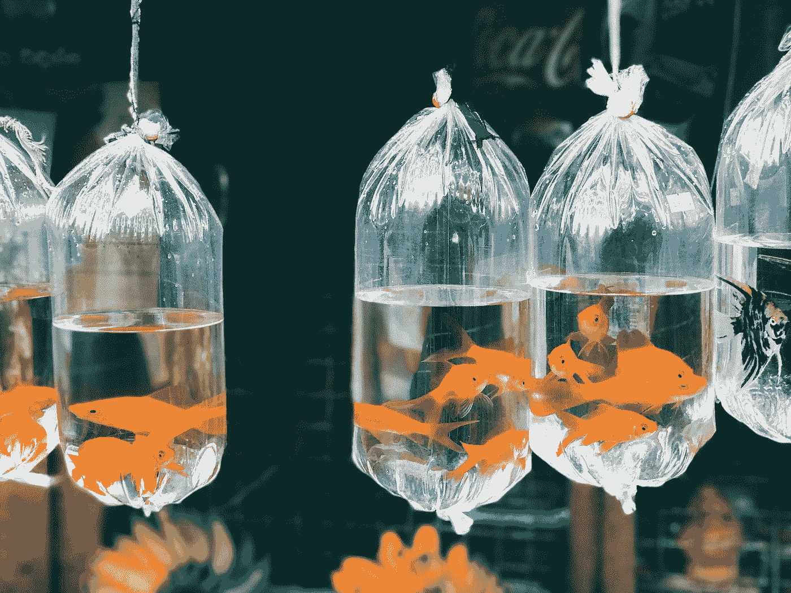

# 微学习如何帮助您在每天不到 10 分钟的时间内提高数据科学技能

> 原文：<https://towardsdatascience.com/how-microlearning-can-help-you-improve-your-data-science-skills-in-less-than-10-minutes-per-day-6499348228d7?source=collection_archive---------5----------------------->

## 这种电子学习趋势可用于高效满足您的数据科学目标

斯里兰卡在 [Unsplash](https://unsplash.com?utm_source=medium&utm_medium=referral) 拍摄的照片

现在，赞美某人的注意力像金鱼一样集中是合理的。

人类曾被认为是注意力持续时间为 12 秒的优等种族，[过去 15 年的研究显示人类的平均注意力持续时间下降到了 8.25 秒。](https://www.wyzowl.com/human-attention-span/)

金鱼的注意力持续时间是 9 秒。

人类平均每小时查看收件箱 30 次，每周拿起手机超过 1500 次(每天使用 3 小时 16 分钟)，平均只阅读网页上 28%的单词，可以肯定地说，作为一个物种，我们很容易分心。

这种容易分心的性质很难转化为对复杂主题的研究，例如与数据科学相关的主题。

传统的学习方式不再是一种选择。进入小额学习。

# 什么是微学习？

[微学习](https://www.shiftelearning.com/blog/numbers-dont-lie-why-bite-sized-learning-is-better-for-your-learners-and-you-too)是一种电子学习和教学设计趋势，指的是一种教育方法，它使用小型学习单元来提供学习者实现目标所需的适量信息。

微学习是一种有效的转变，它远离了整天的课程和枯燥的 PowerPoint 演示，这些课程和演示会让参与者在头两分钟就打瞌睡。相反，我们的目标是提供[小型课程](https://www.shiftelearning.com/blog/numbers-dont-lie-why-bite-sized-learning-is-better-for-your-learners-and-you-too)，仅涵盖 1-2 个主题，可在 10 分钟内完成。

根据发表在《应用心理学杂志》上的一项研究，微学习比传统学习方法效率高 17%。这种提高的效率来自于学习者只需要消化小块的信息，这提高了主题的记忆和理解。

由[软件咨询](https://www.softwareadvice.com/resources/top-lms-features-employee-engagement/)进行的一项研究发现，微学习还创造了 50%以上的学习参与度。这种参与度的提高来自于与人类注意力持续时间相匹配的学习课程的实施。

# 微学习的使用对数据科学学习体验有何益处？

简而言之，数据科学的研究是一个漫长而艰巨的过程。再加上需要成为一个拥有编程、数学、机器学习、人工智能、商业头脑等技能的全面发展的个人，通往数据科学的旅程往往没有被看透。

数据科学就像高尔夫。你可以花一生的时间去掌握它，但你只会触及皮毛。

因此，学习过程必须尽可能地快速和有效。不，这并不意味着走捷径，在你的知识中留下基础漏洞，以便更快地找到“好”的东西。这意味着将复杂的主题分解成小的课程，在这一天结束时，你已经学习了 1-2 个主题，产生了 4-5 个收获。

# 小额学习适合谁，不适合谁。

对于使用微学习来研究数据科学，有一点需要注意。

对于那些已经具备数据科学技能基础的人来说，微学习是一种有益的学习工具。为什么？因为使用微学习方法学习数据科学的基础需要几十年的时间。那些希望过渡到数据科学的人通常会在给定的时间内这样做(通常是在他们的安全网耗尽之前)。因此，每天只花 10 分钟学习概念会让你在 6 个月的学习后只知道数据科学的基本框架。

**这种学习方法适用于:**已经具备数据科学基础知识，并且希望通过学习更复杂的主题来提高技能的人。这些人已经可以进行基本的数据分析，可以编写代码，并可以应用他们的发现来解决业务问题。对于专业人士来说，这种学习方法是一种很好的方式，可以在不中断日常工作的情况下，每天抽出 10 分钟来提高他们在特定主题上的技能。

**这种学习方法不适合:**完全是数据科学新手的人。这种学习方法可以与更传统的学习方法一起使用，以补充更复杂的主题。

# 如何利用微学习提高数据科学技能？

为自己建立微学习模块可能比登录 MOOC 或观看 Youtube 视频需要更多的时间，但结果可以在更短的时间内产生巨大的改善。

## 如何设置您的个性化小额学习模块:

1.  留出专门的时间来计划你的内容:要想成功地制定一个小额学习计划，你需要在这个过程中投入时间。几个小时就能决定你想学什么，以及你打算怎么学。
2.  **列出你想学的概念:**这个列表将为你的模块设定框架。例如，如果你想学习 NLP，列出所有与 NLP 相关的概念。将它们分解成单独的部分，或者将它们组合成小的逻辑模块。
3.  **确保微学习过程适合每个概念:**有时，微学习不足以学习深入的概念。例如，通过微学习无法学习完整的基本统计数据，因为需要更深入和长期的研究。测试一个概念是否适合小额学习的一个好方法是确定你认为学习这个概念需要多长时间。如果花费的时间超过 1 小时，可能不是为了小额学习。
4.  削减脂肪:微学习就是在短时间内学习少量的信息。这意味着你必须把内容精简到最低限度。包括你需要的一切，没有你不需要的。
5.  **确保每个模块或课程都有一些要点，并且只涵盖 1-2 个目标。想要把所有东西都加入到课程中会变得很容易，尤其是当它涉及到你感兴趣的话题时。然而，这些必须保持微经验，以确保你得到微学习的全部效果。如果你的课回答了 1-2 个问题，那太好了！如果它回答更多，尝试进一步分解内容。**
6.  **如果没有效果，不要把自己局限在 10 分钟的课程中:**有时候，不管你减掉多少脂肪，一个概念不会浓缩成 10 分钟的课程。在这种情况下，不要限制自己。如果课程长度少于 20 分钟，请按原样完成，或者考虑分成两节课。
7.  **利用多媒体让事情变得有趣:**看课本很无聊。看个视频就不是了。选择有趣的媒体，让你参与其中，增加学习体验。
8.  **使用微评估来评估你的进步:**小测试和小测验是评估你在学习这些主题方面的进步的好方法。简单测试的例子包括但不限于在 HackerRank 或 Kaggle 上完成一个编码挑战，或者花 10 分钟写下你对某个主题的所有了解，并将你写的内容与你对该主题的笔记进行比较。

# 微观学习之后是微观实践。

没有微观实践，微观学习就什么都不是。

采用新技能需要实践，而不是简单的死记硬背。使用微学习来学习数据科学概念也不例外。

诀窍是将微学习模块与微实践课程配对，微实践课程使用在更实际的情况下学到的确切技能。例如，如果您刚刚完成了 NLP 中关于标记化的微学习模块，那么您应该完成一个微练习，在该练习中，您获取一个运行文本的数据集，并将其分割成句子和单词，也称为标记。

微实践可以简单到在 HackerRank 或 Kaggle 上完成一个编码挑战，也可以复杂到在你自己的个人项目中实现你的新技能。

无论是哪种类型的实践，10 分钟的微观实践会议应该在完成微观学习模块后进行，以巩固你的新知识。

# 最后的想法。

当谈到学习数据科学时，必须使用书中的每一个技巧才能取得成功。这意味着利用一切可能的学习形式，确保你充分利用时间，学习必要的概念，以便在这个以结果为导向的行业中变得更加有效和有影响力。

通过探索不同的学习方法，你会有最好的机会掌握一个无法掌握的知识领域。

对于一个注意力跨度比金鱼还小的物种来说，我们需要所有我们能得到的帮助。