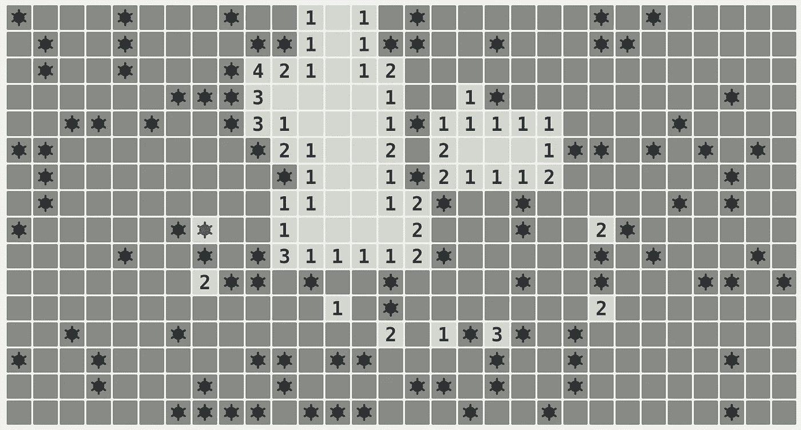

# 《扫雷》如何让我们以不同的方式思考数据

> 原文：<https://towardsdatascience.com/how-minesweeper-can-make-us-think-differently-about-data-439b31db8cc6?source=collection_archive---------22----------------------->

## 我们生活在一个不确定和信息不完善的世界

资料来源:矿业(LTS Ubuntu 18.04)

业余时间经常喜欢下棋扫雷(对，别笑)。

这两款游戏中，我一直觉得扫雷比较难懂，游戏规则一直显得很不透明。

然而，后一个游戏更类似于现实世界中的情形。这就是它与数据科学相关的原因。

# 完美信息与不完美信息

相比之下，在国际象棋中，不管一个人的游戏能力如何，所有的玩家在任何时候都有**完美信息**。

一个人总是可以看到棋盘上的每一个棋子，而且任何一方都不拥有相对于另一方的任何信息优势(除了从玩游戏的经验中获得的潜在知识)。

出于这个原因，人工智能被广泛用于训练计算机在国际象棋中获胜。这在 1997 年被证明是成功的，当时一台 [IBM 超级计算机](https://www.businessinsider.com/chess-grandmaster-gary-kasparov-ai-artificial-intelligence-destroy-jobs-prediction-2020-2?r=US&IR=T)被训练击败特级大师加里·卡斯帕罗夫。

从这个例子很容易推断出，人工智能模型可以被训练来潜在地解决这个世界上呈现给我们的任何给定问题。然而，事实并非如此——**因为人们总是在一个信息不完全的世界里工作**。

当一个人考虑扫雷游戏时，不完善的信息总是围绕着我们。总的来说，在某些方格中有一系列的地雷。点击地雷意味着玩家自动输掉游戏。当开始游戏时，没有办法知道哪些方块是可疑的，哪些不是。一个人必须简单地点击一个给定的方块，然后期待最好的结果。

假设一个人继续玩游戏，某些方格会给出一个指示，指出哪里可能有地雷**。例如，一个数字为 **1** 的方块表示在原来的方块周围有一个有地雷的方块。然而，没有人知道这是哪一个方块。**

**在这方面，《扫雷》是一款比国际象棋等游戏更能反映真实世界的游戏。**

**无论收集了多少数据，都不可能收集到 100%的数据来解释结果变量的变化。**

**即使这是可能的，解释这种变化的参数在未来也总是会改变的。就这一点而言，昨天非常有效的模式明天可能就不那么有效了。**

**所以，当面对不完美的信息时，每个决定都归结为一个**概率。我们无法确切知道在决定一个特定的结果时会发生什么，但我们可以给它分配一个概率。****

**例如，围绕数字 1 的方块比围绕数字 3 的方块风险小——现在后一个方块周围有三个地雷。最好避免点击那些方块！**

# **强化学习**

**有趣的是，强化学习在过去曾被用来试图训练人工智能在扫雷中获胜。sdlee94 的一个例子[在这里](https://sdlee94.github.io/Minesweeper-AI-Reinforcement-Learning/)。**

**虽然我不太熟悉算法如何工作的细节，但作者确实指出，任何被归类为猜测的举动都会得到负面奖励，因为目标是训练计算机通过逻辑和概率揭示安全方块。**

**也就是说，根据结果，神经网络仍然需要超过 60，000 场训练才能达到 10%以上的胜率。**

**当涉及到不确定性时，即使深度神经网络在做出正确预测的能力上似乎也是有限的。即使负面结果(在这种情况下，落在一个正方形上)发生的概率很低——只要尝试足够多，它仍然会发生。**

# **概率的重要性**

**在这点上，我怀疑数据科学将逐渐发展，更少依赖**准确性**，更多依赖**概率。****

**例如，训练模型的经典方法包括训练-测试分离，即首先使用训练数据训练和验证模型，然后通过测试集来测量准确性。**

**但是，较高的验证和测试分数仅表明该模型在这两个数据集上显示出较高的预测准确性。即使使用了交叉验证——该模型在能够表明它与新信息的配合程度方面仍然是有限的。**

# **模拟分析**

**由于这个原因，我预见更多的重点将放在模拟分析上。例如，假设有人试图预测一家公司一段时间内的收入。正在讨论的时间序列有一个固定的均值和标准差。**

**我们对这个时间序列进行 10，000 次模拟，同时人为增加标准差，怎么样？在这种情况下，先验模型有多准确？**

**从这个角度来看，人们将会更好地了解模型在什么情况下可以表现良好，在什么情况下表现不佳。**

**事实上，人们可以进一步发展这一想法，用不同的参数通过模拟数据训练几个模型。根据企业可能面临的潜在情况，可以在概率基础上配置不同的模型，以便在不同的环境中进行预测。**

**事实上，这正是贝叶斯分析的基础，我怀疑这一领域会越来越受欢迎。**

# **结论**

**尽管可以访问的数据比以往任何时候都多，但重要的是要记住现实世界是不确定的、易变的和不完美的。**

**当面对不完美的信息时，我们唯一能做的就是利用我们仅有的一点点信息来给不同的结果分配概率。**

**不仅在扫雷游戏中如此，在我们面临的几乎所有复杂的现实世界场景中也是如此。**