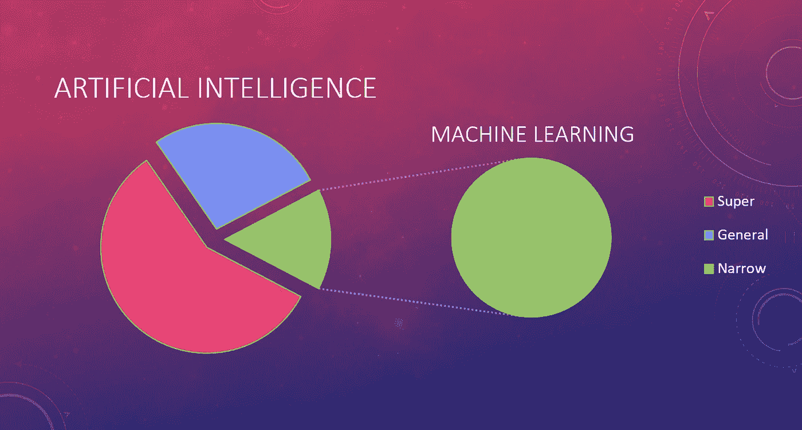
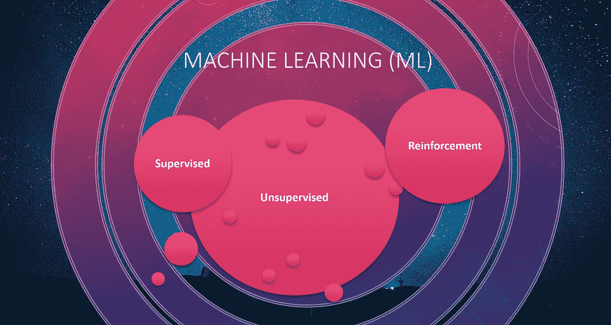

# ML 与 AI 的关系

> 原文：<https://towardsdatascience.com/how-ml-relates-to-ai-95a4f2e2c9cf?source=collection_archive---------25----------------------->

迈克尔·泽兹奇在 [Unsplash](https://unsplash.com?utm_source=medium&utm_medium=referral) 上的照片

## 机器学习(ML)如何融入人工智能(AI)的奇妙世界？

## 人工智能

让我们从陈述 AI *到底是什么*的简单定义开始:

> *表现* **的计算机智能地** *和* **自主地** *，与计算机做它们被告知的事情*

几十年来，软件工程师一直在构建*专家系统*:严格约束的、基于规则的软件解决方案，能够很好地完成单一任务。

这没什么不好！在许多情况下，这是正确的答案。考虑更新电视的固件。你可以通过设置菜单按需寻找它，或者让电视偶尔寻找它，但这是一个最好用传统技术解决的问题。它不需要*智力*。

现在想想开着车在大城市转悠:*那个*需要智能！在人工智能兴起之前，我们在无人驾驶汽车方面进展缓慢。

## 人工智能的类型

那么 AI 的*类型*有哪些呢？有三个。

第一种是 ***窄 AI*** :思考高度集中。苹果 iPhone 上的 Siri 对与电话相关的任务很有帮助，但你可以试着问它“为什么我的伴侣今天对我很生气？”。不会有太大帮助。

垃圾邮件与垃圾邮件过滤器:你上一次设置垃圾邮件规则是什么时候？你没有，AI 本质上已经解决了那个问题。

脸书的人脸识别——非常专注，非常准确——但如果你试图用它来驾驶无人机，底层的 ML 实现将毫无用处。

这就是 ***狭义*** 的意义所在:在有限的环境中提供极具性能的人工智能解决方案。

下一个类型是 ***一般 AI***——想想那种可以媲美人类能力的智能。现在还不存在。

人类适应眼前挑战的能力强调了我们智力的敏捷性和灵活性。如果你和我需要学开叉车，我们可以。如果我们需要掌握驾驶无人驾驶飞机，我们可以。这种可以针对各种各样任务的广义智能在 AI 中还没有实现。

最后一类 AI 是 ***超级 AI***——现在我们说的是那种我们只能推测的智能，既然超过了我们自己。

一般的人工智能必须首先在这种类型之前实现——对这可能需要什么的猜测导致了许多激动人心的科幻书籍和电影。

底线:我们没有**或**想法。我们不会*创造*它——一般的人工智能计算机会。

## 机器学习适合在哪里？

*作者图片*

因此，如果我们有 3 种类型的人工智能，机器学习在哪里？

机器学习是一种类型的 ***狭义的*******AI***:它是*专门打造的*，专注于相对小范围的任务。*

*记住: ***狭义*******AI***是目前仅存的*类型的 AI，我们沉浸其中的所有技术奇迹都是机器学习带给我们的。***

## ***为什么是机器学习？***

> ******因为它解决了传统方法无法解决的问题******

***正如我们已经讨论过的，传统的软件技术已经无法破解某些难题。这些往往是机器学习大放异彩的领域。***

***ML 不是所有问题的解决方案——但它经常是以前的技术失败或不足的解决方案。***

***记住这句格言:“对拿着锤子的人来说，每个问题看起来都像钉子”。不要选择 ML——在很多领域，传统技术是正确的答案——并且将继续是正确的答案。***

## ***什么是机器学习？***

> ******大数据+算法=模型******

***通过筛选堆积如山的数据进行学习并让*更智能*完成任务的功能是机器学习**模型**。这个*训练过的*模型然后可以被部署，并在它暴露给*新的*数据时发挥作用。***

**传统软件不是这样的——它不会随着暴露给更多数据而进化——它只是盲目地遵循设计时的规则。**

**例如，在机器学习中，你可以*向*神经网络(这是一种*类型的*算法)提供大量的狗和猫的图像，然后获取该模型并将其部署到**云**(如微软 Azure、谷歌云平台 GCP 或亚马逊网络服务 AWS)——然后向该模型呈现一张*新的*图片，并询问它是否*看到了*一只狗或猫。使用以前的技术，这种功能本质上是*无法解决的*。**

## **机器学习擅长什么？**

***替换需要大量微调或涉及一长串规则的现有系统***

**如果你有一个现有的软件系统，它需要不断的调整或者涉及到一系列的规则——你可能会有一个好的候选人。当维护系统的持续成本很高时，这可能是 ML 可能更适合的良好指示。**

***复杂的问题(想语音识别、缺陷识别等。)传统解决方案已经失败***

**有许多传统技术无法解决的现实世界问题*。机器学习填补了这些*缺口*，为我们正在经历的惊人进步提供了动力。***

**动态、波动的环境需要不断适应新数据**

*根据定义，处于高度变化状态的问题(想想不断发布的需要分类的新图片)通常最适合 ML 解决方案。*

**从大量数据中洞察复杂关系**

*当数据很小时，数据模式很明显(想象一个有 100 行的电子表格)。随着数据量的增长(想象一下有一百万行的电子表格)，很快就不可能发现模式或趋势。ML 技术在这个领域表现出色。*

## *ML 的三个主要分支*

**

**作者图片**

*回到我们关于狗和猫图像的例子——这将是一个属于 ***监督*** 学习的 ML 模型:算法是用数据*训练的*，数据被给出正确的*答案*(因此得名*监督*)。*

****无监督*** 学习涉及算法筛选没有答案的数据。网飞使用的*推荐系统*是这种 ML 实现的一个很好的例子——算法正在查看观众的流媒体习惯，并识别相似性，通过这些相似性他们可以做出未来的推荐。因此，他们将用户聚集在一起，并根据历史流媒体习惯提出明智的建议。*

****强化*** 学习在游戏界众所周知:一个在*环境中运行的软件*代理**进行*观察*，采取*动作*，并接收*反馈*(可能是正面的或负面的)。目标是随着时间的推移，通过反复试验学会*最大化*正向*反馈*。现实世界中的应用比比皆是:游戏(当然)、机器人、智能家居设备(比如 Nest 恒温器)和自动股票交易——这只是其中的几个例子。*

## *结论*

*到目前为止，您应该对以下主题的电梯演讲感到满意了:*

*   ***什么是 ML？***
*   *你为什么要在乎？*
*   ***它和人工智能有什么关系？***