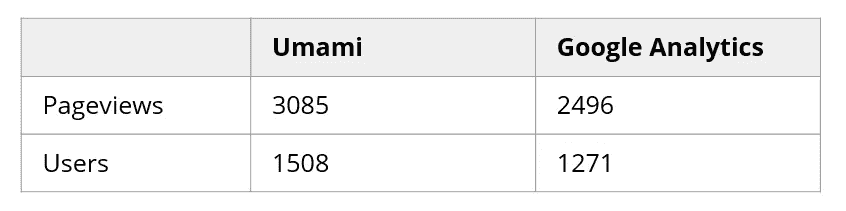
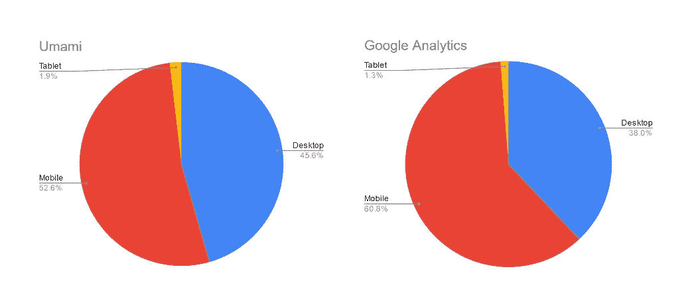
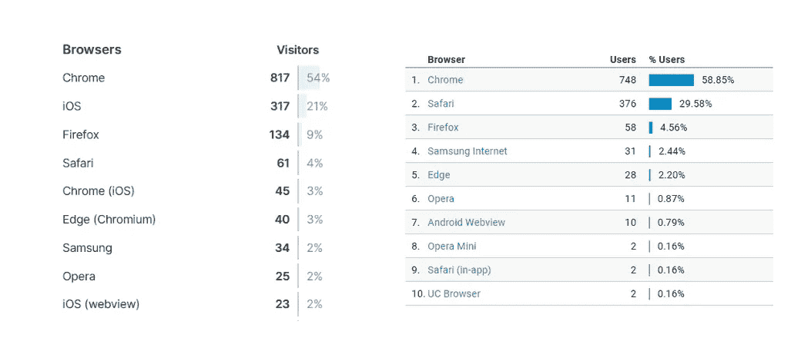
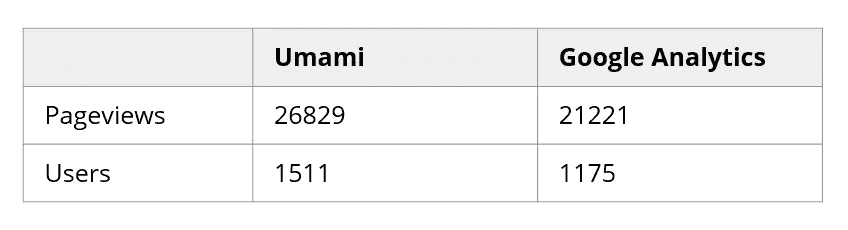
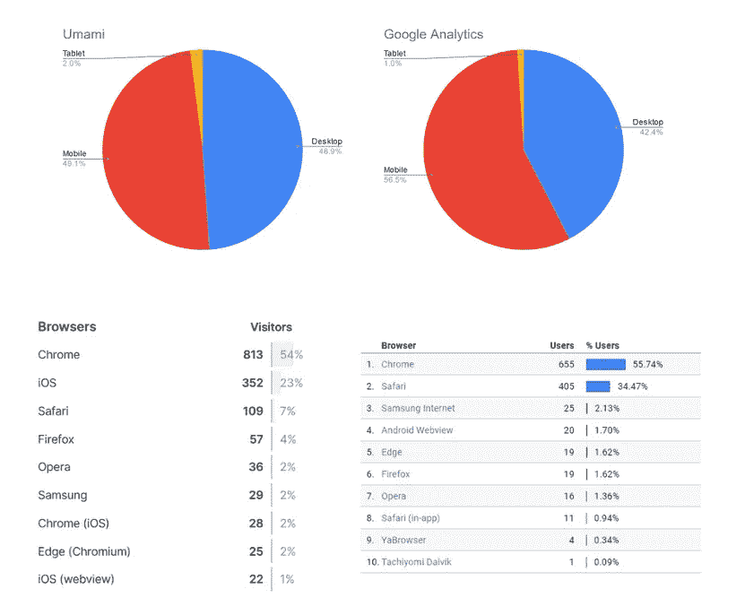

# 您的 Google Analytics 仪表盘中丢失了多少数据？

> 原文：<https://towardsdatascience.com/how-much-data-is-missing-from-your-google-analytics-dashboard-20506b26e6d?source=collection_archive---------30----------------------->

## 利用自托管分析平台发现缺失数据。

米利安·耶西耶在 [Unsplash](https://unsplash.com?utm_source=medium&utm_medium=referral) 上拍摄的照片

随着许多网站采用更智能的广告方法，广告拦截器变得越来越突出。2020 年 Q2 的一项研究表明[各年龄段超过 40%的互联网用户使用某种形式的广告拦截器。](https://www.statista.com/statistics/352030/adblockign-usage-usa-age/)

广告拦截器不仅可以拦截广告，还可以通过拦截脸书和谷歌分析等跟踪标签来保护用户的隐私。uBlock Origin 等应用程序默认情况下会启用跟踪保护，而 AdBlock Plus 等其他应用程序可以轻松打开该设置。这给希望分析和理解用户数据的开发人员带来了一个潜在的问题，因为他们可能没有看到全貌。

# 测量缺失数据

我目前维护着两个基于网络的应用程序，每个都有超过 5000 个月的用户，我将用它们来测试丢失的数据。在这个实验中，我用一个名为 Umami 的自托管分析解决方案建立了一个并发分析服务。这是一个私有的、开源的 Google Analytics 的替代品，你可以在这里了解更多。由于鲜味是自托管的，广告拦截器不会阻止收集分析。这将为我们提供数据的完整视图。我用一些最流行的广告拦截软件测试了这一点，并确认它们都没有阻止鲜味记录数据。

在 Vercel 和 Digital Ocean 上设置了我的鲜味实例并离开网站一个月后，我比较了这两个服务报告的数据。

# 比较结果

在查看报告的数字之前，了解这两个网站的流量背景会有所帮助，因为广告拦截软件的受欢迎程度因人群而异。

## 网站#1

要分析的第一个网站是一个基于 web 的 Reddit 客户端，它使用了媒体接口。根据谷歌分析，该网站大约 95%的流量来自有机搜索。这可能是因为用户想要浏览 Reddit，但更喜欢不同的界面。

图片作者。第一个网站 Reddium 的每周页面浏览量和用户数据

从页面浏览量、用户和跳出率来看，我们发现这两种服务之间存在差异。Umami 的每周用户数增加了 19%，每周页面浏览量增加了 23%。这是一个明显的差异，不能仅仅归因于不同的方法，导致开发人员对他们看到的分析体验到不同的流量负载。

为了证实这种差异，我们可以尝试比较两种服务的人口统计数据。由于桌面广告拦截器的流行和 Firefox 上增强的跟踪保护，我们可以预期在 Google Analytics 上看到更少的桌面和 Firefox 用户。

图片作者。第一网站的用户设备数据

从设备数据来看，很明显，桌面用户是我们的谷歌分析数据中缺失的用户。数字也显示了这一趋势，移动用户的数量在这两种服务中保持不变，而桌面用户的数量则高出 40%。

图片作者。第一个网站的 Umami(左)和 Google Analytics(右)用户浏览器数据

在浏览器数据中，我们可以看到，在谷歌分析和 Umami 之间，Firefox 用户几乎增加了两倍，而其他浏览器略有增加。这证实了这两种服务之间的数量差异可能归因于广告拦截器。

## 网站#2

第二个网站是一个与你的 Spotify 账户相关的[音乐测验。根据 Google Analytics，流量获取在直接、推荐、有机搜索和社交之间平分秋色，每个来源各占 20-25%](https://whisperify.net)

图片作者。第一个网站:Whisperify 的每周页面浏览量和用户数据

用户和页面浏览量数据显示了与第一网站相同的趋势，Umami 记录的页面浏览量和用户数多了约 30%。页面浏览量的差异遵循类似的模式，我们可以看到设备和浏览器数据进一步证实了这一点。

图片作者。Umami(左)和 Google Analytics(右)的用户设备和浏览器数据

# 观察

我们的比较表明，谷歌分析丢失了 15%到 25%的有价值的用户数据。随着越来越多的人熟悉跟踪保护，这一比例在未来可能会增加，但在收集用户数据时，这是一个需要记住的好数字。

当然，这只是一小部分有特定目标受众的网站。这两个网站都与社交应用相关，如 Reddit，其目标人群可能会使用广告拦截器，因此针对普通公众的网站的缺失数据可能比我们观察到的要少。

针对不同平台的网站也会影响谷歌分析中丢失的数据量。如果你的目标人群是移动用户，那么与针对使用 Firefox 的桌面用户的网站相比，你可能只丢失了少量的数据。

# 摘要

在这篇文章中，我们:

1.  找到了谷歌分析的自主替代方案
2.  比较两个网站的两个分析服务之间的分析数据
3.  已确定的用户群更有可能从 Google Analytics 中消失(桌面和 Firefox 用户)
4.  查看了观察中的潜在偏差，以及谷歌分析可能拥有更完整数据的情况

结果提供了相当多的信息。在大多数情况下，谷歌分析应该能够报告大约 80%用户的趋势。但是，在某些情况下，可能会收集更多或更少的数据。随着广告拦截器越来越受欢迎，像 Umami 这样的自托管替代产品可能是一条出路，因为它可以收集所有可用的数据，并让您更好地控制自己的数据。

# 资源

*   [谷歌分析](https://support.google.com/analytics/answer/1008015)
*   [鲜味](https://umami.is/)