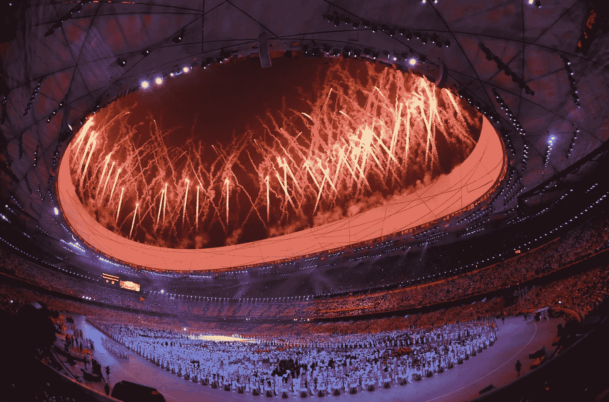
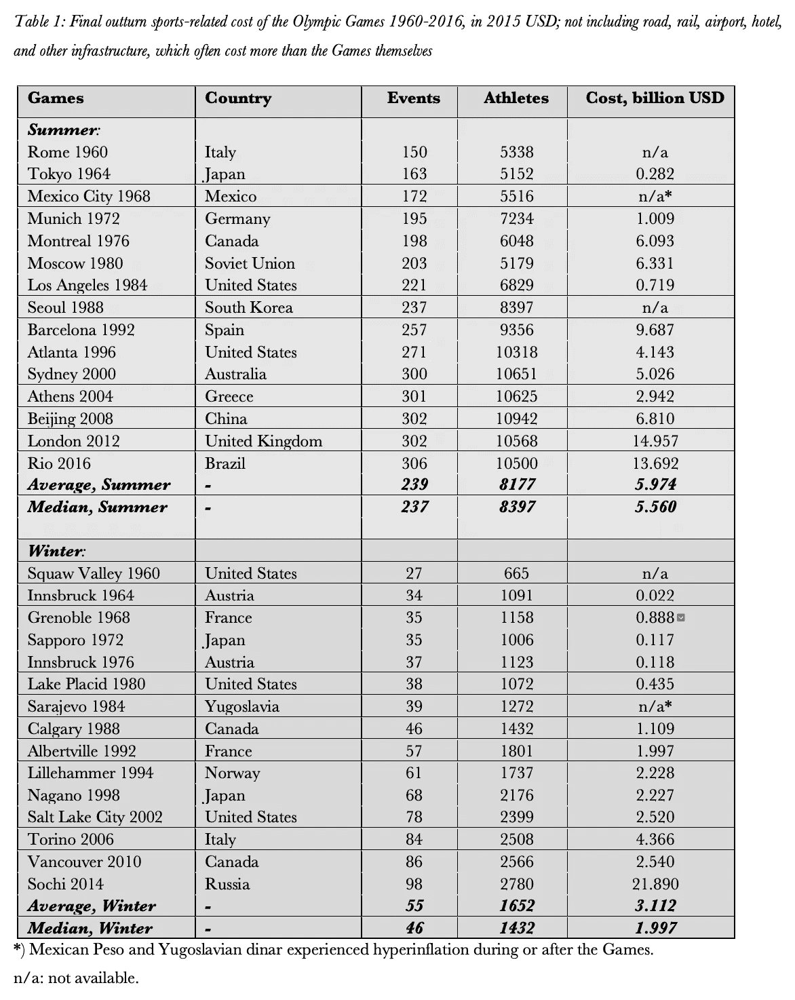
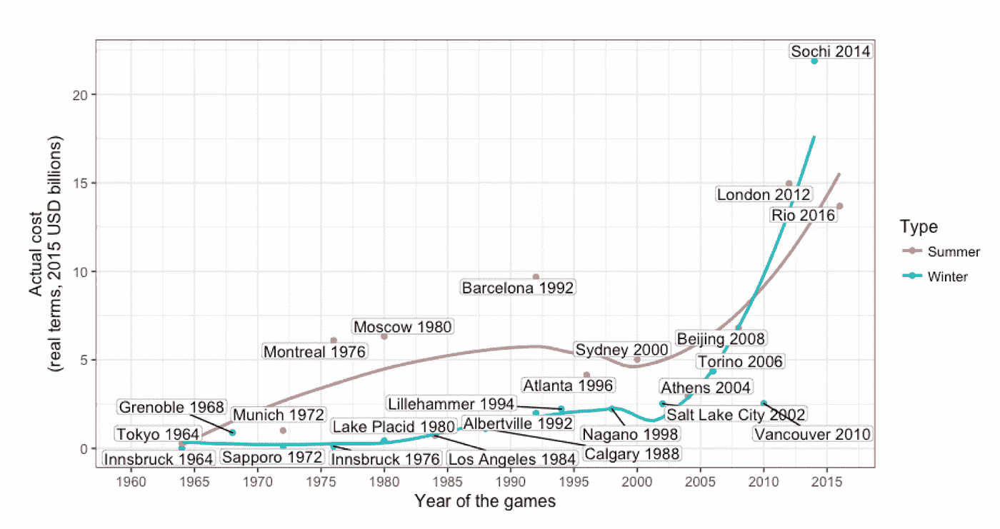
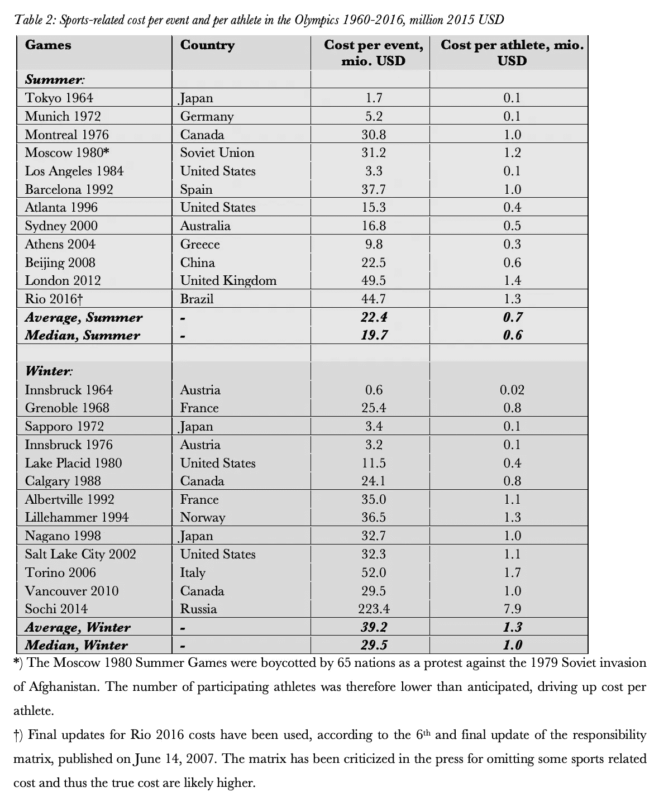
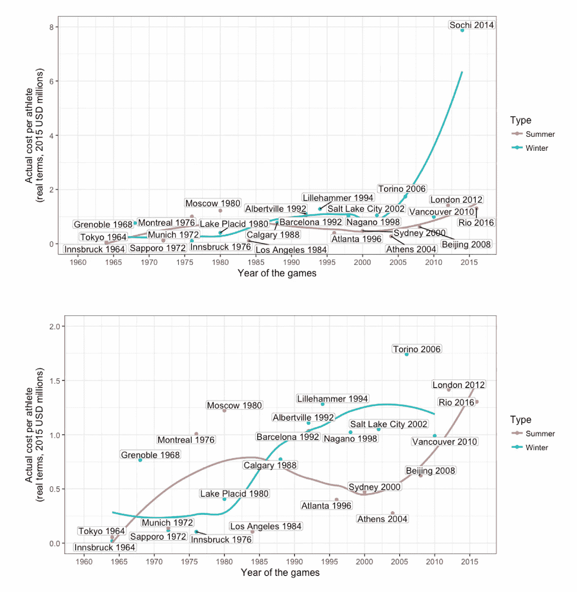

# 奥运会要花多少钱？

> 原文：<https://towardsdatascience.com/how-much-do-the-olympics-cost-ef0170bc71f7?source=collection_archive---------16----------------------->

## 迄今为止最昂贵的奥运会是 2014 年索契奥运会。东京 2020 将改变这一点

*亚历山大·布齐尔和丹尼尔·伦恩*

来自 [Pixabay](https://pixabay.com/?utm_source=link-attribution&utm_medium=referral&utm_campaign=image&utm_content=79575) 的[大卫·马克](https://pixabay.com/users/12019-12019/?utm_source=link-attribution&utm_medium=referral&utm_campaign=image&utm_content=79575)的图片

下表 1 显示了 1960-2016 年奥运会的实际体育相关费用，以及每届奥运会的赛事数量和运动员人数。在 1960 年至 2016 年的 30 届奥运会中，有 25 届获得了产出成本数据。应当提及的是，在编制表格时，2016 年里约夏季奥运会尚未举行。因此，这些比赛使用了初步数据。*

来源:作者，[https://bit.ly/2ZBaQSI](https://bit.ly/2ZBaQSI)

> 迄今为止最昂贵的夏季奥运会是 2012 年伦敦奥运会，耗资 150 亿美元。最昂贵的冬季奥运会，2014 年索契冬奥会耗资 219 亿美元

迄今为止最昂贵的夏季奥运会是 2012 年伦敦奥运会，耗资 150 亿美元，1992 年巴塞罗那奥运会耗资 97 亿美元。对于冬奥会来说，索契 2014 年冬奥会耗资最大，为 219 亿美元；2006 年都灵冬奥会耗资 44 亿美元，位居第二。成本最低的夏季奥运会是 1964 年东京奥运会，耗资 2.82 亿美元；最便宜的冬季奥运会，1964 年因斯布鲁克冬奥会，2200 万美元。必须提及的是，这些数字中不包括城市和交通基础设施的更广泛的资本成本，而这些成本通常是巨大的。

1960 年至 2016 年夏季奥运会的平均成本为 60 亿美元。同期冬奥会的平均成本为 31 亿美元。冬奥会平均成本和中值成本之间的巨大差异主要是由索契 2014 年冬奥会 219 亿美元的异常值造成的。事实上，即使与夏季奥运会相比，2014 年索契冬季奥运会也是有史以来最昂贵的奥运会。这是非同寻常的，因为冬季奥运会的成本通常比夏季奥运会低得多，冬季奥运会的平均成本不到夏季奥运会平均成本的一半。

> 冬季奥运会的成本通常比夏季奥运会低得多，冬季奥运会的平均成本不到夏季奥运会平均成本的一半

图 1 显示了 1960 年至 2016 年成本的发展情况。趋势线表明，游戏的成本随着时间的推移而增加。然而，这种明显的增加在统计上并不显著。因此，从统计角度来看，我们可以说成本不会随着时间的推移而增加或减少，这可能会随着东京 2020 年奥运会成为有史以来最昂贵的奥运会而改变..

*图 1:1960 年至 2016 年的奥运成本时间序列*

来源:作者，【https://bit.ly/2ZBaQSI 

表 2 显示了 1960 年至 2016 年的每项赛事成本和每位运动员的成本(以 2015 年美元计)。这些数据适用于 1960 年至 2016 年的 30 场比赛中的 25 场。夏季奥运会每项赛事的平均成本为 2240 万美元(中位数为 1970 万美元)。冬季奥运会为 3920 万美元(中位数为 2950 万美元)。—2012 年伦敦奥运会的每项赛事费用最高，为 4950 万美元，其次是巴塞罗那，为 3770 万美元。对于冬季奥运会，索契的每项费用最高，为 2.234 亿美元，其次是 2006 年都灵冬奥会，为 5200 万美元。我们再次看到 2014 年索契冬奥会是一个异数。最低的单项成本是 1964 年东京夏季奥运会的 170 万美元和 1964 年因斯布鲁克冬季奥运会的 60 万美元。

来源:作者，【https://bit.ly/2ZBaQSI】T4

就每位运动员的成本而言，我们发现冬季奥运会的成本大约是夏季奥运会的两倍。夏季奥运会每位运动员的平均费用为 70 万美元(中位数为 60 万美元)，冬季奥运会为 130 万美元(中位数为 100 万美元)。然而，这种差异在统计学上并不显著。夏季奥运会每位运动员的最高花费是 2012 年伦敦奥运会的 140 万美元，其次是 1980 年莫斯科奥运会的 120 万美元。**冬奥会每位运动员的最高费用是索契 2014 年冬奥会的 790 万美元**和都灵 2006 年冬奥会的 170 万美元。1964 年东京夏季奥运会的运动员人均费用最低，为 55，000 美元，1964 年因斯布鲁克冬季奥运会为 20，000 美元。

> **夏季奥运会运动员人均花费最高的是 2012 年伦敦奥运会，为 140 万美元**。**冬奥会是 2014 年索契冬奥会，每位运动员 790 万美元**

图 2 显示了每个运动员的花费与时间的关系。我们看到了一个趋势的转变，从夏季运动员的人均成本通常高于冬季奥运会，直到 20 世纪 80 年代中期，冬季奥运会在人均成本方面变得比夏季奥运会更昂贵。我们还看到，从 20 世纪 80 年代中期到 21 世纪初，夏季奥运会每位运动员的成本普遍下降，此后，夏季和冬季奥运会每位运动员的成本一直在上升，主要受 2012 年伦敦奥运会和 2014 年索契奥运会的推动。然而，总的来说，无论是夏季奥运会、冬季奥运会还是所有的奥运会，随着时间的变化在统计上都是不显著的。

*图 2:1960 年至 2016 年奥运会运动员人均体育相关成本的时间序列，包括和不包括索契 2014 年奥运会*

来源:作者，[https://bit.ly/2ZBaQSI](https://bit.ly/2ZBaQSI)

— — — —

*)有关完整的故事，包括参考资料和注释，请参见 Flyvbjerg、Bent、Alexander Budzier 和 Daniel Lunn，2021 年，“回归尾部:为什么奥运会吹了”，*环境与规划 A:经济与空间*，第 53 卷，第 2 期，第 233-260 页。免费 pdf 在这里:【https://bit.ly/2ZBaQSI 