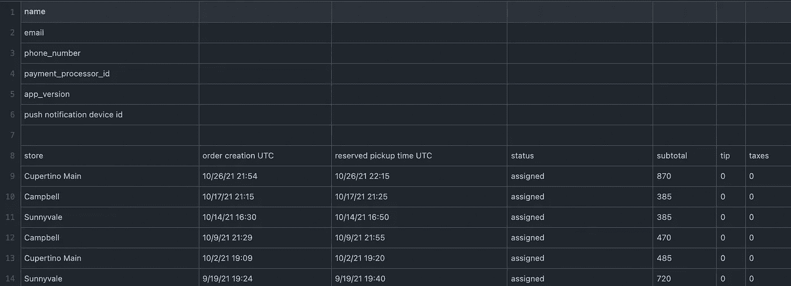

# 你在咖啡上真正花了多少钱？

> 原文：<https://towardsdatascience.com/how-much-do-you-really-spend-on-coffee-9f1edebc8ef8?source=collection_archive---------27----------------------->

## 这是我的故事，关于使用数据分析和可视化来证明我丈夫是错的

自从我们结婚以来，我丈夫和我就一直在为他在菲尔茨咖啡的开销争论不休。不要误解我，[菲尔茨咖啡](https://medium.com/u/1ac5a4cdd91d?source=post_page-----9f1edebc8ef8--------------------------------)非常棒，但我们正在进行的辩论需要解决。为了解决这场争论，我求助于数据。


作者图片

首先，我必须通过[菲尔兹咖啡应用](https://www.philzcoffee.com/app)获取我丈夫的菲尔兹咖啡应用使用数据(当然要经过他的允许！).根据《加州消费者隐私法》,加州人可以在使用移动应用程序时要求收集数据。请求数据后，大约需要 30 天才能返回带有数据集的请求。返回的数据集包含 2018 年 5 月至 2021 年 10 月的用户数据。

然后，我将数据集加载到 [R-studio](https://www.rstudio.com/) 中，看看当用户通过应用程序点咖啡时，应用程序会收集什么样的信息。通过应用程序收集的信息类型包括商店位置、订单时间/日期、提货时间/日期和总交易金额。数据集还包括两个单独的税和小费列，但这些列返回 0，并且税和小费值已经包含在总交易金额中。



原始数据集格式和列标题

我还想使用订单时间/日期和提货时间/日期列，按商店位置分析我丈夫等待咖啡的平均时间。然而，这被证明是困难的，因为该应用程序允许将提货时间设置为未来更晚的时间。例如，可以在上午 8:00 下订单，在上午 10:00 提货。这将显示为订单时间和提货时间之间的两小时“等待时间”，并不一定反映订单的准确“等待时间”。因此，我决定从这个分析中排除这些列。

我首先通过安装几个包来执行数据清理，包括' tidyr '，' dyplr '和' tidyverse '。

```
### INSTALL PACKAGES AND LOAD LIBRARIES
install.packages("readr")
library(readr)
install.packages("tidyverse")
library(tidyverse)
install.packages("dplyr")
library(dplyr)
install.packages("tidyr")
library(tidyr)
```

我删除了与分析计划无关或为空的行，重命名了列标题以更好地描述列中的内容，并删除了任何包含缺失值的行。我还将包含数值的字符列重新格式化为数字列。

```
# Drop row 1 through 6 and 116
df <- (df %>% slice(-c(0:6,121)))# Rename column headers
colnames(df) <- (c("Store", "OrderCreationDate", "ReservedPickUpTime","Status","Subtotal", "Tip", "Taxes"))# Drop first row with column names and relabel column headers with column names
df <- (df %>% slice(-c(1))) # Remove rows with missing values 
df <- na.omit(df) # Change variable from character to numeric
df$Subtotal <- as.numeric(df$Subtotal)
```

出于这个项目的目的，我非常依赖于商店位置列、总支出列和订单日期列。在原始数据集中，日期和时间信息存储在一个单元格中。我将这些数据分成两个单独的列，一列是日期，另一列是时间戳。我这样做是因为出于前面提到的原因，我不会依赖时间信息来进行分析。

```
# Split date and time into two columns
df$OrderCreationDate <- data.frame(do.call("rbind", strsplit(as.character(df$OrderCreationDate),' ', 2)))
```

我还创建了一个新列，将每个商店位置与其各自的邮政编码关联起来。这个额外的列将有助于在地理上映射商店位置，以便在地图上可视化数据。

最后，我将清理后的数据集放入 Google Data Studio，创建一个仪表板来可视化数据。该控制面板具有向下钻取功能，允许用户按位置或日期对数据进行切片和切块。完整的交互式仪表盘可在[这里](https://datastudio.google.com/u/0/reporting/b2b8bf63-c7ab-4327-963f-c09715bc1a11/page/p_ozvdr92fpc)找到。

[点击此处](https://datastudio.google.com/reporting/b2b8bf63-c7ab-4327-963f-c09715bc1a11)通过 Google Data Studio 访问完整的交互式仪表盘。Dashboard 是实时的，可能不会反映这篇静态博客文章中的内容。

这个项目的一个关键发现是，从 2021 年 1 月 1 日到 2021 年 10 月 26 日，我丈夫在菲尔茨咖啡消费了 523.95 美元。数据证实，菲尔茨库比蒂诺大街是和菲尔茨一起放松的首选地点。

这开始于一场关于我丈夫的 Philz 支出和我证明他是错的动机的辩论。而是变成了一个有趣的数据分析和可视化项目。由于他将继续成为菲尔茨的常客，我希望收集足够的数据点来建立对他未来行为的预测模型。那段未完待续…

要查看我的原始数据集、Rstudio 代码和清理后的数据集，请查看我在 GitHub 上的 [Philz Coffee 数据报告](https://github.com/isRadata/PhilzCoffeeData)。