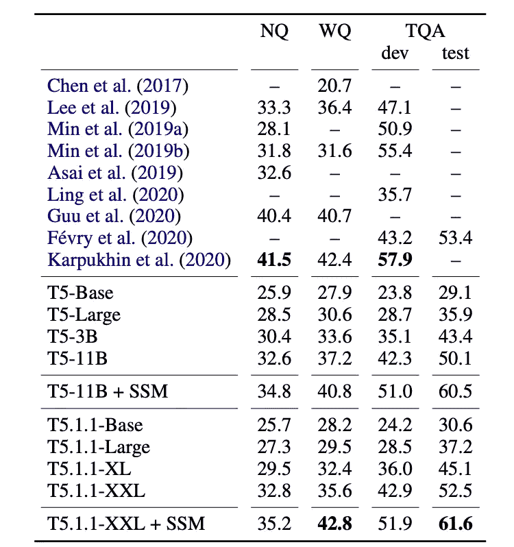

# 语言模型的参数中可以包含多少知识？—摘要

> 原文：<https://towardsdatascience.com/how-much-knowledge-can-you-pack-into-the-parameters-of-a-language-model-a-summary-fed633a092b6?source=collection_archive---------22----------------------->

## 理解“存储”在语言模型中的隐性知识

> TL；博士；医生
> 
> 语言模型已经显示出从用于预训练的数据中隐含地记住信息的能力。Roberts 等人(2020)的这篇论文试图对其进行量化，并展示了隐性知识的规模如何随模型大小和训练时间而变化。

非常感谢 [Sundeep Teki](https://www.sundeepteki.org/) 的反馈，以及帮助我写这篇博客！

# 介绍

Patroni 等人(2019)最近的工作显示了语言模型如何从用于预训练的数据中构建*内部知识库*。在 Roberts 等人(2020)的论文中，作者试图通过“*闭卷问答”来理解这一现象。*与最近在问答(QA)领域的工作不同，作者没有向模型共享任何上下文或外部知识源来回答问题(因此得名——闭卷问答)。在本文中，作者着重于使模型查找它们的参数，以获得预训练时存储的信息。此外，作者还探索了这种行为在缩放模型大小(参数数量)或训练数据(这两者都已被证明可以提高下游任务的性能)时如何变化。

T5 模型和预训练/微调阶段。在这里，本文作者让 T5 从其知识中回答问题*！(* [*来源*](https://arxiv.org/pdf/2002.08910.pdf) *)*

# 背景

**问题回答:**通常为模型提供外部信息源，以查找与问题相关的细节。这些问题可以是历史事实、可以从外部来源解释的信息等。这种问答被称为“开卷问答”。在这个过程中，期望模型输出文本的跨度(范围/坐标)或文本本身。

这个任务的一个更简单的版本是，代替一个完整的“外部知识源”，模型也提供有一个特定的*上下文*输入。这里，模型可以学习从输入的*上下文*中“查找”答案，而不是在庞大的外部语料库中搜索。这个版本的问答被称为阅读理解。

在这篇论文中，作者针对一组他们称为*闭卷问答的更具挑战性的问题。*在这里，模型应该学会在自身内部寻找答案的记忆内容，而不是作为上下文或大型外部语料库的甲骨文文本。

**迁移学习:**大规模语言模型在大型无标签数据语料库的预训练帮助下，表现有所提高。这种预训练步骤被认为是以无人监管的方式为模型提供语言信息或某些“世界知识”。最近流行的迁移学习模型是从 Transformers (Vaswani 等人，2017 年)衍生而来的，一种特殊的仅编码器的 Transformers(类似于 BERT (Devlin 等人，2018 年))在问答系统中很受欢迎。这是由于这样一个事实，即通常使用上下文输入或外部知识库来尝试问题回答，其中编码器模型被期望预测将具有答案的单个标记。

虽然，这对于闭卷问答来说是不可能的，因此作者使用了一个称为 T5(文本到文本转换转换器)的框架，该框架将每个问题建模为文本到文本的问题(Raffel 等人，2019)。也就是说，模型不是提取信息，而是生成信息。

# 实验

**数据集:**该研究着眼于 3 个数据集，即——自然问题(科维亚特科夫斯基等，2019)；网络提问(Berant 等人，2013 年)；TriviaQA (Joshi 等人，2017 年)。论文只利用了数据集中的问题，而*忽略了附带的匹配文档。*此外，TriviaQA(拥有私有测试集)的所有结果都是通过提交给排行榜获得的。

**训练:**作者利用 T5 模型(Raffel et al .，2019)；T5 没有在问答数据集上进行预训练。此外，性能是作为模型大小的一个因素来衡量的——基础模型、大型模型、3B 模型和 11B 模型。此外，还基于 T5.1.1 检查点报告了结果，这些检查点仅根据未标记的数据进行了预训练。验证是在数据集的预留 10%上完成的，其中使用了从 90%的训练中获得的最佳性能检查点。通过在每个时间步选择最可能的标记来选择模型的预测。

**显著跨度掩蔽(SSM):**Guu 等人(2020)提出的掩蔽较长短语(包括命名实体、日期等)的方法已证明可在基于 BERT 的模型中实现更好的性能。在本文中，作者以类似的方式用 100k 个额外步骤微调 T5 模型。

**结果:**这项研究的主要收获是

1.  随着**型号尺寸**从基本型号增加到 11B 型号，性能也随之提高。
2.  SSM 战略大大提升了业绩。
3.  内存和计算成本**显著降低，因为与查找大型知识语料库的典型开放领域问答模型不同，本文描述的模型只查看自身“内部”。**
4.  该模型也击败了多答案任务中的最佳基线，尽管与 SOTA 模型相比，在召回率上落后。

**人工评估:**由于模型使用自由形式的答案生成，评估中有多个假阴性。这是因为，如果在基本事实和输出之间没有精确的匹配，尽管它们在语义上是相同的，这将被认为是错误的输出预测。作者查看了 150 个随机抽样的例子进行评估，他们可以注意到 20 个被错误分类为错误，20 个被标注为错误，17 个无法回答。忽略评估中无法回答的问题，该模型给出了 57.8 分。

通过微调 T5 在开放领域自然问题(NQ)、网络问题(WQ)和 TriviaQA (TQA)任务上获得分数。除了 Ling 等人(2020 年)和 Févry 等人(2020 年)之外，所有模型都使用昂贵的数据查找。此外，我们可以看到 T5 型号的性能随着规模的扩大而提高。([来源](https://arxiv.org/pdf/2002.08910.pdf))

# 结论

在本文中，作者展示了在非结构化数据上预先训练的大型语言模型在“封闭领域”问答中可以获得显著的结果。这需要许多有趣的工作，以及制定资源约束(较小的模型)以模拟较大模型的性能，查看模型可解释性的“知识”，更重要的是，了解模型是否“学习”事实作为基于最大似然损失的预训练的结果。