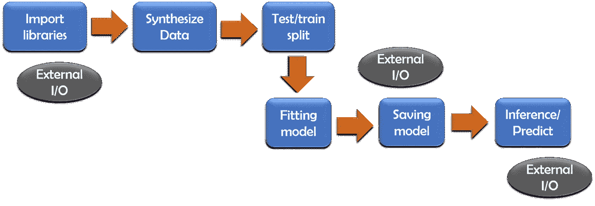
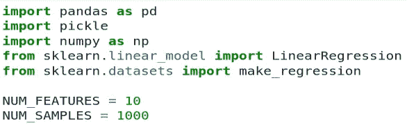
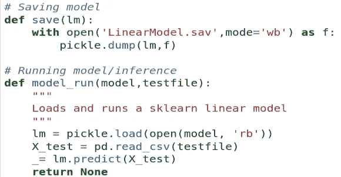
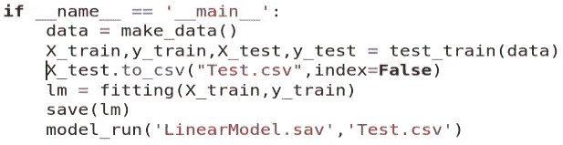
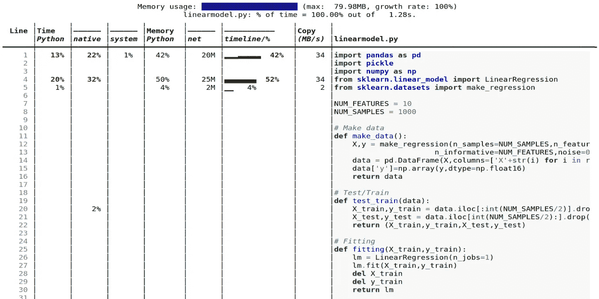
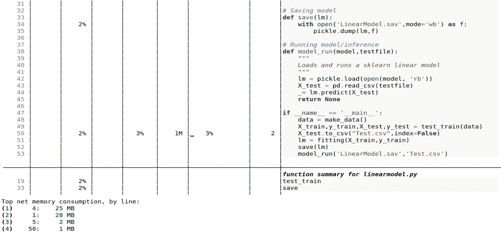
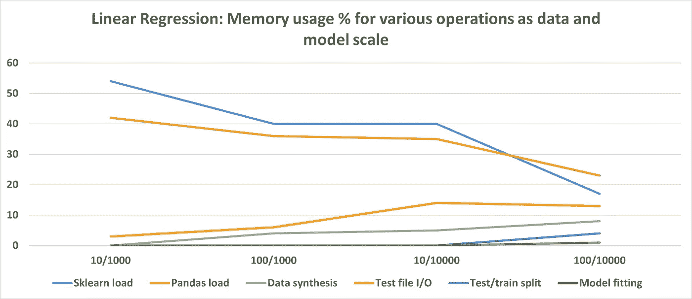
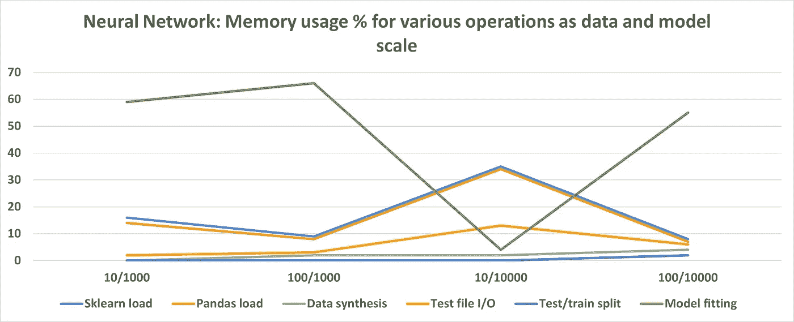

# 你的 ML 代码消耗了多少内存？

> 原文：<https://towardsdatascience.com/how-much-memory-is-your-ml-code-consuming-98df64074c8f?source=collection_archive---------7----------------------->

## 了解如何通过一行命令快速检查机器学习功能/模块的内存占用。生成一个好的报告。


图片来源: [Pixabay](https://pixabay.com/photos/hourglass-clock-time-period-hours-2910951/)

# 为什么要分析内存使用情况？

假设你已经编写了一个很酷的机器学习(ML)应用程序，或者创建了一个闪亮的神经网络模型。现在，您希望在某个 web 服务或 REST API 上部署这个模型。

或者，您可能已经基于来自制造工厂的工业传感器的数据流开发了该模型，现在您必须将该模型部署在一台工业控制电脑上，以便根据持续输入的数据做出决策。


“很高兴开发出闪亮的 ML 模型”。图片来源: [Pixabay](https://pixabay.com/photos/children-win-success-video-game-593313/)

作为一名数据科学家，你可能期望工程/平台团队提出的一个极其常见的问题是“ ***”你的模型/代码有多少内存占用？*** 或 ***在给定的数据负载下运行时，您的代码的内存使用峰值是多少？***

这是很自然的，因为**硬件资源可能是有限的**并且一个单独的 ML 模块不应该占用系统的所有内存。对于边缘计算场景来说，这一点**尤其正确，即 ML 应用可能在边缘上运行，例如在工业 PC 上的虚拟化容器内。**

此外，您的型号可能是运行在该硬件上的数百种型号中的一种，您必须**对内存使用峰值有所了解**，因为如果大量型号同时出现内存使用峰值，可能会导致系统崩溃。

这让你很好奇，不是吗？


图片来源: [Pixabay](https://pixabay.com/photos/child-surprise-think-interactivity-2800835/)

> **…硬件资源可能是有限的**，单个 ML 模块不应该占用系统的所有内存。对于边缘计算场景来说，**尤其如此……**

## 不要犯这个根本性的错误

注意，我们讨论的是整个代码的运行时内存配置文件(一个动态量)。这与您的 ML 模型的大小或压缩无关(您可能已经将它作为特殊对象保存在磁盘上，例如 [Scikit-learn Joblib dump](https://scikit-learn.org/stable/modules/model_persistence.html) ，一个简单的 Python Pickle dump，一个 [TensorFlow HFD5](https://www.tensorflow.org/tutorials/keras/save_and_load) ，等等)。

# Scalene:一个小巧的内存/CPU/GPU 分析器

这里有一篇文章介绍了一些与 Python 一起使用的旧内存分析器。

 [## 如何在 Python | Pluralsight | Pluralsight 中管理内存

### Luke Lee Python 使开发比 C 和 C++之类的语言更快更容易的方法之一是内存管理…

www.pluralsight.com](https://www.pluralsight.com/guides/profiling-memory-usage-in-python) 

在本文中，我们将讨论**Scalene**——您可以一站式回答工程团队提出的这些问题。

根据其 [GitHub 页面](https://github.com/plasma-umass/scalene) , " *Scalene 是一个用于 Python 的高性能 CPU、GPU 和内存分析器，它可以做许多其他 Python 分析器不能做的事情。它的运行速度比其他分析器快几个数量级，同时提供更详细的信息。*”

它是由马萨诸塞大学开发的。查看此视频，了解全面的介绍。

## 安装

毕竟是 Python 包。所以，通常安装，

```
**pip install scalene**
```

目前，仅适用于 Linux 操作系统。我没有在 Windows 10 上测试它。

## 在 CLI 或 Jupyter 笔记本中使用

不等边三角形的使用非常直接，

```
**scalene <yourapp.py>**
```

或者，您可以在 Jupyter 笔记本中使用这个神奇的命令，

```
**%load_ext scalene**
```

## 示例输出

下面是一个输出示例。我们将很快对此进行更深入的研究。


## 特征

以下是 Scalene 的一些很酷的特性。大多数都是不言自明的，可以从上面的截图中判断出来，

*   **行或函数**:报告整个函数和每个独立代码行的信息
*   **线程**:支持 Python 线程。
*   **多重处理**:支持使用`multiprocessing`库
*   **Python 与 C 的时间对比** : Scalene 显示了 Python 与本机代码(如库)的时间对比
*   **系统时间**:区分系统时间(如睡眠或执行 I/O 操作)
*   **GPU** :它还可以报告花费在 NVIDIA GPU 上的时间(如果有的话)
*   **复制量**:报告每秒复制的数据量
*   **检测泄漏** : Scalene 可以自动查明可能导致内存泄漏的线路！

# 一个具体的机器学习代码示例

让我们言归正传，将 Scalene 用于内存分析标准机器学习代码。我们将研究两种不同类型的 ML 模型——原因将很快阐明。我们将对所有三个模型使用 Scikit-learn 库，并利用其合成数据生成功能来创建我们的数据集。

*   多元线性回归模型
*   具有相同数据集的深度神经网络模型

所有三个模型的建模代码都遵循完全相同的结构。下图中还显示了外部 I/O 操作，因为我们将看到，根据型号的类型，它们可能会也可能不会主导内存配置文件。



图片来源:作者出品(拥有版权)

## 线性回归模型

代码文件在我的 GitHub repo 中的[。](https://github.com/tirthajyoti/Machine-Learning-with-Python/blob/master/Memory-profiling/Scalene/linearmodel.py)

我们使用标准导入和两个变量`NUM_FEATURES`和`NUM_SMPLES`来做一些实验。



我们没有展示数据生成和模型拟合代码。它们相当标准，可以在这里看到。我们将拟合的模型保存为一个 pickled dump，并加载它和一个用于推理的测试 CSV 文件。



为了清晰起见，我们在一个`main`循环下运行所有东西，执行和报告都是不规则的(你很快就会明白)。



当我们运行该命令时，

```
$ scalene linearmodel.py --html >> linearmodel-scalene.html
```

我们得到这些结果作为输出。**注意，这里我使用了** `**--html**` **标志，并将输出传输到一个 HTML 文件中，以便于报告**。



## **那么，这个结果有什么惊人之处呢？**

内存占用几乎完全由外部 I/O(如 Pandas 和 Scikit-learn estimator 加载)控制，少量内存用于将测试数据写入磁盘上的 CSV 文件。

实际的 ML 建模、Numpy 或 Pandas 操作以及推理根本不会影响内存！

## 当模型和数据缩放时会发生什么？

我们可以调整数据集大小(行数)和模型复杂性(要素数)，并运行相同的内存分析来记录各种操作在内存消耗方面的表现。结果如下所示。

这里的 **X 轴表示一对**的特征数量/数据点数量。请注意，此图描绘的是百分比而非绝对值，以展示各种类型操作的相对重要性。



图片来源:作者出品(拥有版权)

## 所以，对于线性回归模型…

从这些实验中，我们得出结论，Scikit-learn 线性回归估计器非常有效，并且**不会为实际的模型拟合或推断**消耗太多内存。

然而，就代码而言，它确实有一个固定的内存足迹，并且在加载时会消耗那么多内存。然而，随着数据大小和模型复杂性的增加，代码占用的百分比总体上是下降的。

因此，如果您正在使用这样一个**小型线性模型，那么您可能想要关注数据文件 I/O 来优化您的代码**以获得更好的内存性能。

## 深度神经网络会发生什么？

如果我们用一个 2 隐藏层的神经网络(每个隐藏层有 50 个神经元)运行类似的实验，那么结果看起来如下。[代码文件在这里](https://github.com/tirthajyoti/Machine-Learning-with-Python/blob/master/Memory-profiling/Scalene/mlp.py)。



图片来源:作者出品(拥有版权)

显然，**神经网络模型在训练/拟合步骤消耗大量内存，不像线性回归模型**。但是，对于少量要素和大数据量，拟合占用的内存量很少。

您还可以试验各种架构和超参数，并记录内存使用情况，以获得适合您的情况的设置。

# 遵循实验方法

如果您使用相同的[代码文件](https://github.com/tirthajyoti/Machine-Learning-with-Python/tree/master/Memory-profiling/Scalene)重复实验，结果将会根据您的硬件、磁盘/ CPU/ GPU/内存类型而有很大差异。本文的目的不是关注实际值，甚至不是关注趋势。我想让你拿走为你自己的代码做内存分析实验的方法。

## 一些重要的建议

*   最好在你的代码中编写专注于一个单一任务的小函数
*   保留一些**自由变量**,比如特性的数量和数据点的数量，这样当数据/模型扩展时，您可以运行相同的代码文件进行最小的修改来检查内存配置文件
*   如果你正在比较一个 ML 算法和另一个，试着保持**结构和整个代码的流程尽可能的一致**以减少混乱。更好的是，只需更改估计器类并比较内存配置文件。
*   **根据您的建模场景，数据和模型 I/O** (导入语句，模型在磁盘上的持久性)在内存占用方面可能令人惊讶地占主导地位。做优化的时候千万不要忽略它们。
*   出于上述同样的原因，考虑比较来自多个实现/包的 **same 算法的内存配置文件(例如 Keras vs. PyTorch vs. Scikit-learn)。如果内存优化是您的主要目标，那么您可能需要寻找一种内存占用最少但能够令人满意地完成工作的实现，即使它在功能或性能方面不是绝对最好的。**
*   如果数据 I/O 成为瓶颈，探索**更快的选项或其他存储类型**，例如用拼花文件和 Apache Arrow 存储替换 Pandas CSV。查看这篇文章，

[](/how-fast-is-reading-parquet-file-with-arrow-vs-csv-with-pandas-2f8095722e94) [## 熊猫读拼花文件(带箭头)vs. CSV 多快？

### 重点研究使用 PyArrow 读取拼花文件与使用…读取相同 CSV 文件的速度比较

towardsdatascience.com](/how-fast-is-reading-parquet-file-with-arrow-vs-csv-with-pandas-2f8095722e94) 

## 使用 Scalene 可以做的其他事情

在本文中，我们刚刚讨论了最低限度的内存分析，重点是规范的 ML 建模代码。您可以利用 Scalene CLI 的其他选项，

*   仅分析 CPU 时间，不分析内存
*   仅使用非零内存占用量减少分析
*   指定 CPU 和内存分配最小阈值
*   设置 CPU 采样率
*   多线程并检查差异

## 最终验证有时是必要的

对于资源不足的情况，托管一个验证环境/服务器将是一个好主意，它将接受给定的建模代码(当开发时)并通过这样的内存分析器运行它以创建运行时统计信息。如果它通过了预先确定的内存占用标准，那么只有建模代码才会被接受用于进一步的部署。


图片来源:作者出品(拥有版权)

> 如果内存优化是您的主要目标，那么您可能需要寻找一种具有最小内存占用量但又能令人满意地完成工作的实现。

# 摘要

在本文中，我们讨论了对 ML 代码进行内存分析的重要性，以便与将代码部署到服务/机器上的平台/工程团队进行顺畅、轻松的交互。剖析内存还可以向您展示基于您正在处理的特定数据和算法优化代码的惊人方法。

我们展示了一个典型的 ML 建模代码示例，它是用一个强大而轻量级的 Python 库 Scalene 进行剖析的。我们用线性回归和神经网络模型展示了一些有代表性的结果，并提供了一些一般性的建议。

希望您在使用这些工具和技术将您的 ML 代码实现和部署到产品中时获得更多的成功。

L *喜欢这篇文章？成为* [***中等成员***](https://medium.com/@tirthajyoti/membership) *继续* ***无限制学习*** *。如果你使用下面的链接，我会收到你的一部分会员费，* ***而不需要你额外付费*** *。*

[](https://medium.com/@tirthajyoti/membership) [## 通过我的推荐链接加入媒体

### 作为一个媒体会员，你的会员费的一部分会给你阅读的作家，你可以完全接触到每一个故事…

medium.com](https://medium.com/@tirthajyoti/membership)