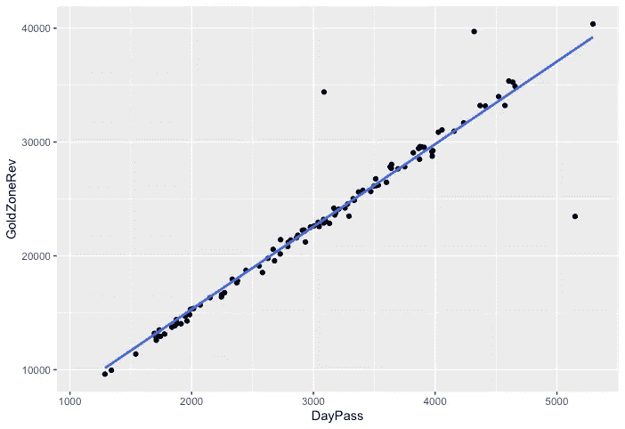

# 用 R 的简化处理缺失值

> 原文：<https://towardsdatascience.com/how-much-money-did-we-make-again-using-simputation-to-balance-the-books-f8e5c7b74f51?source=collection_archive---------20----------------------->

## *我们数据集中的漏洞可以通过在线性模型中进行智能推理来解决*

休伊·费恩·泰

和格雷格·佩奇一起

**上图:一个游乐园；** [**图片来自 Pixabay**](https://pixabay.com/photos/amusement-carousel-amusement-park-2456905/) 吉姆·威灵顿

推断是在证据和推理的基础上得出结论。

在文学中，这是通过上下文线索来完成的。像“…你有一张二月的脸，充满了霜、风暴和多云…”这样的比喻告诉我们，一个人是阴郁的，因为二月在北半球仍然是一年中寒冷的时候。

同样，在数据科学中，智能猜测可以基于我们的领域知识、线性建模或仅仅是常识来做出。

为了说明这一点，我将使用缅因州一个名为龙虾王国的虚构游乐园作为例子。

假设您在 Lobster Land 担任常驻数据分析师。一天，老板发现电子表格中缺少一些条目，要求你“解决问题”。如果手头只有一个数据转储，并且不知道上下文，您会从哪里开始呢？

**第一步:确定数据缺失问题的严重程度。**

我们首先在 r 中安装 *visdat()* 包。对原始数据应用 *vis_miss()* 函数使您能够可视化数据集中的漏洞。

下图显示了两类洞:*降水*和*黄金地带*。*降水*变量表示特定一天的降雨量，单位为英寸。以美元计算的 GoldZoneRev 变量表示龙虾王国的室内博彩区产生的收入，人们在这里赢得可以用来兑换礼物的黄金券。

幸运的是， *GoldZoneRev* 中的缺口只影响了该变量数据的 5.66%。此外，下面的图表告诉我们，*“降水”*列中有 3.77%的数据丢失。

**第二步:确定哪些因素影响黄金区域的收入**

正如我在以前的文章中所写的，[最后一次观察结转](/when-a-crazy-wind-wipes-away-our-records-what-do-you-do-a9f2aab3dc17) (LOCF)是我们可以用来处理缺失值的一种方法。在先前的观察可能提供关于缺失值的重要线索的情况下(如在一个气候季节性变化的地方的每日天气数据)，它可以很好地工作。然而，在这种情况下，LOCF 并不适合应对眼前的挑战，因为游乐园景点的收入会受到多种因素的影响。一周中的某一天可能很重要，就像某一天公园游客的总量一样。我们没有理由假设我们可以通过简单地使用前一天的总数来对这个变量进行合理的估算。

相关矩阵将告诉我们数据集中的其他变量之间是否存在关系，以及这些关系的强度。

为了创建矩阵，我们使用了 *cor()* 函数。同时，我们告诉 R 只使用归类为“数值”的数据，而忽略缺失的值。这些是防止命令失败的必要说明。最后，我们将结果四舍五入到两位小数。

在下面显示的矩阵中，圆圈的大小对应于相关性的强度。较暗的蓝色表示正相关，而较暗的红色表示负相关。在这种情况下，售出的一日通票数量、小吃店的收入以及龙虾馆员工的工作时间是影响黄金区一天收入的三个最重要的因素。

**第三步:根据黄金区与一个或多个变量的关系，估算黄金区当天的收入**

为了简单起见，在这个例子中，我们将尝试基于一个因素来估计黄金区域在那些丢失的日子中的收入——售出的日通票的数量。

相关矩阵告诉我们，在龙虾之乡卖出的一日游越多，我们在黄金区赚的钱就越多。换句话说，这两个因素之间有一种强烈的、积极的、线性的关系(见下图)。

因为我们缺少的 *GoldZoneRev* 的值在我们现有数据的范围内，所以我们可以通过查看当天卖出了多少张一日通票来推断当天的收入。为此，我们使用 R 的 *simputation* 包中的 *impute_lm()* 函数。

为了根据售出的一日通票数量对一天的收入进行智能猜测，我们可以运行以下代码:

在上面的代码中，我们首先告诉 R 在“rawdata”数据集中查找。然后我们添加一个名为 *is_missing* 的列来跟踪最初为空的单元格。接下来，我们调用 *impute_lm()* 函数。在该函数中，我们将 *GoldZoneRev* 表示为 *DayPass* 的函数。

**第四步:验证结果**

第 13 天是黄金区每日总收入缺失的第一个实例。

我们的线性模型告诉我们，当卖出 4151 张一日通票时，当天的收入是 30914 美元。这一估计是合理的，因为它仅略低于我们在第 7 天的收入，当时售出了 4412 张一日通票，黄金区产生了 33163 美元。

所以留给我们两个问题。我们可以根据多个因素预测黄金地带收入的减少吗？是的，但这违反了简约原则——因为 *DayPass* 和 *GoldZoneRev* 之间的线性关系非常强，没有必要通过添加其他输入变量来引入额外的复杂性。

最后，我们是否可以使用类似的线性模型来预测'*降水'*列中的缺失值？答案是否定的。Rain 不依赖于一周中的某一天、售出的龙虾卷的数量或我们数据集中存在的任何其他变量，因此没有任何合适的方法使用 *impute_lm()* 来填充我们数据集中的这些漏洞。