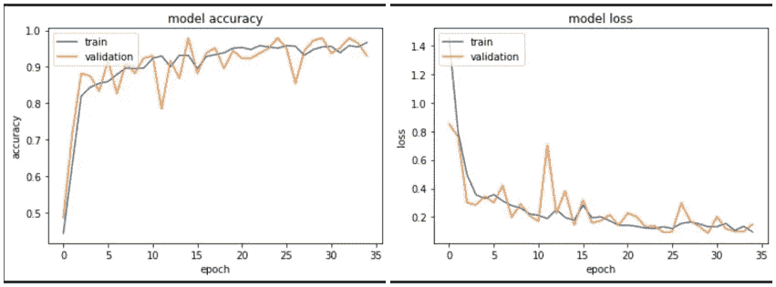
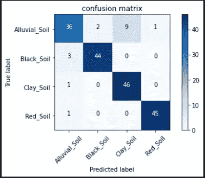
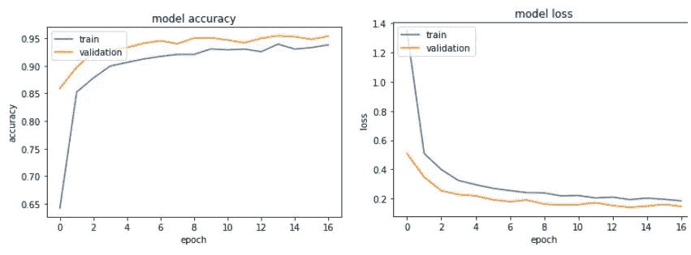
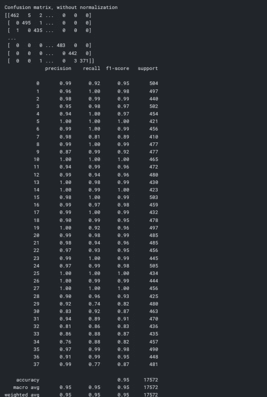
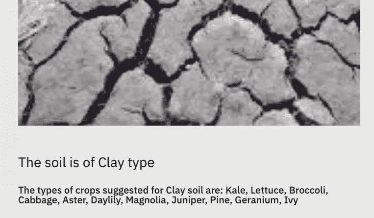

# 我母亲是如何开始用 CNN 来报道她的植物的

> 原文：<https://towardsdatascience.com/how-my-mother-started-using-cnn-for-her-plants-f0913e5548db?source=collection_archive---------12----------------------->


在 [Unsplash](https://unsplash.com?utm_source=medium&utm_medium=referral) 上 [veeterzy](https://unsplash.com/@veeterzy?utm_source=medium&utm_medium=referral) 拍摄的照片

## 她的植物状况不佳；Python、Streamlit 和机器学习拯救了我们

禁闭激发了人们的许多技能；一些人转向烹饪，一些人转向乐器，还有一些人尝试种植植物。我们家属于最后一批。在成长过程中，我们在花盆中种植了常见的圣罗勒、芦荟和偶尔生长的金盏花，但现在是时候扩大品种了。于是开始在亚马逊和当地苗圃寻找盆栽土、花盆和其他用具。

我的国家幅员辽阔，不仅在文化、人民和食物方面，而且在动植物和土壤类型方面都是多样化的。根据产品运输的地点，可能会有差异，尤其是当产品是土壤时。有冲积，粘土，红色，红土，黑色，泥炭和更多类型的土壤在该国。不用说，不同土壤的化学和物理性质是不同的，只有某些种类的植物适合每种土壤。

# 问题陈述

长话短说，我的母亲在每种类型的土壤中种植一切，并补充一些厨房垃圾肥料，但树苗的生长要么很慢，要么植物会在它们身上留下一些下垂的叶子。此外，鸽子——会飞的老鼠——在任何大城市都是威胁。我母亲可以做三件事:

> 1.确定土壤类型，只在其中种植相关的种子。
> 
> 2.尽早发现任何疾病并采取纠正措施。
> 
> 3.照顾鸽子(邪恶的笑声)*😈*

她花了几个小时在 YouTube 上，试图找到照顾某些植物的方法，说实话，在互联网上寻找信息可能会很难。我想过帮助她，但我的植物学知识很可笑，所以我决定召唤机器学习。

# 识别土壤类型

## 资料组

第一个问题是找到土壤的数据。正如我提到的，由于这个国家不同的气候和地理环境，土壤的种类太多了。就在我考虑转向基于土壤特性的更多数值分析时，我发现了一个[土壤数据集](https://www.kaggle.com/omkargurav/soil-classification-image-data)。它有冲积土、粘土、红色和黑色土壤的图像。看起来足够好了。

完美！让我们开始分析。

## 系统模型化

在构建了一些卷积网之后，我创建了一个模板，用来为模型设置基线。很多时候，我们需要对超参数做一点小小的调整，就能得到不错的结果。

我使用 split-folders 包将数据(包含子文件夹)分成训练集、测试集和验证集。在定义了训练、测试和验证数据之后，我形成了一个简单的 CNN 模型，其中有一系列卷积层和最大池层，中间有漏失。模型的后几层由激活 softmax 的“展平”和“致密”组成。

我可以看到，在这些纪元中，我获得了令人尊敬的验证准确性。让我们绘制各个时期的准确度和损失。



跨时代的模型准确性和模型损失。验证集和训练集的模型损失迅速下降(图片由作者提供)

看起来不错！现在，我将评估测试数据上的模型，并绘制一个混淆矩阵来检查错误分类。对于一个好的模型，大部分的观察值应该位于对角线上。



对于测试数据的混淆矩阵，大多数观察值是沿着对角线的(图片由作者提供)

看起来我们对问题的第一部分很满意。

# 识别疾病

## 资料组

像往常一样，我没有数据集，所以我求助于互联网，快速搜索将我带到了[植物村疾病分类挑战](https://www.crowdai.org/challenges/plantvillage-disease-classification-challenge)，它有 38 个不同类别的图像数据集。诚然，数据集中的许多植物都不在我家生长，但至少有总比没有好。

数据集有大约 100k 张图像，在我简陋的机器上运行它会有些过分，所以我决定使用 Kaggle 的 GPU 功能。此外，[数据出现在 Kaggle](https://www.kaggle.com/vipoooool/new-plant-diseases-dataset) 上，因此将其导入模型会简单得多。这种数据有许多内核，但我发现有些奇怪的是，大多数人使用训练和验证数据来训练模型，为了测试的目的，他们使用“已经消费”的验证数据。我在这里看到了一个根本性的问题，决定建立自己的模型。

在开始之前，我将训练数据分成训练集和验证集；已经有了一个测试集，所以我设置了三个必需的数据集——训练、测试和验证

## 系统模型化

在开始建模之前，我记得我的母亲将不得不在现实生活中使用这些模型，而且大多数时候 Keras 的模型都很重~300 MB，这增加了 Heroku 应用程序的 slug 大小。这是一个应该在建模过程中缓解的问题。

我决定使用 MobileNet，经过编译和训练后，它的体积会非常小。

跨时代的准确性和损失看起来很有希望。



植物病害的模型精度和模型损失。(图片由作者提供)

我有一点信心，测试集上的预测不会真的很差，我是对的。



我不能在 Matplotlib 中打印混淆矩阵，因为这里的类的数量是 38，因此这将是一个巨大的矩阵(图片由作者提供)

你可以看到矩阵的对角线由很多数字组成，F1 分数(精确度和召回率的调和平均值)在大多数类别中接近 0.9，我认为这是一个足够好的模型。

# 现在怎么办？

该模型的主要用户是我的母亲，我不希望她使用笔记本电脑来使用该模型，所以我必须让事情变得简单一些。

**进入细流！**

在开发 UI 之前，我知道我有两个模型——一个用于土壤分类，另一个用于植物病害。第二个非常小(12 MB ),但前者(300 MB)需要转换以兼容物联网设备。谢天谢地，TensorFlow 让我们这样做。

现在，我们已经准备好在 Streamlit 上部署应用程序。

## 部署

Streamlit 应用程序非常容易构建，我所要做的就是在一个文件夹中创建 app.py、setup.sh、requirements.txt、Procfile、models 和其他我正在使用的东西。[请看这里的 GitHub 回购](https://github.com/Prashantmdgl9/soil-analysis)。

如果你的 GitHub repo 中有所有文件，那么你可以轻松地使用 Streamlit 共享服务(免费)，指定你的 app.py，如果一切顺利，你将拥有一个你可以在任何地方从*访问的应用(不知道专制国家)。*

请查看这里部署的 app—[https://share . streamlit . io/prashantmdgl 9/soil-analysis/main/app . py](https://share.streamlit.io/prashantmdgl9/soil-analysis/main/app.py)

或者在[https://soil-analyser.herokuapp.com/](https://soil-analyser.herokuapp.com/)

## 资源

编辑资源列表以便于访问。

1.  土壤数据集出现在[这里](https://www.kaggle.com/omkargurav/soil-classification-image-data)。
2.  患病叶片数据集出现在[这里](https://www.kaggle.com/vipoooool/new-plant-diseases-dataset)。
3.  部署的应用程序可以在[这里](https://share.streamlit.io/prashantmdgl9/soil-analysis/main/app.py) (Streamlit)和[这里](https://soil-analyser.herokuapp.com/) (Heroku)访问。
4.  部署的应用程序的 GitHub 是这里的(Streamlit)和这里的(Heroku)。
5.  训练土壤模型的代码在[这里](https://github.com/Prashantmdgl9/soil-analysis/blob/main/codebase/soil.py) (GitHub)。
6.  训练叶子模型的代码出现在[这里](https://www.kaggle.com/prashantmudgal/leaf-diseases-cnn-95) (Kaggle)。

# 我母亲的反馈

1.  她的手机拍摄高分辨率照片，每当她拍摄照片并上传到应用程序时，应用程序就会崩溃。我错过了它，因为测试图像的尺寸非常小。我可以通过设置更高的递归限制来缓解这个问题。

```
sys.setrecursionlimit(10000)
```

2.她喜欢这个应用程序提供建议，告诉她应该在土壤中种植什么类型的植物。



其中一个分类结果的快照(图片由作者提供)

3.她对植物疾病模型的结果并不感到兴奋，因为根据它，几乎所有她的植物都需要手术室，我完全理解这一点。

> 我错误地认为病叶可能看起来有些相似。这种假设似乎很牵强，因为叶子上可能有特征斑点。

迫切需要用她种植的植物来更新这个数据集。目前，她可以在这个应用程序的帮助下照顾小番茄植物。如果叶子是绿色的，它将被分类为健康的，并且在许多情况下，很少有黑星病、锈病、枯萎病、霉变将被正确分类。对于那些身上有自然斑点、黄线、棕色斑点的物种，我需要随时更新数据。

> 就目前而言，如果因为这种努力，甚至有一些植物得到了正确的治疗，那就“不错”了！

资料来源:Giphy