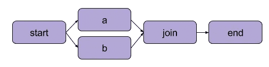
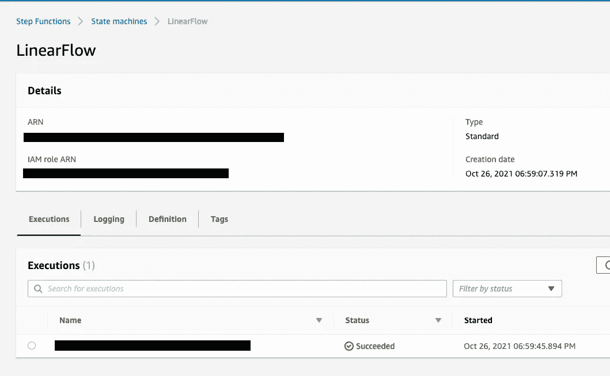
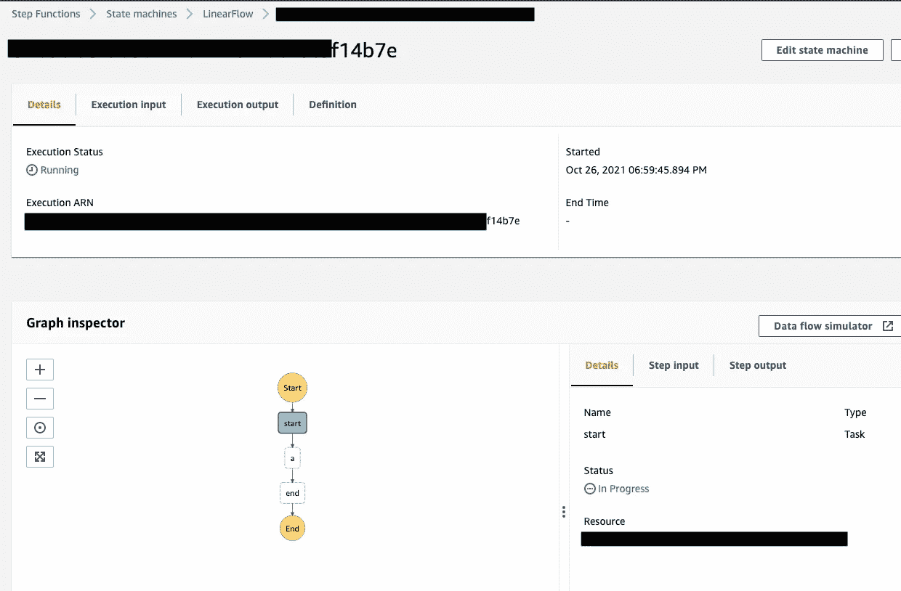

# 网飞元流如何帮助我们建立真实世界的机器学习服务

> 原文：<https://towardsdatascience.com/how-netflix-metaflow-helped-us-build-real-world-machine-learning-services-9ab9a97cdf33?source=collection_archive---------9----------------------->

## 基于真实世界用例的元流快速介绍。

斯塔基·贾在 [Unsplash](https://unsplash.com?utm_source=medium&utm_medium=referral) 上的照片

这篇文章生活在:

*   [中等](https://medium.com/@Ahmad-Houri/how-netflix-metaflow-helped-us-build-real-world-machine-learning-services-9ab9a97cdf33)
*   [开发到](https://dev.to/ahmadhouri/how-netflix-metaflow-helped-us-build-real-world-machine-learning-services-ai2)
*   [走向数据科学](/how-netflix-metaflow-helped-us-build-real-world-machine-learning-services-9ab9a97cdf33)

# 简介:

两年前，我作为一名软件工程师加入了 future demand，去年我和我的团队一直在使用 Metaflow，在这篇文章中，我想总结一下我们使用它的经验。

该框架最初是在网飞开发的，它有一个活跃的社区。由于这个框架仍然相对较新，我决定写一篇文章来描述什么是元流，以及它如何适应产品开发过程的全貌。

尽管 Metaflow 有非常好的文档，但我认为基于真实世界的用例来编写我们的经验会有所帮助，并且更容易掌握。

为了快速了解未来需求，我们与活动组织者(体育、音乐和娱乐活动)合作，通过从他们已有的数据中提取知识来提高他们的门票销售。我们根据人们的真实兴趣，而不是社会和人口统计特征，使用味觉群集的概念来定位人们。例如，基于音乐品味的定位基本上是推动古典音乐领域销售的因素，而不是其他任何特征。

# 什么是元流？

Metaflow 是一个框架，帮助数据科学家在生产环境中管理、部署和运行他们的代码。它通过跟踪数据科学家所做的实验来加速开发过程。

# 前置元流:

在我加入公司时，数据科学团队已经开发了他们的模型。他们的代码是 python 脚本，在本地机器上运行以交付最终结果。

回到过去，这段代码最初是在 Jupyter 的笔记本上写的。然后，我们的团队对其进行提取和重构，使其作为自动化的纯 python 脚本运行。

作为工程师，对我们来说，重点是部署和管理这些代码，如何实现自动化，以及将这些脚本投入生产。

# 元流开始发挥作用:

那时，我们的机器学习代码可以被描述为 DAG(有向无环图)。

简而言之，DAG 是工作流的数学表示，它描述了处理和转换数据的步骤，基本上，它是数据管道的抽象

线性非循环图—图片由 Metaflow 官方文档提供— Apache License 2.0

分支无环图—图片由 Metaflow 官方文档提供— Apache License 2.0

我们自己管理工作流没有任何优势，所以我们决定使用一个框架来为我们运行和管理代码。使用框架可以在很多方面帮助我们。例如自动化、并行化、编排、故障转移(在特定步骤失败后恢复)等。

在做一些研究时，我们发现了许多选项，如(Luigi，Airflow，Metaflow，MLflow)，由于 Metaflow 和 AWS 之间的高度集成给我们留下了深刻的印象，我们决定使用 Metaflow。

# 元流术语:

# 元流流量:

流是 Metaflow 中的主要概念，它是一段描述要执行的步骤以及这些步骤的执行顺序的代码。

让我们考虑下图中提供的 DAG:

Metaflow 官方文档提供的图片— Apache 许可证 2.0

基本上，这个流程可以使用 python 来实现:

并且该流程可以如下容易地执行:

在本地运行元流-按作者分类的图像

# 元流运行:

元流运行的概念——至少对我来说——是一个新的和聪明的东西。
基本上，每次您或任何其他团队成员在本地或 AWS 上运行流程时，所有连接到流程的元数据都会自动存储在中央数据库或 S3 上，以备后用。

例如:

*   你分配给 ***自身*** 的任何东西都会被保存。
*   行刑的时间。
*   已执行的代码版本。
*   元数据(输入参数、状态、执行流程的用户)。
*   数据科学工件(模型、特征集、训练数据快照)

# 元流服务:

正如我在上一节中提到的，Metaflow 的每次运行都会被跟踪，但是这是怎么发生的呢？
简而言之，有一个客户端 API 服务器在运行(在 AWS 上)。
我们称之为元流元服务，每次流被执行时(本地或 AWS 上)，所有关于您运行的元数据都将被传输到一个中央数据库——使用元服务。

# 元流用例:

我将提到一些我们可以从 Metaflow 中受益的用例，以及它如何使我们的开发和部署过程变得更加容易:

# 跟踪和版本控制:

在开发模型时，我们的数据科学家必须进行实验，并选择能够提供最佳模型的最佳特性集。基本上，他们使用 excel 文件来存储哪个特性集给出哪个结果。

应该有更好的方法来做这件事， ***对吗？***

答案是肯定的，Metaflow 将存储您或任何其他团队成员所做实验的所有数据，您可以轻松检查所有历史运行，以比较和选择您的模型的最佳结果。

检查您的历史运行非常简单，可以使用下面的代码片段来解释:

检查历史运行

在这个代码片段中，我们对一个流的所有历史运行进行迭代，并从每次运行中读取一些数据。除了做实验，我们的模型还在不断变化的训练数据上接受训练。迭代历史运行帮助我们理解这是如何影响我们的模型的，这是我们可以使用 Metaflow 轻松跟踪的。

# 扩展和云集成:

我们的另一个用例是，我们希望在本地训练我们的模型，但是有些步骤需要太多的时间和资源来执行。

我们发现，即使我们在本地运行流程，我们也可以很容易地将特定步骤切换为在 AWS 上作为批处理作业执行——这可以使用 batch decorator 来完成:

使用 AWS 批处理作业扩展我们的资源

在最后一个代码片段中，通过对步骤 **a** 使用批处理装饰器，我们使用请求的内存和 CPU 资源在 AWS 上强制执行这个步骤，同时仍然使用我们的 ide 来运行代码。

在本地运行元流，并强制一些步骤作为批处理作业在 AWS 上运行——图片由作者提供

# 部署:

部署是元流的另一个有用的方面。我们第一次讨论如何部署和自动化重新训练我们的模型的过程时，我们考虑了将我们的代码归档，以及选择哪个服务最适合运行代码，等等…

后来我们发现使用 Metaflow 部署过程再简单不过了。
基本上，通过执行一个命令，我们可以将本地流反映为 AWS 上的阶跃函数状态机，我们可以使用 lambda 函数或手动触发它。

这是一个例子:

将元流部署为 AWS 上的阶跃函数状态机—图片由作者提供

这个流程在 AWS 上反映为一个阶跃函数状态机:

AWS 上的阶跃函数状态机—图片由作者提供

我们习惯于在 AWS 上手动触发它们，并使用 lambda 函数安排日常运行。

这是我们的流的阶跃函数在 AWS 上的样子:

触发 AWS 上的流量—图片由作者提供

后来，我们构建了一个简单的部署管道，并将其附加到我们的代码库中。每当有人将新的变更推送到特定的分支时，所有的变更都会直接反映在相关的 step 函数上。

# 机器学习的持续交付:

在其中一个用例中，我们在 rest API 后面使用了一个数据科学模型，以服务于前端并给出事件建议，正因为如此，我们的模型需要每天进行训练，以包含新的事件。我们使用 Metaflow 在后端加载模型的最新版本，步骤如下:

*   从 Metaflow 的最近一次成功运行中在后端加载模型。
*   使用加载的模型对服务进行健全性测试，只有当它通过测试时，我们才使用新的模型。
*   如果健全性测试失败，我们返回到更早的元流运行，从模型中加载一个可以通过我们测试的旧版本。

这完全可以在没有 Metaflow 的情况下完成，但对我们来说，使用 Metaflow 来为我们版本化和存储所有数据科学工件要简单得多。

# 调试和恢复失败的流程:

另一个有用的用例是恢复失败步骤的能力。
有时，计划在 AWS 上每天运行的步进功能会失败。由于数据不断变化，重现错误变得更加困难，因此，我们希望能够使用相同的数据集恢复失败的步骤。
通过使用 Metaflow，我们可以轻松地检查我们机器上的流，查看导致错误的数据，从失败的步骤恢复流执行，并调试哪里出错了。

# 最后…

总之，在某些方面，使用 Metaflow 对我们来说和使用 Git 对代码本身一样重要。它让我们的数据科学家有可能在代码的整个生命周期中对其进行管理。同时，这也给了我们(工程师)更多的时间去关注系统的其他部分。

# 在你走之前…

***感谢*** *的阅读！我希望你喜欢这篇文章……如果你想与我取得联系，请随时通过 ahmad.hori@gmail.com 联系我，或者通过我的* [***LinkedIn 个人资料***](https://www.linkedin.com/in/ahmad-houri/)**也可以通过* ***关注我的媒体*** *了解更多故事。**