# 神经网络如何学习

> 原文：<https://towardsdatascience.com/how-neural-networks-learn-5ded46a13546?source=collection_archive---------65----------------------->

## 反向传播的数学指南

本文的目的是通过开发一个框架来分析权重和偏差的变化如何影响成本函数，从而提供对神经网络的 ***学习*** 过程的数学理解。一旦理解了这一点，我们将能够确定如何使用像 Adam 这样的优化算法，使**非常小** **改变这些变量中的**，可以降低成本函数。

[来源](https://pixabay.com/images/download/neural-network-3816319_1280.png?attachment&modal)

神经网络，或者具体地说是人工神经网络，是一系列模仿动物神经系统的节点，产生类似于大脑的信息处理能力。这些节点之间的连接由在训练过程中学习的权重指定。这些网络背后的基本思想可以追溯到艾伦·图灵在 1948 年发表的题为[智能机器](https://hashingit.com/elements/research-resources/1948-intelligent-machinery.pdf)的论文中，他将它们称为 B 型无组织机器，即从初始组成来看相当无组织，但能够学习如何执行特定任务的机器。今天，这些神经网络构成了深度学习算法不可或缺的组成部分，本文旨在阐明它们到底是如何学习的。

让我们从想象一个相当简单的神经网络开始。让我们想象一个由 L 层组成的网络，但是每一层只有一个神经元，如下图所示。

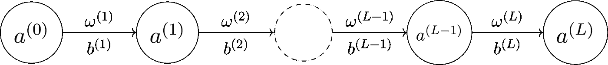

现在，让我们将我们的分析限制在最后一层和倒数第二层之间的连接，下面显示了这两层的关联权重(*)和偏差( ***b*** )。*

*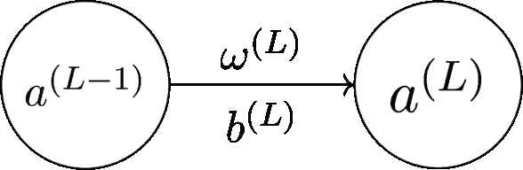*

*激活的神经元 **L** 和 **L-1** 分别是 **a^(L)** 和 **a^(L−1)** 。如果最后一层的期望输出为 ***y*** ，则误差或代价函数变为***c _ o =(a^(l)−y)***。这也称为均方误差，可能是所有可用选项中最简单也是最广泛使用的。成本函数中的下标表示这是第一个训练图像/数据点的成本，并且整个训练过程将需要对训练数据集中的所有 **N** 个图像进行训练。这里的层 **L** 的激活可以表示为:*

*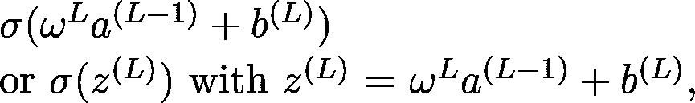*

*其中***【b^(l】***是层 ***L*** 和 ***σ*** 是上面讨论的激活函数。学习包括使用合适的优化算法(通常是梯度下降的某种变体)来达到最小化***【C20】***【ω^(l】和***【b^(l】***的最优值。我们通过检查成本函数对偏差和权重的小扰动的敏感度来做到这一点，即通过使用链式法则计算以下偏导数:*

*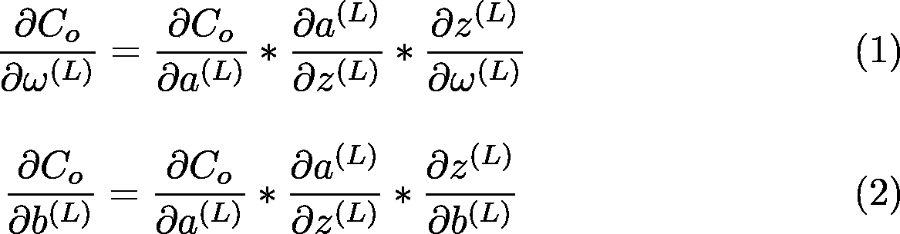*

*上述等式右侧的偏导数可以计算如下:*

*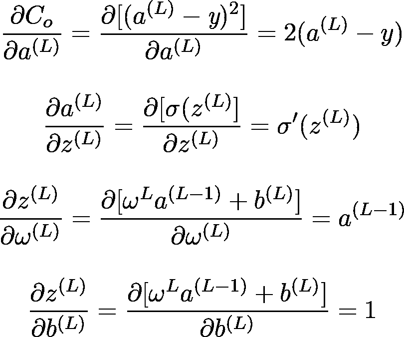*

*将上面导出的偏导数代入等式 1 和 2*

*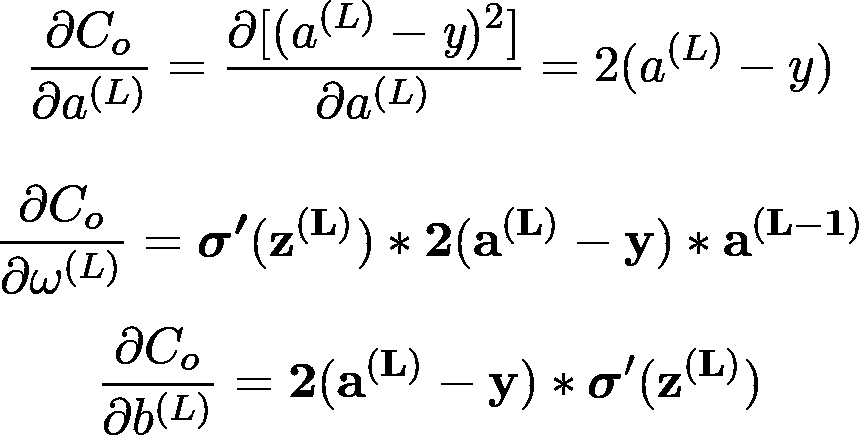*

> *这两个偏导数有助于量化重量和偏差的变化如何影响成本。*

*现在让我们添加另一层到我们的神经网络，如下所示。*

*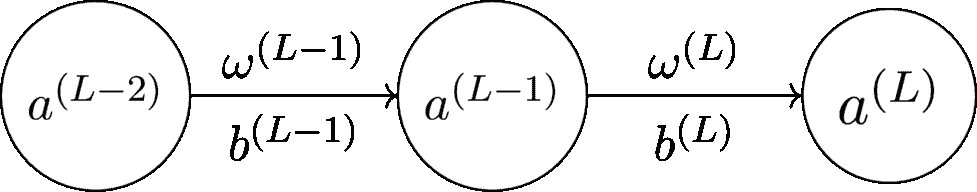*

*除了我们刚刚计算的两个偏导数之外，为了充分研究权重和偏差变化对成本函数的影响，对于该网络，我们还必须计算倒数第二层的以下两个偏导数*

*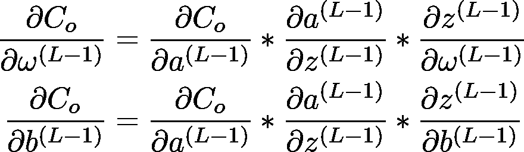*

*上述两个方程所需的偏导数可以计算如下:*

*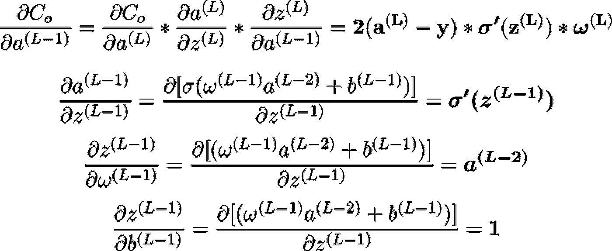*

*代入这些值，我们得到与层 **L-1** 相关的权重和偏差变化的成本函数变化率的以下表达式*

*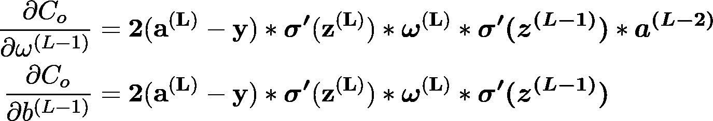*

*这应该能让我们了解反向传播是如何工作的。首先，我们根据层 **L** 和 **L-1** 的激活情况，确定成本相对于层 **L** 的重量和偏差的偏导数。然后，我们推导出该相同成本函数相对于层 **(L-1)** 的权重和偏差的导数，作为层 **L、L-1、**和 **L-2 的激活的函数。**这些激活又被表达为各自权重和偏差的函数。我们可以遵循相同的过程，直到整个网络的第一个神经元，以确定所有的权重和偏差如何影响成本函数。*

**

*在我们的分析中，到目前为止，我们还没有解决单层中有一个以上神经元的情况。事实证明，向一层中添加更多的神经元只需要一些额外的指标来跟踪。下面显示的是一个两层的神经网络，但每层都有许多神经元。这里，我们引入两个新的指数来跟踪每一层上的神经元，k 用于层 L-1，j 用于层 L。*

*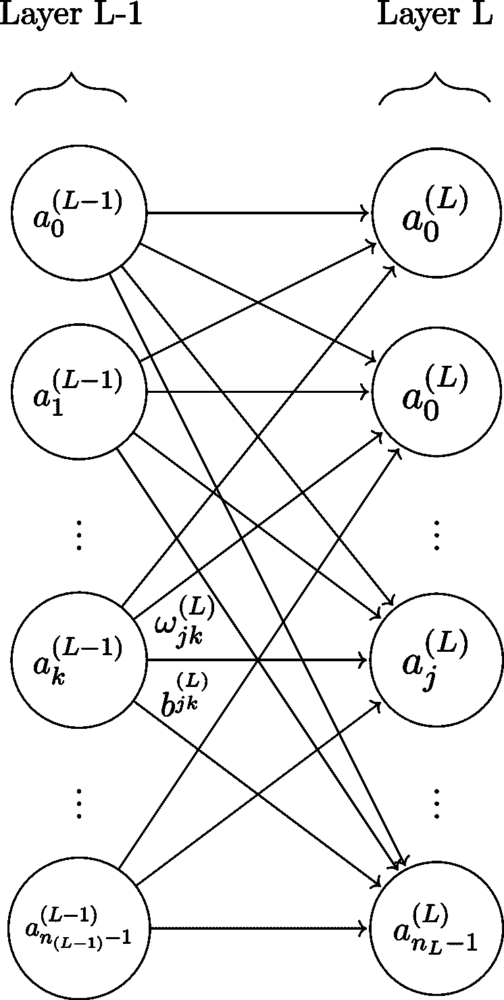*

*这种情况下的成本函数将是输出层 L 中每个神经元的成本之和*

*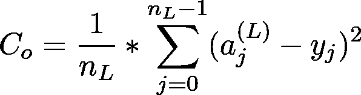*

*层 L 中每个神经元的激活将是层 L-1 中所有神经元的激活的加权和*

*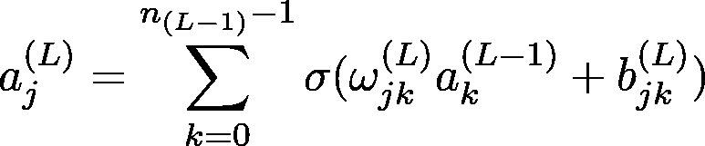*

*成本相对于层 L 的重量和偏差的偏导数可以如前所述*

*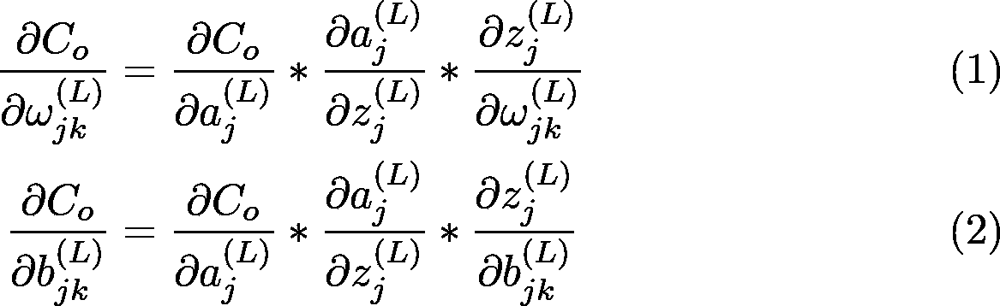*

*上述方程所需的偏导数可以像以前一样计算。*

*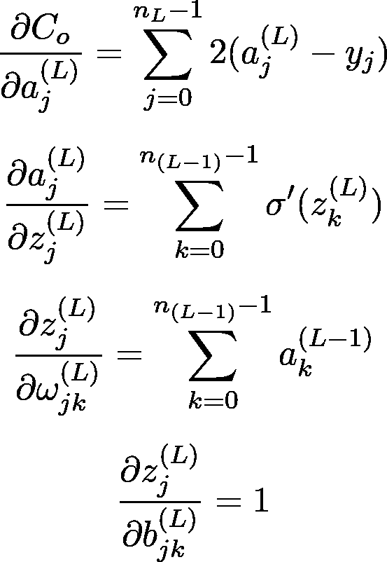*

*将这些代入等式(1)和(2)*

*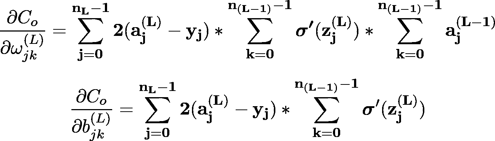*

*上面的等式是用于具有两层但每层有许多神经元的神经网络。我们可以类似地计算具有许多层和每层许多神经元的神经网络的偏导数。我不包括这个方程，因为它们本质上涉及与上面讨论的相同的逻辑。*

*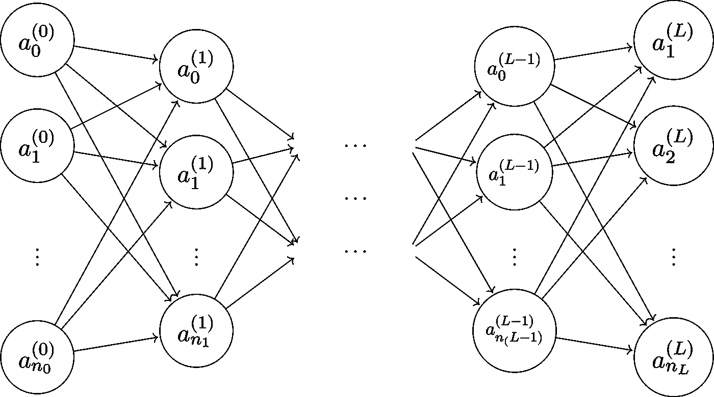*