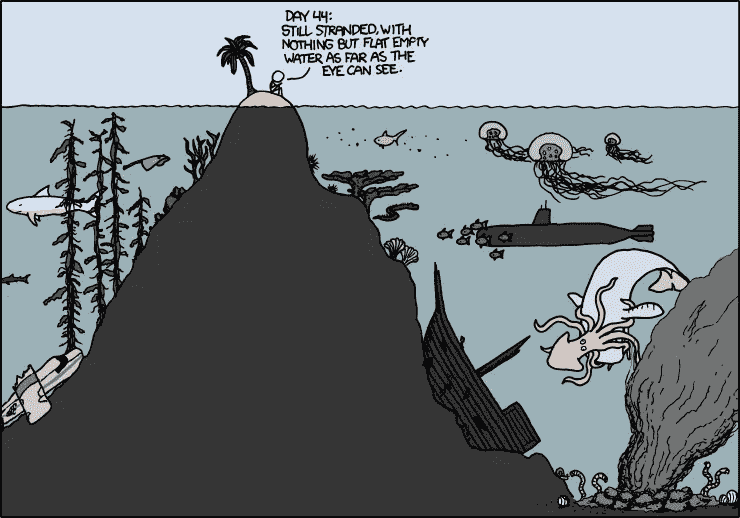
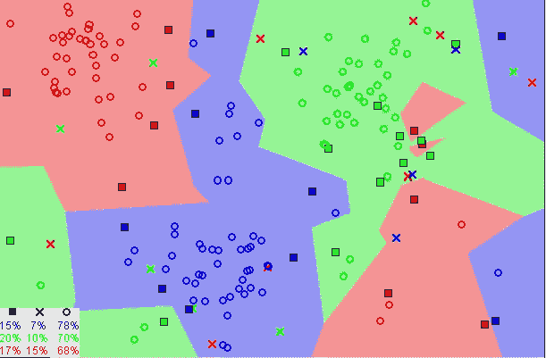
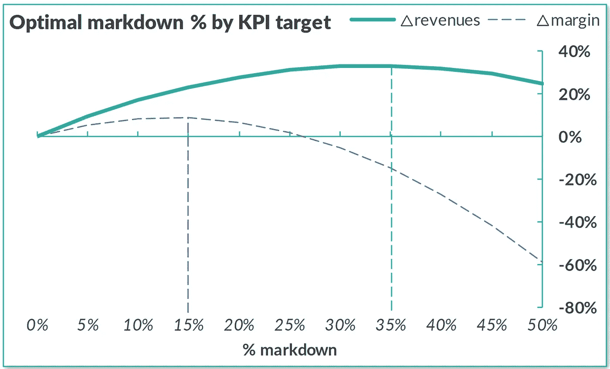
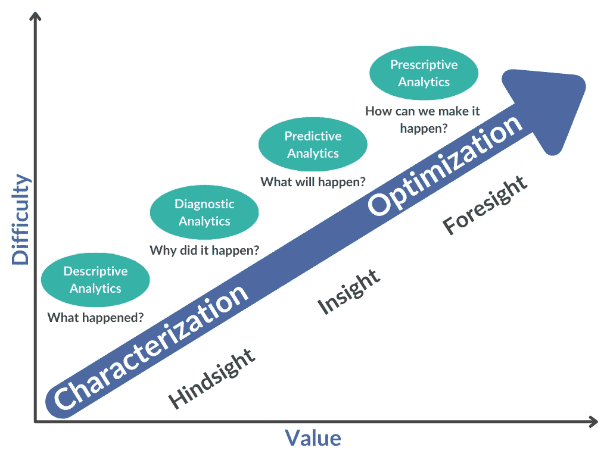

# 如何(不)在数据科学项目中失败

> 原文：<https://towardsdatascience.com/how-not-to-fail-at-your-data-science-project-7e8c84305aa8?source=collection_archive---------25----------------------->

## [行业笔记](https://towardsdatascience.com/tagged/notes-from-industry)，[商业科学](https://medium.com/tag/business-science)

## 可能破坏投资回报和影响的 4 个设计选择


照片由[乔·什切潘斯卡](https://unsplash.com/@joszczepanska?utm_source=medium&utm_medium=referral)在 [Unsplash](https://unsplash.com?utm_source=medium&utm_medium=referral) 拍摄

自新冠肺炎疫情开始一年多以来，数据科学家仍在努力让他们的模型恢复原状。大约每周，我都会看到[另一篇文章](https://venturebeat.com/2021/05/01/data-science-in-a-post-covid-world/)哀叹过去一年的混乱对机器学习模型产生了负面影响。许多组织已经不再试图适应，只是希望等待，直到我们“恢复正常”。

> 当他们最终意识到不存在正常这种东西时，他们将会大吃一惊。

我们所有在数据科学领域工作的人都需要认识到导致这些模型崩溃的失败，并以新的方式处理我们的算法设计。我们不必继续犯同样的错误。

数据科学中这 4 个常见的项目设计选择让你很容易失败。这是你实现模型漂移、最小影响和低投资回报率的路线图(或者，更好的是，4 件让你走向成功的事情)。

# 1.隔离您的项目

回想一下您最近的几个数据科学项目。希望它们不要太相似，这样你就可以挑战自己并保持有趣。但是，即使它们是具有相反目标的非常不同的项目，代码和机器学习基础仍然非常相似。现实情况是[数据科学家有一个特殊的工具箱](https://hbr.org/2018/08/what-data-scientists-really-do-according-to-35-data-scientists)并且经常重复方法来实现不同的目标。

尽管如此，**数据科学家倾向于创建与其他数据科学家和其他项目隔离的项目孤岛**。我们最终会浪费大量时间重复自己的话，做类似的分析。甚至在同一家公司的团队也是如此！

## **整个数据世界是一个集成的全球系统**；打破这些联系只会限制你的回报。

所有数据、见解和中间结果应在整个分析中共享，以最大化其影响。由于您的大多数项目处理相似的操作，隔离只是浪费时间。

*当你在一个* ***项目孤岛*** *上时，你往往会为了收益而错过关键领域*。你看到了所有的水，却忽略了底下的东西。将您的项目与其他数据科学项目隔离会让您面临失败，因为您必须重新学习过去的所有经验教训，并从头开始重新创建所有最好的代码。**孤立的数据、方法和代码让你容易犯错**。与其重新创建代码，不如将时间和精力用于设计您的分析。你会得到更好的结果。



**资料荒岛。**图像演职员表:兰道尔·门罗、[xkcd](https://xkcd.com/731/) 。

# 2.从工具出发，而不是从目标出发

作为一名数据科学爱好者，我和其他人一样对使用新工具和新类型的分析来改进我的结果感到兴奋。**很难抗拒全新战略的吸引力，尤其是因为数据科学的最新进展通常会提供大量增长机会**。

这是一个普遍的问题。在最近一期的[麻省理工学院斯隆管理评论](https://sloanreview.mit.edu/article/why-so-many-data-science-projects-fail-to-deliver/?og=Leadership+Infinite)中，他们讨论了一名技术娴熟的数据科学家受聘改进印度一家大型金融公司的投资定位算法的案例。他迷上了 k-最近邻算法，并投入大量时间和精力将其应用到分析中。

收获甚微。事实上，该算法的建议并不比任何专业人士在没有任何正式统计分析的情况下通过查看数据给出的建议更好: ***所有开发该工具的努力，却一无所获。***



***K-最近邻* *算法。*** *图片演职员表:* E. M. Mirkes，[*维基媒体*](https://commons.wikimedia.org/wiki/File:Map1NNReducedDataSet.png) *。*

为什么？如果你知道关于 k-最近邻算法的任何事情，它看起来会有很大的潜力。您可以使用健壮的聚类快速对数据进行聚类，以找到看似噪声的模式和相似性。**它应该工作，对不对？**

这个问题要追溯到最开始。我们的目标是看看一个特定的算法能做什么，而不是改进 KPI。确切的项目设计是有缺陷的。在有效的数据科学项目中(我喜欢称之为[商业科学](/data-science-is-dead-long-live-business-science-a3059fe84e6c))，**必须有一个精确的目标，以获得想要的结果。**

太多时候，数据科学家带着“让我们应用这个方法，看看我们有什么发现”的心态来建立项目。有时这能带来令人印象深刻的结果，但通常表现不佳。

> 成功的数据科学项目只回答一个问题:我如何改进这个 KPI？

实验可能有它的位置，尤其是在大学里，但一旦你试图实现可预测的增长和最大化的结果，方法必须是不同的。从工具出发，而不是从目标出发，将永远无法实现投资回报最大化。最佳实践是**从业务需求出发，找到实现目标的最佳统计方法** —即使它并不花哨，也不是数据科学领域的最新趋势。

> 如果你专注于方法或工具，而没有深入到*为什么*，你会让自己失败。

# 3.优先考虑错误的 KPI

当然，即使你把目标放在第一位，**只有当目标是*正确目标*时，你才能获得最佳结果。**

你的努力的影响主要取决于你选择优先考虑的 KPI。例如，在零售业，我们经常看到人们以牺牲更有价值的洞察力为代价来提高需求预测的准确性。如果你花费数周时间开发完美的工具，将预测准确度提高 2 个百分点，如果数据科学家忽略供应链或定价中的突出问题，这可能不会产生太大影响。优化这些关键绩效指标带来的收益将更加显著。

[*KPI 优先顺序*](https://www.sciencedirect.com/science/article/pii/S221282711830252X) *至关重要，也极具挑战性*。没有一个硬性的规则告诉你你的目标应该是什么，但是两个简单的准则可以使决策过程更容易管理:

**1。** **你的 KPI 应该对底线有重大影响。**

**2。** **你的 KPI 应该有增长的潜力。**

第一条规则很简单。**你的目标应该带来切实的回报**。例如，一家连锁杂货店将从只能优化牛奶价格的算法中获得最小的好处。它将从能够最大化整体收入的算法中获得更大的好处。这通常要复杂一点，但原理是一样的。

**一个简单的测试？在您选择的 KPI** 中添加“等等……”:即，我们正在优化额外的利润增长，*等等*，这将使我们能够在短时间内大幅提高底线收入。这个练习把你带出经常导致这个设计缺陷的技术思维模式。*你可以交付具有更大影响力的业务可消化的产出。*



**了解正确的 KPI 并非易事。**图片致谢: [Evo 定价](https://evopricing.com/) (CC 带归属)

第二条准则更难实现。有时，很难从表面上评估特定 KPI 的改进潜力。然而，你通常可以通过**识别关键痛点、资源消耗或浪费领域**来找出最大潜力所在。消除这一点大有帮助。

> 您的目标成果最终决定了您的数据科学项目的成败。所以要慎重选择。

# 4.选择错误的分析深度

设计数据科学项目的最后一个致命缺陷？**选择错误的分析级别**。

作为数据科学家，我们可以利用四个基本的分析级别:*描述性、诊断性、预测性和规范性*。所有这些都有其目的，但对于大多数大规模数据科学项目来说，**只有规定性分析才会产生最大的影响**。



**价值与分析难度。**图片来源: [Evo 定价](https://evopricing.com/) (CC 带归属)

*只有规定性分析才能推动，而不是分析或预测结果*。它提供了最佳的预见性，并且是优化您选择的 KPI 的最佳设计。通过规范性分析实现的灵活性使您能够**实现您的目标，而不管前进道路上的干扰或障碍**。

在建立新项目时，很容易默认使用预测分析。毕竟，预测是大多数非数据科学家要求从他们的数据中学习的东西。另外，指令性的方法更难！但作为专家，我们应该更清楚。[优化几乎总是我们的真正目的](/to-forecast-or-not-to-forecast-that-is-the-supply-chain-question-439e0eb47b61)。这要求我们站出来**拥抱更艰难但更有回报的成功之路**。

在过去的一年里，在新冠肺炎危机面前，导致人工智能模型崩溃的干扰是[普遍存在的](https://www.mckinsey.com/business-functions/mckinsey-analytics/our-insights/global-survey-the-state-of-ai-in-2020)——但不是[规范模型中的](https://www.bcg.com/publications/2020/business-applications-artificial-intelligence-post-covid)。他们在处理模式变化时更加敏捷，并且能够调整。

> 如果您想在自己的项目中避免这种失败，请仔细考虑一种规范的方法。

明确地说，描述性、诊断性和预测性分析仍有价值。但是他们永远不会让你的数据价值最大化。除非您的项目范围仅限于事后诸葛亮，仅仅是为了及时捕捉快照或以其他方式限制规模，否则您将在说明性分析方面取得更大的成功。**项目难度会增加，但影响也会增加**。

# 为数据科学的成功干杯！


Guille 阿尔瓦雷斯在 [Unsplash](https://unsplash.com?utm_source=medium&utm_medium=referral) 上拍摄的照片

这可能看起来过于简单，但是简单地从你的项目设计中消除这些错误将会显著增加你在数据科学中的成功率。这是我们这个领域迫切需要的。根据 Gartner 2017 年的一项研究， **85%的数据科学项目都失败了**。我认为这一数字在过去 5 年中有所改善，部分原因是人工智能和机器学习的巨大进步，但几乎没有变化的迹象。

就我们所知，为什么？

> 这可以归结为我们设计这些项目的核心缺陷。

最终，有缺陷的不是技术；它是实现—和我们。幸运的是，这意味着我们有能力为此做些什么。有了集成、规范的方法和正确的目标来指导您的设计，建立一个失败的数据科学计划将会困难得多。

我不能保证这四个考虑会消除你未来的所有失败，但它们会避免最持久的缺陷。这是朝着正确方向迈出的一大步。

PS 更多[商业科学](https://medium.com/tag/business-science)来自我的写作:

</data-science-lessons-were-not-learning-fast-enough-83ead4827735>  </to-forecast-or-not-to-forecast-that-is-the-supply-chain-question-439e0eb47b61>  

```
Monthly Business Science in your inbox, new software, and University-level learning:[**Free access**](https://evouser.com/register)Questions? Please reach out on [Linkedin](https://www.linkedin.com/in/fabrizio-fantini/)
```