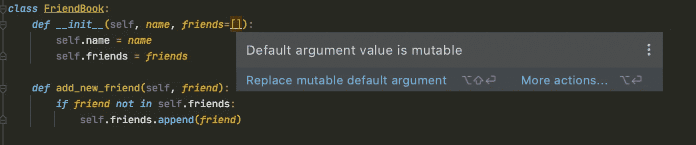

# 如何不使用 Python 列表

> 原文：<https://towardsdatascience.com/how-not-to-use-python-lists-d06cbe8e593?source=collection_archive---------4----------------------->

## 理解 Python 中的可变对象。


由 [Sarah Kilian](https://unsplash.com/@rojekilian?utm_source=unsplash&utm_medium=referral&utm_content=creditCopyText) 在 [Unsplash](https://unsplash.com/s/photos/oops?utm_source=unsplash&utm_medium=referral&utm_content=creditCopyText) 上拍摄的照片

我记得几年前当我从使用 R 转换到使用 Python 时，我必须习惯的一件事是可变对象——这在 R 中并不算什么。

可变对象是创建后**可以修改**的对象。Python 中可变对象的一些例子是列表、字典和集合。在下面的例子中，我们在创建之后扩展了`y`。

```
y = [1, 2, 3]
id(y)
Out[7]: 4831904704y.extend([4, 5, 6])
y
Out[10]: [1, 2, 3, 4, 5, 6]
id(y)
Out[11]: 4831904704
```

我们可以看到它保持了其唯一的标识号(由`id`函数给出)——这意味着我们仍然在使用同一个对象。

另一方面，不可变对象**不能被修改**。一些例子是元组、字符串、整数、布尔等。正如你在下面的例子中看到的，一旦我们改变了`x`的值，它的身份就改变了——我们已经将`x`重新分配给了`2`。

```
x = 1
id(x)
Out[3]: 4564694112x = 2
id(x)
Out[5]: 4564694144
```

如果您不习惯可变对象，那么编写具有…的代码是相当容易的。意想不到的后果。

让我们来看几个例子(在大多数情况下，不要做什么)。

# 列表作为默认参数？

假设您正在编写一个类来帮助跟踪每个人的朋友。所以你要做以下事情。

```
*class* FriendBook:
    *def __init__*(self, *name*, *friends*=[]):
        self.name = *name* self.friends = *friends

    def* add_new_friend(self, *friend*):
        *if friend not in* self.friends:
            self.friends.append(*friend*)
```

然后你开始为不同的人创建友谊书。

```
person_a_friendbook = FriendBook(name='Person A')
person_b_friendbook = FriendBook(name='Person B')person_c_friendbook = FriendBook(
  name='Person C', 
  friends=['Person E'],
)person_a_friendbook.add_new_friend('Person D')
```

现在，我们希望 B 在这一点上没有朋友。但是，事实并非如此。

```
person_a_friendbook.friends
Out[3]: ['Person D']person_b_friendbook.friends
Out[5]: ['Person D']person_c_friendbook.friends
Out[7]: ['Person E']
```

这是因为我们的默认参数`friends=[]`只被创建一次，在我们创建类的时候。我们可以通过使用比较它们的身份的`is`操作符来验证这一点。

```
person_a_friendbook.friends is person_b_friendbook.friends
Out[8]: True
```

我们可以看到`person_a_friendbook.friends`和`person_b_friendbook.friends`的身份是一样的。任何时候你回过头来使用`friends`的缺省值，你都将使用同一个列表——这意味着这个列表将被所有使用缺省参数实例化的对象共享。这很少(很可能永远不会)是我们想要的。大多数 ide 会警告你。



PyCharm 试图将我们从可变的默认参数中拯救出来。图片由作者提供。

解决办法很简单。

```
*class* FriendBook:
    *def __init__*(self, *name*, ***friends*=None**):
        self.name = *name* **self.friends = friends or []** *def* add_new_friend(self, *friend*):
        *if friend not in* self.friends:
            self.friends.append(*friend*)
```

这样，我们为每个对象都获得了一个新的空列表。

# 但我只是修改了函数内部的列表？

继续下一个我们可能会搞砸的方式。

```
x = [1, 2, *None*, 4, 5, *None*]

*def* fill_none(*data*, *fill_value*):
    n = len(*data*)
    *for* i *in* range(n):
        *if data*[i] *is None*:
            *data*[i] = *fill_value

    return data* y = fill_none(data=x, fill_value=100)
```

上面的函数越过`data`并用`fill_value`替换`None`值。

```
y
Out[1]: [1, 2, 100, 4, 5, 100]
```

`y`的值是我们所期望的。你能猜出`x`现在是什么吗？如果你认为它和`y`一样，那么你是正确的。

```
x
Out[2]: [1, 2, 100, 4, 5, 100]
```

当我们将一个可变对象作为参数传递给一个函数时，我们给了这个函数修改它的权力。现在，我们可以用两种方法来解决这个问题。第一个是清楚地表明，如果我们真的想这样的话，函数会修改列表。在我看来，我们可以通过删除`return`语句并添加一个 docstring 来实现。

```
x = [1, 2, *None*, 4, 5, *None*]

*def* fill_none(*data*, *fill_value*):
    '''
    Replace None values with the fill_value. Modifies data in-place.
    '''
    n = len(*data*)
    *for* i *in* range(n):
        *if data*[i] *is None*:
            *data*[i] = *fill_value* fill_none(data=x, fill_value=100)
```

第二种选择是在函数中使用列表的副本。

```
x = [1, 2, *None*, 4, 5, *None*]

*def* fill_none(*data*, *fill_value*):
    data = data[:]  # make a copy of data
    n = len(*data*)
    *for* i *in* range(n):
        *if data*[i] *is None*:
            *data*[i] = *fill_value* *return data*y = fill_none(data=x, fill_value=100)
```

现在`x`和`y`不一样了。

```
y
Out[13]: [1, 2, 100, 4, 5, 100]
x
Out[14]: [1, 2, None, 4, 5, None]
```

# 你确定元组是不可变的吗？

如果你记得，在这篇文章的开始，我们说过元组是不可变的，它们是不可变的，它们没有允许我们改变它们的方法。你可能想知道的一件事是“我能在里面放一个列表吗？”然后“我能改变元组内部的列表吗？”。答案是“是”和“是”。

```
my_list = [1, 2, 3]
my_tuple = ('a', 'b', my_list)my_tuple
Out[1]: ('a', 'b', [1, 2, 3])my_list.append('surprise')my_tuple
Out[2]: ('a', 'b', [1, 2, 3, 'surprise'])
```

为什么会这样？嗯，tuple 是不可变的意味着我们在创建它之后不能改变它包含的对象(但是如果它们是可变的，我们可以修改其中的对象)。事实上，即使在我们修改了列表之后，`my_tuple`仍然包含相同的三个元素，它们在我们创建它的时候都有相同的身份。这不一定是“搞砸了”或你想做的事情，但如果你没有意识到这一点，可能会令人困惑。

# 结论

在这篇文章中，我们讨论了 Python 中的可变和不可变对象。我们关注了可变对象，更具体地说是列表，如果不知道它们是如何工作的，会导致意想不到的后果。

*   **订阅** [**邮件更新**](https://eminik355.medium.com/subscribe) **。**
*   [**成为**](https://eminik355.medium.com/membership) **媒体的会员，获得所有故事的全部访问权限。你的会员费直接支持你读的作家。**

**更多来自同一作者。**

[](/multi-armed-bandits-thompson-sampling-algorithm-fea205cf31df) [## 多武装匪徒:汤普森采样算法

### 了解带 Python 代码的 Thompson 采样(贝叶斯)bandit 算法。

towardsdatascience.com](/multi-armed-bandits-thompson-sampling-algorithm-fea205cf31df) [](/going-bayesian-testing-rate-metrics-82e872b79175) [## 走向贝叶斯:测试速率度量

### 如何在没有 p 值和置信区间的情况下运行速率度量的 A/B 测试？

towardsdatascience.com](/going-bayesian-testing-rate-metrics-82e872b79175) [](https://medium.com/analytics-vidhya/calculating-using-monte-carlo-simulations-337cff638ac5) [## 使用蒙特卡罗模拟计算𝛑

### 用 Python 代码介绍蒙特卡罗模拟。

medium.com](https://medium.com/analytics-vidhya/calculating-using-monte-carlo-simulations-337cff638ac5)