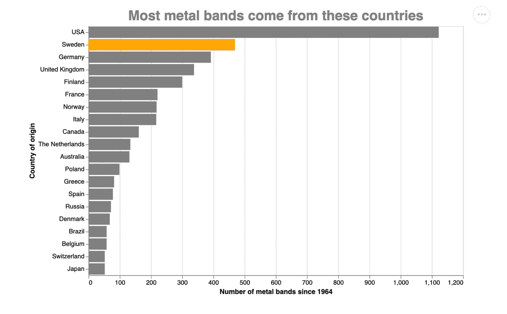
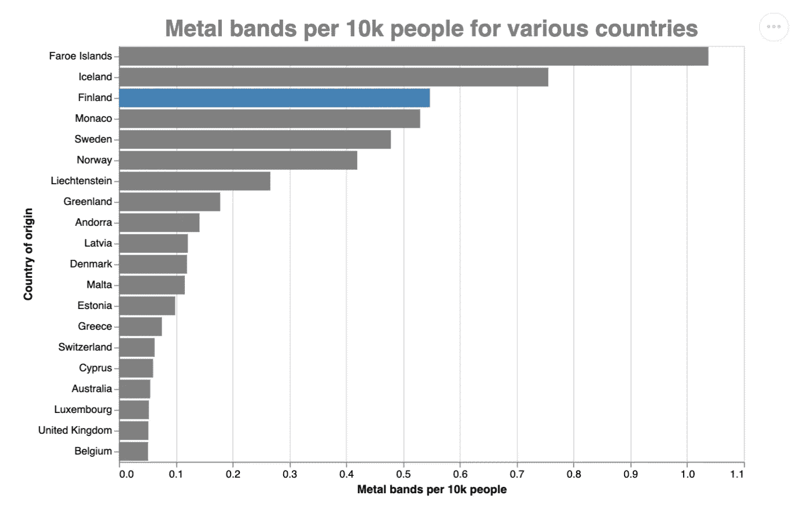
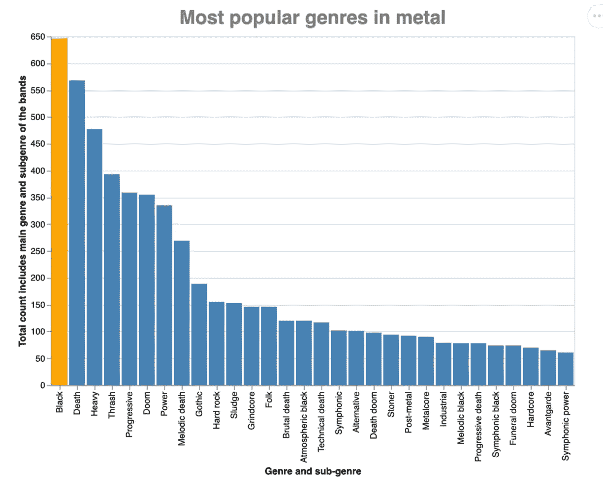
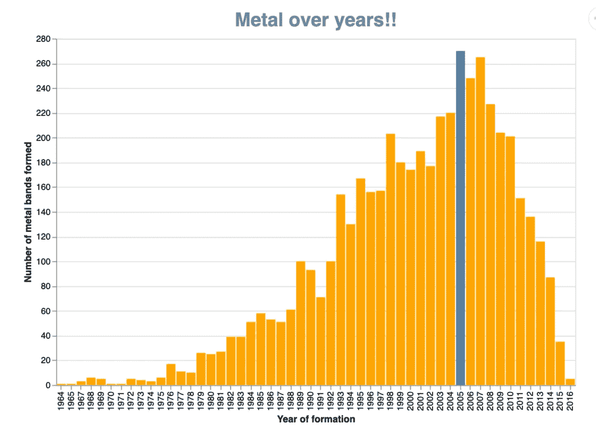
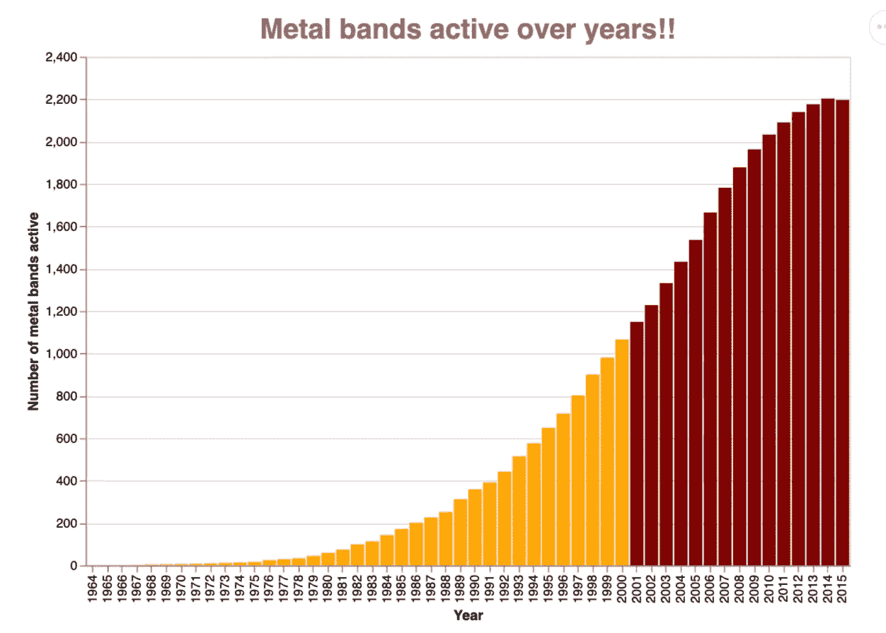
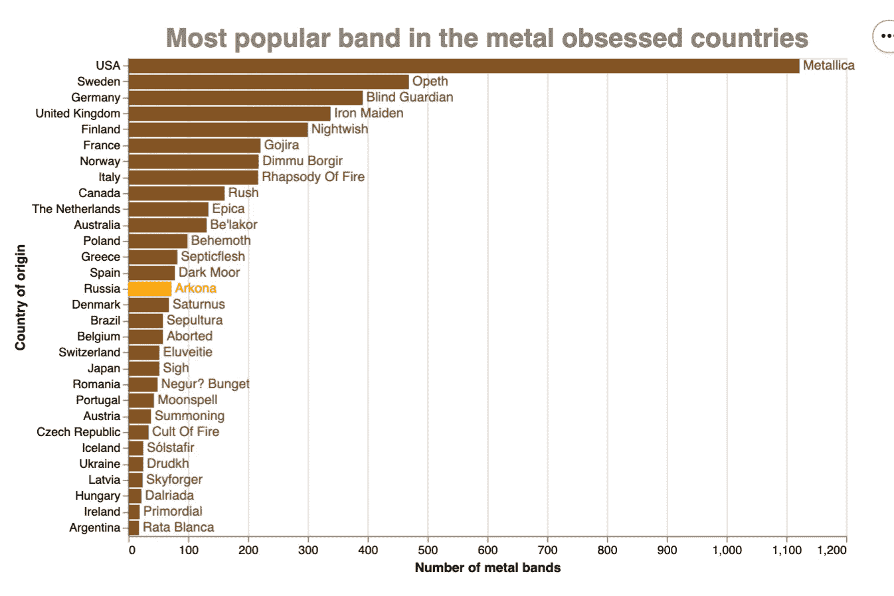
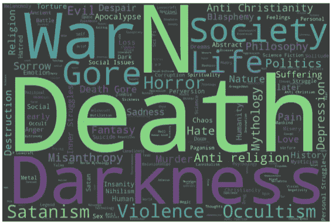
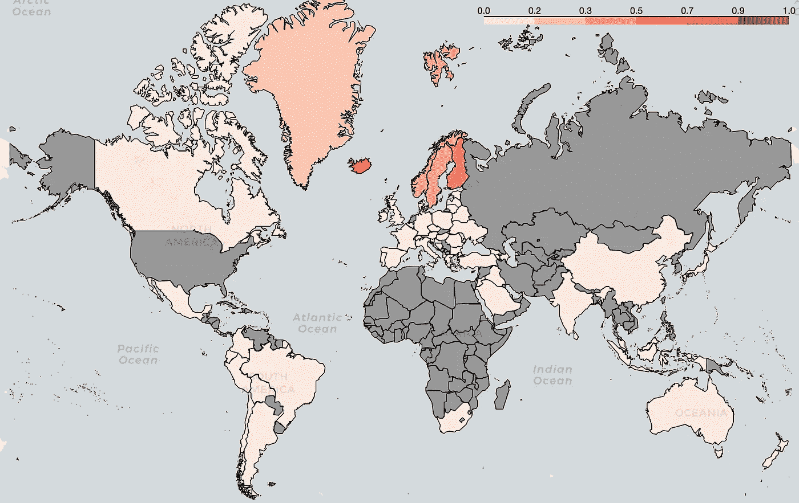

# 你撞头的频率取决于你离北极有多近

> 原文：<https://towardsdatascience.com/how-often-you-bang-your-head-depends-on-how-close-you-are-to-the-north-pole-665980f2e80e?source=collection_archive---------23----------------------->

詹尼弗·拉特珀里萨-安德森在 [Unsplash](https://unsplash.com?utm_source=medium&utm_medium=referral) 上拍摄的照片

## 此外，还有一堂关于 Altair python 可视化的课

> 这是一种古老的技术。这叫权力姿态。你拥有宇宙，所以举起你的岩石酒杯；为摇滚的人干杯。现在微笑点头，让我看看你的眼珠子，好像有什么不对劲。

你听起来熟悉吗？

在一个过去 15 年来小心存放的外置硬盘中，我发现了电影、连续剧、照片、视频和其他随身物品。它有我过去常听的歌曲的 mp3 快速一瞥，我看到了范·海伦，金属乐队，梅加迪思，以及其他艺术家。我打开了其中的几个文件，但大多数都无法播放，或者比特率太低，我甚至无法欣赏它们。这就是时间对你的影响！

说实话，我从来都不是一个狂热的金属追随者，但硬摇滚亚流派正好符合我的兴趣。我原以为我的 [Spotify 的大部分播放列表](/music-psychographics-and-other-interesting-things-38f926aee856)会被《摇滚但男人》占据。我还能错得更离谱吗？我还是会定期听很多经典，还是会点点头。检查完硬盘后，我花了几个小时听老音乐，后来在网上搜索相关数据集，看看摇滚学校发生了什么；很快，我找到了一个，但它是为金属乐队而不是摇滚。

哦好吧！这不是关于敲打头部，而是关于猛烈地摇晃它。

我们走吧！🤘

# 寻找重金属

我在 [Kaggle](https://www.kaggle.com/mrpantherson/metal-by-nation) 上找到了一个数据集，你也可以在这里访问它[。它包含了从这个摇滚子类开始(即 1964 年)的金属乐队的信息。你也可以使用从金属档案里刮来的关于死亡金属的](https://github.com/Prashantmdgl9/Metal/blob/main/corrected_file.csv)[这里](https://www.kaggle.com/zhangjuefei/death-metal)。

在丢弃了复制品和那些没有任何原产国的乐队后，我前进到观想。放心吧！所有那些掉下来的都不流行，因为他们只有很少的粉丝(变量之一)。

没心情用 matplotlib，plotly，bokeh，seaborn，就用 Altair 吧。

# 谁最摇滚？

我知道的许多著名乐队来自美国和英国，但北欧和斯堪的纳维亚也不甘落后。我们来调查一下。

使用 Altair 相当容易；我推荐看杰克·范德普拉斯(Jake VanderPlas)的前 40 分钟视频。

你提到你的数据框架作为“源”,并使用其中的属性来构建你的图。您可以在字段中使用诸如“排序”之类的选项，并且可以获得想要的效果。无需专门更改数据集。

作者图片

不出所料，美国和英国有很多金属乐队，斯堪的纳维亚国家也名列前茅。

但这是清晰的画面吗？美国、英国和德国人口众多，所以也许我们需要找出人均金属乐队的数量。

# 人均摇滚现场

该图表很容易制定，我需要创建一个临时数据框架，将国家的人口作为一个属性，可用于进行更准确的分析。

作者图片

法罗群岛？他们在黑色安息日和金属乐队是不是用药过量了？嗯，他们有 5 个频段，代表 5 万人口，所以每 1 万人就有一个频段，如图所示。此外，法罗岛紧挨着丹麦和瑞典，所以它得到了感应效应。

如果梵蒂冈城只有一个乐队，它会让所有其他国家感到羞愧(梵蒂冈人口约 800 人)。

# 那么，是什么亚类让它们滴答作响呢？

金属世界中最受欢迎的分支是什么？我猜这将是重金属，鞭打，黑色。

作者图片

请注意，我们到目前为止所做的所有图表都是条形图，所以上面的代码只做了微小的改动。

要在笔记本、VSCode 或 Atom 中呈现这些图形，请使用:

我又对了！

黑色、死亡和沉重的统治。黑暗之神一定很高兴。

# 金属正在消亡吗？

每年有多少个金属乐队成立？

作者图片

这些年来，乐队的数量似乎在减少。这是否意味着金属正在消亡？

仅仅因为你没在听它，并不意味着它遇到了它的创造者。找到每年形成和分裂的波段，以找到每年活跃波段的数量，这是公平的。

作者图片

金属是摇滚的一个分支，它比硬摇滚更刺耳，硬摇滚在大众和广播中都有听众。你不会在收音机里听到金属歌曲，你必须自己去寻找。如果你不去尝试，你永远也找不到它，并且会认为它是一种正在消亡的文化。

# 给那些让我们头大的人

每个国家最受欢迎的金属乐队有哪些？

作者图片

这是一个有趣的图表，因为条形标有。你可以选择任何颜色，你只需要指定十六进制代码，并不限于特定库的样式表。通过使用(图表+文本)来查看单个图表中的效果，您可以制定图形的单个元素，并可以像上面一样绑定它们。

# 词源学视角

我最终将我的数据框架与金属档案中的数据合并，因为它很好地包含了乐队的主题信息。一个简单的词云就能说明很多:)

作者图片

哦好吧！你在期待什么？

# 世界观

作者图片

这是一个使用 leav 创建的图表，只是条形图的另一种表示。

裁决是明确的。

> 格陵兰岛、冰岛、瑞典、挪威和芬兰似乎摇摆得很厉害；离北极越近，头撞得越厉害！:)

你可以在我的 [GitHub](https://github.com/Prashantmdgl9/Metal) 上找到创建图表的代码。和往常一样，你可以在 Twitter (@prashantmdgl9)上找到我，或者在 LinkedIn 上大喊一声。我很想知道你会用这些数据创造出什么样的视觉效果。

# 后来添加的东西

摇滚、硬摇滚、金属都经历了时间的考验；那些不认为它们是真正的音乐的人并不喜欢它们，即使是现在，人们也经常拿它们与老派的古典音乐相比较，这是不公平的。但是只要你喜欢，谁会在乎呢！

还有，我不明白为什么一个人要把自己的音乐品味限制在这样或那样的形式上？我可以像喜欢罗伯特·普兰特的音乐一样喜欢卡切里(古典卡纳蒂克音乐家的集会)。

那么为什么要选择呢？

毕竟，这都是音乐，始于大约 45000 年前有人将两块石头撞在一起。