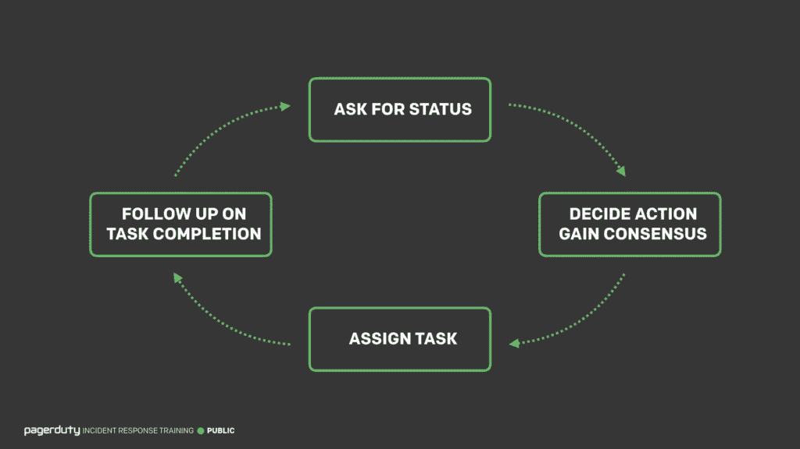
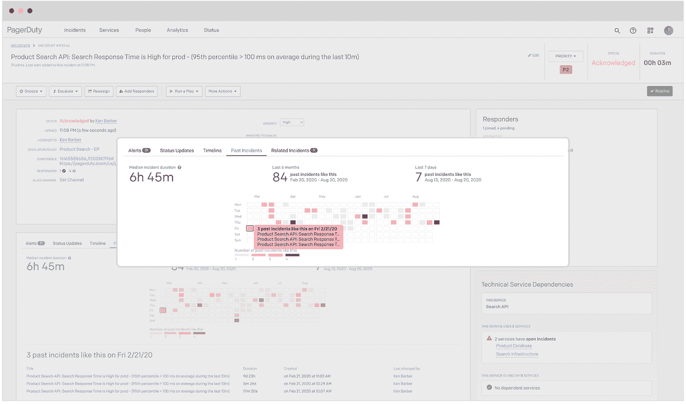
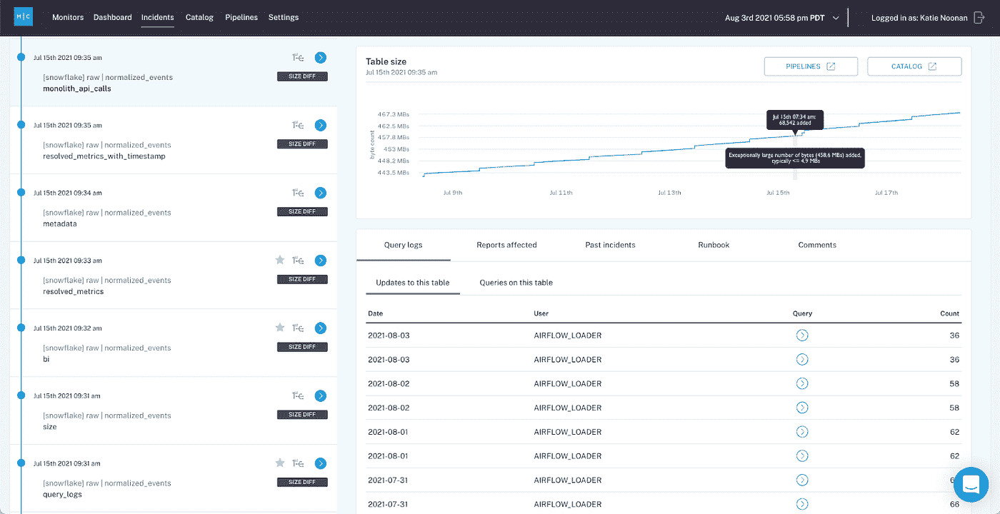

# PagerDuty 如何应用 DevOps 最佳实践来实现更可靠的大规模数据

> 原文：<https://towardsdatascience.com/how-pagerduty-applies-devops-best-practices-to-achieve-more-reliable-data-at-scale-67fa6ba75242?source=collection_archive---------28----------------------->

## 数据可观察性 101

## 以下是这家开创事件管理先河的公司如何防止数据停机

图片由 [Shutterstock](http://www.shutterstock.com) 上的 [Michael V](https://www.shutterstock.com/g/MichaelVi) 提供，可供拥有标准许可的作者使用。

[page duty](https://www.pagerduty.com/)帮助 90 个国家的 16，800 多家企业通过其数字运营管理平台实现正常运行时间 SLA，支持随叫随到管理、事件智能、分析和事件响应。

那么，PagerDuty 是如何在自己的组织内处理特定于数据的事件管理的呢？最近，我与数据平台和分析高级总监 [Manu Raj](https://www.linkedin.com/in/manu-raj-6324bb3) (被恰当地命名为 DataDuty 团队)进行了交谈，以了解他的团队在防止“[数据宕机](https://www.montecarlodata.com/the-rise-of-data-downtime/)”和相关消防演习方面的更多信息。

# PagerDuty 的数据前景

PagerDuty 的业务数据平台团队有一个明确的任务:随时随地为客户提供可信的数据，这些数据易于理解，并能实现高效的决策。

> “其中最关键的部分是数据治理、数据质量、安全性和基础设施运营，”Manu 说。该团队的客户包括“几乎所有的部门，包括财务、行政、客户成功、工程、销售和营销。”

就他们的平台本身而言，DataDuty 团队用的是 page duty——“我们绝对要吃自己的狗粮”——还有数据仓储用的雪花，数据科学用的 Fivetran，Segment，Mulesoft，AWS，Databricks。

该团队最近还将他们的堆栈与 ML 驱动的 [**数据可观察性**](https://www.montecarlodata.com/introducing-the-5-pillars-of-data-observability/) 集成在一起，使他们能够通过监控、跟踪和排除管道每个阶段的数据事件，全面了解数据系统的健康状况。

# 寻呼机工作中的数据挑战

像大多数 SaaS 公司一样，PagerDuty 使用大量 SaaS 云应用程序(想想 Salesforce、Marketo 和 Netsuite ),并吸收大量内部和第三方数据。结构化数据、非结构化数据、不同节奏的数据以及不同粒度的实时批处理数据都是 PagerDuty 整体数据生态系统的一部分。

DataDuty 团队的主要挑战是确保数据质量满足最终用户的期望，使他们能够基于准确的数据做出更快的决策。

Manu 表示:“业务的动态本质是推动数据挑战的原因。“业务数据需求每个季度都在不断变化，必须快速做出准确的决策。一切都是数据驱动的，所以我们必须保持敏捷。”

# 使用 DevOps 最佳实践来扩展数据事件管理

为了完成他们雄心勃勃的任务，DataDuty 团队对其数据管道实施了大量的 [DevOps 事件管理最佳实践](https://www.pagerduty.com/use-cases/devops/engineers/)。

## 最佳实践#1:确保您的事件管理涵盖整个数据生命周期。

图片由 PagerDuty 提供。

在 PagerDuty，数据工程师的事件管理属于他们所谓的数据操作，这是 DevOps 的扩展。它包括对数据和管道问题的跟踪、响应和分类。

一旦数据进入仓库，一直到出现在面向客户的报告中，都有可能出现各种类型的[数据宕机](https://www.montecarlodata.com/the-rise-of-data-downtime/)，从丢失数据到错误模型。DataDuty 团队监控数据质量问题，包括异常、新鲜度、模式更改、指标趋势等。

[**数据可观察性**](https://www.montecarlodata.com/what-is-data-observability/) 对于监控和确保数据仓库中的数据质量尤为重要。您可以通过 ETL 工具进行定制的数据质量检查，在数据管道级别进行干预，但是随着时间的推移，管理逻辑、脚本和数据生态系统的其他元素会变得很麻烦。此外，正如 Manu 指出的，数据趋势的问题无法通过管道质量检查来识别。

## 最佳实践#2:事故管理应包括噪音抑制

图片由 PagerDuty 提供。

在实施数据监控和异常检测时，数据噪音是一个主要问题，在企业范围内，您每天都会收到各种各样的“警报”，其中许多警报表明您的数据发生了变化，但不一定是全新的“问题”数据团队需要能够在客户、企业所有者之间进行分类，并及时响应这些警报，同时对数据产品本身委派明确的所有权。

Manu 的 DataDuty 团队使用 PagerDuty 事件智能来识别类似的数据事件警报，抑制包含多个数据问题的一个事件的多个警报。这样，他的团队成员就不会被警报淹没，可以专注于修复手头数据问题 的 [**根本原因。**](https://www.montecarlodata.com/the-data-engineers-guide-to-root-cause-analysis/)

## 最佳实践#3:对数据资产和事件进行分组，以智能地发送警报

图片由作者提供。

Manu 表示，数据可观察性是任何数据事件管理步骤(包括事件响应和上报)发生之前的第一步。毕竟，与异常趋势或指标相比，“我的数据没有刷新”是一个完全不同的问题。团队需要能够识别这种数据问题随着时间的推移而存在。

当 DataDuty 团队开始在他们自己的数据平台上[集成数据可观察性和 page duty](https://www.montecarlodata.com/delivering-more-reliable-data-pipelines-with-pagerduty-and-monte-carlo/)时，他们遵循了 DataOps 的最佳实践，包括将数据问题分组在一起，以便基于 360 度视图实现更轻松的路由和警报，包括:

1.  **将类似的数据管道问题与数据可观察性组合在一起，并在此工作流之上实施 page duty**，确保这些警报被正确发送给 DataDuty 团队。由于他们使用气流进行调度，团队也通过 PagerDuty 接收气流警报。
2.  **识别公司最关键的数据资产，包括管理层报告和财务报告层面的数据**。现在，与这些资产相关的警报通过带有升级策略的 PagerDuty 发出，并自动发送给其他利益相关者和商业智能团队。
3.  **利用事件警报和可观察性来监控 BI 指标的运行状况**，如客户数量、客户流失率、账户数量和数据事件数量。然后，这些警报被发送给商业智能团队，以便他们能够进行监控并根据需要采取措施。

凭借这些最佳实践，PagerDuty 的平台团队通过从 DevOps 的角度来处理数据事件管理，实现了他们的使命，这与数据可观察性的 [**原则**](/what-is-data-observability-40b337971e3e#:~:text=Introducing%3A%20Data%20Observability&text=Like%20its%20DevOps%20counterpart%2C%20Data,productive%20teams%2C%20and%20happier%20customers.) 完全一致。

作为集成合作伙伴，我们的平台协同工作，帮助企业识别和解决数据事件，使领导者能够快速自信地做出数据驱动的决策。

***好奇一些最优秀的团队是如何开创数据可观测性的？***[***RSVP for IMPACT 2021！***](https://www.montecarlodata.com/request-a-demo/)

