# 百分比近似值的工作原理(以及为什么它比平均值更有用)

> 原文：<https://towardsdatascience.com/how-percentile-approximation-works-and-why-its-more-useful-than-averages-67a5c7490d88?source=collection_archive---------26----------------------->

## [实践教程](https://towardsdatascience.com/tagged/hands-on-tutorials)

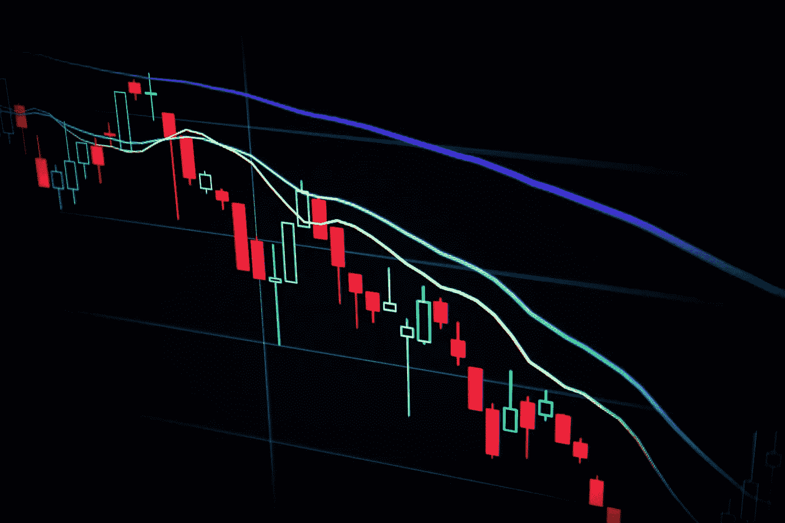

图片由[马克西姆·霍普曼](https://unsplash.com/@nampoh)在 [Unsplash](https://unsplash.com/photos/fiXLQXAhCfk) 上拍摄

*初步了解百分位数近似值，为什么它们对分析大型时间序列数据集有用，以及我们如何创建百分位数近似值超函数来提高计算效率、可并行化，并与连续聚合和其他高级时标 DB 功能一起使用。*

在我最近发表的关于时间加权平均的文章中，我描述了我早期的电化学职业生涯如何让我认识到时间加权平均的重要性，这塑造了我们如何将它们构建成时标超函数。几年前，在我开始学习更多关于 PostgreSQL 内部的知识后不久(查看我的[聚合和两步聚合](https://blog.timescale.com/blog/how-postgresql-aggregation-works-and-how-it-inspired-our-hyperfunctions-design-2/?utm_source=tds&utm_medium=blog&utm_campaign=hyperfunctions-1-0-2021&utm_content=blog-two-step-agg)帖子来亲自了解它们！)，我在一家广告分析公司做后端工作，在那里我开始使用 TimescaleDB。

像大多数公司一样，我们非常关心确保我们的网站和 API 调用在合理的时间内为用户返回结果；我们的分析数据库中有数十亿行数据，但我们仍然希望确保网站响应迅速且有用。

网站性能和商业结果之间有直接的关联:如果用户不得不等待太长时间才能得到结果，他们会感到厌烦，从商业和客户忠诚度的角度来看，这显然是不理想的。为了了解我们网站的表现并找到改进的方法，我们跟踪了 API 调用的时间，并将 API 调用响应时间作为一个关键指标。

监控 API 是一个常见的场景，通常属于应用程序性能监控(APM)的范畴，但是在其他领域也有很多类似的场景，包括:

1.  工业机器的预测性维护
2.  航运公司的船队监控
3.  能源和水使用监控和异常检测

当然，分析原始(通常是时间序列)数据只能帮到你这么多。您希望分析趋势，了解您的系统相对于您和您的用户的期望表现如何，并在问题影响生产用户之前捕捉和修复问题，等等。我们[构建了 TimescaleDB hyperfunctions 来帮助解决这个问题，并简化开发人员处理时序数据的方式](https://blog.timescale.com/blog/introducing-hyperfunctions-new-sql-functions-to-simplify-working-with-time-series-data-in-postgresql/?utm_source=tds&utm_medium=blog&utm_campaign=hyperfunctions-1-0-2021&utm_content=blog-introducing-hyperfunctions)。

作为参考，hyperfunctions 是一系列 SQL 函数，可以用更少的代码行更容易地操作和分析 PostgreSQL 中的时序数据。您可以使用超函数来计算数据的百分比近似值，计算时间加权平均值，缩减采样和平滑数据，并使用近似值执行更快的`COUNT DISTINCT`查询。此外，超函数“易于”使用:您可以使用您熟悉和喜爱的相同 SQL 语法来调用超函数。

我们与社区成员交谈以了解他们的需求，我们的初始版本包括一些最常被请求的功能，包括**百分点近似值**(参见 [GitHub 功能请求和讨论](https://github.com/timescale/timescaledb-toolkit/issues/41))。它们对于处理大型时间序列数据集非常有用，因为它们提供了使用百分位数(而不是平均值或其他计数统计数据)的好处，同时计算速度快、空间效率高、可并行化，并且对于连续聚合和其他高级 TimescaleDB 功能非常有用。

# 我从七年级数学中忘记的事情:百分位数与平均值

我可能在七年级的数学课上学到了平均值、中间值和众数，但是如果你和我一样，它们可能会周期性地迷失在“我曾经学过并认为我知道的东西，但实际上，我并不像我想象的那样记得很清楚。”

在我研究这篇文章的时候，我发现了一些很好的博客帖子(参见来自 [Dynatrace](https://www.dynatrace.com/news/blog/why-averages-suck-and-percentiles-are-great/) 、 [Elastic](https://www.elastic.co/blog/averages-can-dangerous-use-percentile) 、 [AppSignal](https://blog.appsignal.com/2018/12/04/dont-be-mean-statistical-means-and-percentiles-101.html) 和 [Optimizely](https://www.optimizely.com/insights/blog/why-cdn-balancing/) 的人们的例子)，关于平均值对于理解应用程序性能或其他类似的事情来说并不太好，以及为什么使用百分位数更好。

我不会在这上面花太多时间，但我认为提供一点背景知识是很重要的，这是关于*为什么*和*百分位数如何帮助我们更好地理解我们的数据。*

首先，让我们考虑百分位数和平均值是如何定义的。为了理解这一点，我们先来看一个 [**正态分布**](https://en.wikipedia.org/wiki/Normal_distribution) **:**

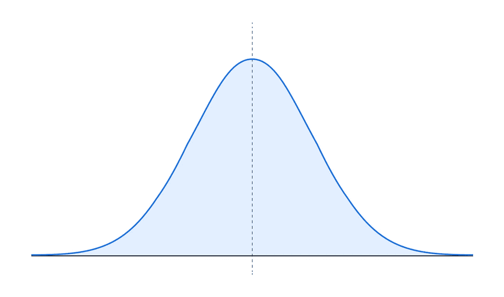

正态分布(或称高斯分布)描述了落在给定值附近的许多真实世界的过程，其中找到远离中心的值的概率降低。对于正态分布，中值、平均值和众数都是相同的，它们落在中心的虚线上。作者图片

正态分布是我们在思考统计时经常想到的；这是入门课程中最常用的方法之一。在正态分布中，中值、平均值(也称为均值)和众数都是相同的，尽管它们的定义不同。

**中值**是中间值，一半数据在上面，一半在下面。**均值**(又名平均值)定义为总和(值)/计数(值)，而**模式**定义为最常见或最频繁出现的值。

当我们看到这样的曲线时，x 轴代表值，而 y 轴代表我们看到给定值的频率(即，y 轴上“较高”的值出现的频率更高)。

在正态分布中，我们看到一条以最频繁值为中心的曲线(虚线)，随着距离最频繁值越远，看到值的概率越小(最频繁值是众数)。请注意，正态分布是对称的，这意味着中心左侧和右侧的值出现的概率相同。

中位数或中间值也称为第 50 个百分位数(100 个百分位数中的中间百分位数)。这是 50%的数据小于该值，50%大于该值(或等于该值)时的值。

在下图中，一半的数据在左边(蓝色阴影)，另一半在右边(黄色阴影)，第 50 个百分位直接在中间。

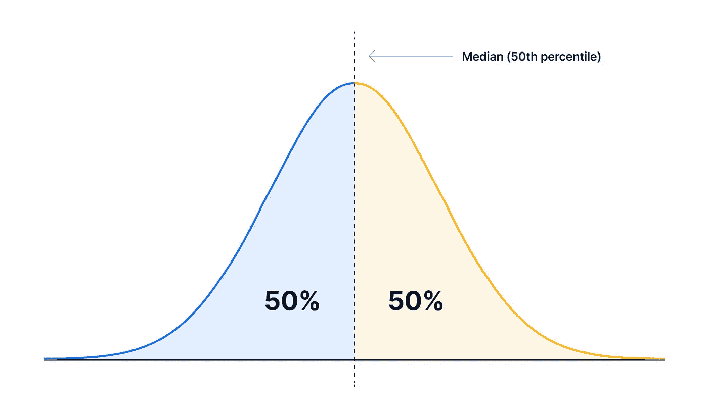

描述了中位数/第 50 百分位的正态分布。作者图片

这就引出了百分位数:百分位数被定义为 x %的数据低于该值的值。

例如，如果我们称之为“第 10 个百分位数”，我们的意思是 10%的数据小于该值，90%的数据大于(或等于)该值。

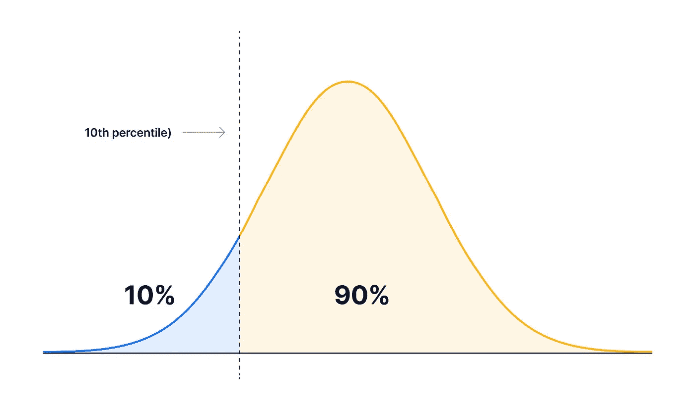

描述了第 10 百分位的正态分布。作者图片

第 90 个百分位数是 90%的数据小于数值，10%大于数值:

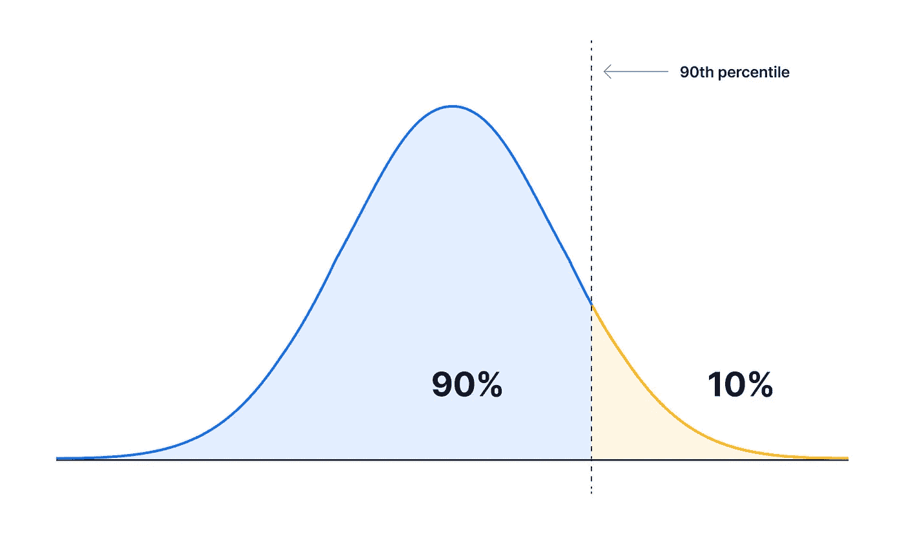

描绘了具有第 90 百分位的正态分布。作者图片

为了计算第 10 个百分位数，假设我们有 10，000 个值。我们取所有的值，从最小到最大排序，并确定第 1001 个值(其中 1000 或 10%的值低于它)，这将是我们的第 10 个百分位数。

我们之前注意到，在正态分布中，中位数和平均数是相同的。这是因为正态分布是*对称的*。因此，值大于中值的点的大小和数量是完全平衡的(在大小和小于中值的点的数量上)。

换句话说，在中间值的两边总是有相同数量的点，但是*平均值*考虑了点的实际值。

为了使中值和平均值相等，小于中值的点和大于中值的点必须具有相同的分布(即，必须有相同数量的点稍微大一些、稍微小一些、大得多和小得多)。(**更正:**正如在[黑客新闻](https://news.ycombinator.com/item?id=28527954)中向我们指出的那样，从技术上来说，这仅适用于对称分布，不对称分布可能适用，也可能不适用，你可能会遇到不对称分布相等的奇怪情况，尽管可能性较小！)

**为什么这很重要？**正态分布中中位数和平均数相同的事实会造成一些混淆。因为正态分布通常是我们首先学习的东西之一，所以我们(包括我自己！)可以认为它适用于比实际更多的情况。

人们很容易忘记或没有意识到，只有*中值*保证 50%的值会在上面，50%在下面——而平均值保证 50%的**加权**值会在上面，50%在下面(即，平均值是[质心](https://en.wikipedia.org/wiki/Centroid)，而中值是中心)。

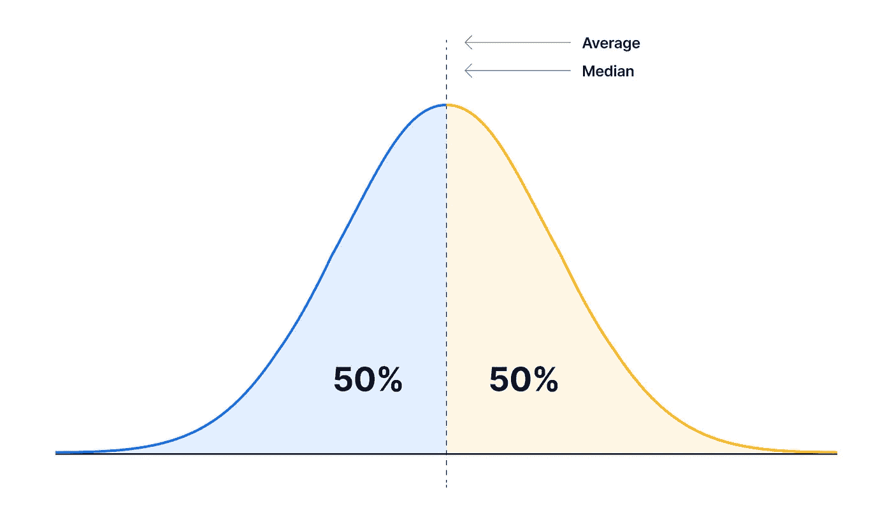

在正态分布中，平均值和中值是相同的，它们将图形精确地分成两半。但是它们的计算方式不同，表示的内容也不同，在其他分布中也不一定相同。作者图片

🙏向在 [Desmos](https://www.desmos.com/) 的人们大声欢呼，感谢他们伟大的图形计算器，它帮助制作了这些图形，甚至允许我制作这些概念的[互动演示](https://www.desmos.com/calculator/ty3jt8ftgs)！

但是，为了脱离理论，让我们考虑一些现实世界中更常见的东西，比如我在广告分析公司工作时遇到的 API 响应时间场景。

# 长尾、异常值和真实效应:为什么百分位数比平均值更好地理解你的数据

我们看了平均值和百分位数的不同之处，现在，我们将使用一个真实的场景来演示使用平均值而不是百分位数是如何导致错误警报或错失机会的。

为什么？平均值并不总是给你足够的信息来区分真实的影响和异常值或噪音，而百分位数可以做得更好。

简而言之，使用平均值会对数值的报告方式产生巨大的(和负面的)影响，而百分位数可以帮助你更接近“真相”

如果您在查看类似 API 响应时间的东西，您可能会看到一个类似于下面这样的频率分布曲线:

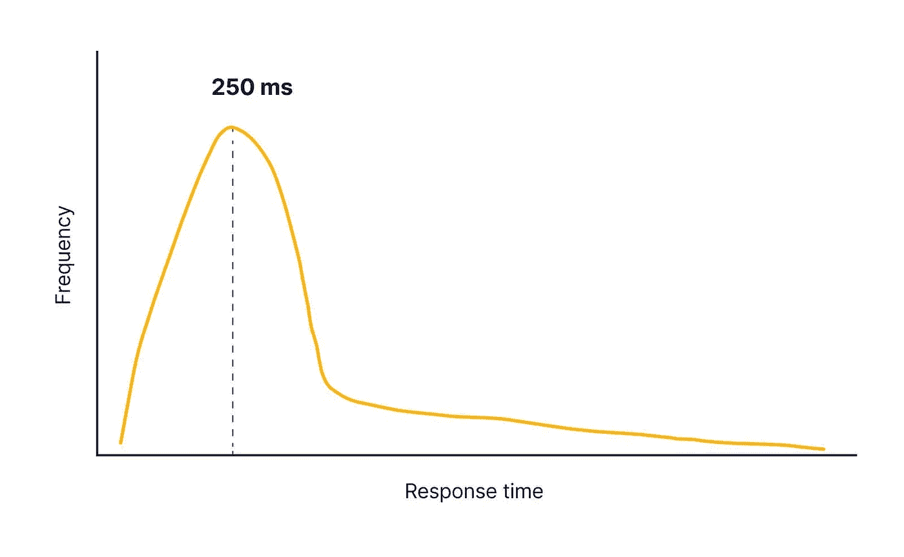

API 响应时间的频率分布，峰值为 250 毫秒(所有图表未按比例绘制，仅用于演示目的)。作者图片

我以前在广告分析公司工作时，我们的目标是让大多数 API 响应调用在半秒内完成，很多比这短得多。当我们监控我们的 API 响应时间时，我们试图理解的最重要的事情之一是用户如何受到代码变化的影响。

我们的大多数 API 调用在半秒钟内完成，但是有些人使用系统在很长的时间内获得数据，或者有奇怪的配置，这意味着他们的仪表板响应速度有点慢(尽管我们试图确保这些情况很少发生！).

由此产生的曲线类型被描述为**长尾分布**，其中我们在 250 ms 处有一个相对较大的峰值，我们的许多值都在该峰值之下，然后响应时间以指数方式减少。

我们之前讨论过如何在对称曲线中(像正态分布)，但是长尾分布是一个**不对称**曲线。

这意味着最大值比中间值大得多，而最小值与中间值相差不远。(在 API 监控的情况下，您永远也不会有响应时间少于 0 秒的 API 调用，但是它们可以花费的时间是没有限制的，所以您会得到较长 API 调用的长尾效应)。

因此，长尾分布的平均值和中值开始偏离:

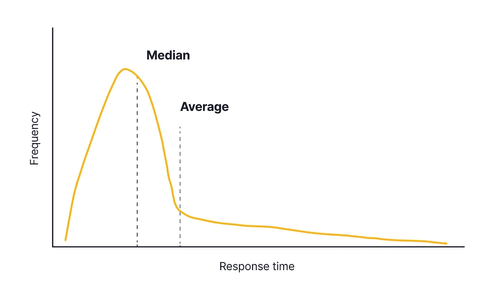

标有中值和平均值的 API 响应时间频率曲线。图表未按比例绘制，仅用于演示目的。作者图片

在这种情况下，平均值明显大于中值，因为长尾理论中有足够多的“大”值使平均值更大。相反，在其他一些情况下，平均值可能小于中值。

但是在广告分析公司，我们发现平均值没有给我们足够的信息来区分我们的 API 如何响应软件变化的重要变化和只影响少数人的噪音/异常值。

在一个案例中，我们对有新查询的代码进行了修改。该查询在暂存中运行良好，但是在生产系统中有更多的数据。

一旦数据“热了”(在内存中)，它就会运行得很快，但第一次运行时非常慢。当查询投入生产时，大约 10%的调用的响应时间超过了一秒。

在我们的频率曲线中，大约 10%的呼叫的响应时间超过 1 秒(但不到 10 秒),导致我们的频率曲线出现第二个较小的峰，如下所示:

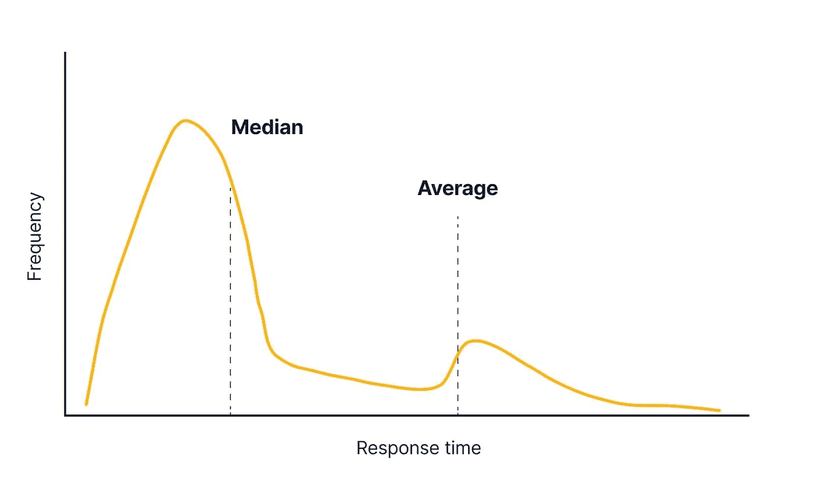

频率曲线显示了当 10%的呼叫花费 1 到 10 秒之间的适度时间时发生的偏移和额外峰(图表仍未按比例绘制)。作者图片

在这种情况下，平均值变化很大，而中位数略有变化，但影响较小。

您可能认为这使得平均值比中值更好，因为它帮助我们识别问题(太长的 API 响应时间)，并且我们可以设置我们的警报，以便在平均值变化时发出通知。

让我们想象一下，我们已经做到了这一点，当平均值超过 1 秒时，人们就会采取行动。

但是现在，我们有一些用户开始从我们的用户界面请求 15 年的数据…这些 API 调用需要*很长时间*。这是因为 API 并不是真正为处理这种“标签外”使用而构建的。

这些用户打来的几个电话就轻松地让平均时间超过了我们的 1s 阈值。

为什么？平均值(作为一个值)可能会受到像这样的异常值的显著影响，即使它们只影响一小部分用户。平均值使用数据的总和，因此异常值的大小会产生巨大的影响，而中位数和其他百分位数则基于数据的排序。

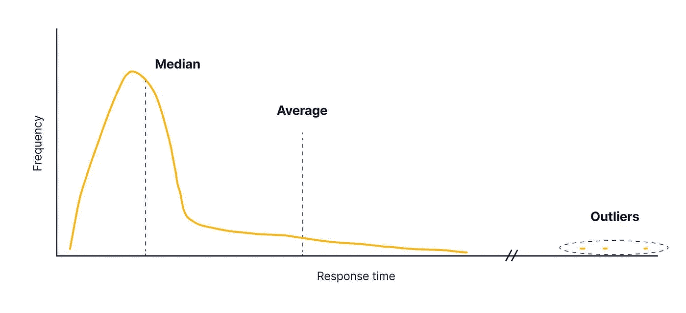

我们的曲线有一些异常值，其中不到 1%的 API 调用响应超过 100 秒(响应时间有一个断点，表示异常值会偏右，否则，该图仍未按比例绘制)。作者图片

关键是，平均值并没有给我们一个区分异常值和真实影响的好方法，当我们有长尾或非对称分布时，它会给出奇怪的结果。

为什么理解这一点很重要？

好吧，在第一个案例中，我们有一个问题影响了 10%的 API 调用，这可能是 10%或更多的用户(它怎么可能影响超过 10%的用户呢？嗯，如果一个用户平均进行 10 次调用，10%的 API 调用受到影响，那么，平均来说，所有用户都会受到影响…或者至少大部分用户会受到影响。

我们希望对这种影响大量用户的紧急问题做出快速响应。我们建立了警报，甚至可能让我们的工程师在半夜起床和/或回复一个更改。

但是在第二种情况下,“标签外”用户行为或小错误对一些 API 调用有很大影响，这种情况要好得多。因为受这些异常值影响的用户相对较少，所以我们不想让我们的工程师在半夜起床或者恢复一个更改。(识别和理解离群值仍然很重要，无论是对于理解用户需求还是代码中的潜在错误，但是它们通常*不是紧急事件*。

除了使用平均值，我们可以使用多个百分点来理解这种类型的行为。请记住，与平均值不同，百分位数依赖于数据的*排序*，而不是受数据的*大小*的影响。如果我们使用第 90 百分位，我们*知道*10%的用户的值(在我们的例子中是 API 响应时间)大于它。

让我们看看原始图表中的第 90 个百分位数；它很好地捕捉了一些长尾行为:

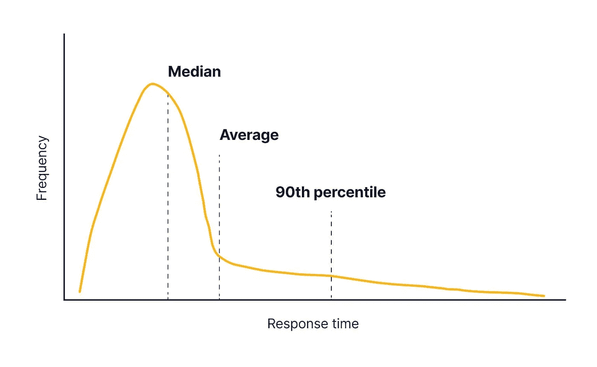

我们最初的 API 响应时间图显示了第 90 个百分点、中间值和平均值。图未按比例绘制。作者图片

当我们有一些由运行超长查询的少数用户或影响一小组查询的 bug 引起的异常值时，平均值会发生变化，但第 90 个百分点几乎不受影响。

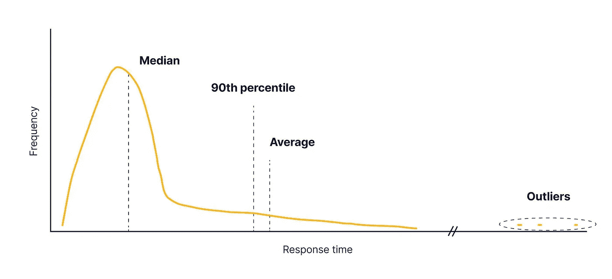

异常值影响平均值，但不影响第 90 百分位或中位数。(图未按比例绘制。)作者图片

但是，当尾部由于影响 10%用户的问题而增加时，我们看到第 90 个百分位非常显著地向外移动——这使得我们的团队能够得到通知并做出适当的响应:

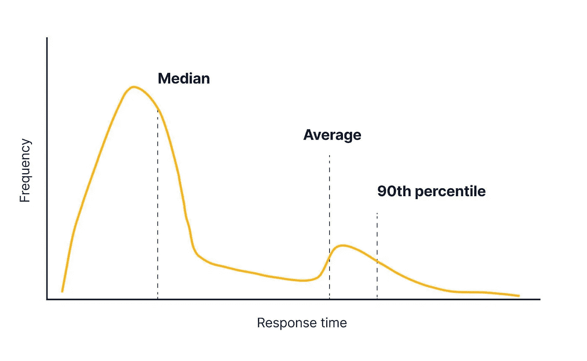

但是，当有“真正的”影响超过 10%用户的响应时，第 90 个百分位会发生显著变化(图未按比例绘制。)图片由作者提供。

这(希望)让您更好地了解百分位数如何以及为什么可以帮助您识别大量用户受到影响的情况——但不会给您带来误报的负担，误报可能会唤醒工程师并让他们感到疲劳！

那么，现在我们知道了为什么我们可能想要使用百分位数而不是平均值，让我们来谈谈我们是如何计算它们的。

# PostgreSQL 中百分点的工作原理

为了计算任何一种精确的百分位数，你取*所有*你的值，对它们进行排序，然后根据你试图计算的百分位数找到第 *n* 个值。

为了了解这在 PostgreSQL 中是如何工作的，我们将展示我们广告分析公司的 API 跟踪的一个简化案例。

我们将从这样一个表格开始:

```
CREATE TABLE responses(
	ts timestamptz, 
	response_time DOUBLE PRECISION);
```

在 PostgreSQL 中，我们可以使用`[percentile_disc](https://www.postgresql.org/docs/current/functions-aggregate.html#FUNCTIONS-ORDEREDSET-TABLE)` [聚合](https://www.postgresql.org/docs/current/functions-aggregate.html#FUNCTIONS-ORDEREDSET-TABLE)来计算列`response_time`的百分比:

```
SELECT 
	percentile_disc(0.5) WITHIN GROUP (ORDER BY response_time) as median
FROM responses;
```

这看起来和普通的聚合不一样；`WITHIN GROUP (ORDER BY ...)`是一种不同的语法，它作用于称为[有序集聚合](https://www.postgresql.org/docs/13/xaggr.html#XAGGR-ORDERED-SET-AGGREGATES)的特殊聚合。

在这里，我们将我们想要的百分位数(0.5 或中位数的第 50 个百分位数)传递给`percentile_disc`函数，我们要评估的列(`response_time`)放在 order by 子句中。

当我们了解了引擎盖下发生的事情后，就会更清楚为什么会发生这种情况。百分位数保证 x %的数据将低于它们返回的值。为了计算这个值，我们需要对一个列表中的所有数据进行排序，然后挑选出 50%的数据低于这个值，50%的数据高于这个值。

对于那些读过我们上一篇文章中关于 PostgreSQL 聚合如何工作的部分的人来说，我们讨论了像 T5 这样的聚合是如何工作的。

当它扫描每一行时，转换函数更新一些内部状态(对于`avg`，它是`sum`和`count`，然后一个最终函数处理内部状态以产生一个结果(对于`avg`，将`sum`除以`count`)。

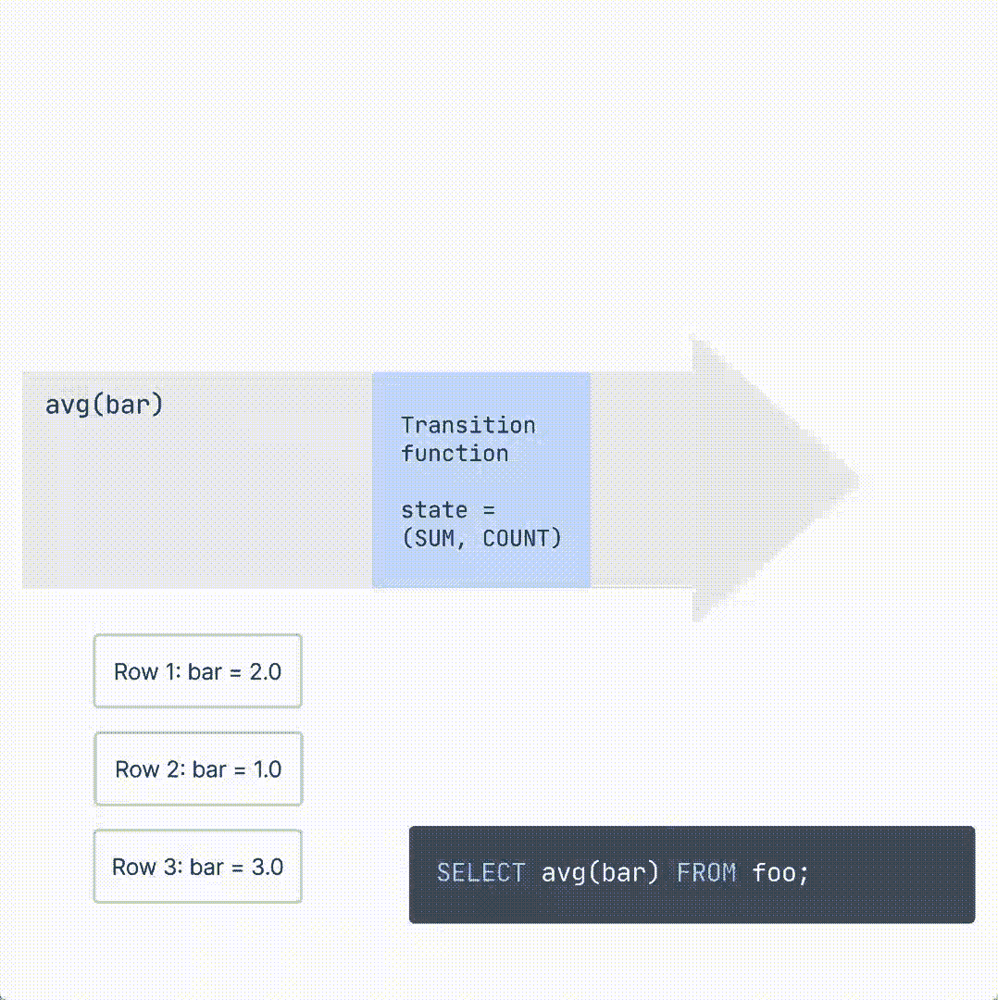

一个 GIF 展示了如何在 PostgreSQL 中计算 avg，其中 sum 和 count 是处理行时的部分状态，而 final 函数在我们完成后将它们相除。作者 GIF。

有序集合聚合，如`percentile_disc`，工作方式有些类似，但有一点例外:状态不是一个相对较小的固定大小的数据结构(如`sum`和`count`代表`avg`，它必须保留所有已处理的值，以便对它们进行排序并在以后计算百分位数。

通常，PostgreSQL 通过将值放入一个名为`[tuplestore](https://github.com/postgres/postgres/blob/c30f54ad732ca5c8762bb68bbe0f51de9137dd72/src/backend/utils/sort/tuplestore.c)`的数据结构中来实现这一点，该数据结构很容易存储和排序值。

然后，当调用最后一个函数时，`tuplestore`将首先对数据进行排序。然后，根据输入到`percentile_disc`中的值，它将遍历排序数据中的正确点(中值数据的 0.5 倍)并输出结果。

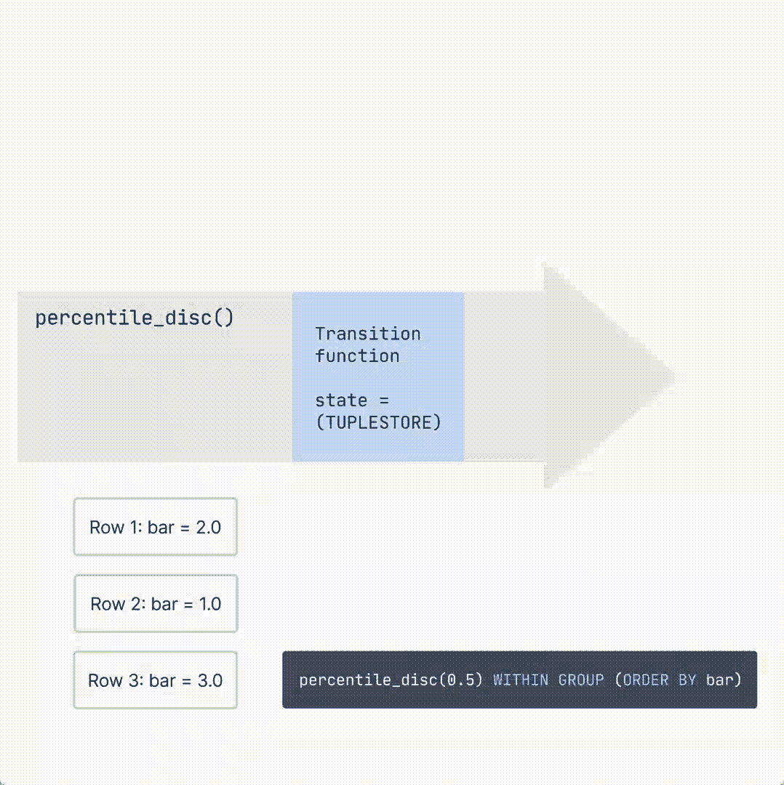

使用“percentile_disc”有序集合聚合，PostgreSQL 必须将它看到的每个值存储在一个“tuplestore”中，然后当它处理完所有行时，对它们进行排序，然后转到排序列表中的正确位置提取我们需要的百分位数。

许多人发现，近似百分位数计算可以提供“足够接近”的近似值，而不需要在非常大的数据集上执行这些昂贵的计算**…这就是我们引入百分位数近似超函数的原因。**

# 百分位数近似值:它是什么以及为什么我们在时标超函数中使用它

根据我的经验，人们经常使用平均值和其他汇总统计数据，而不是百分位数，因为它们在大型数据集上的计算在计算资源和时间上都明显“便宜”。

正如我们上面提到的，在 PostgreSQL 中计算平均值有一个简单的二值聚合状态。即使我们计算一些额外的相关函数，如标准差，我们仍然只需要少量固定的值来计算函数。

相反，为了计算百分比，我们需要一个排序列表中的所有输入值。

这导致了一些问题:

1.  **内存占用**:算法必须将这些值保存在某个地方，这意味着将值保存在内存中，直到它们需要将一些数据写入磁盘，以避免使用过多的内存(这就是所谓的“溢出到磁盘”)。这会产生很大的内存负担和/或大大降低操作速度，因为磁盘访问比内存慢几个数量级。
2.  **并行化带来的有限好处**:即使算法可以并行排序列表，并行化带来的好处也是有限的，因为它仍然需要将所有排序列表合并成一个单独的排序列表，以便计算百分位数。
3.  **高网络成本:**在分布式系统中(比如 TimescaleDB 多节点)，所有的值都必须通过网络传递到一个节点，才能做成一个单一的排序列表，速度慢，成本高。
4.  **没有真正的部分状态**:部分状态的具体化(例如，对于连续的聚集)是没有用的，因为部分状态仅仅是它下面的所有值。这可以节省列表排序的时间，但是存储负担会很高，回报会很低。
5.  **无流式算法**:对于流式数据，这是完全不可行的。您仍然需要维护完整的值列表(类似于上面的部分状态具体化问题)，这意味着算法本质上需要存储整个流！

当您处理相对较小的数据集时，所有这些都是可以管理的，而对于大容量、时序工作负载，它们开始变得更成问题。

但是，如果您想要 ***精确的*** 百分位，您只需要完整的值列表来计算百分位。**对于相对较大的数据集，您通常可以接受一些准确性折衷，以避免遇到这些问题。**

上述问题，以及对权衡是使用平均值还是百分位数的权衡的认识，导致了多种算法的发展，以[在大容量系统中近似百分位数。](https://en.wikipedia.org/wiki/Quantile#Approximate_quantiles_from_a_stream)大多数百分位数近似方法涉及某种修改的[直方图](https://en.wikipedia.org/wiki/Histogram)以更紧凑地表示数据的整体形状，同时仍然捕捉分布的大部分形状。

在设计超功能时，我们考虑了如何获得百分位数的好处(例如，对异常值的稳健性，与现实世界影响的更好对应性)，同时避免计算精确百分位数带来的一些缺陷(如上)。

百分位数近似值似乎非常适合处理大型时间序列数据集。

结果是一整个家族的[百分位近似超函数](https://docs.timescale.com/api/latest/hyperfunctions/percentile-approximation/)，内置于时标 DB 中。调用它们最简单的方法是使用`[percentile_agg](https://docs.timescale.com/api/latest/hyperfunctions/percentile-approximation/percentile_agg/)` [集合](https://docs.timescale.com/api/latest/hyperfunctions/percentile-approximation/percentile_agg/)和 [](https://docs.timescale.com/api/latest/hyperfunctions/percentile-approximation/approx_percentile/) `[approx_percentile](https://docs.timescale.com/api/latest/hyperfunctions/percentile-approximation/approx_percentile/)` [访问器](https://docs.timescale.com/api/latest/hyperfunctions/percentile-approximation/approx_percentile/)。

此查询计算大约第 10、50 和 90 个百分点:

```
SELECT 
    approx_percentile(0.1, percentile_agg(response_time)) as p10, 
    approx_percentile(0.5, percentile_agg(response_time)) as p50, 
    approx_percentile(0.9, percentile_agg(response_time)) as p90 
FROM responses;
```

(如果您想了解更多关于聚合、访问器和两步聚合设计模式的信息，请查看我们的 PostgreSQL 两步聚合入门书。)

与正常的 PostgreSQL 精确百分位数相比，这些百分位数近似值有许多好处，尤其是在用于大型数据集时。

# 内存占用

当计算大型数据集的百分位数时，我们的百分位数近似值限制了内存占用(或者需要溢出到磁盘，如上所述)。

标准百分位数会产生内存压力，因为它们会在内存中建立尽可能多的数据集…然后在被迫溢出到磁盘时会变慢。

相反，超函数的百分位数近似值基于其修改后的直方图中的存储桶数量具有固定的大小表示，因此它们限制了计算它们所需的内存量。

# 单节点和多节点时标并行化 b

我们所有的百分位数近似算法都是可并行化的，因此它们可以在单个节点中使用多个工人来计算；这可以提供显著的加速，因为像`percentile_disc`这样的有序集合聚合在 PostgreSQL 中是不可并行化的。

并行性为单节点时标数据库设置提供了加速——这在[多节点时标数据库设置](https://blog.timescale.com/blog/timescaledb-2-0-a-multi-node-petabyte-scale-completely-free-relational-database-for-time-series/#timescaledb-20-multi-node-petabyte-scale-and-completely-free)中更加明显。

为什么？要使用`percentile_disc`有序集聚合计算多节点 TimescaleDB 中的百分比(不使用近似超函数的标准方法)，必须将每个值从数据节点发送回访问节点，对数据进行排序，然后提供输出。

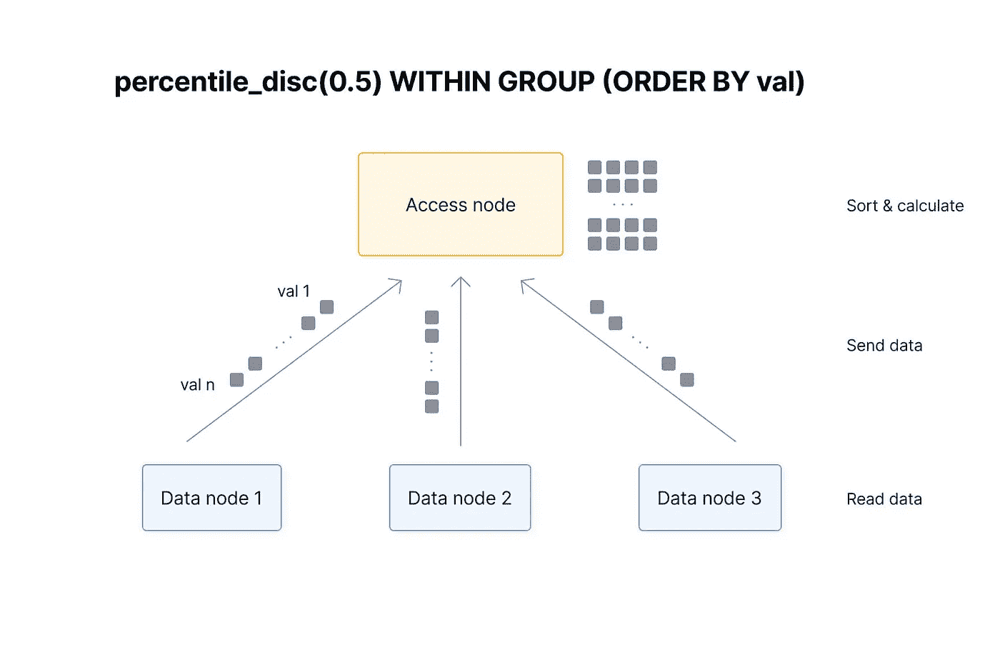

在 TimescaleDB 多节点中计算精确的百分比时，每个数据节点必须将所有数据发送回访问节点。接入节点然后排序并计算百分位数。图片作者。

“标准”方式的成本非常非常高，因为*所有的*数据都需要通过网络从每个数据节点发送到接入节点，这又慢又贵。

即使在访问节点获得数据之后，它仍然需要在将结果返回给用户之前对所有数据进行排序和计算百分比。(注意:有可能每个数据节点可以单独排序，而访问节点只执行合并排序。但是，这不会否定通过网络发送所有数据的需要，这是最昂贵的步骤。)

通过近似百分位超函数，更多的工作可以[下推到数据节点](https://blog.timescale.com/blog/achieving-optimal-query-performance-with-a-distributed-time-series-database-on-postgresql/#pushing-down-work-to-data-nodes)。可以在每个数据节点上计算部分近似百分位数，并通过网络返回固定大小的数据结构。

一旦每个数据节点计算了它的部分数据结构，访问节点就组合这些结构，计算近似百分位数，并将结果返回给用户。

这意味着可以在数据节点上完成更多的工作，最重要的是，通过网络传输的数据要少得多。对于大型数据集，这可以大大减少在这些计算上花费的时间。

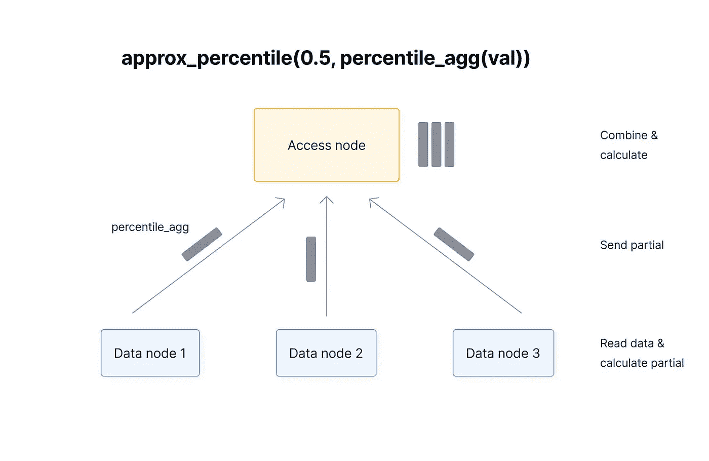

使用我们的百分位数近似超函数，数据节点不再需要将所有数据发送回接入节点。取而代之的是，它们计算一个部分近似值，并将其发送回接入节点，然后接入节点将部分近似值合并，并产生一个结果。这节省了大量网络调用时间，因为它在数据节点上并行执行计算，而不是在访问节点上执行大量工作。图片作者。

# 连续集合体的物化

TimescaleDB 包括一个名为[连续聚合](https://docs.timescale.com/timescaledb/latest/how-to-guides/continuous-aggregates/)的特性，旨在使大型数据集上的查询运行得更快。

TimescaleDB continuous 聚合在后台连续并增量地存储聚合查询的结果，因此当您运行该查询时，只需要计算已更改的数据，而不是整个数据集。

不幸的是，使用`percentile_disc`的精确百分位数不能存储在连续的聚合中，因为它们不能分解成部分形式，而是需要在聚合中存储整个数据集。

我们设计的百分位数近似算法可用于连续聚合。它们具有固定大小的部分表示，可以在连续聚合中存储和重新聚合。

与精确百分位数相比，这是一个巨大的优势，因为现在您可以在更长的时间内进行基线和警报等操作，而不必每次都从头开始重新计算。

让我们回到 API 响应时间的例子，假设我们想要识别最近的异常值来调查潜在的问题。

一种方法是查看前一小时高于 99%的所有数据。

提醒一下，我们有一张表:

```
CREATE TABLE responses(
	ts timestamptz, 
	response_time DOUBLE PRECISION);
SELECT create_hypertable('responses', 'ts'); -- make it a hypertable so we can make continuous aggs
```

首先，我们将创建一个一小时的聚合:

```
CREATE MATERIALIZED VIEW responses_1h_agg
WITH (timescaledb.continuous)
AS SELECT 
    time_bucket('1 hour'::interval, ts) as bucket,
    percentile_agg(response_time)
FROM responses
GROUP BY time_bucket('1 hour'::interval, ts);
```

注意，我们不在连续聚合中执行访问器函数；我们只是执行聚合功能。

现在，我们可以找到最近 30 秒内大于第 99 百分位的数据，如下所示:

```
SELECT * FROM responses 
WHERE ts >= now()-'30s'::interval
AND response_time > (
	SELECT approx_percentile(0.99, percentile_agg)
	FROM responses_1h_agg
	WHERE bucket = time_bucket('1 hour'::interval, now()-'1 hour'::interval)
);
```

在广告分析公司，我们有很多用户，所以我们每小时会有成千上万的 API 调用。

默认情况下，我们的表示中有 200 个桶，因此通过使用连续聚合，我们可以大大减少存储和处理的数据量。这意味着它将大大加快响应时间。如果没有足够多的数据，您会希望增加存储桶的大小或降低近似的保真度，以大幅减少我们必须处理的数据。

我们提到，我们只在连续聚合视图定义中执行了聚合步骤；我们没有在视图中直接使用我们的`approx_percentile`访问函数。我们这样做是因为我们希望能够使用其他访问器函数和/或`[rollup](https://docs.timescale.com/api/latest/hyperfunctions/percentile-approximation/rollup-percentile/)` [函数](https://docs.timescale.com/api/latest/hyperfunctions/percentile-approximation/rollup-percentile/)，您可能还记得这是我们选择两步聚合方法的主要[原因之一。](https://blog.timescale.com/blog/how-postgresql-aggregation-works-and-how-it-inspired-our-hyperfunctions-design-2/#why-we-use-the-two-step-aggregate-design-pattern)

让我们来看看这是如何工作的，我们可以创建一个每日汇总，并得到第 99 个百分位数，如下所示:

```
SELECT 
	time_bucket('1 day', bucket),
	approx_percentile(0.99, rollup(percentile_agg)) as p_99_daily
FROM responses_1h_agg
GROUP BY 1;
```

我们甚至可以使用`[approx_percentile_rank](https://docs.timescale.com/api/latest/hyperfunctions/percentile-approximation/approx_percentile_rank/)`访问函数，它会告诉您一个值将落入哪个百分点。

百分位数排名是百分位数函数的倒数；换句话说，如果你问，第 n 百分位的值是多少？答案是一个值。

对于百分位等级，您会问这个值会在哪个百分位？答案是百分位数。

因此，使用`approx_percentile_rank`可以让我们看到最近 5 分钟到达的值与前一天的值相比排名如何:

```
WITH last_day as (SELECT   time_bucket('1 day', bucket),      
        rollup(percentile_agg) as pct_daily 
    FROM foo_1h_agg 
    WHERE bucket >= time_bucket('1 day', now()-'1 day'::interval) 
    GROUP BY 1)  
SELECT approx_percentile_rank(response_time, pct_daily) as pct_rank_in_day 
FROM responses, last_day 
WHERE foo.ts >= now()-'5 minutes'::interval;
```

这是连续聚合有价值的另一种方式。

我们在一天内执行了一次`rollup`,它只是结合了 24 个部分状态，而不是对 24 小时的数据和数百万个数据点执行完整的计算。

然后，我们使用`rollup`来查看它如何影响最后几分钟的数据，让我们了解最后几分钟与过去 24 小时相比的情况。这些只是一些例子，说明百分位数近似超函数如何给我们一些漂亮的结果，让我们相对简单地进行复杂的分析。

# 百分位数逼近深度探讨:逼近方法，它们如何工作，以及如何选择

你们中的一些人可能想知道 TimescaleDB hyperfunctions 的底层算法是如何工作的，所以让我们开始吧！(对于那些不想进入杂草中的人，可以跳过这一点。)

## 近似方法及其工作原理

我们实现了两种不同的百分位数近似算法作为时标 DB 超函数: [UDDSketch](https://arxiv.org/pdf/2004.08604.pdf) 和 [T-Digest](https://github.com/tdunning/t-digest) 。每一个在不同的场景中都是有用的，但是首先，让我们了解它们是如何工作的一些基础知识。

两者都使用修正的直方图来近似分布的形状。直方图将附近的值分成一组，并跟踪它们的频率。

您经常会看到这样绘制的直方图:


直方图表示与上面的响应时间频率曲线相同的数据，您可以看到图形的形状与频率曲线是如何相似的。不按比例。图片作者。

如果您将它与我们上面展示的频率曲线进行比较，您可以看到它如何提供 API 响应时间与频率响应的合理近似值。从本质上来说，直方图有一系列的存储桶边界和落入每个存储桶的值的数量。

要计算大约百分位数，比如说第 20 个百分位数，首先要考虑代表它的总数据的分数。对于我们的第 20 百分位，这将是 0.2 * `total_points`。

一旦有了这个值，就可以从左到右对每个桶中的频率进行求和，找出哪个桶的值最接近 0.2 * `total_points`。

当存储桶跨越感兴趣的百分比时，您甚至可以在存储桶之间进行插值，以获得更精确的近似值。

当您想到直方图时，您可能会想到类似上面的直方图，其中所有的桶都是相同的宽度。

但是选择存储桶宽度，特别是对于变化很大的数据，会变得非常困难，或者会导致存储大量额外的数据。

在我们的 API 响应时间示例中，我们可以拥有从几十毫秒到十秒或数百秒的数据。

这意味着第 1 百分位的良好近似(例如 2 毫秒)的正确桶大小将比第 99 百分位的良好近似所需的小得多。

这就是为什么大多数百分点近似算法使用带有*可变桶宽*的修正直方图。

例如，UDDSketch 算法使用对数大小的桶，可能如下所示:

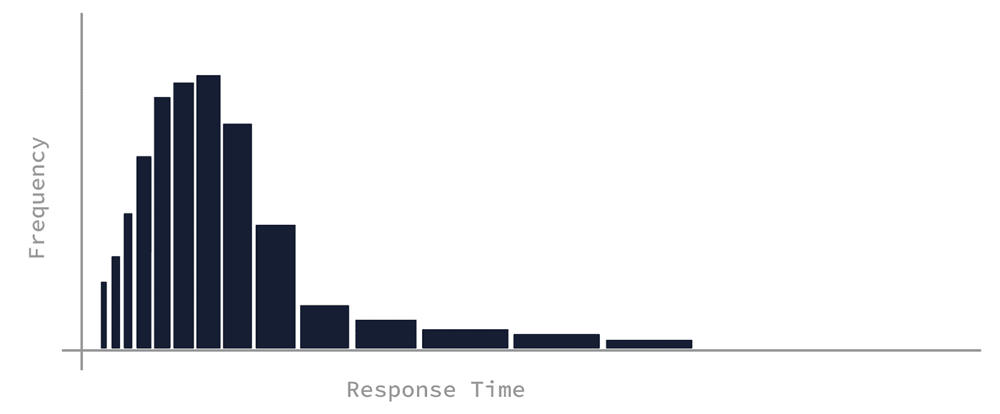

修改后的直方图显示了像 UDDSketch 算法使用的对数存储桶仍然可以表示数据。(注意:我们需要修改图来绘制频率/桶宽，以便比例保持相似；然而，这仅用于演示目的，并未按比例绘制)。图片作者。

UDDSketch 的设计者使用了这样的对数桶大小，因为他们关心的是*相对误差*。

作为参考，绝对误差定义为实际值与近似值之差:

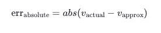

图片作者。

要获得相对误差，将绝对误差除以以下值:

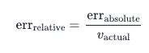

图片作者。

如果我们有一个恒定的绝对误差，我们可能会遇到如下情况:

*我们要求第 99 百分位，算法告诉我们是 10 秒+/-100 毫秒。然后，我们要求第 1 个百分位数，算法告诉我们是 10ms +/- 100ms。*

第一百分位的误差太高了！

如果我们有一个恒定的相对误差，那么我们会得到 10ms +/- 100 微秒。

这要有用得多。(10s +/- 100 微秒可能太紧了，如果我们已经达到 10s，我们可能真的不在乎 100 微秒。)

这就是 UDDSketch 算法使用对数大小的桶的原因，其中桶的宽度与底层数据的大小成比例。这允许算法在整个百分点范围内提供恒定的相对误差。

因此，您总是知道百分位数的真实值将落在某个范围`[v_approx *(1-err), v_approx * (1+err)]`内。

另一方面，T-Digest 使用大小可变的存储桶，这取决于它们在分布中的位置。具体来说，它在分布的两端使用较小的桶，在中间使用较大的桶。

因此，它可能看起来像这样:

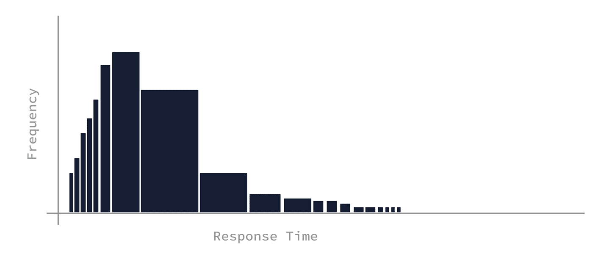

修改后的直方图显示了在极端情况下较小的可变大小存储桶(如 TDigest 算法所使用的存储桶)仍然可以表示数据(注意:出于说明目的，未按比例绘制。)图片由作者提供。

这种具有可变大小桶的直方图结构针对不同于 UDDSketch 的东西进行了优化。具体来说，它利用了这样一个想法:当你试图理解分布时，你可能更关心极值之间的细微差别，而不是范围的中间值。

例如，我通常非常关心区分第 5 百分位和第 1 百分位或者第 95 百分位和第 99 百分位，而我不太关心区分第 50 百分位和第 55 百分位。

中间的区别不如极端的区别有意义和有趣。(注意:TDigest 算法比这个要复杂一点，它没有完全捕捉到它的行为，但是我们试图给出一个大概的要点。如果你想了解更多信息，[我们推荐这篇论文](https://arxiv.org/abs/1902.04023)。

## 在时标超函数中使用高级近似方法

到目前为止，在这篇文章中，我们只使用了通用的`percentile_agg`集合。它使用 UDDSketch 算法，对于大多数用户来说是一个很好的起点。

我们还提供了单独的`[uddsketch](https://docs.timescale.com/api/latest/hyperfunctions/percentile-approximation/percentile-aggregation-methods/uddsketch/)`和`[tdigest](https://docs.timescale.com/api/latest/hyperfunctions/percentile-approximation/percentile-aggregation-methods/tdigest/)`以及聚合，以实现更多的可定制性。

每个都将桶的数量作为它们的第一个参数(这决定了内部数据结构的大小)，并且`uddsketch`也有一个关于目标最大相对误差的参数。

我们可以使用正常的`approx_percentile`访问函数，就像我们使用`percentile_agg`一样，因此，我们可以像这样比较中值估计:

```
SELECT 
	approx_percentile(0.5, uddsketch(200, 0.001, response_time)) as median_udd,
	approx_percentile(0.5, tdigest(200, response_time)) as median_tdig
FROM responses;
```

他们两个也和我们上面讨论的`approx_percentile_rank`机能亢进一起工作。

如果我们想知道 1000 在我们的分布中会落在哪里，我们可以这样做:

```
SELECT 
	approx_percentile_rank(1000, uddsketch(200, 0.001, response_time)) as rnk_udd,
	approx_percentile_rank(1000, tdigest(200, response_time)) as rnk_tdig
FROM responses;
```

此外，每个近似都有一些访问器，这些访问器只对基于近似结构的项起作用。

例如，`uddsketch`提供了一个`error`访问器函数。这将告诉您基于`uddsketch`看到的值的实际保证最大相对误差。

UDDSketch 算法保证最大相对误差，而 T-Digest 算法不保证，所以`error`只和`uddsketch`一起工作(和`percentile_agg`因为它在引擎盖下使用了`uddsketch`算法)。

这个误差保证是我们选择它作为缺省值的主要原因之一，因为误差保证对于确定你是否得到一个好的近似是有用的。

另一方面，`Tdigest`提供了`min_val` & `max_val`访问器函数，因为它将其存储桶偏向极端，并且可以提供精确的最小值和最大值，而不需要额外的成本。`Uddsketch`无法提供。

您可以像这样调用这些其他的访问器:

```
SELECT 
	approx_percentile(0.5, uddsketch(200, 0.001, response_time)) as median_udd,
	error(uddsketch(200, 0.001, response_time)) as error_udd,
	approx_percentile(0.5, tdigest(200, response_time)) as median_tdig,
	min_val(tdigest(200, response_time)) as min,
	max_val(tdigest(200, response_time)) as max
FROM responses;
```

正如我们在上一篇关于[两步聚合](https://blog.timescale.com/blog/how-postgresql-aggregation-works-and-how-it-inspired-our-hyperfunctions-design-2/?utm_source=tds&utm_medium=blog&utm_campaign=hyperfunctions-1-0-2021&utm_content=blog-two-step-agg#why-we-use-the-two-step-aggregate-design-pattern)的帖子中所讨论的，对所有这些聚合的调用都会被 PostgreSQL 自动删除重复数据并进行优化，因此您可以用最少的额外成本调用多个访问器。

它们都有为它们定义的`[rollup](https://docs.timescale.com/api/latest/hyperfunctions/percentile-approximation/rollup-percentile/)`函数，所以当它们用于连续聚合或常规查询时，您可以重新聚合。

(注意:`tdigest` rollup 与直接在底层数据上调用`tdigest`相比，会引入一些额外的错误或差异。在大多数情况下，这可以忽略不计，通常相当于更改底层数据的接收顺序。)

我们在这里提供了算法之间的一些权衡和差异，但是我们在文档中有一个[更长的讨论，可以帮助你选择](https://docs.timescale.com/api/latest/hyperfunctions/percentile-approximation/percentile-aggregation-methods/?utm_source=tds&utm_medium=blog&utm_campaign=hyperfunctions-1-0-2021&utm_content=docs-percentile-approx-discussion##choosing-the-right-algorithm-for-your-use-case)。您也可以从默认的`percentile_agg`开始，然后在您的数据上试验不同的算法和参数，看看什么最适合您的应用。

# 包装它

我们简要概述了百分位数，它们如何比更常见的统计总量(如平均值)提供更多信息，为什么存在百分位数近似值，以及它们通常如何工作以及在时间范围内如何超函数。

**如果您想立即开始使用**[](https://docs.timescale.com/api/latest/hyperfunctions/percentile-approximation/?utm_source=tds&utm_medium=blog&utm_campaign=hyperfunctions-1-0-2021&utm_content=docs-percentile-approx)****—以及更多功能，请创建一个完全托管的时标服务**:创建一个账户[免费试用 30 天](https://console.forge.timescale.com/signup?utm_source=tds&utm_medium=blog&utm_campaign=hyperfunctions-1-0-2021&utm_content=timescale-signup)。(Hyperfunctions 预装在每个新的数据库服务中，所以在你创建一个新的服务后，你就可以使用它们了)。**

****如果您喜欢管理自己的数据库实例，您可以** [**下载并在 GitHub 上安装**](https://github.com/timescale/timescaledb-toolkit) `[**timescaledb_toolkit**](https://github.com/timescale/timescaledb-toolkit)` [**扩展**](https://github.com/timescale/timescaledb-toolkit) ，之后您将能够使用百分点近似值和其他超函数。**

**我们相信时间序列数据无处不在，理解它对于各种技术问题都至关重要。我们构建了超函数，让开发人员更容易利用时序数据的力量。**

**我们一直在寻找关于下一步构建什么的反馈，并且很想知道您如何使用超函数、您想要解决的问题，或者您认为应该或者可以简化的事情，以便更好地分析 SQL 中的时序数据。(要提供反馈，请在 GitHub 的[未决问题](https://github.com/timescale/timescaledb-toolkit/issues)或[讨论主题](https://github.com/timescale/timescaledb-toolkit/discussions)中发表评论。)**

***原载于 2021 年 9 月 14 日*[*https://blog.timescale.com*](https://blog.timescale.com/blog/how-percentile-approximation-works-and-why-its-more-useful-than-averages/)*。***