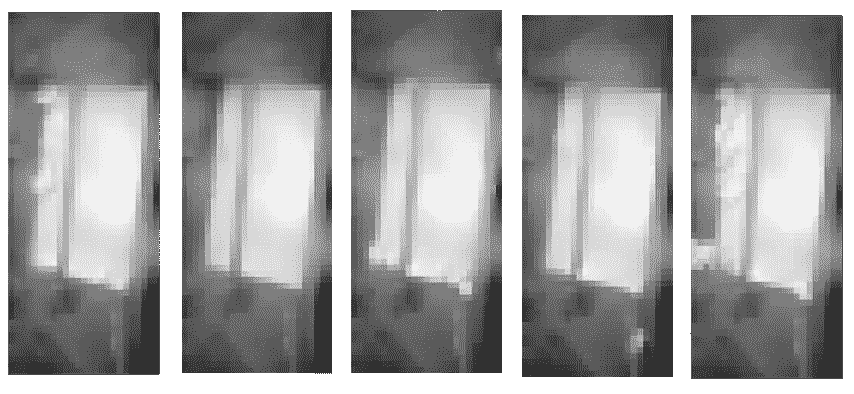
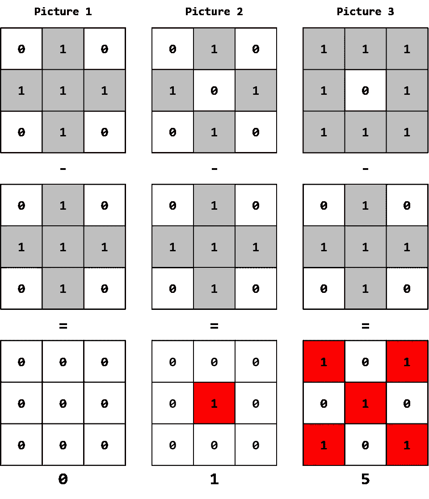
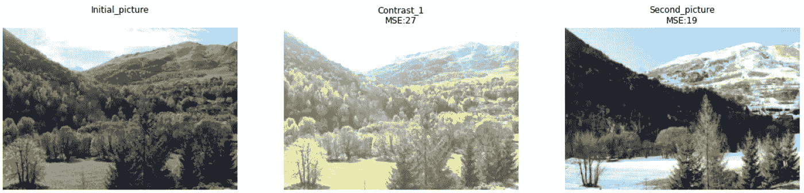
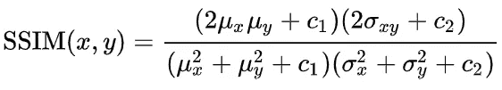
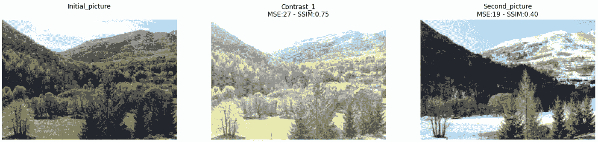
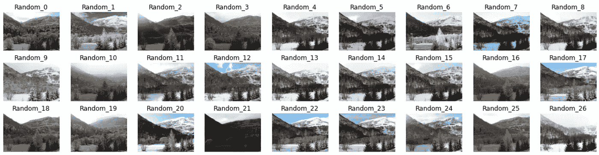
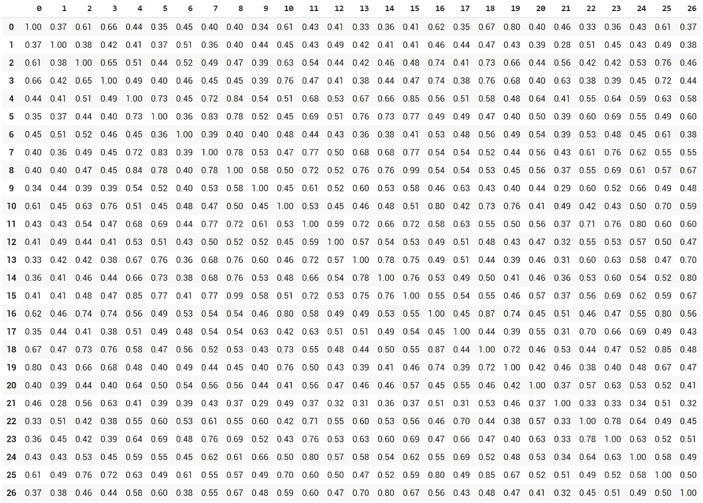
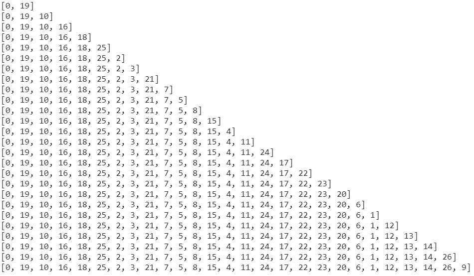
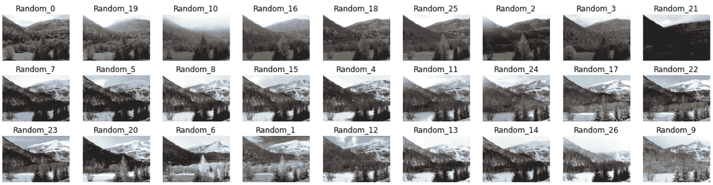

# 图片结构的相似性如何促进你的计算机视觉项目

> 原文：<https://towardsdatascience.com/how-pictures-structural-similarity-can-boost-your-computer-vision-projects-3dbb721a0fa?source=collection_archive---------39----------------------->

## 了解为什么这个 skimage 函数比 MSE 更强大，以及它如何在训练深度学习网络时帮助您加速图片分类并避免目标泄漏。

罗斯·乔伊纳在 [Unsplash](https://unsplash.com?utm_source=medium&utm_medium=referral) 上的照片

如果您以前从事过图像识别或计算机视觉项目，您会知道拥有一个正确分类的数据集是最重要的！

我这里说的不是“现成的数据集”，如 CIFAR 或 MNIST，而是真实的原始图片，你必须在进行任何训练之前手动排序。

我最近在研究一个新的计算机视觉项目，发现图片之间的“结构相似性”(SSIM)可以帮助加快排序过程，并避免一些常见的陷阱。

让我们开始吧！

# 你应该总是质疑伟大的准确性

我知道这是不寻常的，但我会从最后开始…我完成了深度学习网络训练，并对它达到的接近 100%的准确率感到非常自豪。

有时生活给了你柠檬…但有时你也会收到非常干净和清晰的图像，总是从同一个角度拍摄，易于察觉！该模型唯一的预测误差也受到了专家们的争论，因为一些类别之间的界限非常模糊。

在与另一位数据科学家讨论这一成功成果时，他问我是否*绝对*确定没有目标泄露？我使用了适当的“训练/测试/有效”分割，但是在“训练”和“有效”数据集中有可能存储相似的图片吗？

经过一番思考，我意识到这是有可能发生的…

原因是这些图片是从一个不断重复的工业过程中提取出来的。每一批从 X 到 Y 到 Z…然后再回到 X。由于过程(粉末灌装)的随机性，一个批次不可能与另一个批次完全相同，但有些状态可能看起来非常相似，如下图所示:

**图片摘自一个工业用例—图片作者**
(*出于保密原因，图片经过了大量像素化处理！)

于是我只好想办法对比他们之间的图片，寻找“差不多”的双胞胎！

# 比较图片的最好方法是什么？MSE 还是 SSIM？

我将假设您熟悉图片如何被转换成 Numpy 数组。如果你对这个概念不清楚，你应该看看这篇文章:

 [## 由于城市，更好地可视化张量！

### 当然，很容易看出标量、向量或矩阵是什么样子！但是当涉及到 n 维数组时，我们的…

towardsdatascience.com](/better-visualizing-tensors-thanks-to-cities-b97e6b4ca2ca) 

我的第一直觉是，一个简单的数学运算可能会提供一个很好的“双胞胎检测系统”。例如，由于所有图片都是从同一个角度拍摄的，因此每个像素之间的差异总和可能很好:

通过累加不同像素的数量来比较图片—图片由作者提供

但是这在复杂的图片上不起作用，我会解释为什么！

对于本文的其余部分，我们将使用与本文中提供的数据集相同的数据集:

 [## XAI——构建自己的深度学习解释算法

### 你可能听说过莱姆或 SHAP 图书馆，以及它们如何帮助你发现你感兴趣的领域

towardsdatascience.com](/xai-build-your-own-deep-learning-interpretation-algorithm-6e471b59af7) 

让我们处理下图，这是从数据集中随机抽取的样本。如果我们增加原始图片的亮度，相应阵列的值将显著改变，并且这个新的更亮的图片将具有比右边的图片(19)更高的 MSE (27)，然而它在视觉上更接近:

图片与 MSE 的比较—图片由作者提供

那么有没有比 MSE 更好的度量来比较两张图片呢？

[**结构相似度**](https://en.wikipedia.org/wiki/Structural_similarity) 指数(下面的公式)可能是我能建议的最佳选项，因为比较是在 *NxN* 滑动窗口上执行的，而不是逐像素差异:

[来源维基百科](https://en.wikipedia.org/wiki/Structural_similarity)

我们之前分析的三张图片的相应输出是什么？

与 MSE 和 SSIM 的图片比较—图片由作者提供

结构相似性指数(SSIM)具有(0，1)的范围，1 是 100%相同的结构。

我们可以观察到，我们的视觉感知确实与分析相匹配:较亮的图片的指数(0.75)高于第二张图片(0.40)。

我现在能够准确地比较“训练”和“有效”数据集了！幸运的是，尽管图片之间有一些相似之处，没有实际的目标泄漏，但它值得检查！😃

# SSIM 能帮你分类图片吗？

手动分类图片可能是一项无聊的任务，但“某人”或“某物”必须做这件事！

在这两种情况下(我最初的工业项目和本文中使用的冬季延时)，这些照片都是从相同的角度拍摄的，这使它们成为 SSIM 的一个非常好的候选。

如果 SSIM 如此擅长比较图片，有没有可能用它来对图片进行预分类？

让我们从数据集中随机抽取 27 张照片:

随机的一批 27 张图片——图片由作者提供

我们只需要建立一个“简单”的算法，它是这样进行的:

1.我们计算所有图片的 SSIM 矩阵:

SSIM 矩阵继承自 27 张随机图片—图片由作者提供

2.我们先从“图像 0”中找出最接近的图片:“图像 19”(0.80)，然后从“图像 19”(排除图像 0 为一种可能):“图像 10”(0.76)中找出最接近的图片，重复这个过程，直到所有图片都排序完毕:

27 张随机图片的相似链—图片由作者提供

结果非常有趣，可以快速识别图片中的一些趋势(无雪/绿色、雪/白色天空、雪/蓝色天空等)。).显然，我们可能会优化“链接”过程，以获得更准确的集群，但这似乎是一个良好的开端！

根据结构相似性排序的 27 张随机图片——图片作者

因此，SSIM 可能是运行某种“无监督”排序的好选择，前提是它们是“静态”图片(不同角度和/或环境的图像，结果可能不太准确)。

因此，当下一批图片将被交付时，SSIM 索引将帮助我对这些新图像进行排序，并确保没有相似的图片被引入不同的数据集！

像往常一样，我希望你喜欢这首曲子😉！

如果你想试一试，相应的笔记本可以在 Google Colab 的[这里](https://colab.research.google.com/drive/18csSiEQer0HdRChzZ-SRrWj9AAGdwkfL?usp=sharing)找到。

 [## 皮埃尔-路易·贝斯康德关于媒介的文章

### 数据科学、机器学习和创新

pl-bescond.medium.com](https://pl-bescond.medium.com/pierre-louis-besconds-articles-on-medium-f6632a6895ad)