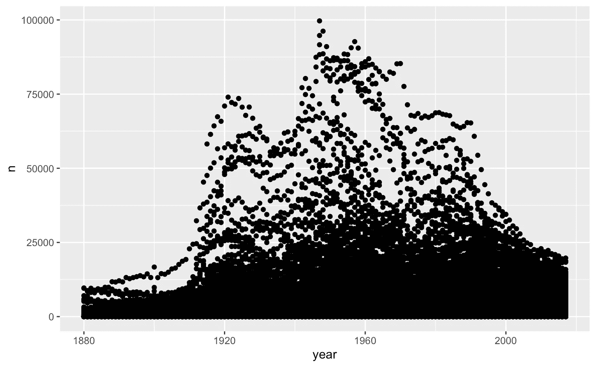
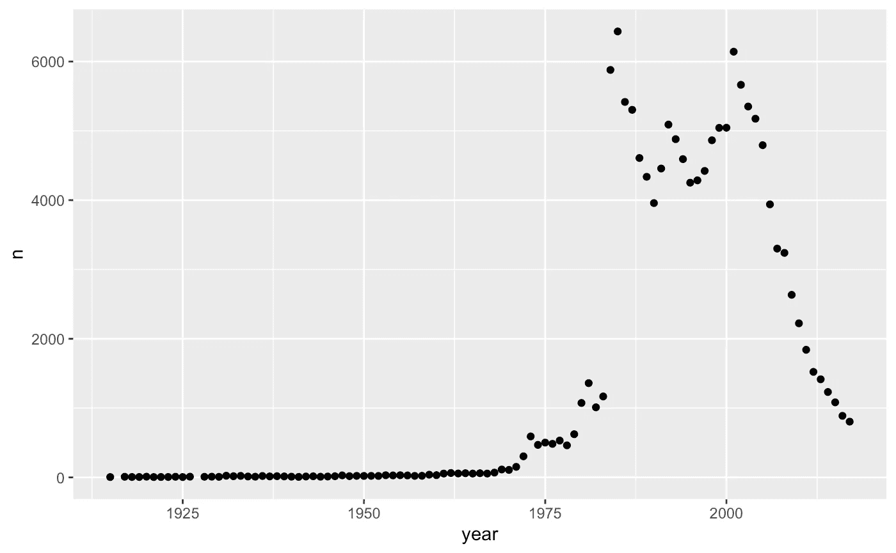
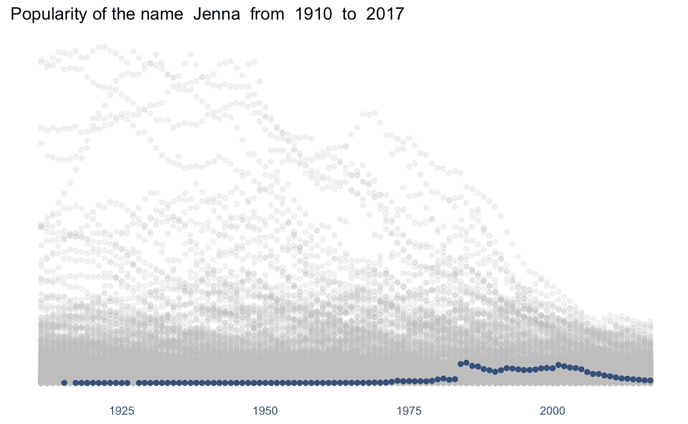
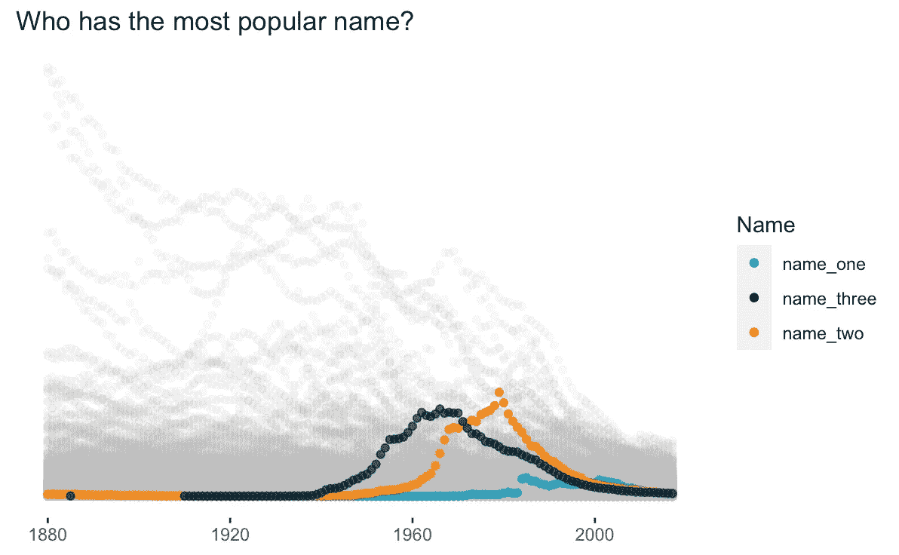

# 你的名字有多受欢迎？微型数据即 R 中的挑战

> 原文：<https://towardsdatascience.com/how-popular-is-your-name-mini-data-viz-challenge-in-r-1dc31f6a22dc?source=collection_archive---------44----------------------->

## 这是一个快速简单的项目，在 R 中使用 ggplot2 练习数据可视化，同时找出美国人名的流行程度


Pablo Gentile 在 [Unsplash](https://unsplash.com?utm_source=medium&utm_medium=referral) 上拍摄的照片

我涉足 R 已经好几年了，但直到最近才开始受到关注。当我试图学习 R 时，我一直遵循同样的模式:看到令人印象深刻的利用率，获得学习的新能量，变得不知所措。

因为它能做这么多，R 是一个神奇的工具，但学习起来也令人生畏。对于那些开始 R 学习之旅的人，我鼓励你从学习 R 中的一件*事情*开始。你的事情可以是学习如何将两个数据集合并在一起，或者如何有效地计算描述性统计。对我来说，这是学习如何做数据可视化。虽然我仍然(经常)感到沮丧，但我发现当我更新代码时，能够立即直观地看到增量变化更令人满意。

所以，对于那些想尝试用 R 语言可视化数据的人，欢迎！您可以跟随我一步一步地自己编写代码，也可以直接跳到底部，复制并粘贴我的代码。你所需要做的就是添加你感兴趣的名字！

1.  **安装并加载软件包**
2.  **地块所有名称(***gg Plot 简介* **)**
3.  **地块“您的”名称(** *迷你项目的开始* **)**
4.  把你的名字和所有的名字标在一起
5.  **剧情多个名字比较(** *加成即* **)**

**步骤 3、4 和 5 中创建的每个地块的完整代码。**

** * *本文假设你已经安装了 R and R 工作室。如果你还没有，* [*这里有一个很棒的教训*](https://datavizm20.classes.andrewheiss.com/lesson/01-lesson/) *。如果你还没有准备好进行这样的跳跃，* [*这是一个有趣的教程*](https://rstudio.cloud/learn/primers/2.3) *，它会遍历我们将在下面使用的相同数据集，并允许你从你的浏览器做任何事情——不需要安装！*

事不宜迟，让我们开始视觉化！

# 步骤 1:安装和加载软件包

```
# If you haven't used the packages before, you will need to install them first#
install.packages("tidyverse")
install.packages("babynames")# Load packages
library(tidyverse)
library(babynames)
```

babynames 包有一个由社会保障管理局提供的数据框，其中包含:年份、性别、姓名、n(实例数)和属性(该年中给定姓名和性别的实例数除以申请人总数)。可惜这个数据只有二元男/女作为性别选项。这个数据集包括至少有 5 个实例的每个名字！哇！

# 第二步:画出所有的名字

当在 data viz in R 中开始时，您最有可能使用 ggplot 包开始。一旦你理解了这个结构，你就可以很快地改变你想要的情节了！

```
%>% ggplot() + (mapping = aes())
```

让我们一步一步来看:

```
%>%
```

您将用正在使用的数据框的名称替换“数据”。babynames 包已经为您创建了一个数据框，但是如果您正在使用自己的数据，则需要创建一个数据框公式。" %>% "被称为管道运算符，但也可以读作" then "因此，我可能会阅读第一行，并对自己说“好的，我们将采用“数据”数据框，然后我们将……”

```
%>% ggplot() +
```

现在我们从 ggplot 包中添加 ggplot()函数。这告诉 R 你想要创建一个可视化。你可以试着跑一会儿，你会发现只有一个空白的长方形。我们还没有告诉 R 我们希望事情如何发展。因此，“我们将采用“数据”数据框，然后我们将创建某种绘图。”

```
babynames %>%
  ggplot()
```


不，这不是错误。我们希望第一个图是空白的。

所以这可能不是我们所期待的有趣的 vizzies，但是和我呆在一起！

```
%>% ggplot() + (mapping = aes())
```

现在事情越来越有趣了！我们现在要选择我们想要的几何函数。有许多预制的 geom_functions，可以快速轻松地创建您选择的地块。比如:geom_point()添加点的图层，geom_bar()添加条形图，geom_line()创建线图等等。点击查看所有可用的几何图形[。](https://rstudio.com/wp-content/uploads/2015/03/ggplot2-cheatsheet.pdf)

最后，你要描绘出你的审美，这是事情开始变得有条理的地方！您将替换为设置 x 和 y 变量，以及设置颜色和大小等内容。

```
babynames %>%
  ggplot() +
  geom_point(mapping = aes(x = year, y = n))
```

请记住，这是一个巨大的数据集，因此可能需要一些时间来完全绘制。



男性和女性名字的每一年都有一个点。

# 第三步:我的名字呢？

现在我们可以看到所有的名字，但是只看到我们的名字(或者任何我们感兴趣的名字)呢？

为此，我们可以用我们感兴趣的名称创建一个变量。我们还可以指定是只查看男性还是女性。我将使用我的名字(詹娜)和女性(“F”)，但请随意替换成你感兴趣的！

```
myname <- "Jenna"
mysex <- "F"babynames %>%
  filter(name == myname, sex == mysex) %>%
  ggplot() +
  geom_point(mapping = aes(x = year, y = n))
```



一个圆点代表每年被命名为“珍娜”的女性指定性别的人数。

就这样！我们已经完成了我们的使命！这就是你在 r 中开始创作情节所需要的全部。你可以得到各种各样的花哨和夸张的定制，但你也不必这样做。当你第一次开始，庆祝这些胜利！你想制造一个阴谋，你制造了一个阴谋。干得好。

但是，如果你是那些喜欢额外学分的孩子之一，让我们看看我们还能做些什么。

# 第四步:把我们的名字和所有的名字对应起来

我们将再次绘制整个数据集，因此在运行时，可能是煮点咖啡或倒点酒的好时机。

```
mynameis <- "Jenna"
mysexis <- "F"

myname <- babynames %>%
  filter(name == mynameis, sex == mysexis)

mynameminyear <- min(myname$year)-5
maxyear <- max(babynames$year)

babynames %>%
  filter(year > mynameminyear) %>%
  ggplot() +
  geom_point(mapping = aes(x = year, y = prop), alpha = 0.2, color = "gray") +
    geom_point(data = myname, mapping = aes(x = year, y = prop), alpha = 0.8, color = "#013175") +# the below is just formatting, not required!  
theme_minimal() +
 theme(panel.grid.major = element_blank(), panel.grid.minor = element_blank(), panel.background = element_blank(),
        axis.title = element_blank(),
        axis.text.y = element_blank(),
        axis.ticks.y = element_blank()) +
  ggtitle(paste("Popularity of the name ", mynameis, " from ", mynameminyear, " to ", maxyear))
```



名字詹娜和性别女性密谋反对所有其他的名字。

# 第五步:画出多个名字进行比较

因为没有什么比竞争更能激发学习兴趣了，你可以一次突出多个名字，看看你是如何比较的。我会把三个名字放在一起，但你可以随意添加更多！

首先为你想比较的三个人选择一个名字和性别。我做了我自己，我的伙伴，和我的兄弟。记住名字应该用引号括起来，你可以选择“M”或“F”来表示性别。

```
name_one <- "Jenna"
sex_one <- "F"name_two <- "Melissa"
sex_two <- "F"name_three <- "Jeffrey"
sex_three <- "M"
```

好了，我们已经设置了变量，是时候绘图了！

```
firstname <- babynames %>%
  filter(name == name_one, sex == sex_one)

secondname <- babynames %>%
  filter(name == name_two, sex == sex_two)

thirdname <- babynames %>%
  filter(name == name_three, sex == sex_three)

legendcolors <- c("name_one" = "#219EBC", "name_two" = "#FB8500", "name_three" = "#023047")babynames %>%
  ggplot() +
  geom_point(mapping = aes(x = year, y = prop), alpha = 0.1, color = "gray") +
  geom_point(data = firstname, mapping = aes(x = year, y = prop, color = "name_one"), alpha = 0.8) +
  geom_point(data = secondname, mapping = aes(x = year, y = prop, color = "name_two"), alpha = 0.8) +
  geom_point(data = thirdname, mapping = aes(x = year, y = prop, color = "name_three"), alpha = 0.8) +

# The below is formatting and not required!
theme(panel.grid.major = element_blank(), panel.grid.minor = element_blank(), panel.background = element_blank(),
        axis.title = element_blank(),
        axis.text.y = element_blank(),
        axis.ticks.y = element_blank()) +
  ggtitle(paste("Who has the most popular name?")) +
  scale_color_manual(name = "Name", values = legendcolors)
```



我们做到了！该死的，就总体受欢迎程度而言，看起来我(name_one)是失败者，尽管看起来我可能在 2000 年代初击败了其他两人。Melissa females (name_two)已经存在了很长时间，并在 20 世纪 90 年代大受欢迎。

现在，你有**无尽的**方式来完全定制这个视觉效果，让它成为你自己的。选择自己的冒险！一些有趣的尝试:

*   改变使用的颜色(这里有一个在 ggplot 中定制颜色的指南
*   突出显示其他姓名
*   在图上标注不同的点

# 完整代码

[选项 1:只有一个名字](https://gist.github.com/jeagleson/948b7534ba36f3fb7dcb0b56a9965634)


[选项 2:一个名称对所有名称](https://gist.github.com/jeagleson/4d539d4d88898dace678f93c1e2c3511)


[选项 3:比较三个名字与所有名字](https://gist.github.com/jeagleson/d175552658cddf7338c0913cef4ec8be)


我迫不及待地想看看你们都想出了什么！继续用你的头撞墙，这样会好很多！


[***詹娜·伊格尔森***](https://medium.com/@jeagleson)*我的背景是工业组织心理学，我在人物分析中找到了自己的家。数据使我的作品变得生动。我主要使用 Power BI，但偶尔也会使用 Tableau 和其他工具。我很想听到更多关于你的旅程！通过在此评论或在*[*Twitter*](https://twitter.com/JennaEagleson)*或*[*Linkedin*](https://www.linkedin.com/in/jenna-eagleson/)*联系我。*