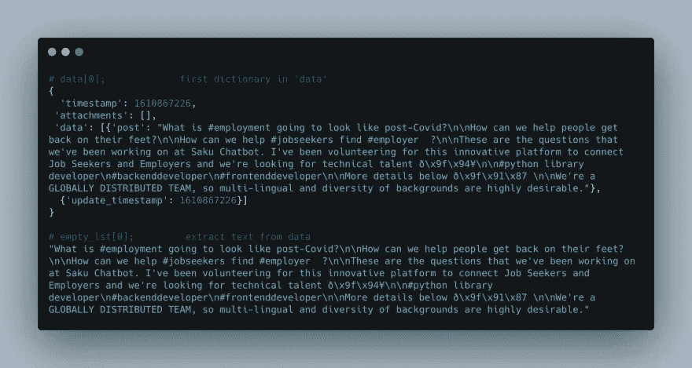
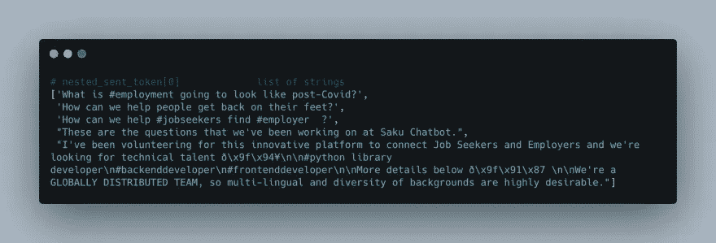
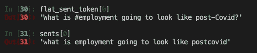
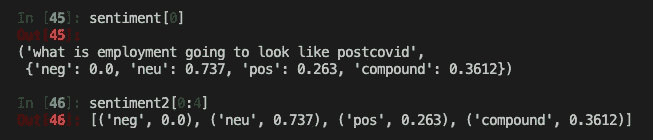
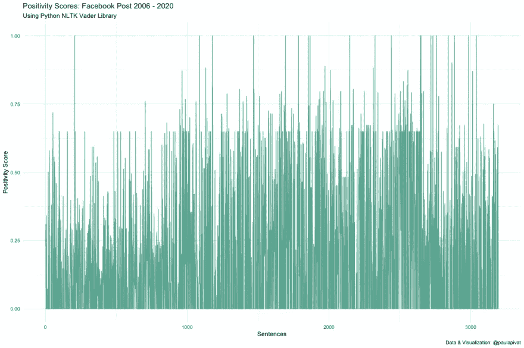
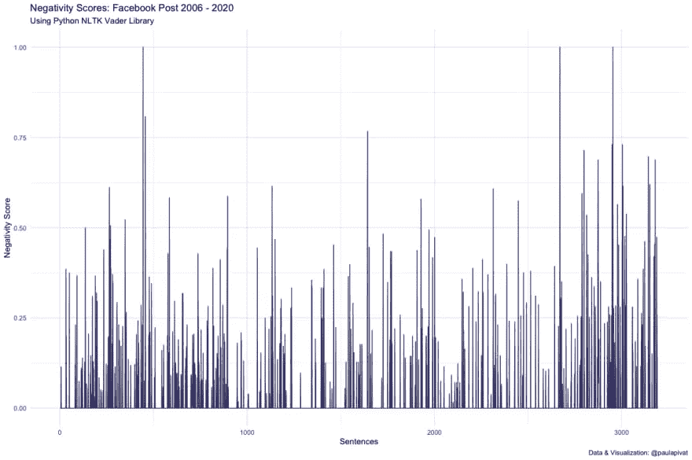
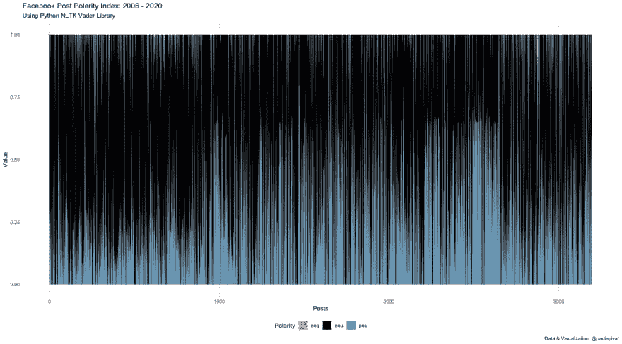
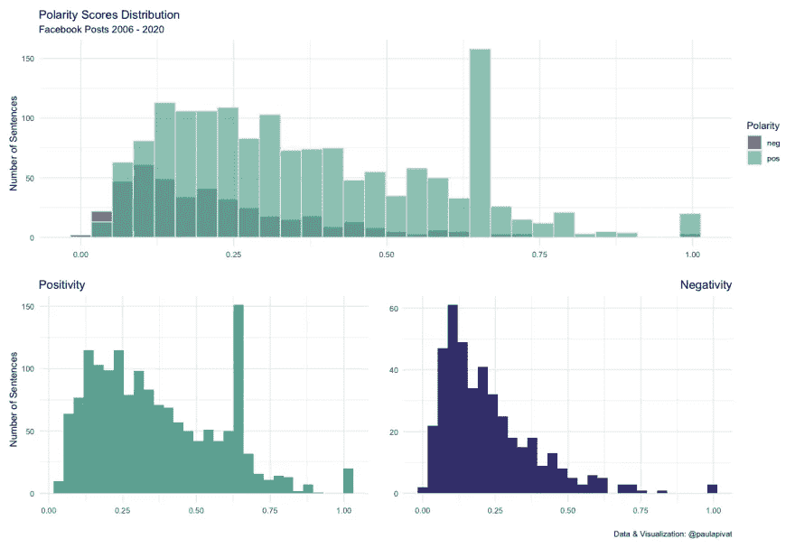
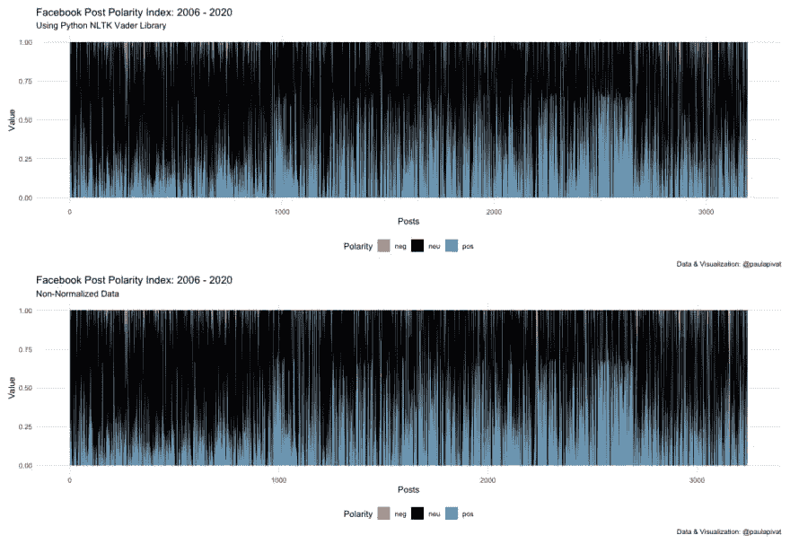

# 你在脸书的帖子有多积极？

> 原文：<https://towardsdatascience.com/how-positive-are-your-facebook-posts-47a7b05c661b?source=collection_archive---------48----------------------->

## 使用 Python 和 R 的基于规则的情感分析


作者图片

# 概观

## 为什么要进行情感分析？

NLP 是语言学、计算机科学和人工智能的子领域，你可能会花上几年的时间来研究它。

然而，我想快速了解一下自然语言处理是如何工作的，我们将通过**情感分析**来完成，按照极性对文本进行分类。

我们不禁感到有动力看到关于我们自己的社交媒体帖子的见解，所以我们将转向一个众所周知的平台。

## 脸书对我们了解多少？

为了搞清楚，我下载了 14 年的帖子来应用**文字**和**情绪**分析。我们将使用`Python`来读取和解析来自脸书的`json`数据。

我们将在 Python 的**自然语言工具包**、`NLTK`的帮助下执行诸如标记化和规范化等任务。然后，我们将使用`Vader`模块(休顿&吉尔伯特，2014)进行基于规则的(词典)**情感分析**。

最后，我们将把我们的工作流程转移到`R`和`tidyverse`来进行**数据操作**和**可视化**。

# 获取数据

首先，您需要通过以下方式下载您自己的脸书数据:设置&隐私>设置>您的脸书信息>下载您的信息>(选择)帖子。

下面，我把我的文件命名为`your_posts_1.json`，但是你可以改变这个。我们将使用 Python 的`json`模块读入数据。我们可以用`type`和`len`来感受一下数据。

```
import json# load json into python, assign to 'data'
with open('your_posts_1.json') as file:
    data = json.load(file)type(data)     # a list
type(data[0])  # first object in the list: a dictionary
len(data)      # my list contains 2166 dictionaries
```

以下是我们在本帖中使用的 Python 库:

```
import pandas as pd
from nltk.sentiment.vader import SentimentIntensityAnalyzer# OPTIONAL (more relevant for individual words)
from nltk.stem import LancasterStemmer, WordNetLemmatizer from nltk.corpus import stopwords
from nltk.probability import FreqDist
import re
import unicodedata
import nltk
import json
import inflect
import matplotlib.pyplot as plt
```

自然语言 Tookkit 是一个流行的 Python 平台，用于处理人类语言数据。虽然它有超过 50 个词汇资源，但我们将使用 [Vader 情感词汇](https://github.com/cjhutto/vaderSentiment)，即*专门针对社交媒体中表达的情感。*

[正则表达式](https://docs.python.org/3/library/re.html)(正则表达式)将用于删除标点符号。

[Unicode 数据库](https://docs.python.org/3/library/unicodedata.html)将用于删除非 ASCII 字符。

[JSON](https://docs.python.org/3/library/json.html) 模块帮助我们从脸书读入 JSON。

[屈折](https://pypi.org/project/inflect/)帮助我们将数字转换成单词。

[Pandas](https://pandas.pydata.org/) 是一个强大的数据操作和数据分析工具，用于我们将文本数据保存到数据框中并写入 csv。

在我们得到数据后，我们将[挖掘](https://twitter.com/paulapivat/status/1352893979897909251?s=20)以获得实际的**文本数据**(我们的帖子)。

我们将把它存储在一个列表中。

**注意**:键`data`偶尔会返回一个空数组，我们想通过检查`if len(v) > 0`跳过这些。

```
# create empty list
empty_lst = []# multiple nested loops to store all post in empty list
for dct in data:
    for k, v in dct.items():
        if k == 'data':
            if len(v) > 0:
                for k_i, v_i in vee[0].items():  
                    if k_i == 'post':
                        empty_lst.append(v_i)print("This is the empty list: ", empty_lst)
print("\nLength of list: ", len(empty_lst))
```

我们现在有了一个字符串列表。



作者图片

# 标记化

我们将遍历我们的字符串列表(empty_lst ),用`nltk.sent_tokenize()`来标记每个*句子*。我们想把这篇课文分成单独的句子。



作者图片

这会产生一个 list 列表，我们将对其进行展平:

```
# list of list, len: 1762 (each list contain sentences)
nested_sent_token = [nltk.sent_tokenize(lst) for lst in empty_lst]# flatten list, len: 3241
flat_sent_token = [item for sublist in nested_sent_token for item in sublist]
print("Flatten sentence token: ", len(flat_sent_token))
```

# 规范化句子

对于本节中使用的函数的上下文，请查看 Matthew Mayo 关于文本数据预处理的文章。

首先，我们将删除非 ASCII 字符(`remove_non_ascii(words)`)，包括:`#`、`-`、`'`和`?`，等等。然后我们会小写(`to_lowercase(words)`)，去掉标点(`remove_punctuation(words)`)，替换数字(`replace_numbers(words)`)，去掉停用词(`remove_stopwords(words)`)。

停用词的例子有:你的、你的、你自己、你们自己、他、他的、他自己等等。

这让我们每个句子都处于平等的竞争环境中。

```
# Remove Non-ASCII
def remove_non_ascii(words):
    """Remove non-ASCII character from List of tokenized words"""
    new_words = []
    for word in words:
        new_word = unicodedata.normalize('NFKD', word).encode(
            'ascii', 'ignore').decode('utf-8', 'ignore')
        new_words.append(new_word)
    return new_words # To LowerCase
def to_lowercase(words):
    """Convert all characters to lowercase from List of tokenized words"""
    new_words = []
    for word in words:
        new_word = word.lower()
        new_words.append(new_word)
    return new_words # Remove Punctuation , then Re-Plot Frequency Graph
def remove_punctuation(words):
    """Remove punctuation from list of tokenized words"""
    new_words = []
    for word in words:
        new_word = re.sub(r'[^\w\s]', '', word)
        if new_word != '':
            new_words.append(new_word)
    return new_words # Replace Numbers with Textual Representations
def replace_numbers(words):
    """Replace all interger occurrences in list of tokenized words with textual representation"""
    p = inflect.engine()
    new_words = []
    for word in words:
        if word.isdigit():
            new_word = p.number_to_words(word)
            new_words.append(new_word)
        else:
            new_words.append(word)
    return new_words# Remove Stopwords
def remove_stopwords(words):
    """Remove stop words from list of tokenized words"""
    new_words = []
    for word in words:
        if word not in stopwords.words('english'):
            new_words.append(word)
    return new_words# Combine all functions into Normalize() function
def normalize(words):
    words = remove_non_ascii(words)
    words = to_lowercase(words)
    words = remove_punctuation(words)
    words = replace_numbers(words)
    words = remove_stopwords(words)
    return words
```

下面的屏幕截图让我们了解了语句**规范化**与**非规范化**之间的区别。



作者图片

```
sents = normalize(flat_sent_token)
print("Length of sentences list: ", len(sents))   # 3194
```

**注**:词干化和词条化的过程对于单个单词(超过句子)更有意义，所以我们在这里就不用了。

# 频率

您可以使用`FreqDist()`功能获取最常见的句子。然后，您可以绘制一个折线图，直观地比较最常用的句子。

虽然简单，但是计算频率可以产生一些洞察力。

```
from nltk.probability import FreqDist# Find frequency of sentence
fdist_sent = FreqDist(sents)
fdist_sent.most_common(10) # Plot
fdist_sent.plot(10)
```

# 情感分析

我们将使用来自`NLTK`的`Vader`模块。维德代表:

> *化合价、意识、字典和情感推理器。*

我们正在采用基于**规则/词典**的方法进行情感分析，因为我们有一个相当大的数据集，但缺乏标记数据来建立一个强大的训练集。因此，机器学习对于这项任务来说不是理想的。

为了直观地了解`Vader`模块是如何工作的，我们可以访问 github repo 来查看`vader_lexicon.txt` ( [来源](https://github.com/cjhutto/vaderSentiment/blob/master/vaderSentiment/vader_lexicon.txt))。这是一本经过经验验证的**字典**。情感评级由 10 名独立的人类评分者提供(经过预先筛选、培训并检查评分者之间的可靠性)。

分数范围从(-4)极负到(4)极正，0 为中性。比如《死》的评分是-2.9，而《尊严》的评分是 2.2。更多详情请访问他们的([回购](https://github.com/cjhutto/vaderSentiment))。

我们将创建两个空列表来分别存储句子和极性得分。

`sentiment`捕捉每个句子和`sent_scores`，T5 初始化`nltk.sentiment.vader.SentimentIntensityAnalyzer`计算每个句子的 **polarity_score** (即阴性、中性、阳性)。

`sentiment2`捕获元组列表中的每个极性和值。

下面的屏幕帽应该让您了解我们的产品:



作者图片

在我们附加了每个句子(`sentiment`)和它们的极性分数(`sentiment2`，负、中性、正)之后，我们将**创建数据帧**来存储这些值。

然后，我们将数据帧写入 **CSV** 以转换到`R`。注意，在保存为 CSV 格式时，我们将 index 设置为 false。Python 从 0 开始计数，而`R`从 1 开始计数，所以我们最好在`R`中将索引重新创建为一个单独的列。

注意:我在这里做的事情有更有效的方法。我的解决方案是保存两个 CSV 文件，并将工作流转移到`R`进行进一步的数据操作和可视化。这主要是个人对在`R`中处理数据框和可视化的偏好，但是我应该指出这个*可以用`pandas`和`matplotlib`来完成*。

```
# nltk.download('vader_lexicon')sid = SentimentIntensityAnalyzer()sentiment = []
sentiment2 = []for sent in sents:
    sent1 = sent
    sent_scores = sid.polarity_scores(sent1)
    for x, y in sent_scores.items():
        sentiment2.append((x, y))
    sentiment.append((sent1, sent_scores))
    # print(sentiment)# sentiment
cols = ['sentence', 'numbers']
result = pd.DataFrame(sentiment, columns=cols)
print("First five rows of results: ", result.head())# sentiment2
cols2 = ['label', 'values']
result2 = pd.DataFrame(sentiment2, columns=cols2)
print("First five rows of results2: ", result2.head())# save to CSV
result.to_csv('sent_sentiment.csv', index=False)
result2.to_csv('sent_sentiment_2.csv', index=False)
```

# 数据转换

从现在开始，我们将使用`R`和`tidyverse`进行数据操作和可视化。`RStudio`是这里的首选 IDE。我们将创建一个`R Script`来存储我们所有的数据转换和可视化过程。我们应该在用`pandas`创建上述 CSV 文件的同一个目录下。

我们将加载我们保存的两个 CSV 文件和`tidyverse`库:

```
library(tidyverse)# load data
df <- read_csv("sent_sentiment.csv")       
df2 <- read_csv('sent_sentiment_2.csv')
```

我们将创建另一个与第一个数据框的索引相匹配的列。我把它保存为`df1`，但是如果你愿意，你可以覆盖原来的`df`。

```
# create a unique identifier for each sentence
df1 <- df %>%
    mutate(row = row_number())
```

然后，对于第二个数据帧(sent _ perspective _ 2 . CSV)，我们将创建另一个匹配索引的列，但是也使用来自`tidyr`包的`pivot_wider`。**注意**:你首先需要`group_by`标签，然后使用`mutate`创建一个唯一的标识符。

然后，我们将使用`pivot_wider`来确保所有极性值(负、中性、正)都有自己的列。

通过使用`mutate`和`row_number()`创建一个惟一的标识符，我们将能够按行连接(`left_join`)。

最后，我将操作保存到`df3`,这允许我为可视化创建一个全新的数据帧。

```
# long-to-wide for df2
# note: first, group by label; then, create a unique identifier for each label then use pivot_widerdf3 <- df2 %>%
    group_by(label) %>%
    mutate(row = row_number()) %>%
    pivot_wider(names_from = label, values_from = values) %>%
    left_join(df1, by = 'row') %>%
    select(row, sentence, neg:compound, numbers)
```

# 形象化

首先，我们将分别可视化所有 3194 个句子的正负极性得分(您的数字会有所不同)。

以下是积极得分:



作者图片

以下是消极得分:



作者图片

根据`Vader`(Valance Aware Dictionary and perspective Reasoner)，当我将积极和消极得分相加得到一个比率时，它大约是 568:97，即积极比消极多 5.8 倍。

`Vader`模块将接收每一个句子，并分配一个从-1(最消极)到 1(最积极)的配价分数。我们可以将句子分类为`pos`(肯定)`neu`(中性)`neg`(否定)或复合(`compound`)得分(即归一化加权复合得分)。更多详情，请参见[维德-情感文档](https://pypi.org/project/vader-sentiment/)。

这里有一个图表，看*正反两个分数加在一起(正=蓝色，负=红色，中性=黑色)。*



作者图片

最后，我们还可以使用`histograms`来查看句子中消极情绪和积极情绪的分布:



作者图片

## 非标准化数据

事实证明`Vader`模块完全能够分析带有标点符号、词形(大写以示强调)、俚语甚至 utf-8 编码的表情符号的句子。

因此，为了看看如果我们在没有标准化的情况下实施情感分析**是否会有任何不同，我重新运行了上面所有的分析。**

这里有两个版本的数据进行比较。顶部代表正常化，底部代表非正常化。



作者图片

虽然预期会有细微的差别，但它们只是细微的差别。

## 摘要

我下载了脸书 14 年的帖子，使用`Python`和`R`进行基于规则的情绪分析，并可视化结果。

我喜欢在这个项目中使用这两种工具，并试图发挥它们的优势。我发现用 Python 直接解析 JSON，但是一旦我们转换到数据框架，我就渴望回到 r。

因为我们缺乏标记数据，使用基于规则/词典的方法进行情感分析是有意义的。现在我们有了价分数的标签，也许有可能采用机器学习的方法来预测未来帖子的价。

# 参考

1.  休顿，C.J .和吉尔伯特，E.E. (2014 年)。VADER:基于规则的社交媒体文本情感分析的简约模型。第八届网络日志和社交媒体国际会议。密歇根州安阿伯，2014 年 6 月。

关于数据科学、机器学习、R、Python、SQL 等更多内容，[在 Twitter 上找到我](https://twitter.com/paulapivat)。