# PostgreSQL 聚合如何工作，以及它如何启发了我们的 hyperfunctions 设计

> 原文：<https://towardsdatascience.com/how-postgresql-aggregation-works-and-how-it-inspired-our-hyperfunctions-design-bb063cc874ee?source=collection_archive---------39----------------------->


乔希·穆勒在 [Unsplash](https://unsplash.com/photos/gq7CheNKrzc) 上的图片

*获得关于 PostgreSQL 聚合的初级读本，PostgreSQL 的实现如何启发我们构建 TimescaleDB 超函数及其与高级 TimescaleDB 功能的集成，以及这对开发人员意味着什么。*

在时间尺度上，我们的目标是始终关注开发人员的体验，我们非常小心地设计我们的产品和 API，使其对开发人员友好。我们相信，当我们的产品易于使用，并能为广大开发人员所用时，我们就能让他们解决各种不同的问题，从而构建解决大问题的解决方案。

这种对开发人员体验的关注是我们在设计 TimescaleDB 的早期就决定在 PostgreSQL 之上构建的原因。我们当时相信，就像现在一样，建立在世界上增长最快的数据库上将给我们的用户带来许多好处。

也许这些优势中最大的是开发人员的生产力:开发人员可以使用他们了解和喜欢的工具和框架，并带来他们所有的 SQL 技能和专业知识。

如今，有近 300 万个活跃的 TimescaleDB 数据库运行着各行各业的任务关键型时序工作负载。时间序列数据来得很快，有时每秒产生数百万个数据点([阅读更多关于时间序列数据的信息](https://blog.timescale.com/blog/what-the-heck-is-time-series-data-and-why-do-i-need-a-time-series-database-dcf3b1b18563/?utm_source=tds&utm_medium=blog&utm_campaign=hyperfunctions-1-0-2021&utm_content=what-is-time-series-data))。由于信息量大，速度快，时间序列数据很难查询和分析。我们构建了 TimescaleDB 作为专门为时间序列构建的关系数据库，以降低复杂性，使开发人员可以专注于他们的应用程序。

因此，我们以开发人员体验为核心，并不断发布功能来推进这一目标，包括[连续聚合、用户定义的操作、信息视图](https://blog.timescale.com/blog/timescaledb-2-0-a-multi-node-petabyte-scale-completely-free-relational-database-for-time-series/?utm_source=tds&utm_medium=blog&utm_campaign=hyperfunctions-1-0-2021&utm_content=timescaledb-2-0-blog)，以及最近的[time scale db hyperfunctions](https://blog.timescale.com/blog/introducing-hyperfunctions-new-sql-functions-to-simplify-working-with-time-series-data-in-postgresql/?utm_source=tds&utm_medium=blog&utm_campaign=hyperfunctions-1-0-2021&utm_content=hyperfunctions-announcement-blog):time scale db 中的一系列 SQL 函数，使得用更少的代码行在 PostgreSQL 中操作和分析时间序列数据变得更加容易。

为了确保我们在规划新的 hyperfunctions 功能时始终关注开发人员的体验，我们建立了一套“设计约束”来指导我们的开发决策。遵循这些准则可确保我们的 API:

*   在 SQL 语言中工作(没有新语法，只有函数和集合)
*   对于新的和有经验的 SQL 用户来说非常直观
*   仅对几行数据有用，对数十亿行数据具有高性能
*   很好地使用所有的 TimescaleDB 特性，理想情况下，让它们对用户更有用
*   使基本的事情变得简单，使更高级的分析成为可能

这在实践中是什么样子的？在这篇文章中，我解释了这些约束如何使我们在整个 TimescaleDB hyperfunctions 中采用两步聚合，两步聚合如何与其他 TimescaleDB 特性交互，以及 PostgreSQL 的内部聚合 API 如何影响我们的实现。

当我们谈到两步聚合时，我们指的是以下调用约定:

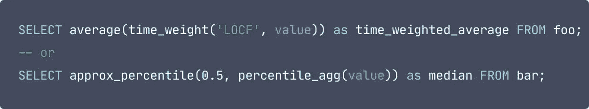

我们有一个内在的集合调用:

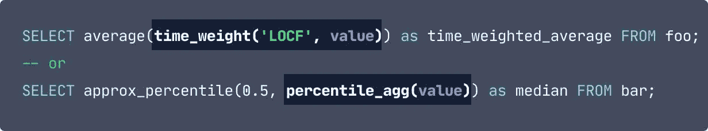

和一个外部访问器调用:

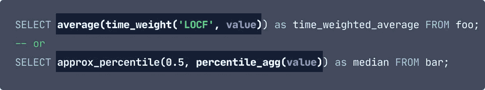

我们选择了这种设计模式，而不是更常见(似乎更简单)的一步聚合方法，在这种方法中，一个函数封装了内部聚合和外部访问器的行为:

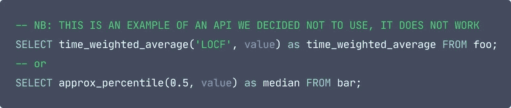

请继续阅读，了解为什么一步聚合方法在您开始做更复杂的事情(如将函数组合成更高级的查询)时会很快失效，以及几乎所有的 PostgreSQL 聚合都是如何执行两步聚合的。您将了解 PostgreSQL 实现如何启发我们构建 TimescaleDB 超函数、连续聚合和其他高级功能，以及这对开发人员意味着什么。

# PostgreSQL 聚合入门(通过图片)

当我五六年前开始学习 PostgreSQL 时(我是一名电化学专家，处理大量的电池数据，正如我在[上一篇关于时间加权平均值的文章](https://blog.timescale.com/blog/what-time-weighted-averages-are-and-why-you-should-care/?utm_source=tds&utm_medium=blog&utm_campaign=hyperfunctions-1-0-2021&utm_content=time-weighted-averages)中提到的)，我遇到了一些性能问题。我试图更好地了解数据库内部发生了什么，以提高其性能——这时候我通过图片找到了[布鲁斯·莫姆坚](https://momjian.us)关于 [PostgreSQL 内部的演讲。Bruce 因其深刻的演讲(和他对领结的嗜好)而在社区中众所周知，他的会议对我来说是一个启示。](https://momjian.us/main/presentations/internals.html)

从那以后，它们成了我理解 PostgreSQL 如何工作的基础。他把事情解释得非常清楚，当我能想象出正在发生的事情时，我总是学得最好，所以“通过图片”的部分真的帮助了我——并让我坚持下来。

所以下一点是我试图通过图片解释一些 PostgreSQL 的内部原理来引导 Bruce。系好你的领结，准备学习吧。


作者向 Bruce Momjian 致敬(看起来对自己相当满意，因为他第一次尝试就成功地打了一个领结)。作者大卫科恩的 GIF。

# PostgreSQL 聚合与函数

我们已经写了关于如何使用定制函数和集合来扩展 SQL 的文章，但是我们还没有解释它们之间的区别。

SQL 中聚合函数和“常规”函数的根本区别在于,**聚合**从相关行的*组*中产生一个结果，而常规**函数**为每行的*产生一个结果:*

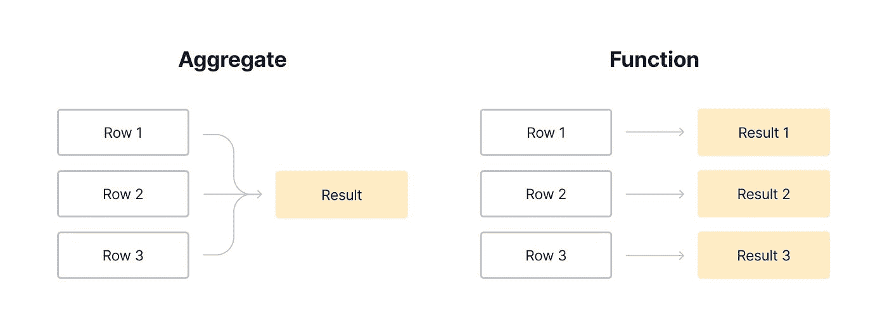

在 SQL 中，聚合从多行产生一个结果，而函数每行产生一个结果。作者图片

这并不是说一个函数不能有来自多个列的输入；他们必须来自同一排。

另一种思考方式是，函数通常作用于行，而聚合作用于列。为了说明这一点，让我们考虑一个有两列的理论表`foo`:

```
CREATE TABLE foo(
	bar DOUBLE PRECISION,
	baz DOUBLE PRECISION);
```

只有几个值，所以我们可以很容易地看到发生了什么:

```
INSERT INTO foo(bar, baz) VALUES (1.0, 2.0), (2.0, 4.0), (3.0, 6.0);
```

函数`greatest()`将为每行产生列`bar`和`baz`中的最大值:

```
SELECT greatest(bar, baz) FROM foo; 
 greatest 
----------
        2
        4
        6
```

而聚合`max()`将从每一列中产生最大值:

```
SELECT max(bar) as bar_max, max(baz) as baz_max FROM foo;

 bar_max | baz_max 
---------+---------
       3 |       6
```

使用上面的数据，这里有一个当我们聚合一些东西时会发生什么的图片:

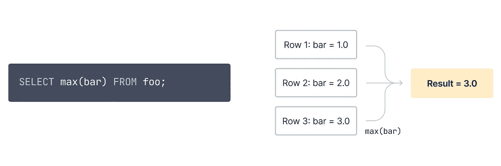

“max()”聚合从多行中获取最大值。作者图片

该聚合从多行中获取输入，并生成一个结果。这是它和函数的主要区别，但是它是怎么做到的呢？让我们看看它在引擎盖下做什么。

# 聚合内部:逐行

在后台，PostgreSQL 中的聚合是逐行工作的。但是，聚合如何知道前面的行呢？

好吧，一个聚合存储一些它以前看到的行的状态，当数据库看到新的行时，它更新内部状态。

对于我们一直在讨论的`max()`集合，内部状态就是我们迄今为止收集到的最大值。

让我们一步一步来。

当我们开始时，我们的内部状态是`NULL`，因为我们还没有看到任何行:

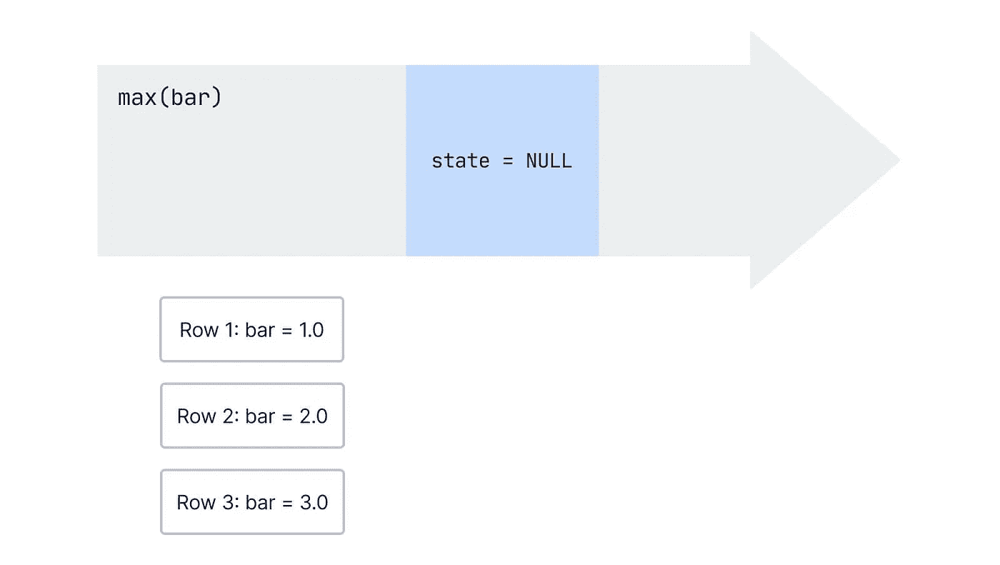

作者图片

然后，我们进入第一行:

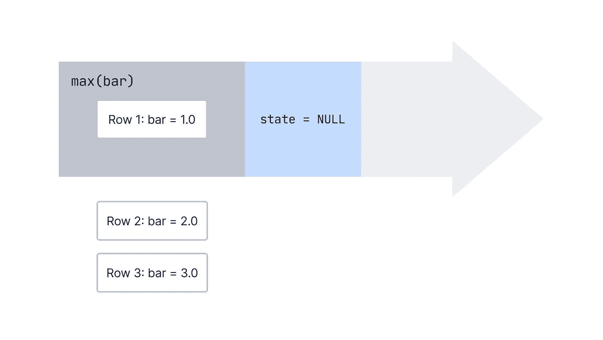

作者图片

由于我们的状态是`NULL`，我们将其初始化为我们看到的第一个值:

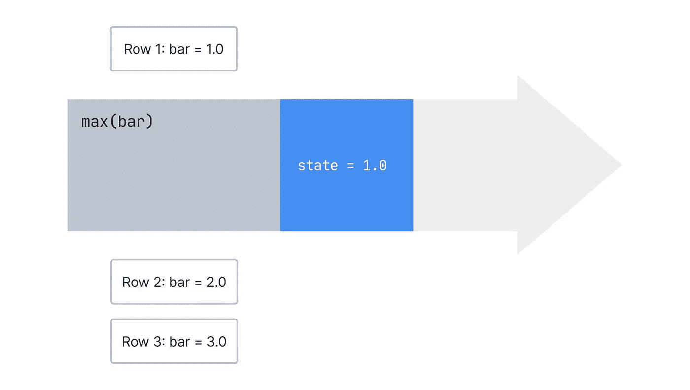

作者图片

现在，我们得到第二行:

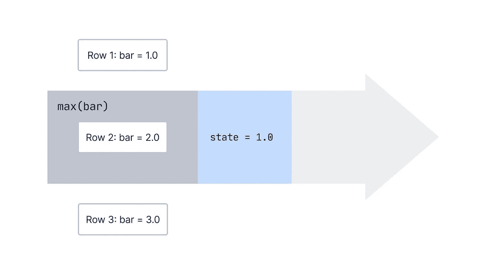

作者图片

我们看到 bar 的值(2.0)大于我们当前的状态(1.0)，所以我们更新状态:

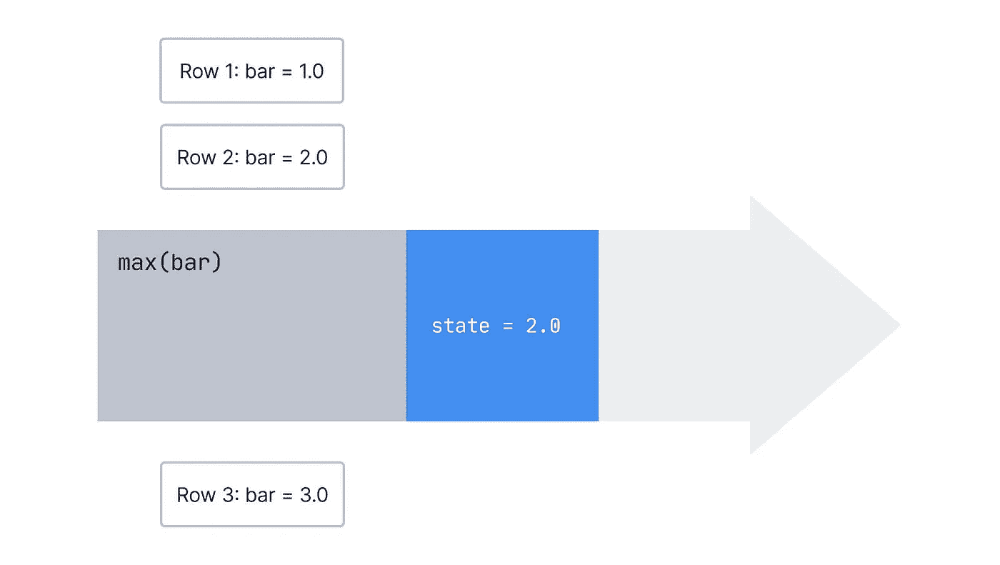

作者图片

然后，下一行进入聚合:

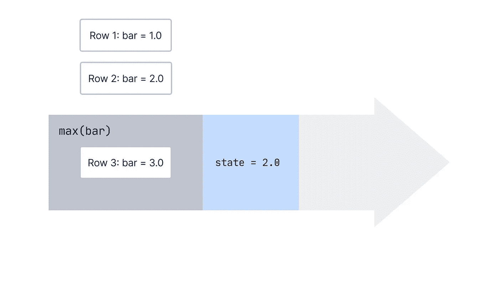

作者图片

我们将其与当前状态进行比较，取最大值，并更新我们的状态:

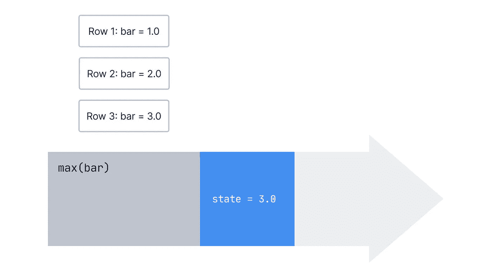

作者图片

最后，我们没有更多要处理的行，所以我们输出结果:

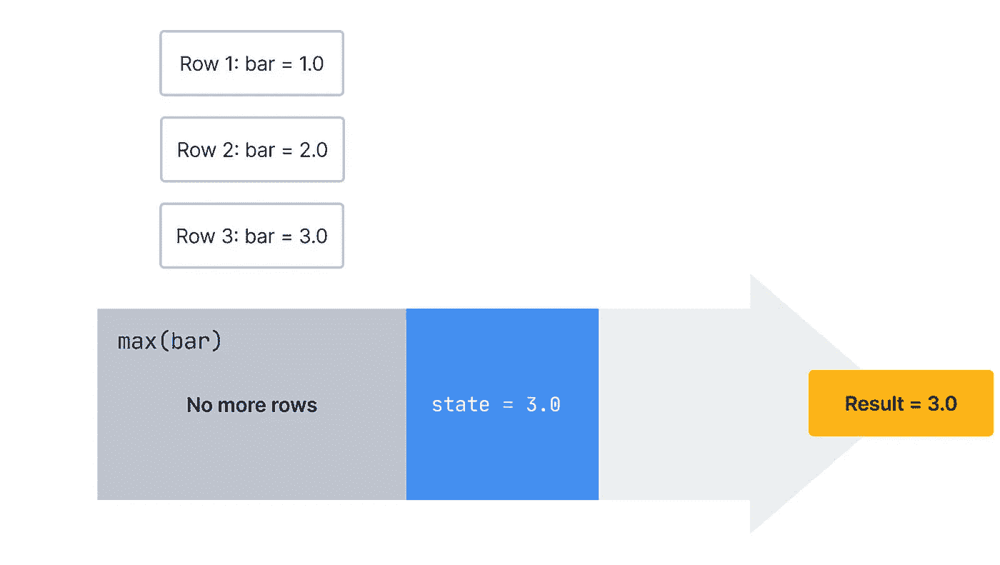

作者图片

所以，总结一下，每一行进来，与我们当前的状态进行比较，然后状态被更新以反映新的最大值。然后下一行进来，我们重复这个过程，直到我们处理完所有的行并输出结果。

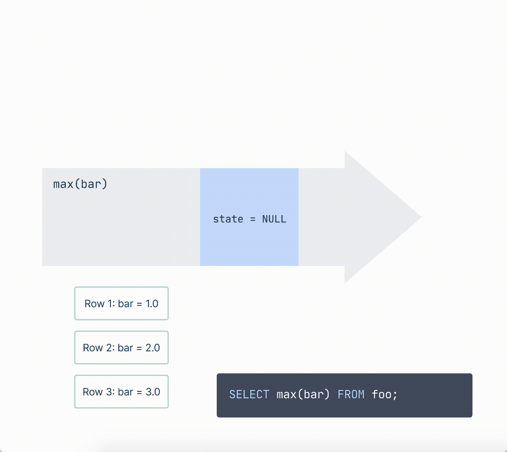

最大聚集聚集过程，用 gif 表示。作者图片

处理每一行并更新内部状态的函数有一个名字: [**状态转换函数**](https://www.postgresql.org/docs/current/sql-createaggregate.html) (或者简称为“转换函数”)。)聚合的转换函数将当前状态和传入行中的值作为参数，并生成一个新状态。

它是这样定义的，其中`current_value`表示来自传入行的值，`current_state`表示在前面的行上构建的当前聚合状态(如果我们还没有得到任何值，则为 NULL)，而`next_state`表示分析传入行后的输出:

```
next_state = transition_func(current_state, current_value)
```

# 聚集内部:复合状态

因此，`max()`聚合有一个简单的状态，只包含一个值(我们见过的最大值)。但并不是 PostgreSQL 中的所有聚合都有这样简单的状态。

让我们考虑一下平均值的总数(`avg`):

```
SELECT avg(bar) FROM foo;
```

为了刷新，平均值定义为:

\ begin { equation } avg(x)= \ frac { sum(x)} { count(x)} \ end { equation }

为了计算它，我们将总和和计数存储为我们的内部状态，并在处理行时更新我们的状态:

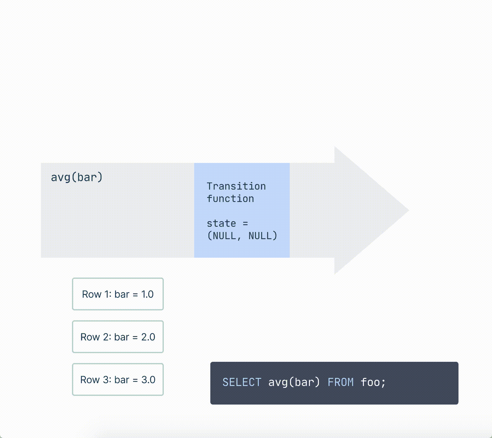

“avg()”聚合过程，用 gif 表示。对于“avg()”,转换函数必须更新更复杂的状态，因为 sum 和 count 在每个聚合步骤都是分开存储的。作者图片

但是，当我们准备输出`avg`的结果时，我们需要将`sum`除以`count`:

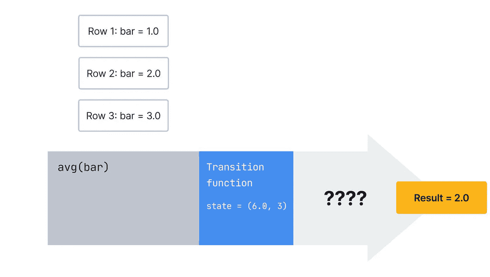

对于某些聚合，我们可以直接输出状态，但是对于其他聚合，我们需要在计算最终结果之前对状态执行操作。作者图片

聚合内部还有另一个函数执行这个计算:最终函数[**。一旦我们处理完所有的行，最后一个函数就会获取状态，并做任何需要的事情来产生结果。**](https://www.postgresql.org/docs/current/sql-createaggregate.html)

它是这样定义的，其中`final_state`表示转换函数处理完所有行后的输出:

```
result = final_func(final_state)
```

并且，通过图片:


平均总量是如何工作的，用 gif 来表示。这里，我们强调最后一个函数的作用。作者图片

总结一下:当一个聚集扫描行时，它的**转换函数**更新它的内部状态。一旦聚合扫描了所有的行，它的**最终函数**就会产生一个结果，并返回给用户。

# 提高聚合函数的性能

这里要注意一件有趣的事情:transition 函数被调用的次数比 final 函数多得多:每一行调用一次，而 final 函数每*组*行调用一次。

现在，在每次调用的基础上，转换函数本身并不比最终函数更昂贵，但是因为通常进入聚合的行数比出来的行数多几个数量级，所以转换函数步骤很快成为最昂贵的部分。当您以高速率摄取大量时间序列数据时，尤其如此；优化聚合转换函数调用对于提高性能非常重要。

幸运的是，PostgreSQL 已经有了优化聚合的方法。

# 并行化和组合功能

因为转移函数是在每一行上运行的，[一些有进取心的 PostgreSQL 开发人员](https://www.postgresql.org/message-id/flat/CA%2BTgmoYSL_97a--qAvdOa7woYamPFknXsXX17m0t2Pwc%2BFOvYw%40mail.gmail.com#fb9f2ae2a52ac605a4439a1879ff3c10)问:*如果我们并行化转移函数计算会怎么样？*

让我们重温一下我们对转移函数和最终函数的定义:

```
next_state = transition_func(current_state, current_value)

result = final_func(final_state)
```

我们可以通过实例化转换函数的多个副本并将行的子集传递给每个实例来并行运行。然后，每个并行聚合将在其看到的行子集上运行转换函数，产生多个(部分)状态，每个并行聚合一个状态。但是，由于我们需要聚合整个*数据集，我们不能分别在每个并行聚合上运行最终函数，因为它们只有一些行。*

所以，现在我们已经陷入了一点困境:我们有多个部分聚合状态，而 final 函数只对单个最终状态起作用——就在我们将结果输出给用户之前。

为了解决这个问题，我们需要一种新型的函数，它采用两个部分状态并将它们合并成一个状态，这样最终的函数就可以完成它的工作。这被(恰当地)称为 [**合并功能**](https://www.postgresql.org/docs/current/sql-createaggregate.html) 。

我们可以对并行化聚合时创建的所有部分状态迭代运行 combine 函数。

```
combined_state = combine_func(partial_state_1, partial_state_2)
```

例如，在`avg`中，组合功能会将计数和总和相加。

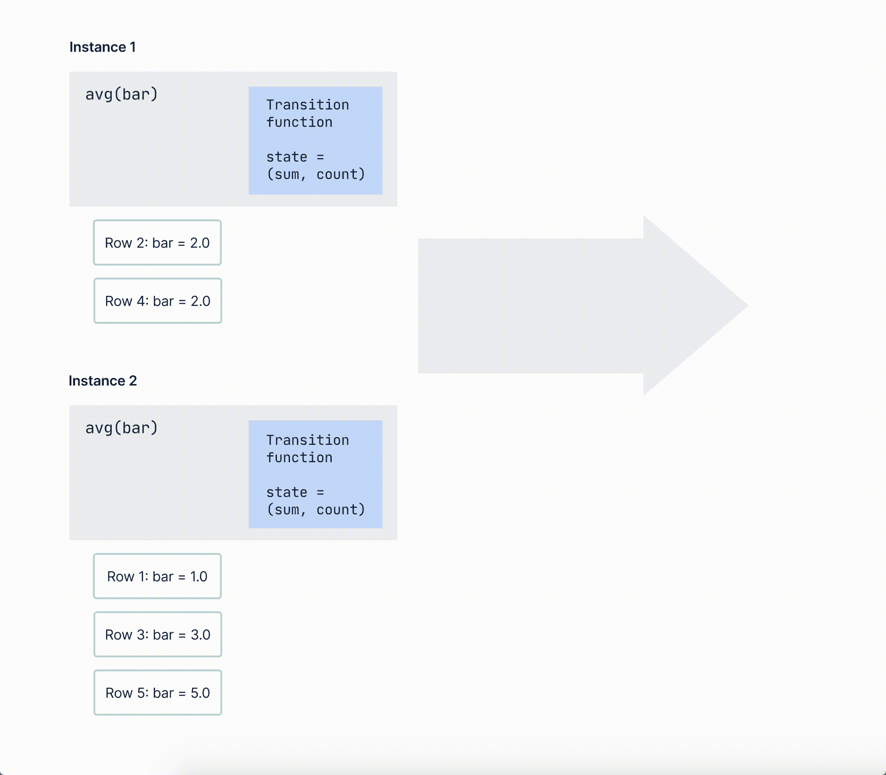

并行聚合如何工作，用 gif 讲述。这里，我们突出显示了 combine 函数(我们添加了几行来说明并行聚合。)作者图片

然后，当我们从所有并行聚合中获得组合状态后，我们运行最终函数并获得结果。

# 重复数据删除

并行化和组合函数是降低调用聚合成本的一种方法，但不是唯一的方法。

降低聚合成本的另一个内置 PostgreSQL 优化出现在如下语句中:

```
SELECT avg(bar), avg(bar) / 2 AS half_avg FROM foo;
```

PostgreSQL 将优化该语句，只对`avg(bar)`计算求值一次，然后使用该结果两次。

并且，如果我们有不同的聚集，有相同的转移函数，但是不同的最终函数呢？PostgreSQL 通过在所有行上调用转换函数(昂贵的部分),然后执行两个最终函数来进一步优化！相当整洁！

现在，这不是 PostgreSQL 聚合所能做的全部，但这是一次很好的旅行，足以让我们今天到达我们需要去的地方。

# 时标超函数中的两步聚合

在 TimescaleDB 中，我们为聚合函数实现了两步聚合设计模式。这概括了 PostgreSQL 内部聚合 API，并通过我们的聚合、访问器和汇总函数将其公开给用户。(换句话说，每个内部 PostgreSQL 函数在 TimescaleDB hyperfunctions 中都有一个等价的函数。)

作为复习，当我们谈论两步聚合设计模式时，我们指的是下面的约定，其中我们有一个内部聚合调用:


和一个外部访问器调用:


内部聚合调用返回内部状态，就像 PostgreSQL 聚合中的转换函数一样。

外部访问器调用获取内部状态并将结果返回给用户，就像 PostgreSQL 中的 final 函数一样。

我们还为每个聚合定义了特殊的`rollup`函数[，其工作方式非常类似于 PostgreSQL 组合函数。](https://docs.timescale.com/api/latest/hyperfunctions/time-weighted-averages/rollup-timeweight/?utm_source=tds&utm_medium=blog&utm_campaign=hyperfunctions-1-0-2021&utm_content=docs-time-weighted-averages)

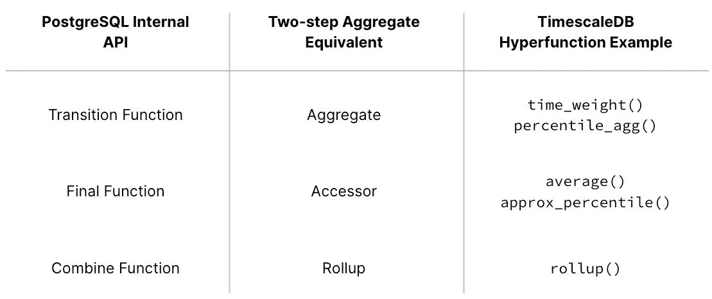

PostgreSQL 内部聚合 API 及其 TimescaleDB hyperfunctions 的等效项。图片作者。

# 为什么我们使用两步聚合设计模式

我们向用户公开两步聚合设计模式，而不是将其作为内部结构，有四个基本原因:

1.  允许多参数聚合重用状态，从而提高效率
2.  清楚地区分影响聚合和访问器的参数，使性能含义更容易理解和预测
3.  在连续聚合和窗口函数(我们对连续聚合最常见的要求之一)中实现易于理解的汇总，并获得逻辑一致的结果
4.  随着需求的变化，允许更容易的*追溯分析*连续聚合中的缩减采样数据，但是数据已经消失了

这有点理论性，所以让我们深入解释每一个。

# 重用状态

PostgreSQL 非常擅长优化语句(正如我们在本文前面看到的，通过图片🙌)，但是你要用它能理解的方式给它东西。

例如，[当我们谈到重复数据删除](https://blog.timescale.com/blog/how-postgresql-aggregation-works-and-how-it-inspired-our-hyperfunctions-design-2/?utm_source=tds&utm_medium=blog&utm_campaign=hyperfunctions-1-0-2021&utm_content=how-aggregration-works-blog#deduplication)时，我们看到 PostgreSQL 可以“发现”一个语句在查询中出现多次的情况(即`avg(bar)`)，并且只运行该语句一次以避免重复工作:

```
SELECT avg(bar), avg(bar) / 2 AS half_avg FROM foo;
```

这是可行的，因为`avg(bar)`出现多次而没有变化。

然而，如果我以稍微不同的方式写这个等式，并将圆括号内的除法*移到圆括号内，这样表达式`avg(bar)`就不会那么整齐地重复，PostgreSQL *就不能*想出如何优化它:*

```
SELECT avg(bar), avg(bar / 2) AS half_avg FROM foo;
```

它不知道除法是可交换的，也不知道这两个查询是等价的。

对于数据库开发人员来说，这是一个需要解决的复杂问题，因此，作为 PostgreSQL 用户，您需要确保以数据库能够理解的方式编写查询。

数据库不理解的等价语句导致的性能问题是相等的(或者在您编写的特定情况下相等，但在一般情况下不相等),这可能是用户需要解决的最棘手的 SQL 优化问题。

因此，**当我们设计 API 时，我们试图让用户很难无意中编写低性能代码:换句话说，默认选项应该是高性能选项**。

对于下一点，将一个简单的表定义为以下内容会很有用:

```
CREATE TABLE foo(
	ts timestamptz, 
	val DOUBLE PRECISION);
```

让我们看一个例子，看看我们如何在百分位数近似超函数[中使用两步聚合来允许 PostgreSQL 优化性能。](https://docs.timescale.com/api/latest/hyperfunctions/percentile-approximation/?utm_source=tds&utm_medium=blog&utm_campaign=hyperfunctions-1-0-2021&utm_content=docs-percentile-approximation)

```
SELECT 
    approx_percentile(0.1, percentile_agg(val)) as p10, 
    approx_percentile(0.5, percentile_agg(val)) as p50, 
    approx_percentile(0.9, percentile_agg(val)) as p90 
FROM foo;
```

…被视为等同于:

```
SELECT 
    approx_percentile(0.1, pct_agg) as p10, 
    approx_percentile(0.5, pct_agg) as p50, 
    approx_percentile(0.9, pct_agg) as p90 
FROM 
(SELECT percentile_agg(val) as pct_agg FROM foo) pct;
```

这种调用约定允许我们使用相同的聚合，因此，在后台，PostgreSQL 可以对相同聚合的调用进行重复数据删除(因此速度更快)。

现在，让我们将其与一步聚合方法进行比较。

PostgreSQL 在这里无法对聚合调用进行重复数据删除，因为`approx_percentile`聚合中的额外参数会随着每次调用而改变:

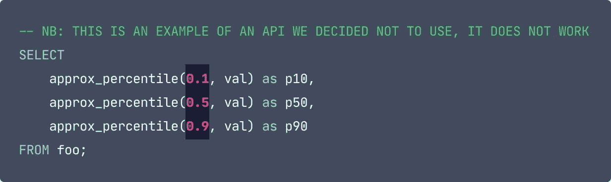

因此，即使所有这些函数都可以对所有行使用相同的近似值，PostgreSQL 也无法知道。两步聚合方法使我们能够构建我们的调用，以便 PostgreSQL 可以优化我们的代码，并且它使开发人员能够了解什么时候东西会更贵，什么时候不会。具有不同输入的多个不同聚合的成本会很高，而对同一个聚合的多个访问器的成本会低得多。

# 清楚地区分聚合/访问器参数

我们还选择了两步聚合方法，因为我们的一些聚合本身可以接受多个参数或选项，并且它们的访问器也可以接受选项:

```
SELECT
    approx_percentile(0.5, uddsketch(1000, 0.001, val)) as median,--1000 buckets, 0.001 target err
    approx_percentile(0.9, uddsketch(1000, 0.001, val)) as p90, 
    approx_percentile(0.5, uddsketch(100, 0.01, val)) as less_accurate_median -- modify the terms for the aggregate get a new approximation
FROM foo;
```

这是一个`uddsketch`的例子，一个[的高级聚集方法](https://docs.timescale.com/api/latest/hyperfunctions/percentile-approximation/percentile-aggregation-methods/?utm_source=tds&utm_medium=blog&utm_campaign=hyperfunctions-1-0-2021&utm_content=docs-hyperfunctions-perncentile-approx##choosing-the-right-algorithm-for-your-use-case)，用于百分点近似值，可以采用自己的参数。

想象一下，如果这些参数混杂在一个集合中:

```
-- NB: THIS IS AN EXAMPLE OF AN API WE DECIDED NOT TO USE, IT DOES NOT WORK
SELECT
    approx_percentile(0.5, 1000, 0.001, val) as median
FROM foo;
```

很难理解哪个参数与功能的哪个部分相关。

相反，两步方法非常清楚地将访问器的参数与聚合的参数分开，其中聚合函数定义在最终函数输入的括号中:

```
SELECT
    approx_percentile(0.5, uddsketch(1000, 0.001, val)) as median
FROM foo;
```

通过明确哪个是哪个，用户可以知道，如果他们改变聚集的输入，他们将获得更多(昂贵的)聚集节点，而访问器的输入改变起来更便宜。

所以，这是我们公开 API 的前两个原因——以及它允许开发人员做的事情。最后两个原因涉及连续聚集以及它们如何与超功能相关，所以首先，快速复习一下它们是什么。

# 两步聚合+时标连续聚合 b

TimescaleDB 包括一个名为[连续聚合](https://docs.timescale.com/timescaledb/latest/how-to-guides/continuous-aggregates/?utm_source=tds&utm_medium=blog&utm_campaign=hyperfunctions-1-0-2021&utm_content=docs-continuous-aggs)的特性，旨在使大型数据集上的查询运行得更快。TimescaleDB continuous 聚合在后台连续并增量地存储聚合查询的结果，因此当您运行该查询时，只需要计算已更改的数据，而不是整个数据集。

在上面对组合函数[、](https://blog.timescale.com/blog/how-postgresql-aggregation-works-and-how-it-inspired-our-hyperfunctions-design-2/#deduplication)的讨论中，我们介绍了如何在每行上计算转换函数，并在多个并行聚合上拆分行，以加快计算速度。

TimescaleDB 连续聚合做一些类似的事情，除了它们将计算工作分布在*时间*上，而不是在同时运行的并行进程之间。连续聚合对过去某个时间插入的行子集计算转换函数，存储结果，然后在查询时，我们只需要计算最近一小段时间的原始数据，我们还没有计算这些数据。

当我们设计 TimescaleDB hyperfunctions 时，我们希望它们能够在连续聚合中很好地工作，甚至为用户开辟新的可能性。

假设我从上面的简单表格中创建了一个连续聚合，以 15 分钟为增量计算总和、平均值和百分比(后者使用了一个超函数):

```
CREATE MATERIALIZED VIEW foo_15_min_agg
WITH (timescaledb.continuous)
AS SELECT id,
    time_bucket('15 min'::interval, ts) as bucket,
    sum(val),
    avg(val),
    percentile_agg(val)
FROM foo
GROUP BY id, time_bucket('15 min'::interval, ts);
```

如果我回来后想将数据重新聚合到小时或天，而不是 15 分钟，或者需要聚合所有 id 的数据，该怎么办？我可以为哪些集合这样做，哪些不可以？

# 逻辑一致的汇总

我们希望通过两步聚合解决的一个问题是，如何向用户传达何时可以重新聚合，何时不可以。(所谓“好的”，我的意思是从重新聚合的数据中得到的结果与直接在原始数据上运行聚合得到的结果是一样的。)

例如:

```
SELECT sum(val) FROM tab;
-- is equivalent to:
SELECT sum(sum) 
FROM 
    (SELECT id, sum(val) 
    FROM tab
    GROUP BY id) s;
```

但是:

```
SELECT avg(val) FROM tab;
-- is NOT equivalent to:
SELECT avg(avg) 
FROM 
    (SELECT id, avg(val) 
    FROM tab
    GROUP BY id) s;
```

为什么重新聚合对`sum`可以，对`avg`不行？

从技术上讲，在以下情况下重新聚合在逻辑上是一致的:

*   聚合返回内部聚合状态。`sum`的内部聚集状态是`(sum)`，而对于平均而言，是`(sum, count)`。
*   集合的组合和转移函数是等价的。对于`sum()`，状态和操作相同。对于`count()`，状态*与状态*相同，但是转换和组合功能*对它们执行不同的操作*。`sum()`的 transition 函数将传入的值添加到状态中，它的 combine 函数将两个状态相加，或者相加。相反地，`count()` s 转换函数为每个输入值增加状态，但是它的组合函数将两个状态相加，或者是计数的和。

但是，您必须对每个聚合的内部有深入的(有时甚至是晦涩的)了解，才能知道哪些符合上述标准，从而知道哪些可以重新聚合。

**使用两步聚合方法，当聚合允许时，我们可以通过公开组合函数的等价物来传达重新聚合在逻辑上是一致的。**

我们称这个函数为`rollup()`。`Rollup()`从聚合中获取多个输入，并将它们组合成一个值。

我们所有可以组合的聚合都有`rollup`函数，该函数将组合来自两组不同行的聚合输出。(从技术上讲，`rollup()`是一个聚合函数，因为它作用于多行。为了清楚起见，我将它们称为 rollup 函数，以区别于基本聚合)。然后就可以在组合输出上调用访问器了！

因此，使用我们创建的连续聚合来获得我们的`percentile_agg`的 1 天重新聚合变得简单如:

```
SELECT id, 
    time_bucket('1 day'::interval, bucket) as bucket, 
    approx_percentile(0.5, rollup(percentile_agg)) as median
FROM foo_15_min_agg
GROUP BY id, time_bucket('1 day'::interval, bucket);
```

(正是因为这个原因，我们实际上建议您在不调用访问器函数的情况下创建连续聚合。然后，您可以在上面创建视图或将访问器调用放入您的查询中)。

这就引出了我们的最后一个原因。

# 使用连续总量的回顾性分析

当我们创建一个连续的聚合时，我们定义了一个我们的数据视图，然后我们可能会坚持很长一段时间。

例如，我们可能有一个在 X 时间段后删除底层数据的数据保留策略。如果我们想要返回并重新计算任何东西，即使不是不可能，也是具有挑战性的，因为我们已经“丢弃”了数据。

但是，我们知道在现实世界中，你并不总是提前知道你需要分析什么。

因此，我们设计了使用两步聚合方法的超功能，因此它们可以更好地与连续聚合集成。因此，用户将聚集状态存储在连续聚集视图中，并修改访问器函数*，而不需要*要求他们重新计算可能难以(或不可能)重建的旧状态(因为数据被存档、删除等)。).

两步聚合设计还为连续聚合提供了更大的灵活性。例如，让我们来看一个连续聚合，其中我们执行两步聚合的聚合部分，如下所示:

```
CREATE MATERIALIZED VIEW foo_15_min_agg
WITH (timescaledb.continuous)
AS SELECT id,
    time_bucket('15 min'::interval, ts) as bucket,
    percentile_agg(val)
FROM foo
GROUP BY id, time_bucket('15 min'::interval, ts);
```

当我们第一次创建聚合时，我们可能只想得到中位数:

```
SELECT
    approx_percentile(0.5, percentile_agg) as median
FROM foo_15_min_agg;
```

但是后来，我们决定也想知道第 95 百分位。

幸运的是，我们不必修改连续集合；我们**只需修改原始查询中访问器函数的参数，以从聚合状态**返回我们想要的数据:

```
SELECT
    approx_percentile(0.5, percentile_agg) as median,
    approx_percentile(0.95, percentile_agg) as p95
FROM foo_15_min_agg;
```

然后，如果一年后，我们也想要第 99 百分位，我们也可以这样做:

```
SELECT
    approx_percentile(0.5, percentile_agg) as median,
    approx_percentile(0.95, percentile_agg) as p95,
    approx_percentile(0.99, percentile_agg) as p99
FROM foo_15_min_agg;
```

那只是触及表面。最终，我们的目标是提高开发人员的工作效率，增强 PostgreSQL 和 TimescaleDB 的其他功能，如聚合重复数据删除和连续聚合。

# 两步聚合设计如何影响 hyperfunctions 代码的示例

为了说明两步聚合设计模式如何影响我们对超函数的思考和编码，让我们看看[时间加权平均函数族](https://docs.timescale.com/api/latest/hyperfunctions/time-weighted-averages/?utm_source=tds&utm_medium=blog&utm_campaign=hyperfunctions-1-0-2021&utm_content=docs-time-weighted-averages)。(我们的[什么是时间加权平均值，为什么你应该关心这个问题](https://blog.timescale.com/blog/what-time-weighted-averages-are-and-why-you-should-care/?utm_source=tds&utm_medium=blog&utm_campaign=hyperfunctions-1-0-2021&utm_content=blog-time-weighted-averages)帖子为下一点提供了很多背景知识，所以如果你还没有阅读它，我们建议你阅读它。你也可以暂时跳过这一步。)

时间加权平均值的计算公式如下:

\ begin { equation } time \ _ weighted \ _ average = \ frac { area \ _ under \ _ curve } \ end { equation }

正如我们在上述的[表中所指出的:](https://blog.timescale.com/blog/how-postgresql-aggregation-works-and-how-it-inspired-our-hyperfunctions-design-2/#agg-table)

*   `time_weight()`是 TimescaleDB hyperfunctions 的聚合，对应于 PostgreSQL 内部 API 中的 transition 函数。
*   `average()`是访问器，对应 PostgreSQL final 函数。
*   `rollup()` for re-aggregation 对应于 PostgreSQL 的 combine 函数。

`time_weight()`函数返回一个集合类型，该集合类型必须可供该系列中的其他函数使用。

在这种情况下，我们决定使用一个`TimeWeightSummary`类型，它是这样定义的(用伪代码):

```
TimeWeightSummary = (w_sum, first_pt, last_pt)
```

`w_sum`是加权和(曲线下面积的另一个名称)，而`first_pt`和`last_pt`是进入`time_weight()`聚合的行中的第一个和最后一个(时间，值)对。

下面是这些元素的图形描述，它建立在我们的[如何导出时间加权平均理论描述](https://blog.timescale.com/blog/what-time-weighted-averages-are-and-why-you-should-care/#mathy-bits-how-to-derive-a-time-weighted-average)的基础上:

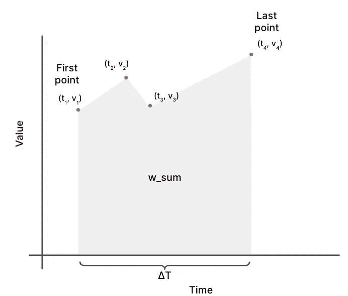

我们存储在“TimeWeightSummary”表示中的值的描述。图片作者。

因此，`time_weight()`聚合在接收我们图表中的每个点时进行所有的计算，并为它“看到”的第一个和最后一个点之间的时间段(δT)构建一个加权和然后输出`TimeWeightSummary`。

`average()`访问器函数执行简单的计算，从`TimeWeightSummary`返回时间加权平均值(在伪代码中，其中`pt.time()`从该点返回时间):

```
func average(TimeWeightSummary tws) 
	-> float {
		delta_t = tws.last_pt.time - tws.first_pt.time;
		time_weighted_average = tws.w_sum / delta_t;
		return time_weighted_average;
	}
```

但是，当我们构建`time_weight` hyperfunction 时，确保`rollup()`函数按预期工作变得更加困难——并且引入了影响我们的`TimeWeightSummary`数据类型设计的约束。

为了理解 rollup 函数，让我们使用我们的图形示例，想象一下`time_weight()`函数从不同的时间区域返回两个`TimeWeightSummaries`，如下所示:

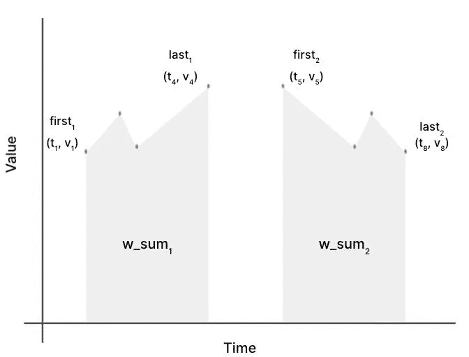

当我们有多个“TimeWeightSummaries”代表图形的不同区域时会发生什么？图片作者。

`rollup()`函数需要接受并返回相同的`TimeWeightSummary`数据类型，以便我们的`average()`访问器能够理解它。(这反映了 PostgreSQL 的 combine 函数如何从 transition 函数接收两个状态，然后返回一个状态供最终函数处理)。

我们还希望`rollup()`的输出与我们对所有底层数据计算`time_weight()`的输出相同。输出应该是代表整个区域的`TimeWeightSummary`。

我们输出的`TimeWeightSummary`还应考虑这两个加权和状态之间的间隙面积:

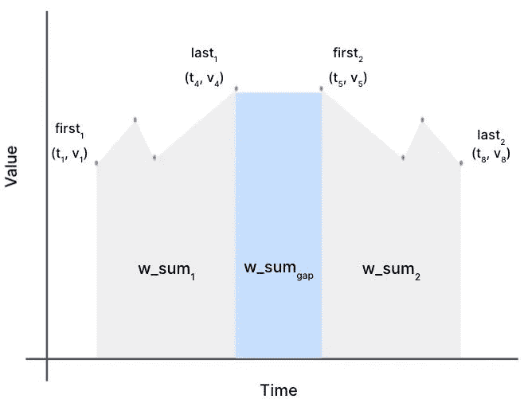

小心空隙！(在一个“TimeWeightSummary”和下一个之间)。图片作者。

差距区域很容易获得，因为我们有最后 1 个点和前 2 个点，这与我们通过对它们运行`time_weight()`聚合获得的`w_sum`相同。

因此，整个`rollup()`函数需要做这样的事情(其中`w_sum()`从`TimeWeightSummary`中提取加权和):

```
func rollup(TimeWeightSummary tws1, TimeWeightSummary tws2) 
	-> TimeWeightSummary {
		w_sum_gap = time_weight(tws1.last_pt, tws2.first_pt).w_sum;
		w_sum_total = w_sum_gap + tws1.w_sum + tws2.w_sum;
		return TimeWeightSummary(w_sum_total, tws1.first_pt, tws2.last_pt);
	}
```

从图形上看，这意味着我们将以一个代表整个区域的`TimeWeightSummary`结束:

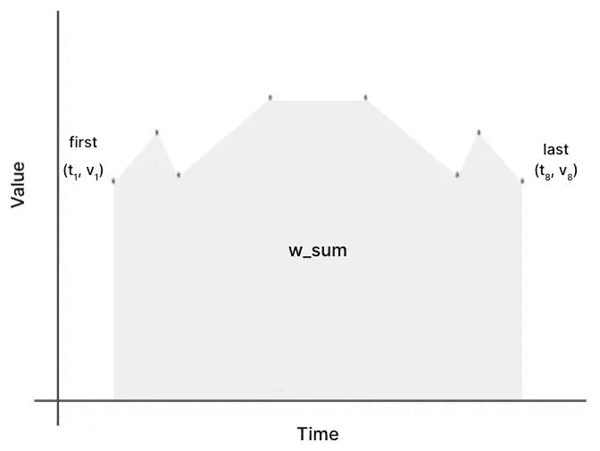

合起来`TimeWeightSummary`。图片作者。

这就是两步总体设计方法最终如何影响我们的时间加权平均超函数的现实世界实施。上面的解释有点浓缩，但是它们应该让您更具体地了解`time_weight()`聚合、`average()`访问器和`rollup()`函数是如何工作的。

# 总结一下

现在，您已经了解了 PostgreSQL 聚合 API，它是如何启发我们开发 TimescaleDB hyperfunctions 两步聚合 API 的，以及它在实践中如何工作的几个示例，我们希望您亲自尝试一下，并告诉我们您的想法:)。

**如果你想马上开始使用 hyperfunctions，** [**启动一个完全托管的 TimescaleDB 服务并免费试用**](https://console.forge.timescale.com/signup/?utm_source=tds&utm_medium=blog&utm_campaign=hyperfunctions-1-0-2021&utm_content=forge-console-signup) **。在时标 Forge 上，每个新的数据库服务都预装了 Hyperfunctions，所以在你创建一个新的服务之后，你就可以使用它们了！**

**如果你喜欢管理自己的数据库实例，你可以** [**下载并在 GitHub 上安装 timescaledb_toolkit 扩展**](https://github.com/timescale/timescaledb-toolkit) ，之后你就可以使用`time_weight`和所有其他的超功能了。

**如果您对这篇博客文章有任何问题或评论，** [**我们已经在 GitHub 页面上开始了讨论，我们希望收到您的回复**](https://github.com/timescale/timescaledb-toolkit/discussions/196) 。

我们喜欢在公共场合进行构建，你可以在 GitHub 上查看我们[即将发布的路线图，以获得提议的功能、我们当前正在实现的功能以及今天可以使用的功能的列表。作为参考，两步聚集体方法不仅仅用在这里讨论的稳定超函数中；它也用于我们的许多实验功能，包括](https://github.com/timescale/timescaledb-toolkit)

*   `stats_agg()`使用两步聚合使简单的统计聚合，如平均值和标准差，更容易在连续聚合中工作，并[简化滚动平均值的计算](https://github.com/timescale/timescaledb-toolkit/blob/main/docs/rolling_average_api_working.md)。
*   `[counter_agg()](https://github.com/timescale/timescaledb-toolkit/blob/main/docs/counter_agg.md)`使用两步聚合来提高计数器的工作效率和可组合性。
*   `[Hyperloglog](https://github.com/timescale/timescaledb-toolkit/blob/main/docs/hyperloglog.md)`将两步聚合与连续聚合结合使用，为用户提供更长时间内更快的近似`COUNT DISTINCT`汇总。

这些功能将很快稳定下来，但我们希望在 API 仍在发展的时候收到您的反馈。什么会让它们更直观？比较好用？[提出问题](https://github.com/timescale/timescaledb-toolkit/issues)或[开始讨论](https://github.com/timescale/timescaledb-toolkit/discussions)！

*原载于 2021 年 8 月 4 日 https://blog.timescale.com*[](https://blog.timescale.com/blog/how-postgresql-aggregation-works-and-how-it-inspired-our-hyperfunctions-design-2/)**。**