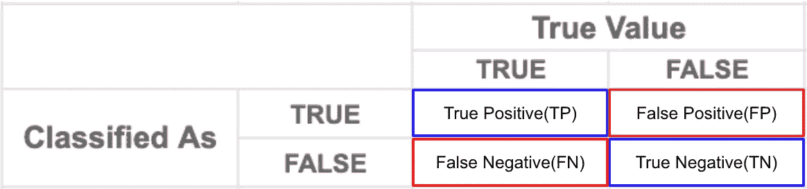

# 精确度和召回率如何影响反 COVID 度量

> 原文：<https://towardsdatascience.com/how-precision-and-recall-affect-the-anti-covid-measures-38d625de61d9?source=collection_archive---------31----------------------->

## 从统计角度看我们如何抗击疫情

埃德温·胡珀在 [Unsplash](https://unsplash.com?utm_source=medium&utm_medium=referral) 上的照片

> 考还是不考，这是一个统计学问题。

在这场与疫情的全球斗争中，台湾在保护其公民安全和健康方面表现出色，迄今为止(2021 年 17 月 1 日)总共只有 850 例确诊病例和 7 例死亡。作为一个与病毒发源地中国仅一海峡之隔的小岛，这个数字简直令人难以置信。除了比世界其他地区更早承认疫情之外，台湾从未对国际入境者强制进行新冠肺炎检测。事实上，没有几个国家实行这项政策。

为什么我们不测试所有到达的人？难道通用检测不能让我们在患者入境前识别他们，从而防止本地传播和社区传播吗？如果检测结果为阴性，为什么我仍然需要进行自我隔离？你可能会问。

这篇文章旨在回答你的问题。

来自 [Pixabay](https://pixabay.com/vectors/unimaginative-uninspired-pencil-152217/) 的[openclipbart-Vectors](https://pixabay.com/users/openclipart-vectors-30363/?utm_source=link-attribution&utm_medium=referral&utm_campaign=image&utm_content=152217)图片

为了理解这一决策背后的基本原理，我们首先需要理解两个统计指标，精确度和召回率。这是两个广泛使用的准确性指标。他们在很多决策中扮演着重要的角色。

# **混淆矩阵**

在深入研究这两个指标是什么以及它们如何影响通用测试的实施之前，我必须先向您介绍一下**‘混淆矩阵**’。

混淆矩阵

对于每一种二元测试，无论是积极的还是消极的，结果只会落入四个网格中的一个。如果结果是正确的，这意味着测试结果与真实情况匹配，它将落入左上角的网格(您有 COVID，您被测试为阳性)或右下角的网格(您没有 COVID，您被测试为阴性)。否则，它将落入右上角或左下角的网格中。

但只称结果正确或错误是不够精确的。有多正确？怎么错了？所以我们必须给每个网格起一个名字，以便更好地理解结果。命名为***‘结果的对(真)或错(假)’+‘测试结果(阳性或阴性)’***。

1.  真正的阳性:你有新冠肺炎，你测试呈阳性。
2.  真阴性:你没有感染新冠肺炎病毒，测试结果呈阴性。
3.  假阳性:你没有感染新冠肺炎病毒，但你的检测结果呈阳性。
4.  假阴性:你感染了新冠肺炎，但检测结果呈阴性。

将它们放入表格中，你会得到统计世界中最突出的表格之一:

混淆矩阵

各种测试或筛查都旨在最大限度地减少 FN 和 FP。最佳测试工具将具有 0 FN 和 0 FP。不幸的是，这种完美的、100%准确的、0 错误的测试工具还不存在(还没有？).

# 准确(性)

现在我们理解了混淆矩阵，然后我们可以进入如何评估测试结果。为了便于说明，我将使用下面的场景作为例子。

本能地，人们会认为准确性是正确的结果/总的结果。所以我们的准确率是(90+1)/(90+1+1+8)=91%。哇，真令人印象深刻！一个 95%准确率的测试工具！好吧，从技术上来说，这种说法没有错，但是你可能会通过查看混淆矩阵发现它有点奇怪。

从矩阵中，我们知道事实上有 9 个人是积极的，91 个人是消极的。大多数人持否定态度。现在想象一下，有一个测试工具，它会给每一个被测试者一个否定的结果。因此，这个测试工具仍然可以获得 91%的准确率。*高吗？* **真是高得要命！** *要不要在医院用这个检测工具？* **肯定不是！**

# 那么我们应该如何验证测试工具呢？

从这个例子中，我们知道仅仅准确性不足以评估结果。必须引入新的度量标准。这就是**精度**和**召回**的用武之地。数学上，这两个指标定义为:

**精度= TP / (TP+FP) = 1/ (1+1) = 0.5**

**召回= TP / (TP+FN) = 1/ (1+8) = 0.11**

如果我们观察这两个指标，性能会急剧下降，尤其是在召回方面。为什么会这样？测试工具有什么问题？

看着公式，在这里暂停 10 秒钟。你可能已经有了精确和回忆的概念。

## 精确

如果你看得足够近，你可以发现精度实际上是计算为 ***真正/总分类正*** 。没错！精度是指在测试结果为肯定的情况下测量的准确度。换句话说，如果你被检测为阳性，这有多准确。

> **精度**反映正面分类实际正确的比例。

如果你被这个测试工具测试为阳性，有 50%的可能性你实际上没有感染病毒。那是相当高的！你可能不想用这样精确的棉签。

当 FP 的成本很高时，精度是有用的。例如，如果我们的新冠肺炎测试精度低，这意味着有很多健康人被诊断为阳性。这些人会被错误地送到医院，接受他们没有的疾病的治疗。这不仅完全浪费了我们的卫生保健资源，还将健康的人暴露在危险的环境中，因此可能会产生更多的病人。这种恶性循环会在很短的时间内使医疗保健系统崩溃。这在某种程度上解释了为什么大多数国家不把检测呈阳性的人送到医院。

## 回忆

另一方面，召回计算为 ***真阳性/总实际阳性*** 。它衡量我们在所有阳性病例中实际识别出多少阳性病例。

> 召回表示正确识别的实际阳性病例的比例。

在这个场景中，总共有 9 个阳性案例，但是，这个测试工具只识别了其中的 1 个，也就是 11%。这很危险！你肯定不希望仅仅因为他们的检测结果是阴性，就看到很多新冠肺炎患者在街上晃荡！

FN 成本高的时候召回更重要。例如，癌症检测或信用卡欺诈检测。如果某人患有癌症，但测试呈阴性，患者将错过治疗的最佳时机。后果可能很严重。同样，如果信用卡发行商的欺诈检测算法召回率低，它可能会经常错误地将交易识别为欺诈否定(不是欺诈)并让其通过，这可能会使其客户损失大量金钱。

记住何时使用回忆的一个好方法是，当你的分类器的目标是识别一件'*坏事'*，比如癌症或身份盗窃。错过识别那些'*坏事'*极有可能导致严重后果。我们希望在这类检测中召回率尽可能高。

## 敏感性和特异性

在医学上，回忆也被称为*。还有另一个度量， ***特异性*** ，与灵敏度相反。它测量被正确识别的实际阴性病例的比例。计算方法为***TN/(TN+FP)= 90/(90+1)= 0.9****

**

> *敏感等于回忆。特异性代表正确识别的实际阴性病例的比例。*

*当记者向学者或官员询问专业意见时，你可能会在新闻中更多地看到这两个术语。*

# *这些和通用测试有什么关系？*

*现在我们终于可以进入主题了，所有这些指标是如何影响是否对国际抵达者实施普遍测试的决定的？*

*想象一下，我们有一个测试工具，可以达到 85%的灵敏度和 95%的特异性。以伦敦为例，目前的患病率约为 0.7%。了解这些指标的含义后，我们可以从每 100，000 次测试中得出以下矩阵:*

**

## *假阳性的人*

*我们需要注意的数字是假阳性和假阴性。有 4965 个假阳性，他是健康的，但被检测为阳性。从前面提到的例子中，我们已经知道这些人将会浪费我们的医疗资源，并且很有可能使整个系统崩溃。*

## *假阴性的人*

*另一方面，有 105 名假阴性者感染了新冠肺炎病毒，但测试呈阴性。这些人不知道他们真的会传染。他们像往常一样被送回家，很容易放松他们的预防措施，因为他们认为他们是健康的。不戴口罩，不跟别人混。最终，他们会在不知情的情况下传播病毒。社区传播通常就是这样开始的。*

*即使敏感性和特异性更高，大量的测试仍然会导致大量的 FP 和 FN。测试的数量越多，FP 和 FN 的人数就越多。*

# *结论*

*我们已经看到一些对国际入境者实施强制检测的国家，要么几乎摧毁了他们的医疗体系，比如德国，要么出现了爆炸性的社区传播，比如冰岛。对所有国际入境者进行强制检测似乎不是战胜病毒的最佳方式。*

*当然，在政府起草和执行政策时，情况要复杂得多。我不是流行病专家，这只是整体情况的一个方面。不过，当我们讨论应否实施普及检查时，与其责备政府不要做任何事，倒不如说一些简单的概念可以让我们有一个更理性的论点。*

*我希望这个故事能帮助你理解一些统计概念，以及我们如何将它们应用到现实世界的问题中。*

## *参考:*

*[准确度、精密度、召回率还是 F1？](/accuracy-precision-recall-or-f1-331fb37c5cb9)*

*[精确度、召回率、灵敏度和特异性。](https://uberpython.wordpress.com/2012/01/01/precision-recall-sensitivity-and-specificity/)*

*[分类:精度和召回率](https://developers.google.com/machine-learning/crash-course/classification/precision-and-recall)。*

*[伦敦冠状病毒数据](https://data.london.gov.uk/dataset/coronavirus--covid-19--cases)*

*[灵敏度和特异性](https://en.wikipedia.org/wiki/Sensitivity_and_specificity)*