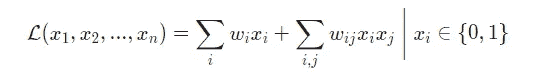
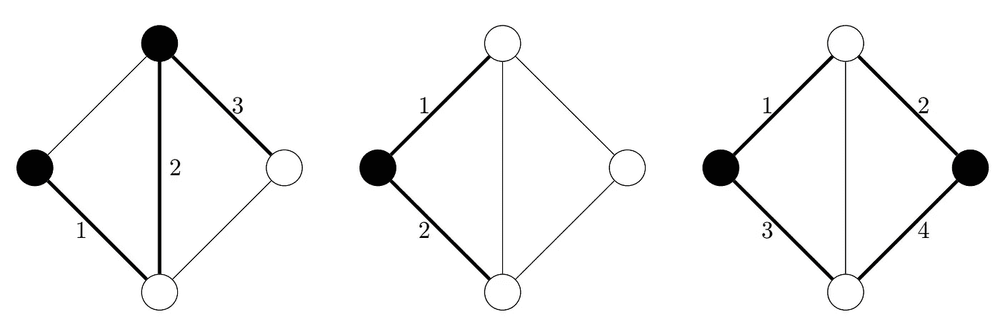
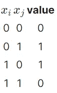
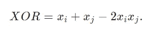
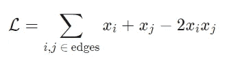
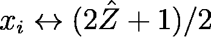
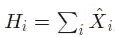
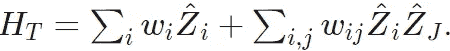

# 量子退火如何解决最难的计算问题|绝热量子计算 2

> 原文：<https://towardsdatascience.com/how-quantum-annealing-solves-the-hardest-computational-problems-adiabatic-quantum-computation-2-e16d062dfeff?source=collection_archive---------27----------------------->

## 量子退火可能价值数十亿美元或彻底失败，在此阅读它如何改变世界

Johannes W 在 [Unsplash](https://unsplash.com?utm_source=medium&utm_medium=referral) 上的照片。退火的另一个用途是通过加热然后冷却来强化金属或玻璃，这不是今天使用的定义😏。

## 本系列文章

1.  [绝热量子计算 1:绝热定理和基础](https://deepnote.com/@milanleonard/Adiabatic-Quantum-Computation-1-The-Adiabatic-Theorem-and-foundations-u-jWdi_MRF2H4gynW3TyVA)

2.[这个！](https://deepnote.com/@milanleonard/How-Quantum-Annealing-Solves-the-Hardest-Computational-Problems-or-Adiabatic-Quantum-Computation-2-ebPunK-vT-KbLKWxCLvf4Q)

预先注意:Medium 不允许数学方程的原生渲染，因此它们被强制为图像。这个里面链接的笔记本！允许打开本文末尾显示的代码，以及看到格式良好的数学。

上周，我们在绝热定理中学习了绝热量子计算的基本原理，关键要点是

*   绝热定理；如果一个量子态处于系统的基态，那么系统的任何足够慢的变化都会使量子态保持在基态
*   我们可以利用这一点得到一个通用的算法来寻找一个给定系统的基态。

该算法具有以下步骤

1.将状态初始化为一个易于设置的系统的基态，我们称之为 H_i 系统

2.构造一个基态解决问题的目标系统 H_t

3.从 H_i 慢慢演化到 H_t，读出基态。

本周，我想把重点放在算法的第二部分，并演示一个“最难”的计算问题的构造。

# 量子计算机到底擅长什么？

在我们完全投入之前，我想谈谈量子计算机有望帮助解决的一类困难的计算问题，以及为什么。

一般来说，一个问题是很难解决的，甚至很难找到一个好的解决方案，如果:

1.  可能的组合数量非常大，或者可能是无限的
2.  没有办法从当前状态转移到更好的状态。

当我们考虑具有数千个参数的参数化机器学习模型时，我们肯定会有第一个条件，即具有难以想象的大量可能设置。然而，训练过程完全取决于这样一个事实，即我们可以求导，或者有一些其他的机制，允许我们更新参数，使它们得到改善。在神经网络的情况下，可微性(求导的能力)完全取决于神经网络参数是连续的这一事实，而在决策树的情况下，数据集的变量可以排序。无论哪种情况，都不一定会是这样。

特别是在*组合优化问题*的情况下，对我们没有任何帮助。组合优化问题的一个例子是旅行推销员问题，其解决方案每年在供应链优化中价值数十亿美元。

# 简单的计算复杂性论证

当涉及到量子退火时，从计算复杂性理论中可以学到一个极其重要的教训。这是因为这些组合优化问题中的许多是 NP 完全的(并且是 NP 困难的)，这意味着它们至少和任何其他计算问题一样困难(在 NP 中)。这意味着，如果有可能用量子计算机有效地解决这些问题中的任何一个，那么就有可能有效地解决所有这些问题，因为一个问题可以有效地转化为另一个问题。

这之所以如此重要，是因为它允许我们从复杂类 NP-Complete 中研究一个特定的简单问题。在本文中，我使用最大割问题。类似地，如果一个算法对这些问题中的一个有效，那么它应该对所有这些问题都适用。

# 一个合理的一般问题公式:二次无约束二元优化问题。

二次无约束二元优化(曲波)问题有一个听起来比实际可怕得多的名字。具体来说，它们是优化数学方程(成本函数)的问题

曲波成本函数

其中 x_i=0，即 x_i 是一个二进制变量。它被称为曲波，因为它是二次的，因为它的最高阶项是 x_i x_j，它取决于两个变量，无约束，因为 w_i，w _ j 可以取任何值，二进制，因为 x_i 是一个二进制变量，最优化，因为我们试图在成本函数上最小化。

# 最大割问题。

最大割问题涉及将数学图的节点分成两组，让我们称它们为 *A* 和 *B* ，使得*最大*条边将组 *A* 的一个节点连接到组 *B* 。考虑下图，其中显示了三个不同的分区。显然，更右的分割是最佳的。然而，事实证明，要在计算上解决这个问题，没有有效的解决方案可以避免枚举每一个可能的分区。因为有 nn *n* 个节点，每个节点可能有 2 种可能的状态，这意味着通过 2^n 可能的组合进行强力搜索。

这个 5 节点图的三种可能的切割，右边的显然是最佳的。作者图片

我们可以很容易地把最大割问题转化为曲波问题。我们可以说每个节点都是一个二元变量 x_i，0 表示它是有色的(A 组)，1 表示它是白色的(B 组)。如果 x_i≠x_j，则一条边计数为最大值。将此改写为二元运算，我们需要

我们可以立即认出这就是异或运算。这个等式(很容易通过替换来检查其正确性)是

因此，就曲波问题而言，成本函数是简单的

其中 edges 是这样的边的集合，使得(1，2)将节点 1 连接到节点 2。注意到这是一个最大化，如果我们想把它公式化为一个最小化问题，我们可以简单地取负数。

# 这和量子有什么关系？

所以我刚刚做了很多随机的，复杂的技术阐述，要把它和量子联系起来，我们只需要再做一次飞跃。我真的很难从这一段中删除一些术语，如果有你不明白的地方，并且对“获得要点”至关重要，请评论，我们可以在评论中进一步讨论。在量子计算中，我们实际上没有取二进制值 0 或 1 的比特。相反，我们有量子位。事实上，这些量子位实际上是自旋 1/2 系统，这意味着它不是取值 0 和 1，而是取值 1/2 和 1/2。我们还知道量子位可以同时呈现多个值*，这就是量子叠加的力量。因此，为了“检查”该值，我们对它应用一个操作，根据它的状态将它发送到 1/2 或 1/2。让我们把做这个的操作叫做^，这里我们的帽子意味着它是一个对量子对象的操作。*

*所以，要把曲波语言的问题转化成量子语言的问题，我们有一个直接的翻译*

**

# *那么最后，什么是量子退火？*

*量子退火是绝热量子计算，它有特定的限制*

*   *最初的系统是*

**

*其中 X hat 只是另一个量子算符*

*   *目标系统是*

**

*知道了我们的翻译，我们现在可以立即将任何曲波问题，如 MaxCut，转化为量子退火问题。对于那些喜欢行话的人来说，这被称为*2-局域伊辛模型*。*

# *所以让我们写点东西吧！*

*我将使用我为自己的荣誉【https://github.com/milanleonard/QuantumAnnealers[编写的一个包来简化这里的代码。这是一个名为 QuTip 的量子模拟库的简单包装。](https://deepnote.com/project/How-Quantum-Annealing-Solves-the-Hardest-Computational-Problems-or-Adiabatic-Quantum-Computation-2-ebPunK-vT-KbLKWxCLvf4Q/qanneal)*

# *万岁！我们的量子退火机得到了正确的答案*

*通过简单地枚举每一个可能的状态，这对于只有 5 个节点的情况来说是足够容易的，我们可以看到我们已经成功地获得了正确的节点分配和正确的值。*

# *关键要点*

1.  *理解量子退火本质上和曲波问题讲同一种语言*
2.  *组合优化问题真的很难，这里展示的一个特定的曲波问题是组合优化问题最难形式的一个例子*
3.  *量子退火也许能解决这些问题。*

# *我下周要讲的内容*

*第三份外卖里的“可能”其实还是挺大的“可能”。下周我想讨论量子退火的一些未知和挑战，并评估我对它们是否可行的看法。我将特别谈到*

1.  *理论上量子加速是否可能*
2.  *我们是否已经看到了它的实验证据，以及对 D 波量子退火装置的一般性讨论*
3.  *一些内在的难题，最重要的是量子位连接*

*如果您有任何问题或意见，请告诉我。我真的想尽我所能让这篇文章对读者有更多的信息和更多的用处，我得到的反馈越多，我就越能为你量身定做！*