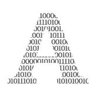

# 量子技术如何开启新领域

> 原文：<https://towardsdatascience.com/how-quantum-tech-can-unlock-new-frontiers-b68c2cce07dc?source=collection_archive---------41----------------------->

## 科学家们正在寻找暗物质。如果没有量子技术，搜索可能需要一万年——真的。

在某些领域，量子计算已经超过了经典计算机。作者图片

  A 差不多一个世纪前，荷兰天文学家雅各布斯·卡普坦首先[提出](https://ui.adsabs.harvard.edu/abs/1922ApJ....55..302K/abstract)暗物质的存在。他一直在研究星系中恒星的运动——一个星系可以粗略地描述为一堆恒星、气体和尘埃围绕一个共同的中心旋转——并注意到有些东西不对劲。星系外层的恒星旋转得太快，不符合万有引力定律。Kapteyn 的假设是，一些看不见的大质量物质可能存在于星系中和星系周围，使外层恒星达到观察到的速度。

从 20 世纪 60 年代到 80 年代，薇拉·鲁宾、肯特·福特和肯·弗里曼收集了更多的证据来支持这一假设。他们最终表明，大多数星系包含的不可见质量是可见恒星、气体和尘埃的六倍。

其他有利于暗物质的[观察](https://arxiv.org/abs/astro-ph/9407006)随之而来，比如宇宙微波背景中的引力透镜和各向异性。[引力透镜](https://www.science.org.au/curious/space-time/gravitational-lensing)是一种光束在大质量物体周围弯曲的现象；[宇宙微波背景](https://www.quantamagazine.org/how-the-cosmic-microwave-background-reveals-the-universes-contents-20200128/)是宇宙的外层，如果没有暗物质，它将是非常均匀的，但实际上是相当不均匀的。

与此同时，无数的智囊团已经设计出理论并设计出实验来追踪暗物质。然而，到目前为止，没有人真正看到过暗物质粒子。这就是为什么，即使在今天，高级科学家，以及像我这样的博士生，仍然在进行暗物质的研究。似乎发现暗物质还需要几个世纪，甚至几千年。

然而，随着量子计算的最新进展，暗物质物理学可能会经历一次巨大的推动。寻找两种类型的暗物质——科学家们实际上不知道它们是否都存在，但他们正在试图弄清楚——可能会从量子技术中受益。第一种是[轴子](https://www.symmetrymagazine.org/article/the-other-dark-matter-candidate)，它的存在可以解释为什么如果你翻转一个粒子的电荷和宇称，强核力不会改变。另一种是暗光子。这些粒子的行为类似于光的粒子光子，当然，除了暗光子根本不是光。

</why-python-is-not-the-programming-language-of-the-future-30ddc5339b66>  

# 寻找轴子

根据理论，轴子应该以特定的频率在时空中摇摆。唯一的问题是理论学家无法预测这个频率会是多少。因此，研究人员只能扫描大范围的频率，一次一个小频段。

就像旧的无线电接收器将无线电波转换成声音一样，轴子探测器将轴子波转换成电磁信号。然而，这个过程变得更加复杂，因为轴子同时以两种不同的频率振荡。

你可以想象这看起来有点像一个喝醉的人试图从聚会上回家:他们可能向右走三步，然后向左走三步，然后再向右走。那是一个频率，在“左-右”频谱上。因为它们也有严重的打嗝，不过，它们可能会在每次打嗝时跳到空中！，每四步发生一次。这是“上下”频谱上的第二个频率。

Axions 可能比喝醉的人更复杂一点，但他们也有两个频率，就像聚会上喝多了一杯的人一样。

从数学上讲，可以通过平方相加将这两个频率放在一起。也就是说，将第一个频率乘以自身，将乘以自身的第二个频率相加，然后求平方根。

在我们的酒鬼的例子中，对于第一频率，三步乘以自身等于九步的平方，对于第二频率，四步乘以自身等于十六步的平方，并且我们一起得到九步的平方加上十六步的平方的平方根是五步。在我们的例子中，这五个步骤被称为[电磁场正交](https://journals.aps.org/rmp/abstract/10.1103/RevModPhys.77.513)。

量子系统的特性使它们在寻找轴子时更有效率。作者图片

现在，通常需要在很大的频率范围内(比如 1 到 200 步)检查一个很小的频段(在我们的例子中相当于一步)。实际上，这更难。轴子频率 T3 可能在 300 赫兹到 3000 亿赫兹之间。这是一个很大很大的范围！以我们目前的方法运行的速度，覆盖这个范围可能需要[长达一万年](https://jila.colorado.edu/bibcite/reference/12122)，因为我们一次只能测试一个小的带宽。

这个带宽受到所谓的[测不准原理](https://theconversation.com/explainer-heisenbergs-uncertainty-principle-7512)的限制。所以，回到我们聚会的例子，观察者自己可能喝醉了，因此错算了两个频率。他们可能会错过两步，计算 1 的平方加上 2 的平方的平方根，大概是两步。或者他们可能会计算 5 的平方加上 7 的平方的平方根，大概是八步。这是六个步骤的带宽。因此，如果观察者想要扫描 1 到 200 步的范围，他们必须测量 33 次。然而，带宽越大，他们测量频率的频率就越低。

谢天谢地，通过一种叫做[量子压缩](https://physicstoday.scitation.org/doi/10.1063/PT.3.2596)的过程，这个带宽可以被扩大。直接从量子计算机借用超导电路，人们可以重新分配不确定性，使得一个频率比另一个频率受影响更大。

在我们的例子中，喝醉的观察者可能能够很好地计算上下频率，达到一步的精度，但他可能会错过三步左右的频率。因此，他可能会测量 0 的平方根加 1 的平方(一个步长)到 6 的平方根加 5 的平方(大约八个步长)之间的任何值。带宽因此增加了一个步长，观察者只需要测量 28 次而不是 33 次。

由耶鲁大学、加州大学伯克利分校、劳伦斯伯克利国家实验室和科罗拉多大学博尔德分校的研究人员组成的 HAYSTAC 合作组织已经完全实现了这一协议。通过量子压缩，他们已经将之前 1 万年的观测时间缩短了一半。随着进一步的改进，他们相信他们可以将寻找轴子的速度提高 10 倍。

科学家们正在集中他们的技能来更快地发现暗物质。作者图片

# 让暗光子穿过墙壁

在费米实验室，科学家们正在研究[,加速对暗光子的搜索](https://scitechdaily.com/physicists-build-a-quantum-bit-that-can-search-for-dark-matter/)。为了这一研究，他们用光子填充一个超导微波腔，并尽可能保持另一个为空。根据理论，这些光子中的一小部分应该会自发地变成暗光子。由于暗光子可以穿过墙壁(是的，野生动物)，其中一些将最终进入科学家设置的第二个空腔。这些暗光子中的一小部分会变回普通光子，然后[科学家可以探测到](https://news.fnal.gov/2020/03/quantum-and-accelerator-science-enable-mysterious-dark-sector-searches-at-fermilab/)。

然而，这些光子探测器有两个问题。首先，它们经常会返回误报。也就是说，他们表明他们发现了一个光子，尽管实际上，没有光子在陷阱里！第二，当一个光子进入探测器时，它就消失了。这意味着不可能检查阳性结果是假阳性还是真阳性。

量子测量避开了这两个问题。它们保存光子，这意味着它们可以重复测量，直到光子的自然寿命结束。并且通过反复测量，可以消除假阳性结果。如果那里没有光子，但探测器显示为阳性，那么在随后的测量中显示为阴性的可能性很高。这是因为当周围有光子时，探测器显示阳性的几率比周围没有光子时(理应如此)要高，所以显示一连串的假阳性是不太可能的。

此外，费米实验室在建造空腔方面的专业知识通过延长光子的寿命而获得了回报。本质上，在低质量的腔中，光子很快消失。然而，在费米实验室的空腔中，它们存活了很长时间。这种耐用性使得重复测量变得更加容易。

通过结合腔和量子测量方面的专业知识，这种技术的灵敏度比量子极限(即常规量子测量的基准)高 36 倍。如果没有量子技术，探测暗光子甚至是不可能的。

</bye-bye-python-hello-julia-9230bff0df62>  

# 搜索正在升温

物理学家已经在暗物质上花了将近一个世纪的时间，而且没有迹象表明这个谜会很快被解开。尽管如此，搜寻工作还是取得了进展。

特别令人兴奋的是，量子技术，无论是量子压缩，量子测量，甚至可能是量子计算，都被应用于这些搜索中。仍处于初级阶段的探测方法正被用于寻找迄今为止最难以捉摸的粒子。为了找到看不见的粒子，科学家们正在使用和发展未来的技术。

暗物质已经有了漫长而丰富的历史。你可以花半辈子的时间来研究这个，从最初的概念到几十年的实验都没有发现它。但是科学家们不愿意再增加一两章，甚至 10 章，这可能会比前几章更令人兴奋。也许尖端的量子技术将最终打破这个谜团。

*本文原载于* [*建于*](https://builtin.com/software-engineering-perspectives/quantum-dark-matter) 。