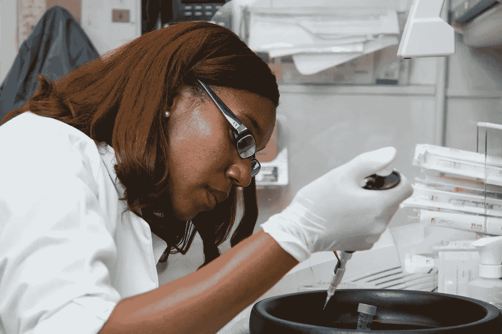
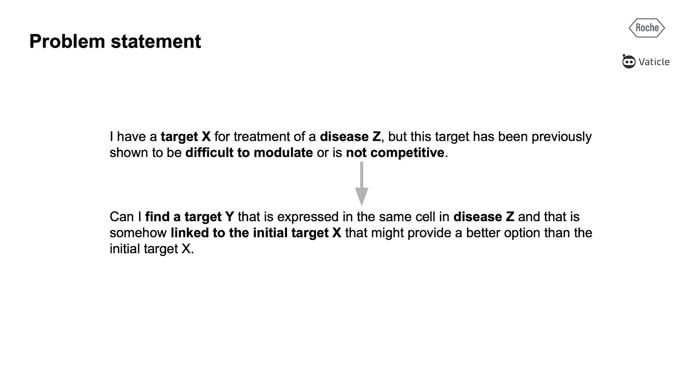
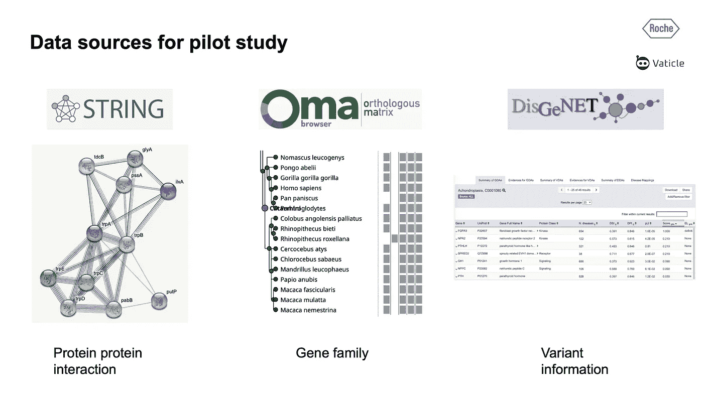
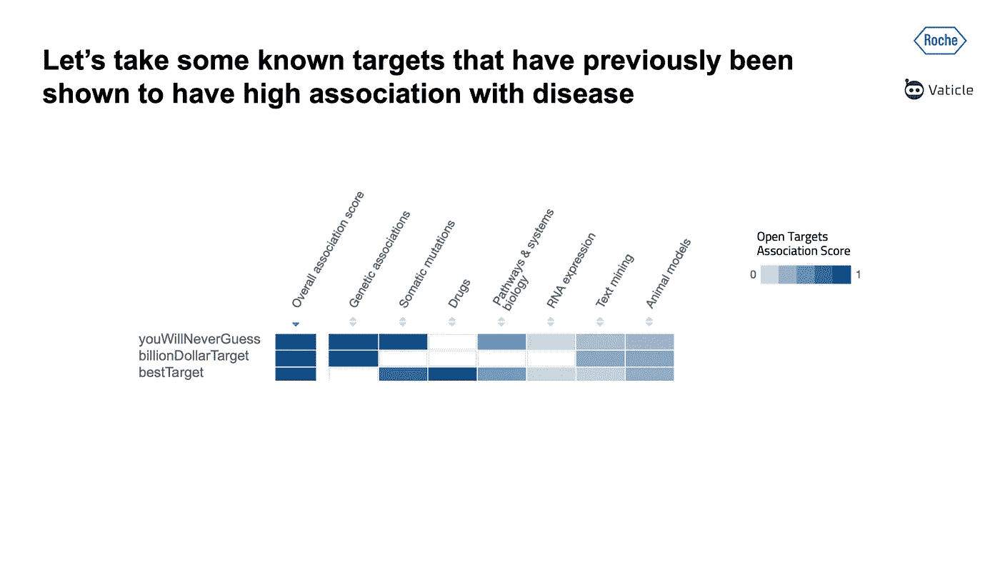
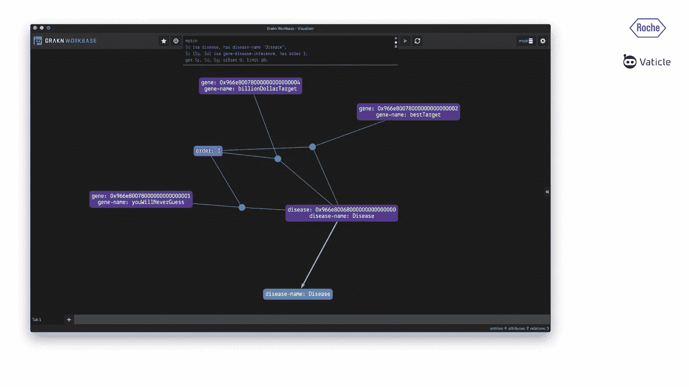
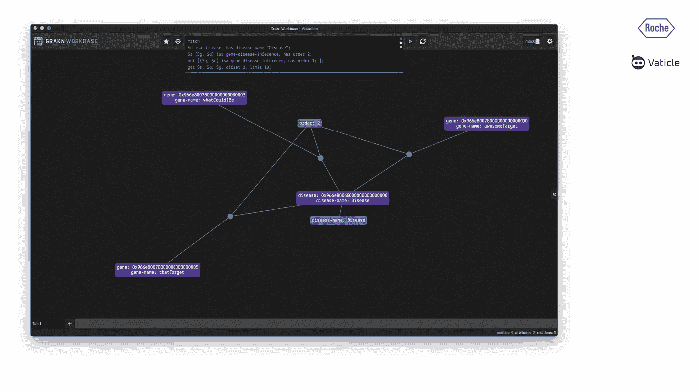
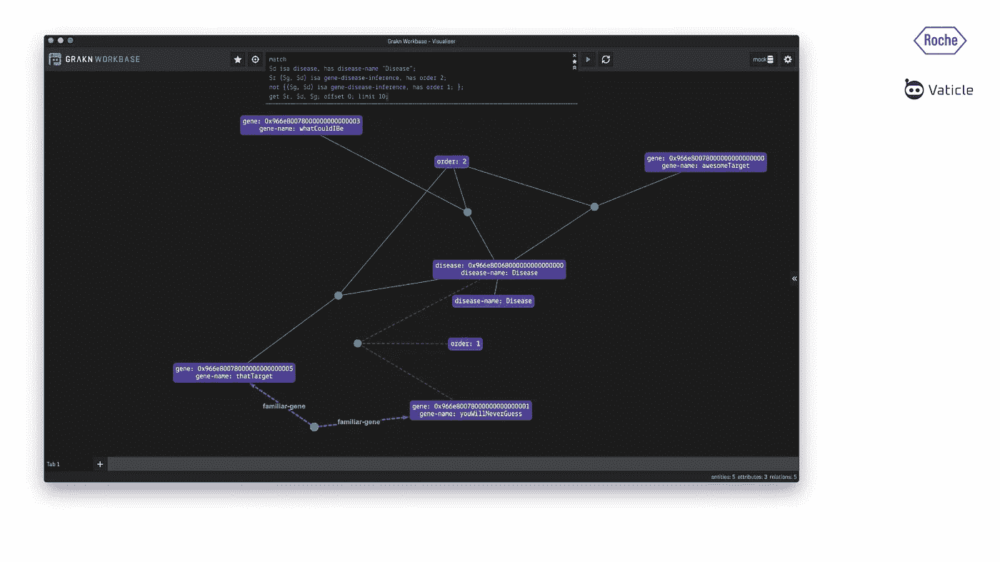
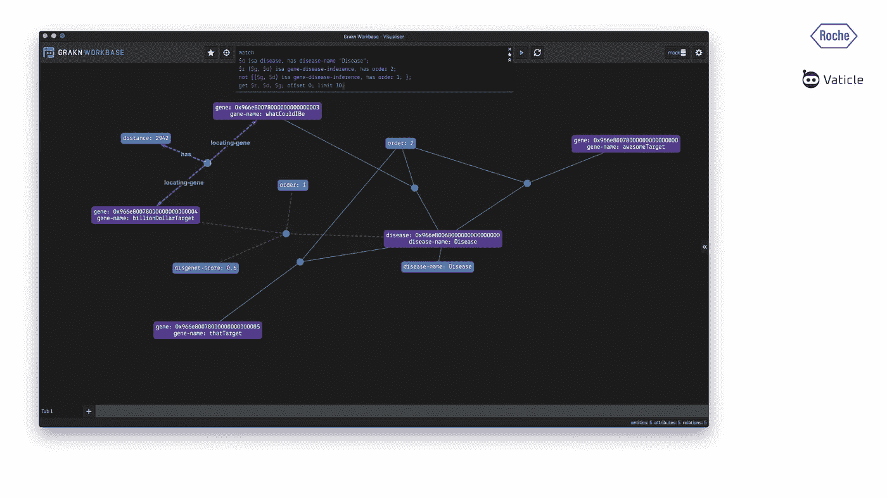
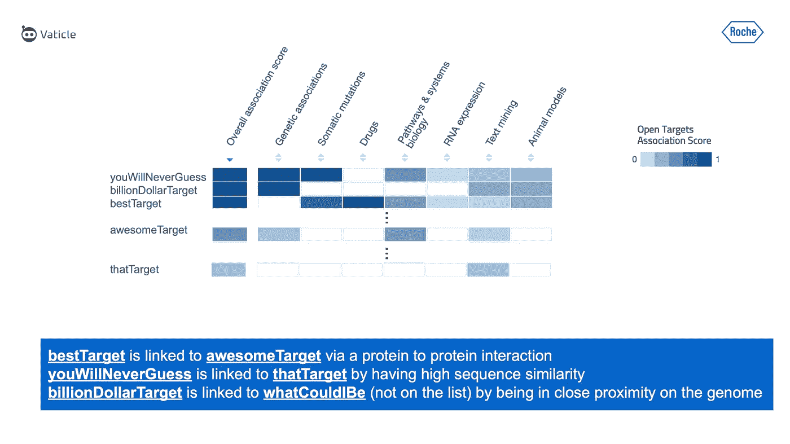

# 罗氏如何利用 TypeDB 发现新的潜在基因靶点

> 原文：<https://towardsdatascience.com/how-roche-discovered-novel-potential-gene-targets-with-typedb-9fb7029d7610?source=collection_archive---------34----------------------->



国家癌症研究所拍摄的照片

## 类型系统如何为药物研发渠道带来速度和新颖性

听取来自 [Vaticle](https://vaticle.com) 社区讲座的汇报——由[罗氏](https://roche.com)系统生物学科学家 David Dylus 主讲。这个演讲是四月份在轨道 2021 上虚拟发表的。

药物发现的核心是寻找在疾病机制中重要的靶标。然而，目前，所有已知的目标都经过了缓慢的尝试和测试。在这个项目中，大卫和他的团队设计了一个规则系统来推断和发现目标和疾病之间的隐藏联系。



在接下来的故事中，David 介绍了他在 Roche 的团队是如何识别出那些未被[开放靶标](https://www.opentargets.org/)识别为高排名的潜在新靶标的。这是通过 TypeDB 实现的，他的团队用它来存储相关数据，然后为这些新目标找到潜在的生物学证据。

# 使用了哪些数据集？

对于这个项目，使用了三个数据集: [STRING、Oma 和 DisGeNET](http://needs to be linked) 。



[STRING](https://string-db.org/cgi/about) 是已知和预测的蛋白质-蛋白质相互作用的数据库。相互作用包括直接(物理)和间接(功能)关联；它们来源于计算预测、有机体之间的知识转移以及从其他(主要)数据库聚集的相互作用。这不仅包括文献，还包括蛋白质与其他蛋白质相互作用的实验证据。这意味着我们可以寻找只有实验证实的蛋白质相互作用的蛋白质。

[Oma](https://omabrowser.org/oma/home/) 用于插入基因家族，即视差基因，即功能保守的相似基因，在基因组上是重复的，可能彼此具有相似的功能。

最后，[基因](https://www.disgenet.org/)被用来提供变异信息，这使他们能够将突变与基因联系起来:例如，如果你的基因组上有一个突变，如果这个突变与一个基因有关，如果这个基因与一种疾病有关，我们可以将疾病与这个突变联系起来。托马斯在他的“轨道 2021”演讲中也提到了这个数据库。

这就导致我们提出一个问题，例如:

> *有这种突变的人是否也有某种特定疾病的患病率？*

要回答这个问题，我们应该检查特定的突变与基因有多接近，然后认定这个变异以某种方式调节了那个基因。这可以解释为什么我们会看到这种类型的疾病表型。

# 如何建模和查询洞察力

首先，该团队查看了[开放目标](https://www.opentargets.org/)数据库中的现有目标，并选择了那些已经排名很高且已知具有高关联分数的目标——由于罗氏内部知识产权，不幸的是，他们不能具体提及哪些目标；为了便于理解，对它们进行了重命名。



David 将从开放靶标`billionDollarTarget`和`bestTarget`中提取的排名较高的靶标称为关联得分较高的靶标，换句话说，它们与 David 团队感兴趣的疾病紧密相关。下面我们将看到如何使用 TypeDB 来寻找在开放靶标上排名不高，但仍间接调节疾病的靶标，因此是潜在的高价值靶标。

为此，David 在 TypeQL 中构建了一套规则和模式。下面是如何对这些数据进行建模的一小段摘录，摘自 [BioGrakn-Covid](https://github.com/vaticle/biograkn-covid) ，这是一个由 [Konrad Mysliwiec](https://www.linkedin.com/in/konrad-my%C5%9Bliwiec-764ba9163/) (罗氏数据科学软件工程师)领导的 Vaticle 社区项目。请注意，这是一个选定的架构；完整的模式可以在 BioGrakn-Covid 模式[文件](https://github.com/vaticle/biograkn-covid/blob/master/Schema/biograkn-covid.gql)中找到。

```
define
gene sub fully-formed-anatomical-structure,    
  owns gene-symbol,       
  owns gene-name,      
  plays gene-disease-association:associated-gene;
disease sub pathological-function,    
  owns disease-name,    
  owns disease-id,    
  owns disease-type,    
  plays gene-disease-association:associated-disease;
protein sub chemical,    
  owns uniprot-id,    
  owns uniprot-entry-name,    
  owns uniprot-symbol,    
  owns uniprot-name,    
  owns ensembl-protein-stable-id,      
  owns function-description,    
  plays protein-disease-association:associated-protein;
protein-disease-association sub relation,    
  relates associated-protein,    
  relates associated-disease;
gene-disease-association sub relation, 
  owns disgenet-score,    
  relates associated-gene,    
  relates associated-disease;
```

插入正确的模式、规则和数据后，我们可以编写第一个查询。下面的关系被大卫的团队称为`gene-disease-inference`，属性`order:1`表示这是一个直接关系。该查询如下所示:

```
match
$d isa disease, has disease-name "Disease";
$r ($gene, $d) isa gene-disease-inference, has order 1;
get $r, $d, $gene;
```

结果如下，我们可以看到`billionDollarTarget`、`bestTarget`、`youWillNeverGuessTarget`链接到了`Disease`。我们也看到这三个目标是`order: 1`，这表明疾病和基因之间有直接的和先前已知的联系。然而，目标是找到新颖的目标。



为此，他们编写了如下所示的查询。这寻找通过与`order 2`的`gene-disease-inference`关系连接的疾病和基因，但是明确排除那些已经与`order:1`的`gene-disease-inference`关系连接的疾病和基因:

```
match
$d isa disease, has disease-name "Disease";
$r ($gene, $d) isa gene-disease-inference, has order 2;
**not {($gene, $d) isa gene-disease-inference, has order 1;};**
get $r, $d, $gene;
```

这个查询返回一个完全不同的基因列表:`whatCouldIBeTarget`、`awesomeTarget`和`thatTarget`。这些都是通过带有`order:2`的`gene-disease-inference`连接到`Disease`的目标。



> 如果您不熟悉 TypeDB 工作库，可以右键单击其中一个推断关系，并在下拉列表中选择“解释”。这将解释那些推论，并告诉你这些目标是如何通过目标所扮演的角色与我们的疾病联系在一起的。

如果我们解释链接`deadTarget`的推断关系，我们会看到这个目标与`youWillNeverGuessTarget`和`order: 1`属于同一个基因家族。这种推断是通过一条规则实现的，这条规则允许我们根据现有数据推断新数据。在这种情况下，我们发现了两个目标之间以前未知的间接相互作用。



> *给出这个推论的规则背后的逻辑分解如下:*
> 
> **什么时候:**
> 
> 基因靶标与疾病相关联
> 
> 并且该靶标也与已经被鉴定为与疾病具有强相关性的另一靶标在同一基因家族中
> 
> **然后:**
> 
> 这个基因靶点和疾病应该通过一个基因-疾病-推理的关系联系起来

对于其他新的目标，`awesomeTarget`和`bestTarget`，我们看到这些推论是基于蛋白质间的相互作用，这与`whatCouldIBeTarget`有关。如果我们解释这种关系，我们会看到它通过一个`gene-disease-association`与`billion-dollar Target`相连，可能与疾病有相同的变异。



尽管`awesomTarget`和`thatTarget`出现在感兴趣疾病的开放目标数据库中，但它们的排名非常低。这意味着他们与那种疾病有一些联系，但不是很强。TypeDB 发现了新的证据，表明这些目标可能排名更高。

这就是罗氏的大卫团队如何能够利用 TypeDB 的推理引擎来找到使用标准方法或更直接的方法可能会错过的新目标。



也就是说，生物学是一个非常复杂的领域，并且在不断进化。过去正确的数据集今天可能不正确。我们一直在处理新的混淆因素，不同的方法，生物学中固有的噪音。目标是用强有力的生物学证据找到控制疾病的新方法。

发现一个新的目标并不一定意味着这是一个解决方案或者可以进行试验。然而，开始挖掘其调节特定疾病的功效是一个伟大的假设，无论是找到治愈方法还是为患者提供更好的治疗方法。

# 从这里我们能去哪里？

通过整合蛋白质复合物和途径等额外信息，可以实现更高级的靶向，而不是靶向单个蛋白质。例如，我们可以寻找属于同一途径的几个基因。如果一种药物不能充分调节单个靶点，使患者的状态发生积极变化，那么我们可以考虑在同一途径上靶向多个位点。

大卫还提到，他考虑扩展规则，例如，寻找高阶关系，以便能够检查特定疾病的三阶、四阶或五阶联系。除了蛋白质-蛋白质相互作用之外，还有扩展的空间，并加入非常具体的查询约束。例如，我们可以过滤，我们希望基因 X 和 Y 是同一途径的一部分，在同一细胞类型中表达，在疾病表达中显示上调或下调，等等。这样，就像边界条件一样，我们可以提高我们的目标优先级，并使其对我们的过程非常有价值。

特别感谢 David 的工作，他对社区的贡献，以及他为工作带来的快乐。

所有幻灯片均经许可使用。你可以在 Vaticle YouTube 频道[点击](https://www.youtube.com/watch?v=9Vtn3xE2cfo&list=PLtEF8_xCPklY3P5NLSQb1SyIYLhQssxfY&index=15)找到完整的演示文稿。