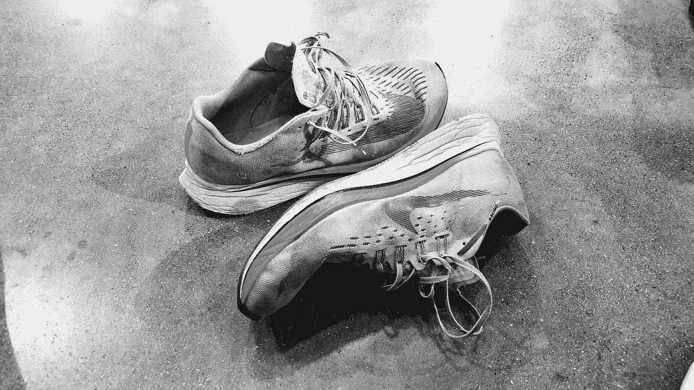

# 卖鞋如何让我成为更好的数据分析师

> 原文：<https://towardsdatascience.com/how-selling-shoes-made-me-a-better-data-analyst-2095854f1a19?source=collection_archive---------21----------------------->

## 尽管看似毫无关联，但在当地一家跑步用品店工作对我作为数据分析师的工作方式产生了重大影响

高二的时候，我开始在当地一家跑步用品店打工。我是越野队和田径队的成员，在跑步装备方面我是一个痴迷的书呆子，所以只有找到一份兼具两者的工作才有意义。在店里，我大部分时间都在一对一地与顾客打交道，帮助他们试穿鞋子，偶尔还会挑选各种服装。

当我说我是一个痴迷跑步装备的书呆子时，我是真心的。我可以告诉你每双鞋的堆叠高度，组成鞋底的化学化合物，并且一度可以记住 50 多种型号的每种颜色代码。我大部分时间都在工作时穿 2-3 双不同的鞋子，对模特进行“产品测试”,以便以后能和她们交流。

作者图片

在一家经营中的商店工作带来了各种各样的顾客。有许多高中和大学的跑步者，已经跑了一段时间的老年人，尝试第一双鞋的跑步新手，以及许多其他种类的人。鉴于顾客群的多样性，我参与了许多不同的互动，结果，真正磨练了我销售鞋子的能力。

我卖鞋时的心态是，我从来不会特别在意一个人是否买了鞋。现在，这听起来可能违反直觉，但这是有原因的。我的重点是为人们找到一种产品，在他们和跑步之间创造积极的体验。强迫某人买鞋不符合他们的最佳利益，因此也不符合我的利益。

所以不要问“我怎么才能卖出这只鞋？”问题是“我如何为这个人找到合适的产品？”。这就是事情变得有趣的地方。

与客户合作时，了解你的受众很重要。如果我和一个有经验的、有竞争力的跑步者一起工作，和我和一个第一次买鞋的人一起工作时，对话会非常不同。在第一种情况下，我可能会深入一些技术规格，解释重量差异，材料风格，以及它们如何影响跑步。在后一种情况下，对话通常会有所不同。我不是解释工程网、EVA 泡沫等之间的区别，而是经常在更高的层面上解释事情，将鞋子比作枕头和弹簧。

传达的基本信息仍然相同，但格式不同了。知道你在和谁说话是销售的一个重要方面，能够在一次舒适的谈话中使用技术语言会让你更容易解决手头的问题。

那么，这些与数据分析有什么关系呢？

嗯，在数据分析中遇到的问题与在一个运转的商店中遇到的问题非常相似。在数据中，你可以得到你想要的技术(或者非技术)，构建从饼图到神经网络的任何东西。但是，您最终得到的解决方案取决于…

1.  谁是你的观众？
2.  他们真正需要的是什么？

在许多情况下，只有当你得到观众的认同时，展示的信息才是重要的。如果你的老板来自一个非技术背景，而你抛出了 t 检验、ANOVA 分析和超参数调整的幻灯片，你会很快失去它们。如果他们不接受，那么你正在做的工作就真的无关紧要，因为它永远不会离开你的办公桌。

就像我卖鞋一样，我现在不得不卖数据分析。

虽然能够进行良好的数据分析并对所需的技术技能有很强的了解很重要，但同样重要(或更重要)的是能够销售和交流这种分析。归根结底，如果你周围的人不愿意购买使用数据，世界上所有的分析都是没有意义的。

当处理数据时，想想你会如何把它卖给别人。它带动了什么好处？它如何满足他们的需求？有多容易理解？

处理数据中的问题就像卖鞋子一样。你必须了解客户的背景，以决定如何向他们展示信息。你需要能够将这些技术信息翻译成可以理解的有意义的东西。有时这意味着用散点图、自相关图和模型参数表进行深入的统计分析。其他时候，它意味着条形图。虽然事先可能看起来传达了更多的信息，但只有当你的观众理解它并能将其与问题联系起来时，它才会这样做。

如果客户不能理解，堆积如山的信息并不比单一的事实更好。

人们很容易被数据的魅力所吸引，认为分析师的素质来自于他们工作的深度。许多(年轻的)分析师经常没有意识到的是，与学校不同，在学校里你经常被要求进行几页的分析，现实世界关注的是影响，而影响与理解相关联。

考虑到这一点，您将如何“出售”您的数据？