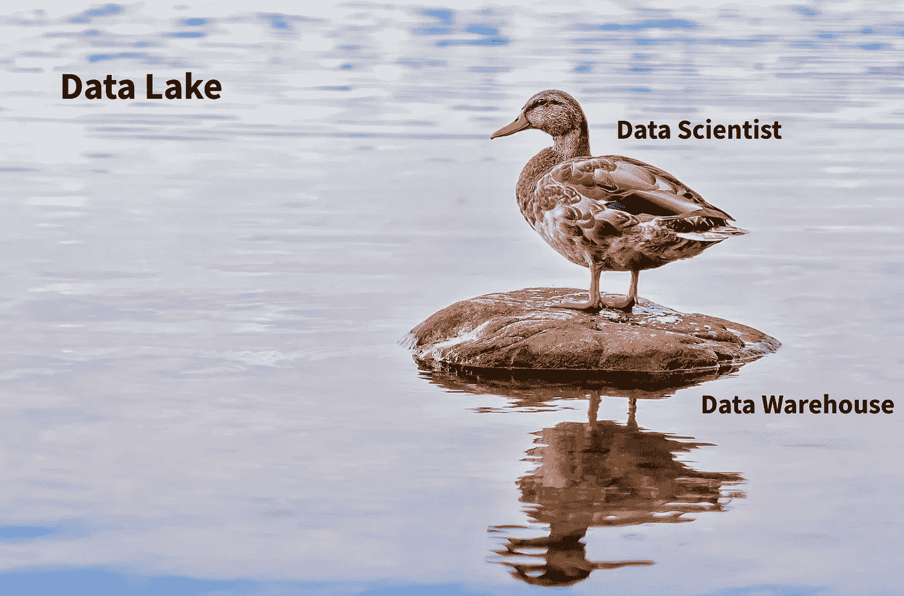
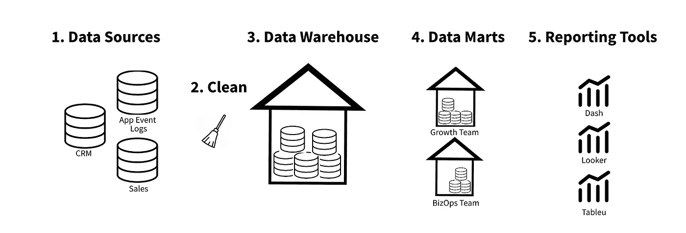
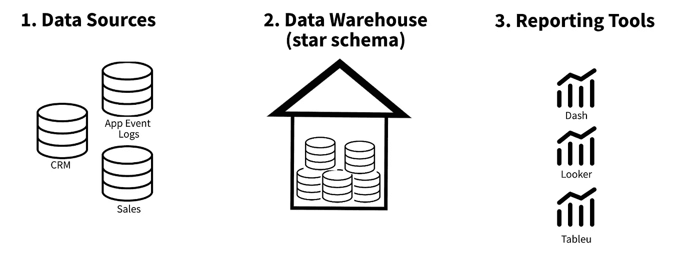
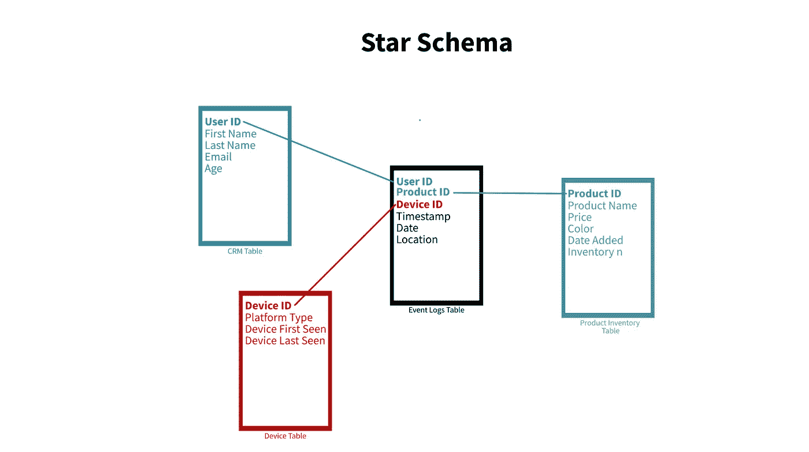
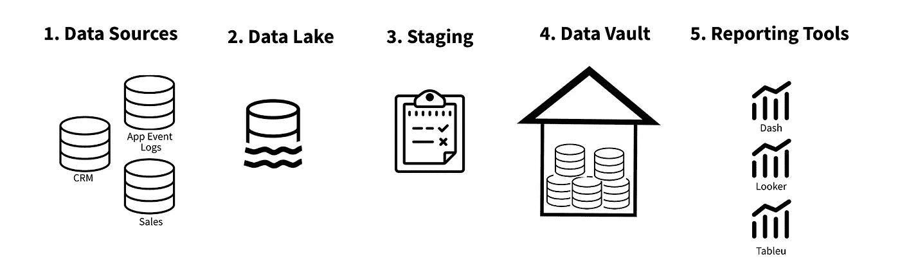

# 组织应该如何组织他们的数据？

> 原文：<https://towardsdatascience.com/how-should-organizations-structure-their-data-c19b66d629e?source=collection_archive---------1----------------------->

## 意见

## 三种流行的数据仓库技术综述

高效的数据基础设施造就高效的数据科学家。组织如何构建数据会对创新、员工效率和整体数据文化产生巨大影响。

图 1:作者图片— [src img](https://unsplash.com/photos/wNeRmO0Xxmg) via unsplash 和 [idea credit](https://mobile.twitter.com/klotz_tom) 。

自 90 年代计算兴起以来，在最佳数据结构化技术之间一直存在激烈的争论。然而，有两种思想占据了主导地位——比尔·恩门和拉尔夫·金博尔的思想。两者都定义了 ETL 管道，将各种来源的数据带到同一个位置，供组织内的利益相关者访问。

然而，在 21 世纪初，Dan Linstedt 发明了另一种数据管道结构，称为数据仓库。

在本帖中，我们将回顾一篇来自 [2021 论文](https://ieeexplore.ieee.org/abstract/document/7815845)的比较，该论文概述了每种方法并解释了每种方法的优缺点。请注意，每个主题都很复杂，所以我们只涉及最基本的内容——更多资源在文章和评论中有链接。

事不宜迟，我们开始吧。

# 技术 TLDR

有三种感兴趣的数据仓库结构。

1.  Inmon:一种稳定的仓储策略，其中**数据一致性是最高优先级**。所有面向用户的数据集市都建立在健壮和规范化的数据仓库之上。
2.  Kimball:一种动态仓库策略，其中快速开发有用的数据结构是最高优先级。所有面向用户的数据都建立在星型架构之上，星型架构存储在多维数据仓库中。
3.  Data Vault:一种快速异步的仓储策略，其中敏捷开发是最高优先级的。所有面向用户的数据都需要另一个中间层，比如星型模式结构。

# 好的，但是我应该使用哪一个，为什么？

让我们慢一点来讨论数据仓库的目的，并更好地理解上面的每一种方法。

# 1.为什么数据结构很重要？

几乎每个大中型公司都非常依赖数据。数据可以用来构思产品，决定组织的策略，并支持 A/B 测试。

如果您的组织利用数据，数据结构会非常有影响力。它决定了你要花多少钱来存储和访问你的数据，你能多快得到这些数据，它有多准确，它有多一致，等等。

此外，由于数据科学家是组织数据的主要消费者之一，我们高度依赖良好的数据工程。

在本帖中，我们将讨论一种特定的数据存储策略— **数据仓库。**

# 2.数据仓库的主要类型是什么？

从定义开始，**数据仓库用于在一个位置**存储来自各种来源的数据。就像仓库一样，它们通常有一个组织结构，但可以容纳各种不同的对象。

人们已经提出了许多组织数据仓库的方法，但是自 20 世纪 90 年代以来，有两种主要的方法:Inmon 和 Kimball。我们将在列表中添加第三个更现代的结构，称为数据库。让我们依次看一看每一个。

## **2.1。英蒙**

Inmon 的数据仓库将数据的准确性和一致性放在高于一切的位置。由于对一致性的强调，往往会有大量的前期工作，但是随后的修改和添加是非常有效的。

让我们看看数据流实际上是什么样子的…

图 2: Inmon 数据仓库结构。图片作者。

在图 2 中，数据流非常线性。我们从各种数据源(1)开始，清理它们(2)，然后将它们插入一个结构化和有组织的数据仓库(3)。从那里，我们预测业务用例，并将不同团队的某些信息存储到数据集市中(4)。最后，我们添加了一个可视化层(5 ),它允许人们不用写代码就能访问这些数据。

## **2.2。金博尔**

Kimball 的数据仓库采用结构化程度较低的方法，这加快了初始开发周期。然而，未来的迭代需要相同的工作量，如果您不断地更新仓库，这可能会很昂贵。质量检查也很少——我们甚至不包括清洁步骤。

图 3: Kimball 数据仓库结构。图片作者。

数据流如图 3 所示。我们从各种数据源(1)开始，并立即将它们存储在一个数据仓库(2)中，该数据仓库利用了一个**星型模式**，我们将在下面讨论这个概念。最后，我们允许非技术人员通过可视化层(3)访问这些信息。

Kimball 方法受欢迎的一个原因是数据仓库中的数据是如何结构化的——它利用了星型模式…

图 Kimball 数据仓库利用的星型模式的例子。图片作者。

在图 4 中，我们的数据源在逻辑上被组织成更小的表，每个表中都有连接键。因此，如果我们需要获取给定用户的设备信息，我们可以简单地使用 CRM 表(蓝色)、设备表(红色)和事件日志表(黑色)来创建一个包含所有必要信息的更大的连接表。

## **2.3。数据保险库**

最后，我们最新的竞争者是数据库。数据保险库希望通过保持最大的灵活性来解决前两种方法的一些弱点。这使得它实现起来高效，(相对)快速，并且高度动态。然而，由于非结构化的性质，建议在构建报告工具之前利用星型模式。

图 5:数据仓库仓库结构。图片作者。

在图 5 中，我们可以看到数据仓库的简化流程。和上面的方法一样，我们从各种数据源开始(1)。接下来，我们将这些数据源放入一个数据湖(2 ),这是所有先前数据源的非结构化存储。所有数据都在一个位置后，我们将这些数据移动到 staging(3 ), staging(3)支持各种数据“移动”操作，如批处理和流处理。接下来，我们进入数据库(4 ),它以下面讨论的集线器-链路-卫星结构存储所有原始数据。最后，当组织中有人需要这些数据时，我们添加一个可视化层(5)。请注意，通常最好在 4 和 5 之间添加一个结构，以便于访问。

但是数据仓库中的数据是如何构建的呢？嗯，有三个主要组成部分:

1.  **枢纽:**枢纽是企业感兴趣的实体。它们只包含一个不同的业务键列表和关于每个键首次加载的时间和位置的元数据。
2.  **链接:**链接连接集线器，并且可以记录集线器之间的事务、组合或其他类型的关系。
3.  **卫星:**卫星连接到集线器或链路，存储关于数据何时从哪里加载的元数据。它们非常适合版本管理和历史分析。

这种结构使它具有高度的动态性，因此如果业务逻辑发生变化，数据基础设施可以很容易地适应。

# 3.哪种方法最好？

和大多数复杂的主题一样，没有简单的“最佳”解决方案。因此，让我们来看看几个潜在的评估标准，并在每个标准中选出我们的获胜者。

## **3.1。准确性/一致性**

**在数据准确性类别中，Inmon 是明显的赢家。**在最初开发 dat 仓库时，我们花了大量时间清理脚本，并进行强大的质量检查。从那里，所有输入到我们的数据仓库的数据都“保证”符合我们的数据质量标准，这使我们可以依赖我们的数据仓库作为单一和通用的事实来源。

Kimball 和 data vaults 在如何定义指标方面有很大的可变性。Kimball 比 data vault 更早开始这个过程，但是两者都缺乏通过下游表的标准化。

## **3.2。开发时间**

**关于开发时间，我们没有明确的赢家——这取决于在开发周期的什么时候你想花费你的资源**。Inmon 涉及大量的前期工作，但是一旦数据标准化代码到位，未来的迭代相对于其他两种方法要简单得多。

在另一个极端，数据仓库本身的开发时间可能是最短的。然而，要使数据可访问，您必须添加一个 Kimball(创建者推荐)或 Inmon 结构。因此，vault 本身的开发速度更快，但是还需要下游的工作。

Inmon 是一个中间地带，设置起来非常快，但是我们没有创建太多样板代码或健壮的结构，所以每个额外的更改都需要做同样多的工作。

## **3.3。查询速度**

**Kimball 目前拥有最快的查询速度。这使得它成为数据分析师和产品经理的热门选择。如图 4 中的星型模式图所示，我们所有的表都会变得非常小，所以如果我们要查找特定的信息，智能设计的 Kimball 结构会非常有效。**

英蒙可能排在第二位。数据集市是由报告工具访问的结构层，但是在转换到数据集市时通常没有太多的数据重组。仓库和数据集市之间的主要区别在于，后者是特定业务功能的子集，而前者存储所有业务信息，而不考虑团队或主题。

最后，如前一节所述，不建议直接查询数据保险库——相反，我们希望在保险库之上构建结构，从而使查询速度取决于我们选择的最终结构。

# 4.答案

使用上述信息和其他一些要点，这里有一些选择数据仓库结构时的基本经验法则。

如果…使用 **Inmon**

*   数据准确性是您的仓库最重要的特征
*   你有时间/资源做大量前期工作

如果…使用**金博尔**

*   如果您的业务需求定义明确且稳定
*   您经常查询大量数据

使用**数据库**如果…

*   你的商业目标经常改变
*   您需要在基础设施中内置版本控制

现在你知道了！我们分解了三种主要的数据仓库技术，并快速讨论了为什么每种技术都有价值。

最后，我做了很多 ETL，但我不是数据工程师，所以如果有错误或者你同意/不同意以上建议，请留下评论。

*感谢阅读！我会再写 23 篇文章，把学术研究带到 DS 行业。查看我的评论，链接到这篇文章的主要来源和一些有用的资源。*