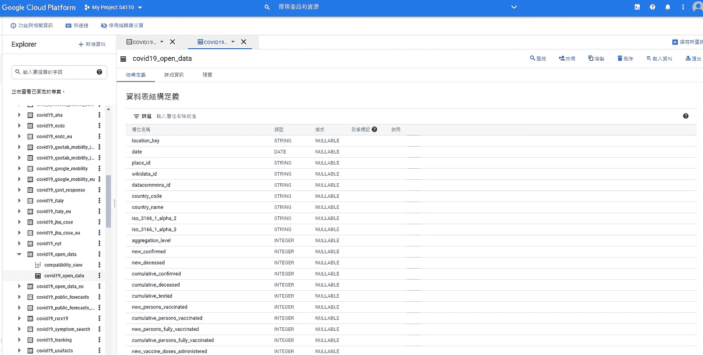
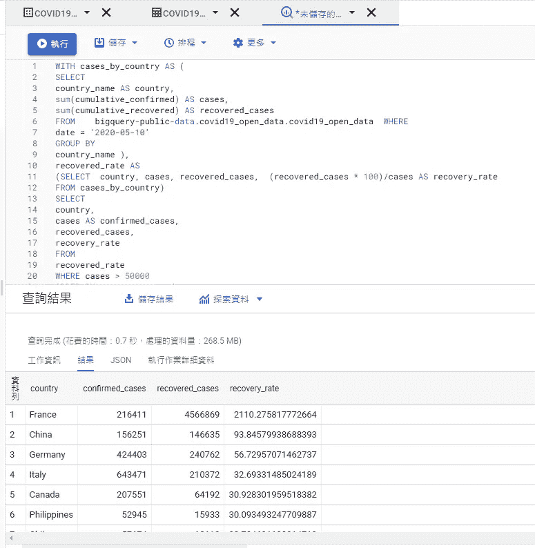
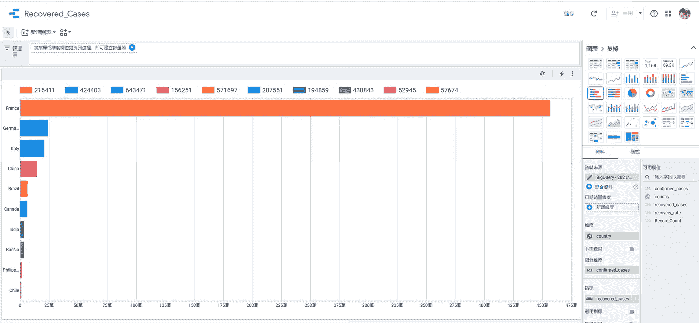

# SQL 初学者如何使用 BigQuery 了解全局疫情

> 原文：<https://towardsdatascience.com/how-sql-beginners-use-bigquery-to-understand-global-pandemic-9f11c0332bc0?source=collection_archive---------14----------------------->

## 无需预装，使用浏览器分析新冠肺炎公共数据集


沃洛季米尔·赫里先科在 [Unsplash](https://unsplash.com/photos/7JAyy7jLTAk) 上的照片

无论你是准备数据分析师面试，学习 SQL，还是仅仅对通过数据分析解决业务挑战感兴趣。面临这样的挑战是很常见的:我了解数据库是如何工作的，但不知道去哪里找项目？试题库很多，但都不是业务问题，知识和实践经验有差距。

在本文中，我将带您了解如何使用公共数据集来体验数据分析之旅。以 BigQuery 中的新冠肺炎公共数据集为例。

一年多来，许多国家都在不同阶段谈论新冠肺炎。一些国家已经解除了戴口罩的禁令，但其他国家仍处于封锁状态。这个数据集帮助我们回答这样的问题:A 国的回收率是多少？或者哪些国家和这个疫情打交道最好？

*   挑战
*   解决办法
*   步伐
*   思想
*   限制
*   结论

# 挑战

这些是我们学习 SQL 时面临的挑战

*   计算不同语法的练习是什么
*   缺少场景
*   缺乏实践
*   缺乏数据
*   缺乏端到端的体验
*   缺失数据
*   缺乏商业意识和对指标的理解，如保留率或转换率

# 解决办法

谈到 SQL、商业智能和 ETL，有许多选择。在本文中，我将使用 BigQuery。

# 什么是 BigQuery，我为什么选择它？

BigQuery 是谷歌云平台上一个流行的数据分析解决方案。它无需服务器，高度可扩展。最重要的是，它有许多公共数据集可以使用。

# 关于数据集

[数据集](https://console.cloud.google.com/marketplace/product/bigquery-public-datasets/covid19-open-data?authuser=1&project=united-course-317009&folder=&organizationId=)的来源来自不同的组织，包括纽约时报、欧洲疾病预防和控制中心、谷歌、世界银行的全球健康数据、OpenStreetMap 等。在 2021 年 9 月之前，它可以免费用于教育或研究目的。

数据大小为 6.9GB，并且还在不断增长。超过 1.2 亿行 700 多列的数据。它包含确诊病例数、死亡、性别、年龄和恢复等数据。

# 步伐

# 步骤 1:将数据加载到 BigQuery

准备一个 GCP 账户或在 Qwiklab 上开始免费试用，然后使用这个数据集。

当你看到下面的截图时，你已经准备好了。



BigQuery Web 界面(按作者)

# 步骤 2:数据清理

我推荐保持的一个好习惯是在任何分析之前总是检查重复。您可以通过运行下面的查询来实现它。

```
SELECT COUNT(*) AS num_duplicate_rows, 
FROM `the_table_you_want_to_check` 
GROUP BY column1,column2,column3
HAVING num_duplicate_rows > 1;
```

# 步骤 3:练习您的 SQL 技能

是时候练习您的 SQL 技能了。

下面是一个例子，找出 2020 年 5 月 10 日哪个国家的回收率最好。

```
WITH cases_by_country AS (  
SELECT    
country_name AS country,    
sum(cumulative_confirmed) AS cases,   
sum(cumulative_recovered) AS recovered_cases  
FROM    bigquery-public-data.covid19_open_data.covid19_open_data  WHERE    
date = '2020-05-10'  
GROUP BY    
country_name ), recovered_rate AS 
(SELECT  country, cases, recovered_cases,  (recovered_cases * 100)/cases AS recovery_rate
FROM cases_by_country)SELECT 
country, 
cases AS confirmed_cases, 
recovered_cases, 
recovery_rate
FROM 
recovered_rate
WHERE cases > 50000
ORDER BY recovery_rate desc
LIMIT 10
```

查询结果显示答案是法国。



BigQuery Web 界面(按作者)

# 第四步:视觉化

最后，不要忘记将它形象化，因为这有助于我们更好地与观众沟通。点击“探索数据”并链接到谷歌的报告解决方案 Data Studio，从不同角度展示结果。



Data Studio 界面(由作者提供)

# 思想

# 使用高质量的数据，这样您就可以专注于最重要的事情:数据分析

就食物的质量而言，配料就是一切。数据分析可以是类似的，因为分析师不再需要担心数据的完整性或一致性。由于您可能没有高质量的数据，开放数据集将是一个不错的选择。

值得注意的是，云计算的一个优势是数据集保存在数据湖中。需要时，我们打开水龙头，数据流入 BigQuery 等服务。没有必要等待传输中的数据。

# **一路发展你的商业理解**

预测销售预测时的关键特征是什么？评估政策影响的关键指标是什么？即使解决了数百个 SQL 挑战，这些问题仍然没有答案。这就是为什么使用上下文(如场景和用例)进行练习是必不可少的，因为它可以帮助我们将查询与现实世界的问题联系起来。

# **头脑风暴展示你掌握一项技能的另一种方法**

用一种方法来应对挑战是很好的，但是想出另一种方法怎么样？

我和一个在数学方面很有天赋的朋友聊天。他在大学入学考试中名列前茅。一开始我以为他只是练了很多题。令人惊讶的是，他并没有大量练习题型。相反，他会考虑第二种甚至第三种方法来解决同样的问题。这个提示在我学习新东西的时候启发了我。也许我们不应该试图解决过去考试中的那么多问题。相反，思考一种新的方法来解决同样的问题！

# 限制

# 活动跟踪有时不起作用。

如果你正在使用 GCP 提供的 Quest 进行练习，它会在你完成实验的各个部分时使用活动跟踪来监控你的工作。有时，它只计算特定的列或值。例如，我在一个查询中使用了 country_code 来计算确诊病例数，但没有得到要点。最后，我发现我应该用 country_name 来代替。想法是一样的，但是我们需要适应这个机制。

# 数据的详细程度因国家而异

美国数据的粒度是最好的。例如，您可以按每个州检查案例。但是在其他国家找不到相同级别的粒度。

# 这个项目不是为面试准备而设计的

如果你正在寻找面试准备材料，Leetcode 或 Hackerrank 将是更好的选择，因为这些平台可以专注于某项具体技能的提高。

我对分析数据以找到解决方案很感兴趣，并且一直在寻找高质量的数据集来探索。我发现 BigQuery 提供的公共数据集很有帮助。我会推荐使用平台体验整个过程，从数据到结论。无论您是在寻找一个项目来练习您的 SQL 技能，好奇云计算是如何工作的，还是仅仅对解决问题感兴趣，这都是一个很好的起点。

**免责声明:**这是用 BigQuery 完成[对数据的洞察后的一篇综述。如果你需要更多的细节，请随时参考](https://www.qwiklabs.com/quests/123?locale=zh_TW)[我的问题](https://github.com/wanchunghuang/Insights-from-Data-with-BigQuery-Challenge-Lab)。

# 保持联系

*   在 [Medium](https://medium.com/@wanchunghuang) 上关注我，了解更多类似的故事
*   在 [LinkedIn](https://www.linkedin.com/in/wanchung-huang/) 上连接