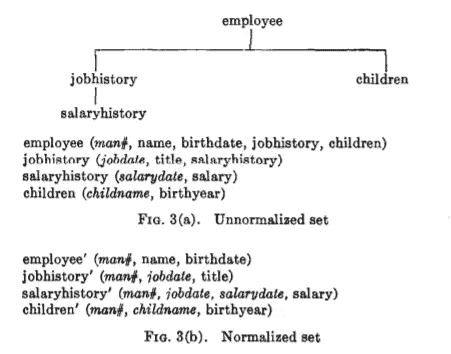

# 技术如何影响数据建模

> 原文：<https://towardsdatascience.com/how-technology-is-impacting-data-modelling-fe3a7f697e7c?source=collection_archive---------15----------------------->

## [行业笔记](https://towardsdatascience.com/tagged/notes-from-industry)

数据建模已经存在了 40 多年。对于不同类型的用户和系统应该如何对数据进行建模，有一些既定的方法。但毫无疑问，技术在 40 年里发生了巨大的变化，过去 5-10 年在数据领域尤为重要。这些方法今天仍然适用吗？

截图来自 [Codd 的论文](https://www.seas.upenn.edu/~zives/03f/cis550/codd.pdf)

# 多了解一点历史

> 【E. F. Codd 博士在 1970 年 6 月发表了论文，“大型共享数据库的数据关系模型”。Codd 的模型现在被接受为关系数据库管理系统(RDBMS)的最终模型。结构化英语查询语言(SEQUEL)是由 IBM 公司开发的，使用 Codd 的模型。SEQUEL 后来变成了 SQL。1979 年，Relational Software，Inc .(现在的 Oracle)推出了第一个商用 SQL 实现。今天，SQL 被接受为标准的 RDBMS 语言。

如你所料，在那之后发生了一些事情。

在 20 世纪 90 年代，出版了两本关于数据仓库的主要书籍——一本由比尔·恩门于 1992 年出版，另一本由拉尔夫·金博尔于 1996 年出版。在[数据仓库](https://en.wikipedia.org/wiki/Data_warehouse)建模中，它们成为建模存储数据的层的两个众所周知的竞争选项。要么你根据 Ralph Kimball 的模型，用事实表和符合的维度(作为[星形模式](https://en.wikipedia.org/wiki/Star_schema))，要么你根据比尔·恩门的模型，用数据库[标准化](https://en.wikipedia.org/wiki/Normal_forms)。

2000 年， [Dan Linstedt](https://en.wikipedia.org/w/index.php?title=Dan_Linstedt&action=edit&redlink=1) 发布了[数据保险库建模](https://en.wikipedia.org/wiki/Data_vault_modeling)，作为 Inmon 和 Kimball 的替代方案，为来自多个操作系统的数据提供长期历史存储，重点是跟踪、审计和对源数据模型变化的弹性。data vault 模型实际上提供了一个“基于图形”的模型，其中包含关系数据库世界中的中心和关系。

在 2010 年代，Apache Hadoop 和围绕它的生态系统被开发出来并流行起来。这些技术与关系数据库非常不同，尽管其中一些允许使用 SQL 查询数据。[读取模式](https://www.techopedia.com/definition/30153/schema-on-read)允许按原样加载数据供以后查询——因此不需要前期数据建模。当处理数据以备后用时，方法是将所有内容“连接在一起”成一个大范围的非规范化文件。数据存储不再是问题，但是“数据连接”在计算上非常昂贵。

现在是 2021 年，一种新型的数据技术正在不断被采用，特别是采用 MPP(大规模并行处理)架构的云原生列数据仓库，如雪花、亚马逊红移或谷歌大查询。

使用 20 世纪 90 年代的方法对数据建模有意义吗？现在，新的数据或分析工程师应该花时间学习它们吗？

# 数据仓库 vs 传统 vs 消除垃圾

我最近看到了一个视频，视频中一组数据专家讨论了这些问题。

<https://www.greatdataminds.com/insights/data-vault-vs-traditional-vs-flatten-that-crap-out/>  

这是一个漫长而有趣的讨论，如果你选择不看，这里是我的总结。

最终，没有单一的答案—不同的使用案例和工作负载需要不同的方法。传统方法之所以被称为传统方法是有原因的——它们经过了时间的考验，而且行之有效。有时，在单一架构中有一个空间可以容纳所有这些方法。

任何解决方案都应该是专门构建的，以下是一些常用的选项(只是一些示例):

*   即席分析—星型模式(Kimball)
*   数据科学—平面表
*   具有跟踪和审计需求的企业数据仓库—Data vault
*   操作数据库— [第三范式(3NF)](https://en.wikipedia.org/wiki/Third_normal_form)

现代数据堆栈提供的强大功能可以克服许多设计缺陷，即使没有最佳的建模选择，查询也可以执行得很好。然而，除了查询速度之外，还有维护成本，或者所谓的技术债务，如果使用次优技术，这个成本可能会高得不必要。

事实上，当我们谈论速度时，我们应该考虑几个不同的因素:

*   查询的速度或性能
*   交货速度
*   变化的速度(换句话说，敏捷性，或者我们对数据模型中需求变化的响应速度)

利用云弹性的现代数据工具，结合良好的开发实践，如自动化数据质量测试和 CI/CD(我在这里写了[和](/data-engineering-in-2020-e46910786eda))，允许我们在开发过程中更加敏捷，并在需求出现时进行迭代。当交付和变更的速度很快时，您可以从简单开始，首先专注于交付业务价值，然后不断改进。或者，一些数据模型被设计为对变化具有弹性(data vault)，这在某些场景中可能是更好的方法。

另一个重要的考虑因素是数据管理。当我们查看数据时，我们需要知道它是什么，它来自哪里，以及它是如何组合在一起的。好的数据模型对此有所帮助，但是帮助跟踪数据血统、数据质量、数据字典等的工具也是如此。如果数据的建模和文档记录都很糟糕，那么很容易以巨大的数据混乱而告终。

# 最后的想法

我是一名数据工程师，我的典型用例是即席分析、BI 和数据科学。我喜欢将我处理的数据视为事实和维度(即使它是平面的)，并且更喜欢在有意义的时候以类似 Kimball 的风格对数据建模。我发现星型模式很容易理解，商业用户通常也喜欢它。这些天来，我总是以这种方式对数据进行物理建模吗？号码

如果需求允许，数据模型可以是“逻辑的”而不是物理的，并且可以随着需求的改变而改变。在某些情况下，可以完全跳过前期建模，或者根据需要尽量少建模。*我必须在这里强调，当交付速度和变化速度很快的时候，当数据管理到位的时候，它是有效的。*当然，假设数据仓库中的原始数据是以原始形式存在的，因此最终模型总是可以重建的，这是当今不关心数据存储的常见做法，通常称为 ELT(提取—加载—转换)。

例如，在过去，当我在 MS SQL Server 中为我的数十亿行事实表添加列和选择数据类型时，我必须非常小心，因为当选择 int 而不是 bigint 时，每条记录节省 4 个字节意味着总共节省 10-20gb，这对于 10 年前的中档本地服务器来说意义重大。如今，我可以将 json 日志直接保存到 blob 存储中，通过 schema-on-read 在 Snowflake 的 SQL 视图中直接读取它们，然后在其上构建一个仪表板——所有这一切都在几天内完成，无需预先考虑模式或数据类型。然后，在几天内，当它变得有价值时，它可以被重新设计成具有引用完整性的星型模式。

# 答案是什么？

那么，使用 20 世纪 90 年代的方法对数据建模有意义吗？

您不必对 Kimball 的方法或这里提到的任何其他方法持教条主义态度，但是了解经典的设计模式和常见的陷阱通常是有帮助的，特别是当您试图解决一些棘手的设计挑战而没有明显的答案时。数据建模已经有 40 多年的历史了——所以这个棘手的问题很可能已经有了答案。

# 我在哪里可以了解更多信息？

如果你今天想读 Kimball 的“数据仓库工具包”，我强烈推荐这篇文章(以及其他关于 [holistics.io](https://www.holistics.io/blog/tag/data-modeling/) 的数据建模资源)，它解释了哪些章节仍然相关，哪些章节你可以安全地跳过。

<https://www.holistics.io/blog/how-to-read-data-warehouse-toolkit/>  

我没有使用 data vault 的实践经验(它似乎更适合企业数据集成)，但如果你想了解更多，我发现[这篇评论](https://www.ben-morris.com/data-vault-2-modelling-the-good-the-bad-and-the-downright-confusing/)很有趣。