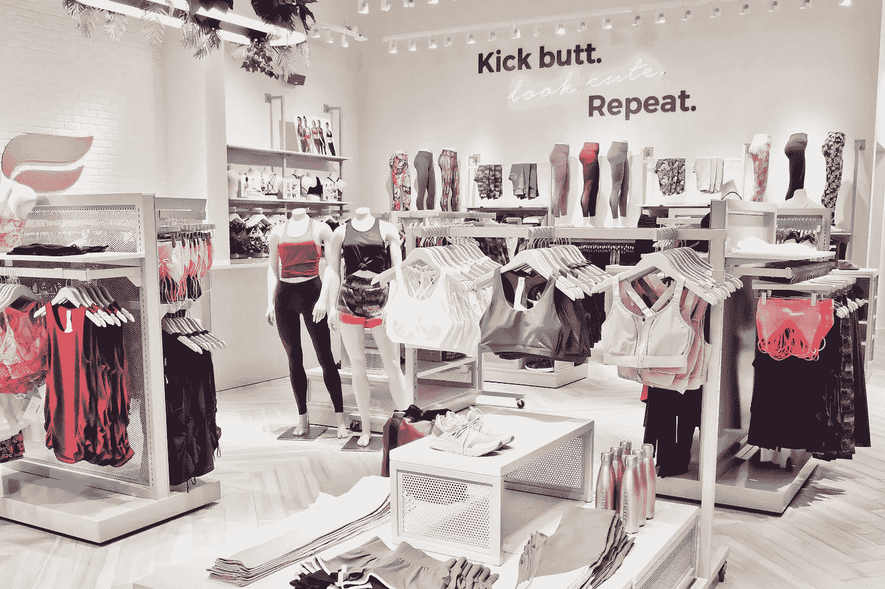
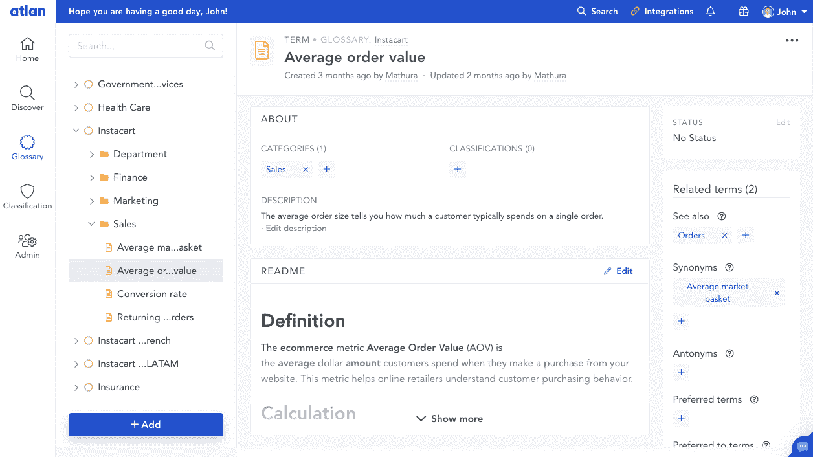
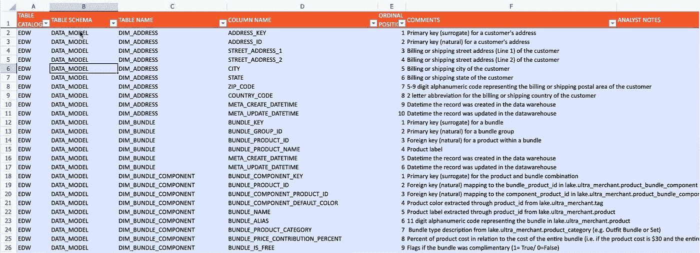
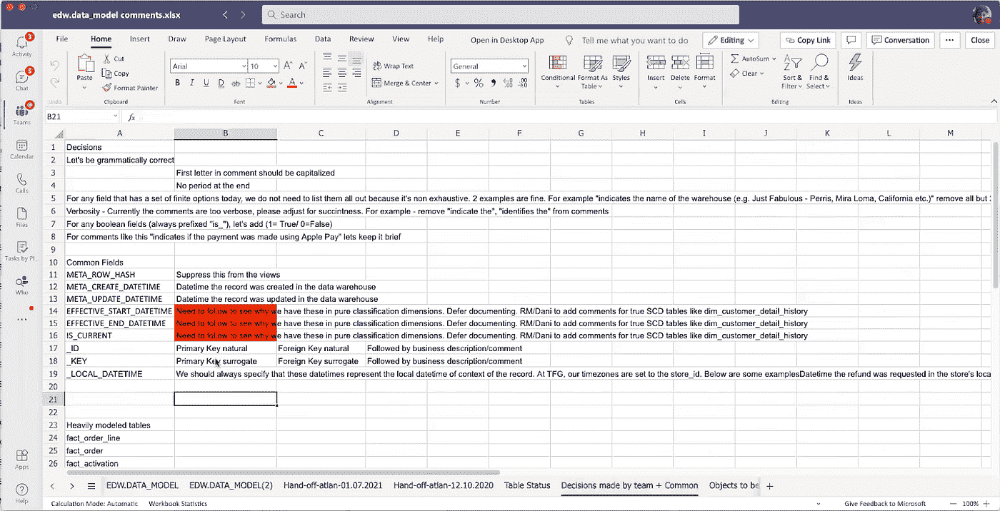
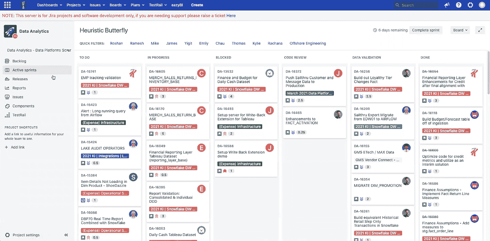

# TechStyle 如何使用敏捷 Sprints 部署现代数据平台

> 原文：<https://towardsdatascience.com/how-techstyle-used-agile-sprints-to-roll-out-a-modern-data-platform-c0fc92cc397c?source=collection_archive---------21----------------------->

## [行业笔记](https://towardsdatascience.com/tagged/notes-from-industry)

## TechStyle 由 50 名成员组成的分析团队通过 Snowflake、Atlan 和 Tableau 尝试并测试了部落知识民主化的方法

Fabletics，TechStyle 旗下品牌之一。(图片由 TechStyle 提供。)

推出新的数据平台绝非易事。尽管有遗留的后台，几乎全新的团队，以及突然转向在家工作，但还是要这样做…这是一个巨大的挑战。但这正是 TechStyle 在 2020 年初开始做的事情。

[**TechStyle 时尚集团**](https://techstylefashiongroup.com/) 成立于 2010 年，是一家拥有五个品牌组合的时尚零售商——Fabletics、Savage X Fenty、JustFab、FabKids 和 ShoeDazzle。通过将数据科学和个性化与会员模式相结合，该公司已经发展成为世界上最大的会员制时尚公司之一(拥有 550 万会员，年收入超过 7.5 亿美元)。

TechStyle 围绕在其运营中嵌入数据建立了自己的商业模式。想想它网站上的个性化客户体验，植根于预测分析的数字供应链，以及运行在物联网设备上的仓库。

为了处理这些数据，TechStyle 使用了一种“轴辐式分析模型”。TechStyle 的每个品牌都有自己的嵌入式分析团队。然而，每个团队创造自己的技术是没有意义的，所以这就是**数据平台团队**的用武之地。它的作用是通过创建和管理通用数据系统来支持每个职能分析团队。它运行公司的核心数据平台以及数据工程、集成、架构和治理。

2020 年 3 月，TechStyle 开始着手改革这些通用系统并推出新的数据仓库，由 **Danielle Boeglin** (数据&分析副总裁)和 **Rachana Mukherjee** (数据平台团队的数据分析总监)带头。在这个过程中，Danielle 和 Rachana 需要解决一个困扰公司多年的问题——让每个人都可以发现和理解数据，而不仅仅是长期团队成员。

作为 TechStyle 在该计划中使用的统一数据工作空间 [Atlan](https://atlan.com/) 的联合创始人，我近距离目睹了他们新数据仓库的发展。从头开始设置文档和元数据可能会很困难，所以我认为与其他希望建立更好的数据系统的现代数据团队分享他们的过程是有价值的。

通过与 Danielle 和 Rachana 的一系列对话，我撰写了这篇文章，深入了解 TechStyle 如何构建其现代数据仓库和数据分析团队的幕后过程。它还解释了他们通过敏捷 sprints 记录多年部落知识的过程，以及民主化部落知识和支持数据管理的重要性。

# 为整个公司的可访问数据奠定基础

2020 年初，TechStyle 决定将其系统迁移到雪花数据仓库。尽管这是一项重大工程，但这个项目给了公司一个重新定位和规划未来的机会。

TechStyle 已经倾向于传统的 EDW 设计。但是对 Rachana 来说，毫无疑问，新的雪花系统应该避免传统的数据仓库模式。

> “传统的数据仓库非常昂贵和耗时。它确实延长了洞察的时间。因此，当您交付洞察力时，对业务来说可能已经太晚了。我们需要适应。”
> 
> –Rachana Mukherjee，TechStyle

然而，选择一条更好的前进道路是一个更难的问题。“现在事情进展得太快了……”她说。“我认为，对于很多处于我们这种位置的人来说，很难说，‘好吧，这是我们应该做的事情’，因为现在市场上没有任何指导。我们只能靠自己的设备。”

相反，TechStyle 选择了 ELT 风格的数据工程，他们从数据源加载数据。一旦加载了原始数据，TechStyle 就使用一种混合方法来建模任何需要建模的东西，并愉快地保持其余部分不变。

Rachana 说:“**你不必总是为数据**建模。例如，对将来将被重用的对象(如历史表)进行建模、处理，然后存储起来以备不时之需。但是对于有很多未知的领域，没有必要经历过早建模的麻烦。

# 数据到知识的差距

从这个项目一开始，TechStyle 就知道数据的可发现性是重中之重。

“不幸的是，知识上存在着巨大的差距，”Rachana 说。“**我们正在招聘分析师，但他们效率不高，因为他们不理解数据。**“Danielle 补充道，“有了我们的软件和代码，我们在 Git 中的工作流程让这一切变得非常简单。我们真的需要一个对等的数据。”

数据平台团队从公司内部的上游系统获取数据，例如他们自己开发的仓储和电子商务系统。这些系统已经有十多年的历史了，所以它们有着以某种方式管理和使用的悠久历史。

然而，这些系统的文档通常是有限的或不存在的。Danielle 说:“以前，我们的数据文档只记录表中的列。"文档与我们的日常工作流程脱节。"

不属于 TechStyle 中央数据团队的数据源的增长加剧了这一问题。随着公司将技术资源直接扩展和嵌入到每个品牌团队中，团队开始创建自己的数据源。虽然这些是由单个品牌团队管理的，但它们经常在整个组织中使用。Danielle 说:“这导致了谁拥有和认证数据的混乱和复杂性。

这个文件问题在 2020 年初达到了顶点。当时，数据平台团队中有两个人已经在 TechStyle 工作了很长时间，每人都超过了 7 年。但是团队中的其他人，包括 Rachana，都是新手。通常，新的团队成员会逐渐加入到办公室的这些遗留系统中。但是在 2020 年 3 月，因为新冠肺炎，每个人都开始远程工作。

突然之间，在办公室中正常工作的非正式信息流停止了，两位老成员成为了向新成员传递知识的瓶颈。拉查纳说:“**有点令人沮丧。"**我们想加快步伐，但我们做不到，因为我们在这里的时间还不长……简而言之，这并不理想。****

**结果，数据文档从一开始就成了 TechStyle 新数据仓库的重点。从头开始记录他们的整个数据系统将是一项艰巨的任务，但是花费时间和精力是值得的。**

> **“这基本上是由对敏捷性的需求驱动的。敏捷被打破了。人们在公司变得有效率需要更长的时间，因为所有这些部落知识在任何地方都不存在。”**
> 
> **–Rachana Mukherjee，TechStyle**

# **实施 Atlan 以实现更好的数据记录和可见性**

**作为数据和分析副总裁，Danielle 亲自参与为 TechStyle 选择合适的工具。**

**她说:“**我们一直在寻找一种产品，这种产品能让我们的数据更容易民主化，并且不太依赖于某个人一次性回答每个分析师的问题**”。“我们在市场上探索的许多数据目录都是针对 IT 或单个数据管理团队拥有数据的传统系统和方法定制的。我们选择 Atlan 是因为它与我们的现代分析堆栈(如雪花和 Tableau)相集成，并为采购文档创造了协作体验。”**

**在决定继续推进 [Atlan](https://atlan.com/) 后，数据平台团队迅速将其与 TechStyle 的新现代数据堆栈整合在一起— [雪花](https://www.snowflake.com/)、 [Tableau](https://www.tableau.com/) 、[阿帕奇气流](https://airflow.apache.org/)和 [Git](https://git-scm.com/) 。**

> **“我们所有的数据源在第一天就开始流动。用户界面使我们能够快速轻松地上手，并允许我们在整个组织内协作获取数据文档。”**
> 
> **丹尼尔·伯林，技术风格**

**接下来是困难的部分——组织和记录他们的数据资产。是时候让 TechStyle 开始构建一个知识管理流程，作为新数据仓库展示的一部分了。**

**Rachana 没有自上而下地创建这个新文档，而是与数据平台团队的其他成员有机地协作展开。Rachana 说:“这是一个既有规范性又让团队来推动的混合体。**

****

***Atlan 的元数据词汇表，帮助用户记录和理解数据资产。(图片由 Atlan 提供。)***

# **通过敏捷、迭代的实验创建可复制的文档过程**

**对于优秀的文档来说，最大的挑战是创建易于整个团队采用的标准。**

**TechStyle 团队明智地处理了这个问题。他们没有从一个漫长的、自上而下的战略过程开始，而是选择了一个用例作为他们在 Atlan 上的初始原型。然后，他们利用学到的知识快速创建和验证新的全公司文档标准。**

****这是 TechStyle 用来从头开始构建他们的文档的过程:****

1.  ****选择一个 MVP** :为一个用例，EDW，推出一个数据治理和文档工具(Atlan)。**
2.  ****测试几个案例**:选择几个简单的表格，让团队成员记录下来。**
3.  ****从结果中学习**:比较并从最初的结果中学习，以创建通用的文档标准。**
4.  **Sprint 和 refine :执行一系列 Sprint，继续为 EDW 中的其他表和列构建新的文档，同时完善文档标准。**

# **从 MVP 开始寻找模式并创建指导方针**

**数据平台团队知道 TechStyle 的 EDW 主数据库中有 718 列，每一列都需要对其含义和/或来源进行清楚的解释。Rachana 从如何记录这些列开始。**

**他们的第一步是将挑战分解成更小的部分，而不是试图一次解决所有的问题。首先，该团队解决了几个简单的例子。他们列出了所有表格的清单，确定了容易摘到的果子，然后通过指派最有背景的分析师来记录每个表格中的列，进行了划分和征服。**

****

***tech style 元数据文档的一个例子。(图片由 TechStyle 提供。)***

**接下来，他们作为一个团队回到一起，比较他们的结果，并为未来的文档创建指导方针。“有些很简单……我最初确实看到数据中有许多自然模式，”拉查纳说。**

# **在 TechStyle 创建数据文档标准**

**团队最终决定了数据文档的基本卫生标准。例如，以下是他们的一些基本规则:**

*   **所有文档都应该语法正确。**
*   **列描述的第一个字母应该始终大写。**
*   **结尾不应该有句号。**

**该团队还解决了特定问题类型的规则。例如，他们决定布尔需要一个前缀“is”(例如“is_live”)和一个标准描述(“1 =真/ 0 =假”)。**

****

***tech style 的一些文档规则。(图片由 TechStyle 提供。)***

**他们还能够为数据中明确的列创建规则。例如，团队中的每个人都知道“Address_Key”和“Address_ID”列是什么意思。(键是他们在数据仓库中分配或创建的人工键，而 ID 是上游源系统中自然存在的字段。)所以他们决定如何同样地记录任何地址键或 ID 列，不管数据源或写它的人是谁。**

**随着他们处理更多的表和出现更多的模式，团队能够自信地创建指导方针并提前做出决策。**

> **“我们选择最好的东西，然后做出决定。我们没有在真空中做决定。”**
> 
> **–Rachana Mukherjee，TechStyle**

# **使用敏捷 sprints 围绕数据文档建立一种文化**

**使这个迭代过程成为可能的一件事是使用敏捷 sprints 来快速实验、记录和推进学习。**

**Rachana 一加入 TechStyle，就将数据平台团队纳入了敏捷团队。“我们正在做的所有工作都是在这两周的冲刺阶段预先计划好的，”她说。“我们有一个 Scrum 流程，在这个流程中，你可以看到团队正在做的所有工作。”**

****

***数据平台团队的冲刺板。(图片由 TechStyle 提供。)***

**为了让文档成为日常工作的一部分，团队在每个 sprint 中都添加了文档任务。例如，每个 sprint 将包含一个需要记录的新表或列的列表。**

**这些冲刺还包括对新文档的质量检查。为了确保团队遵守他们制定的规则，有一个批准过程。团队指定了一名审批人来审核新的意见并将其推送到 Atlan。**

# **TechStyle 的数据平台前景如何？**

**TechStyle 已经超越了这个新数据仓库的推出，展望了公司内部数据的未来。**

**"**数据科学是一个巨大的时髦词，人们经常谈论数据科学。但是几乎没有人支持数据管理方面**，”Rachana 说。“我认为数据平台在未来会变得更具战略性。我希望变得更具战略性，与企业合作并创造价值，而不仅仅是维护和管理数据。”**

**在 TechStyle 内部，数据平台团队扮演着关键角色，他们是幕后专家，帮助每个人更好地利用数据进行合作。**

**他们非常清楚，数据协作是一个主要的痛点。但是，有了合适的平台和优秀的文档，这是一个宝贵的机会来创建一个共享的工作空间，在这里，不同团队或品牌的数据和业务可以无缝地合作，以解决任何业务问题。**

****非常感谢 TechStyle、Danielle Boeglin 和 Rachana Mukherjee 为本文提供时间和支持！❤️****

****觉得这个内容有帮助？在我的时事通讯《元数据周刊》上，我每周都写关于活动元数据、数据操作、数据文化和我们的学习建设的文章。** [**在此订阅。**](https://metadataweekly.substack.com/)**