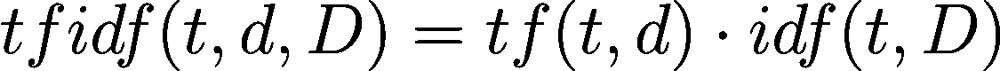
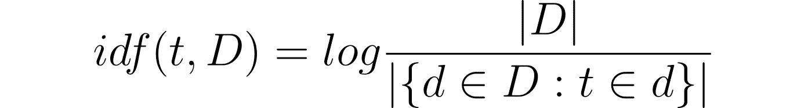
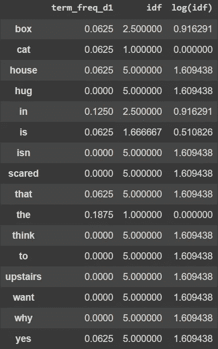
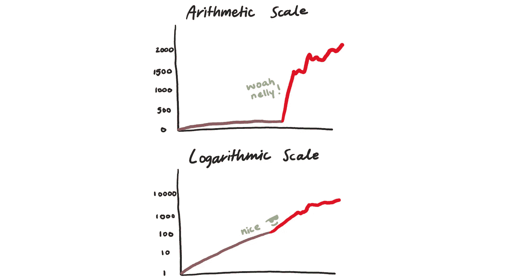

# TF-IDF 的工作方式和原因

> 原文：<https://towardsdatascience.com/how-tf-idf-works-3dbf35e568f0?source=collection_archive---------10----------------------->

## 简要介绍 TF-IDF 如何定义术语重要性。

在 [Unsplash](https://unsplash.com?utm_source=medium&utm_medium=referral) 上由 [Waldemar Brandt](https://unsplash.com/@waldemarbrandt67w?utm_source=medium&utm_medium=referral) 拍照

您希望用数字来表示一个单词在一组文档中的重要性。也许你想根据刚刚写的几篇文章使用这种表示来总结当前事件，或者你想对 Yelp 评论进行情感分类。经过一些谷歌搜索，你已经找到了 TF-IDF，及其数学定义。它是如何工作的，为什么工作？

# 数学定义

图片作者。TF-IDF 的数学定义

*   *t*=学期
*   *d*=文档
*   *D*=套单据

> TF-IDF 通过考虑某个术语在单个文档中的重要性来定义该术语的重要性，并通过其在所有文档中的重要性来对其进行缩放。

## ***文档中术语的重要性(词频):tf(t，d)***

术语频率回答了这样的问题，*在所有单词在本文档中出现的次数中，该单词在本文档中出现了多少次？*换句话说，*这个词对这个特定的文档有多重要？*

图片作者。术语频率的数学定义

给定一个只包含句子的文档:

> 猫在盒子里。

你会说‘房子’这个词在文档中出现的 6 个单词中出现了 0 次，或者说*TF(‘房子’，文档 1)=0/6=0* 。

同样，在包含一个句子的不同文档中:

> 是的，猫在房子里的盒子里。

单词“house”在文档中出现的所有 11 个单词中出现 1 次，即 *tf('house '，document2)=1/11。*

## 一个术语在所有文档中的重要性(逆文档频率):idf(t，D)

逆文档频率回答了这个问题，*这个单词在我所有的文档中有多常见(或不常见)？*

图片作者。逆文档频率的数学定义

此时，我们有两个文档。单词“house”的逆文档频率由*IDF(‘house’，D)=log(2/1)* 表示，因为它出现在我们的集合中的 2 个文档中的 1 个中。

类似地，单词‘the’的逆文档频率由*IDF(‘the’，D)=log(2/2)* 表示。您可能会有以下问题:

> *对于 IDF，我们为什么要取逆？为什么我们使用对数标度？为什么要乘以 TF？*

由*(总文档数)/(包含该单词的文档数)*创建的比率被反转，以给在所有文档中不太常见的单词更高的值。例如，在上面的例子中，“house”在所有两个文档中更不常见，因为它出现在一个文档中而不出现在另一个文档中，因此值为 2/1 或 2(而不是 1/2)。单词“The”在所有两个文档中更常见，因为它出现在所有文档中，因此值为 2/2 或 1。如果这些值没有反转，“the”将被视为“更重要”，因为它将具有更高的值(1 > 1/2)。这就是 IDF 对整个计算很重要的原因，因为它通过给它一个较低的 IDF 值来“照顾”英语中自然出现的单词，如“the”。我稍后会补充“小心”的其他含义。

将这些值输入对数标度，使其与频率项处于“同一标度”上:

图片作者。对于每个术语:术语在文档中的频率，未应用对数标度的 IDF，应用对数标度的 IDF

如果 IDF 不是对数标度，高 IDF 将对 TF-IDF 值产生**天文**效应。假设一个术语的 IDF 为 2，另一个术语的 IDF 为 4。现在，想象一下同样的条件，但是它们现在分别有 2000 万和 4000 万的 IDF。他们得出的 TF-IDF 值将**非常**不同。具有较高 IDF 的术语肯定会压倒其他术语。另一个术语可能根本不被认为是重要的。使用对数标度，IDF 值的影响是“平滑的”:

图片作者。算术标度(上)与对数标度(下)

这样，TF-IDF 值就处于一个更加平等的竞争环境中。

回到较低的 IDF 值如何“照顾”英语中自然出现的单词。IDF 为 1 意味着一个术语出现在我们集合中的每一个 文档中，因为*# documents in our collection = # documents 该术语出现在*。这可能发生在像“the”这样的术语中。在 *log(1)=0* 的情况下，该术语被赋予零值，因此通过将其作为术语重要性的候选项移除而得到“照顾”。

TF-IDF 是一种用于为 NLP 任务加权术语的流行方法，因为它根据术语在文档中的重要性为术语赋值，并根据其在语料库中所有文档中的重要性进行缩放，这在数学上消除了英语中自然出现的单词，并选择了更能描述文本的单词。因此，诸如文本摘要、信息检索和情感分类之类的 NLP 任务是利用 TF-IDF 的强大加权操作的一些任务。既然你已经理解了它是如何工作的，为什么要工作，那就试试这些任务吧！