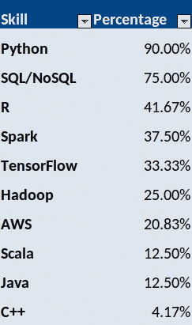
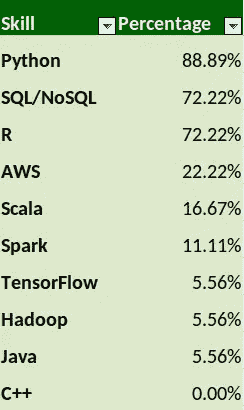

# 数据科学市场如何发展

> 原文：<https://towardsdatascience.com/how-the-data-science-market-is-evolving-99ce9bbf3c59?source=collection_archive---------23----------------------->

## 公司正在回归基础

来源:来自 [Pixabay](https://pixabay.com/photos/writing-pen-man-ink-paper-pencils-1149962/) 的[免费照片](https://pixabay.com/users/free-photos-242387/)

我记得有一次我和一个新客户的对话。

我刚刚加入了一个新的数据科学项目，客户问我的背景。

他特别问我的一个问题是，“你认为自己更像一个**统计学家**还是一个**程序员**？”。

我花了一点时间思考这个问题，然后回答:“统计学家。我的背景是经济学和计量经济学，在最初使用 SPSS 和 STATA 等统计软件包后，我随后转而使用 R 和 Python 进行分析，R 是我的第一语言。”

他的回应？

> “哦，太棒了。我发誓——如果我再看到一篇这样的机器学习文章……”

我强烈怀疑持这种观点的不止他一个人。

数据科学是一个非常宽泛的术语，坦率地说，它正被过度使用。虽然数据科学本身的许多方面并不新鲜，但迄今为止，围绕机器学习一直有一种特殊的热潮。

除了新奇因素，机器学习的部分吸引力在于自动化的潜力。与必须在深层次上理解统计概念相反，机器学习模型可以以黑盒的方式使用，通过这种方式，数据被简单地输入到模型中，正确的见解和预测就会以某种方式神奇地产生。

然而，事实证明并非如此，越来越多的公司开始认识到这一点。

## 公司在寻找什么？

有时候，在查看数据科学家的职位描述时，我会在电子表格中记下公司希望精通的特定语言。

对于我在 2019 年记录的一些角色，下面是公司似乎在寻找的技能的细分——百分比表明了公司寻找这种技能的比例:

来源:作者的计算

以下是 2021 年不同角色的调查结果。

来源:作者的计算

不出所料，排名前三的语言仍然是 **Python** 、 **R** 和 **SQL** 。然而，与 2019 年相比，有一些有趣的变化。

*   虽然 2019 年有 33%的角色在需求技能中宣传 TensorFlow，但 2021 年只有不到 6%的角色这样做。
*   同样，2019 年对 Spark 的需求为 38%，而 2021 年已降至 11%。
*   有趣的是，对 R 的需求从 2019 年的 41%大幅增长到 2021 年的 72%。

请注意，在进行这项分析时，我在 2019 年选择了一系列主要求职网站(例如 LinkedIn)的 20 个角色，在 2021 年选择了另外 20 个角色。

因此，上述分析绝非详尽无遗，每个公司都有自己的要求。例如，如果一家公司正在招聘图像识别或 NLP 技能人员，那么对 TensorFlow 技能的需求可能会高得多。

此外，作为一名统计学家，我承认任何人工选择的样本都可能存在选择偏差！然而，总的趋势似乎是更少关注机器学习，而更多关注理解统计数据并从中获得有用的见解。

## 林迪效应

虽然预测未来可能是一件徒劳的事情，但一个有用的启发可能会让我们这样做，那就是所谓的**林迪效应**。从本质上来说，林迪效应表明技术和其他非人类实体会反向老化。

例如，如果一项技术已经存在了五年，我们可以预期它还会存在五年。然而，如果一项技术已经存在了 20 年，我们可以预期它还会存在 20 年。这都是关于什么能经受住时间的考验——一些已经存在多年的东西可能会继续存在下去。

我们举一个 R 对 TensorFlow 的例子。哪一个更有可能在 2050 年出现？

虽然 R 经常被认为不如其他编程语言(严格来说，它不是编程语言)，但事实是 R 自 1993 年以来一直在使用，而 TensorFlow 自 2015 年以来一直存在。如果让我打赌三十年后人们会用什么，我会选择前者。

就此而言，Python 最初发布于 1991 年，而 SQL 则可以追溯到 1974 年。世界继续在数据库上运行——在这个领域，没有任何语言能够取代 SQL。

还有一个鲜为人知的事实是，SQL 本身也可以用于分析——SQL 数据库不仅仅是为了将数据导入 Python 或 r 而存在的。事实上，在 SQL 中进行简单的分析(例如简单的回归)是一种确定结果是否有意义和值得进一步分析的好方法。人们经常浪费宝贵的时间和资源，用 Python 和 R 进行更深入的分析，却发现结果是虚假的。

## 沟通是关键

公司雇佣数据科学家的一个主要原因是理解数据。所谓有意义，我们是指能够**清晰地传达**与数据相关的发现。

当我们开始从事数据科学时，我们经常会犯错误——就像我自己一样——把错误的事情放在优先位置。

例如，初学者的思维方式通常是获取一组数据，并试图建立一个能够产生最高预测准确性的模型。

抛开这种准确性是否确实可靠的问题不谈——**这种做法实际上给公司带来了什么价值**？

例如，假设您构建了一个模型，该模型能够高度准确地预测汽车租赁公司的销售额。你能解释一下**为什么**这款车型表现如此之好吗？那家汽车租赁公司销售的最大**驱动因素**是什么？根据你分析的信息，公司可以采取哪些步骤来进一步增加销售额？

如果不能回答这些问题，那么获得高精度的指标是没有意义的。即使没有数据分析，行业专家仍然会对这个特定行业的季节性销售波动有很好的了解。

释放数据科学价值的关键是能够将模型的发现转化为可操作的见解。计算机可以在自动化模型计算中取代人类——但它们永远无法取代人类创造性思维和逻辑分析信息的能力。

# 结论

在“数据科学”这个术语出现之前，统计能力、解决问题的能力和领域知识等技能早已存在。很久以后它们还会存在。

企业开始认识到这一点，并越来越重视聘用数据科学家，他们不仅能理解统计和编程元素，还能创造性地思考，并以有意义的方式利用模型洞察力。

从个人的角度来看，这意味着我将继续扩展我在统计和概率等领域的知识——特别强调在打开代码编辑器之前确保我理解每种方法背后的理论。

其次，在决定使用一个模型之前，我会更严格地评估它。虽然我在技术上可以使用 XGBoost 进行时间序列预测，但是这些数据适合这样的预测吗？ARIMA 模式会做得更好吗？

在我们的核心，数据科学家基本上是问题解决者。比起成为一名优秀的程序员，公司更看重这种技能，并相应地调整他们的招聘方式。

*免责声明:本文是在“原样”的基础上编写的，没有任何担保。它旨在提供数据科学概念的概述，不应被解释为专业建议。本文中的发现和解释是作者的发现和解释，不被本文中提到的任何第三方认可或隶属于任何第三方。作者与本文提及的任何第三方无任何关系。*