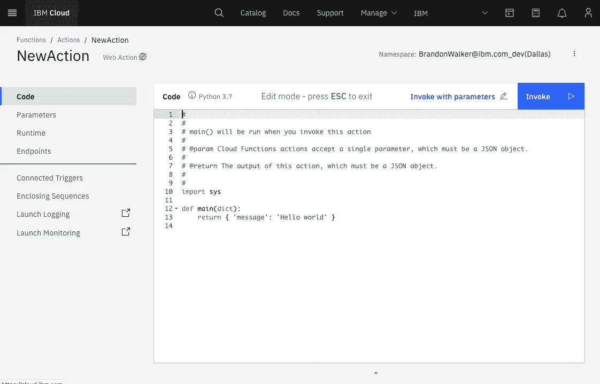

# 数据科学家的角色将如何演变

> 原文：<https://towardsdatascience.com/how-the-data-scientist-role-could-evolve-36a6ef5c24fd?source=collection_archive---------30----------------------->

## 面对不断变化的技术，数据科学家能学到什么

照片由[布伦丹·丘奇](https://unsplash.com/@bdchu614?utm_source=unsplash&utm_medium=referral&utm_content=creditCopyText)在 [Unsplash](https://unsplash.com/s/photos/career?utm_source=unsplash&utm_medium=referral&utm_content=creditCopyText) 上拍摄

# 什么威胁着数据科学家的工作？

随着计算机越来越快，数据科学工具越来越好，数据科学家的工作将不再专注于优化传统的 ML 模型(非神经网络模型)。许多公司都在追求能够针对各种问题执行大量特征工程和模型优化的 AutoML 框架。所有主要的云提供商(和一群初创公司)都为计算机视觉提供现成的迁移学习模型，许多公司还为表格和 NLP 模型提供 AutoML 服务。在这些服务中，你可以上传你的数据，在你点击“训练”后，最好的模型就会被剔除。具有讽刺意味的是，应该创造 ML/AI 的数据科学家发现这些新工具正在自动化他们自己工作的一部分。

# 一个数据科学家除了 ML 还擅长什么？

作为一名数据科学家，我花了很多时间思考，如果有一天我的工作高度自动化，我可以做些什么。我的结论是，虽然有许多非 ML 数据科学任务，但我的核心技术能力——编写 ML 模型，解释它们，部署它们，监控和更新它们——可能需要多样化。那么，除了这些技能，我和大多数其他数据科学家还擅长什么呢？Python 和函数式编程。如果你不知道，函数式编程强调编写函数，而不是编写面向对象的代码。面向对象编程(OOP)的兴起是因为人们倾向于根据对象及其相互关系来思考。因为许多 OO 代码没有定义的执行顺序，所以关注对象的行为是最重要的。大量的时间花在设计软件上，人们已经把描述设计模式作为整个职业。另一方面，函数式编程旨在关注函数，在函数中，我们可以更清楚地看到作为输入结果的输出。我认为大多数数据科学家都认识到，当他们编写代码时，他们是在类定义之外进行的，并且通常旨在对输入进行一组一致的可验证操作。函数式程序的目标应该是达到数学函数的精度水平。f(x) = 4x + 3 和一段代码一样有效，因为它是一个数学函数。这个函数很容易验证，而 OO 代码可能会以难以重新创建和调试的状态结束。

# 我们的技能组合对什么有用？

我相信很多数据科学家认为自己不能因为懂 python 就成为软件工程师。要理解 OOP、软件设计、前端开发、应用的托管、扩展和部署，还有很多工作要做。也就是说，在无服务器的环境中，我认为数据科学家是编写代码的优秀候选人。无服务器代码在很大程度上依赖于云，并部署特定的功能以用作 API 或在其他操作时触发，这就是为什么它们经常被称为功能即服务(FaaS)。我(作为一名数据科学家)曾经写过这样的例子:在网上购物车中添加/删除商品，根据时间表从数据库中收集 KPI，在商店中指派一名工作人员将新送到商店的商品放好并添加到数据库中。由于其他系统非常复杂，许多初创企业和大型企业都在这个架构上运行。学习如何开发 OOP 并在后端运行它会有很多令人头痛的问题，解决 bug 也很困难。无服务器代码通常与业务逻辑联系非常紧密，更容易调试，部署和监控工作量也更少。考虑到 jupyter 笔记本运行的几乎是功能性的过程，数据科学家使用数据库的能力，以及对业务成果的关注，我认为它们是将来编写这样的代码的完美候选。

# 我们如何为这样的角色做准备？

大多数无服务器代码都是事件触发的。当有人对数据库进行写操作时，这将是触发您的无服务器代码的事件。这些事件经常与 NoSQL 数据库相关，所以我建议从 MongoDB 这样的流行数据库开始复习。

其次，我认为创建自己的功能来部署到云是一个很好的开始。如果你愿意，这个函数还可以包含 ML，但是我会从一个狭窄的用例开始。无论您选择什么样的云提供商，您的代码的整体软件架构都将非常相似，但是有些功能对于经理来说会比其他的稍微简单一些。以下是您将在主要云提供商上创建的内容:

*   IBM 公共云:云功能

对于 IBM Cloud 函数，您可以非常快速地编写和测试代码，如下所示。连接的触发器包括写入云对象存储、Cloudant 数据库、Kafka 事件流和自定义触发器(当特定 HTTP 端点收到 POST 时激活)。

[创建新的 IBM 云功能](https://cloud.ibm.com/functions/)

*   谷歌云平台:云功能
*   AWS: Lambda
*   微软 Azure:无服务器功能
*   Cloudflare: Cloudflare 工人

最后，我建议学习另一种语言。云功能成本由执行时间、消耗的数据量和使用次数决定。因为 python 是一种相对较慢的语言，使用 Go 或 C++等更快的语言可以节省成本。学习另一种语言的额外好处是，它可以帮助你学习如何优化你的母语。