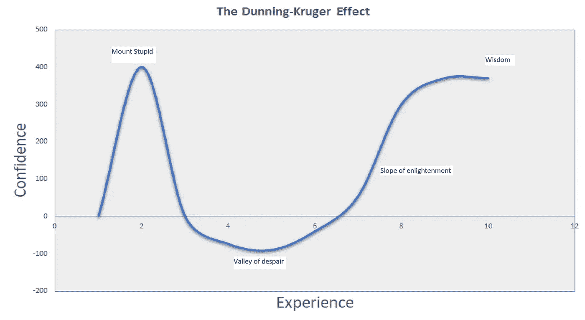

# 邓宁-克鲁格效应如何解释为什么你的数据科学提议没有被接受

> 原文：<https://towardsdatascience.com/how-the-dunning-kruger-effect-can-explain-why-your-data-science-proposals-dont-get-buy-in-f625ab37c94?source=collection_archive---------38----------------------->

## 考虑一下邓宁-克鲁格效应，让你的提议得到重视

## **许多出色的数据科学提案从未超出论文的范围**

由[蒂姆·高](https://unsplash.com/@punttim?utm_source=medium&utm_medium=referral)在 [Unsplash](https://unsplash.com?utm_source=medium&utm_medium=referral) 上拍摄的照片

## **简介**

我想先给你画一幅画。

假设你是一名经验丰富的数据科学家。你在一家小公司工作，向领导公司并负责所有决策的董事团队汇报。只有得到他们认可的提议才能实施。

上个月，你一直在研究工作中效率低下的数据流程，现在你终于有了解决方案。它简单、优雅，实现起来不需要任何成本。您对自己的解决方案很有信心，但是您通过了其他数据科学家进行的一些必要的感觉检查。让你高兴的是，他们都在船上，现在你充满了信心。

你简直迫不及待地想把这个拿到导演面前；你写一篇论文，在下次委员会上提出来。你对你的新解决方案很满意，你觉得这应该是一个不需要动脑筋的问题，“他们肯定会同意吗？”—你心里想。

委员会日到了，你提交了你的论文，这个报告完美无缺，因为你认真排练了。完成后，你在脑海中回放演示文稿。你的一部分感觉房间里没有人真正理解这个问题或解决方案。你可以发誓你已经尽可能简单地把它表达出来了，但是你无法从你的想法中摆脱那些空白的脸、抓头和打哈欠。

会议结束时，你会收到一封来自你的一位主管的电子邮件，感谢你的工作。遗憾的是，他们已经决定不采用你的解决方案。你感到失望，并努力理解哪里出了问题。你觉得根本没人听你说话。

如果这曾经发生在你身上，你可能会发现自己在责怪办公室政治，甚至是你自己。但你有没有想过，这里可能起作用的是邓宁-克鲁格效应？

## **什么是邓宁-克鲁格效应？**

邓宁-克鲁格效应是心理学家大卫·邓宁和贾斯汀·克鲁格创造的心理学观察。他们提出了经验/知识和自信之间的关系。

作者生成的图像

**愚笨山的高处:**这是一种极乐的无知状态。在这里，你站在世界之巅，过于自信。在数据科学术语中，你可能刚刚用一些玩具数据建立了你的第一个线性回归。你自信满满，相信几个月后你就能成为所在领域的顶尖数据科学家。

**下降到绝望的山谷:**在愚蠢山高高地骑了几个星期或几天之后，你开始有所领悟。当你试图用真实世界的数据建立你的第一个模型时，或者当你遇到你在 MOOC 中没有见过的问题时，它击中了你。你开始意识到你“知识”的局限性。这种感觉最初会爬上你的身体，但你会感觉到它越来越深。为了解决这个问题，你读更多的书，参加更多的课程，做更多的项目。令你绝望的是，这口井比你想象的要深。

这确实是很多人会放弃的地方。在绝望的山谷中，事情进展缓慢，动力不足，挫败感侵蚀着你。毕竟，你的自信心空前低落，因为你的自尊心受到了打击。

> 你终于发现你不知道自己有多无知。更糟糕的是，你还有很长的路要走。

**开悟之坡:**在黑暗中徘徊了漫长的时间后，你看到了一丝曙光。一个你努力去领会的想法变成了你的直觉。你现在已经有了几个项目，并且可以看到你遇到的大多数问题的解决方案。你不知道什么时候或者怎样，但是有一天事情开始变得明朗起来。你的坚持终于有了回报，你看着自己每天都在能力上成长。学习变得有趣和令人兴奋，你张开双臂欢迎它。

智慧:现在你真正胜任你的工作。你领域内的其他人认可你的专业知识，而你有工作组合来支持它。你可以从高层次看待问题，你的经验会引导你相对容易地找到最佳解决方案。

你不会吹嘘你已经获得的知识，并认识到总有新的东西要学。在这种新的自信水平下，你获得了开始时没有的东西——对过程和旅程的尊重。

## **邓宁-克鲁格效应在起作用**

在开头概述的场景中，我让您想象自己是一名经验丰富的数据科学家。很可能你会处于智慧的一端，或者至少接近它。

作为专家，你经历了整个过程。你会遇到存在于邓宁-克鲁格曲线所有点上的领导者，你的工作是知道如何作为专家接近他们中的每一个。如果你想让别人听到你的声音并认真对待你的提议。

以下是我的建议:

> **不要接近愚蠢山山顶的领导者**

你必须现实一点，愚蠢山上的人们高估了他们对某个领域的知识。你可能无法让他们相信他们是无知的。在这种情况下，我看到了三种现实的选择。

**方案一:**你可以耐心等待。

如果你和愿意学习的人打交道，最终他们会陷入绝望的深渊。在这里，他们可能更愿意认可你的专长，也许你可以和他们一起工作。

这种方法的缺点是，有些人很固执，不愿意学习，你会等这样的人很长时间。

**选择 2:** 只向这些类型的领导者提出你专业领域的基本问题。

他们可能足够了解这些问题，愿意倾听你的意见。你必须小心，这个问题实际上是初级的，尽管在商业中，问题往往更加复杂。

这里的缺点是，您可能会对只能在工作中实现基本解决方案感到愤怒。

我在工作中一次又一次地看到这种情况。这样做的人经常感觉他们的职业停滞不前，并发现他们缺乏有意义的项目。

**选择三:**止损换工作。

如果你的领导满足于呆在愚蠢的山上，那么你做的事情不会让他们明白。不要浪费你的时间和精力去说服那些不想被说服的人。

> 明智而谨慎地接近绝望之谷的领导者

绝望之谷的领导者可能会不知所措，有防御心理和压力，所以你需要在这里熟练地导航。你需要谦逊地接近他们，表现出对他们处境的同情。与他们分享你的经历，帮助他们理解你也经历过同样的过程，会给他们额外的安慰。你的目标不是变得微不足道，而是给他们理解和认可你的提议所需要的东西。这需要耐心。

对于绝望之谷的领导者来说，最困难的事情是发现他们。不像愚蠢山上的人，他们不骄傲也不过度自信。他们明白他们不知道，有时这可能意味着他们因为羞愧而隐瞒这一点。

识别这类领导人的一个方法是倾听他们提出的问题。有些问题显示出对该主题缺乏了解，只有 it 专家才能意识到这一点。

好消息是，这个阶段的领导者非常乐于学习。如果你谨慎行事，你可能会成为他们在你专业领域成长的催化剂。他们将体验到开悟斜坡的回报，并开始因此认可和欣赏你。

如果你足够幸运，走到了这一步，你会发现你的提议得到了很多支持(前提是它们真的很好)。你的领导团队会对你有信心，可能会给你很多机会。

## **最终想法**

在我从事金融服务的时候，我多次看到这样的故事。我见过有人试图一次又一次地将同样伟大的提议推进门外，但却徒劳无功。希望这篇文章能指导你不要犯同样的错误。

还没提到的是自我意识。最重要的是，你要认识到你在任何领域的邓宁-克鲁格曲线上的位置。意识到你在哪里会引导你适当地行动。例如，当你意识到自己站在愚蠢的山上时，你会控制自己的“自信”。

> 自我意识到你在曲线上的位置将会提高你识别你的领导在哪里的能力，从而运用策略与他们合作。

请记住不要自大。你的领导可能不是数据科学方面的专家，但他们可能是非常有经验的专业人士，并且在其他领域处于智慧曲线的末端。

最后，人类心理学非常复杂，但我发现这个简化的框架帮助我成功地指导我的工作。

<https://www.linkedin.com/in/john-adeojo/> 