# LSTM 如何改善 RNN

> 原文：<https://towardsdatascience.com/how-the-lstm-improves-the-rnn-1ef156b75121?source=collection_archive---------10----------------------->

持续流动。杰里米·毕晓普在 [Unsplash](https://unsplash.com/s/photos/flow?utm_source=unsplash&utm_medium=referral&utm_content=creditCopyText) 上的照片

## [实践教程](https://towardsdatascience.com/tagged/hands-on-tutorials)

早在 1997 年，长短期记忆(LSTM)网络相对于其他递归网络的优势来自一种反向传播误差的改进方法。Hochreiter 和 Schmidhuber 称之为“恒定误差反向传播”[1]。

但是“不变”是什么意思呢？为了回答这个问题，我们将浏览 LSTM 的架构，并理解它是如何向前和向后传播的。在此过程中，我们将与递归神经网络(RNN)进行一些比较。如果你不熟悉 RNN，你可能想在这里阅读一下。

然而，我们应该首先了解 RNN 要求 LSTM 提出的解决方案的问题是什么。这个问题是来自反向传播步骤的梯度的**爆炸**和**消失**。

## 消失和爆炸渐变

反向传播是从预测到权重和偏差的误差传播。在像 RNN 和 LSTM 这样的循环网络中，这个术语也被创造了**通过时间的反向传播** (BPTT)，因为它通过所有时间步长传播，即使权重和偏差矩阵总是相同的。

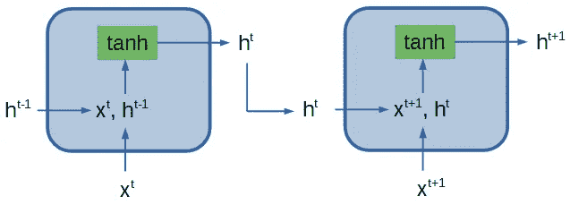

具有两个时间步长的典型 RNN 的一部分。作者图。

上图描绘了具有两个输入的典型 RNN 的一部分。绿色矩形表示使用双曲正切(tanh)函数对净输入及其隐藏状态激活进行前馈计算。前馈计算在所有时间步骤中使用相同的一组参数(权重和偏差)。

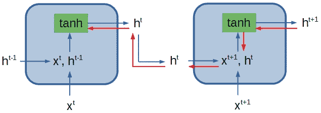

典型 RNN 一部分的前向传播路径(蓝色)和后向传播路径(红色)。作者图。

红色的是 BPTT 路。对于较大的序列，可以看到计算的叠加。这很重要，因为它产生了一个指数因子，这个因子很大程度上取决于我们的权重值。每当我们后退一个时间步，我们需要在当前梯度和权重矩阵之间做一个内积。

我们可以想象我们的权重矩阵是一个标量，假设绝对标量在 0.9 或 1.1 左右。此外，我们有一个长达 100 个时间步长的序列。通过将这些值乘以 100 倍而产生的指数因子将产生 0.9 的**消失梯度**问题:

> **0.9 ⁰⁰ = 0.000017(…)**

以及 1.1 的**爆炸渐变**问题:

> **1.1 ⁰⁰ = 13780.61(…)**

本质上，最后一个时间步的 BPTT 计算类似于以下内容:

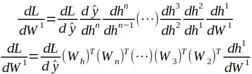

请注意，尽管该表示并不完全准确，但它给出了具有 n 个输入的 RNN 的 BPTT 中权重矩阵的指数堆叠的好主意。 *W_h* 是 RNN 最后一个线性层的权重矩阵。

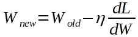

接下来，我们将把这些值的一部分添加到权重和偏差矩阵中。你可以看到，我们要么几乎没有改善参数，要么试图改善太多，以至于适得其反。

既然我们理解了消失和爆炸渐变的概念，我们可以继续学习 LSTM。让我们从它的向前传球开始。

## LSTM 正向传播

尽管存在差异，使 LSTM 成为比 RNN 更强大的网络，但仍有一些相似之处。它包含一对一、多对一、一对多和多对多的输入和输出配置。此外，人们可以选择使用堆叠配置。

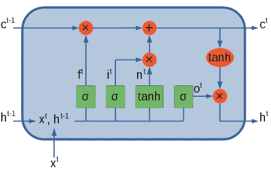

LSTM 细胞的表现。作者图。

上面我们可以看到 LSTM 细胞内的向前传播。它比简单的 RNN 要复杂得多。它包含四个由 sigmoid 函数(σ)或 tanh 函数激活的网络，每个网络都有自己不同的参数集。

这些网络中的每一个，也称为门，都有不同的用途。他们将用应该传递到下一个时间步的相关信息来转换时间步 t ( *c^t* )的单元状态。橙色圆圈/椭圆是它们之前的矩阵的元素转换。盖茨镇是这样做的:

**忽略栅极层(f)** :使用在 0 和 1 之间调节信息的σ函数，决定从单元状态中忽略哪些信息。它会忘记所有为 0 的东西，记住所有为 1 的东西，中间的东西都是可能的候选者。

**输入门层(i)** :这也可以是一个记忆门。在σ函数的帮助下，它决定哪些新候选项与该时间步相关。

**新的候选门层(n)** :创建一组新的候选门，存储在单元状态中。这些新候选的相关性将通过与输入门层的逐元素乘法来调制。

**输出门层(o)** :决定输出单元状态的哪些部分。单元状态通过双曲正切函数归一化，并通过输出门逐元素相乘，输出门决定隐藏状态应该输出哪个相关的新候选。

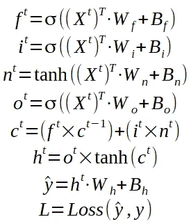

在左边，你可以看到在 LSTM 细胞内进行的计算。最后两个计算是一个外部前馈层，用于获得预测和某个损失函数，该损失函数采用预测和真实值。

整个 LSTM 网络的架构旨在处理三个时间步长的输入序列，并预测未来的时间步长，如下图所示:

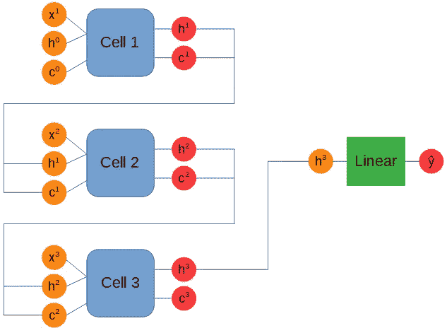

具有三个输入和一个输出的 LSTM 的表示。作者图。

将输入和参数转换成向量和矩阵形式有助于理解计算的多维性。注意，我们使用四个权重和偏差矩阵，它们有自己的值。

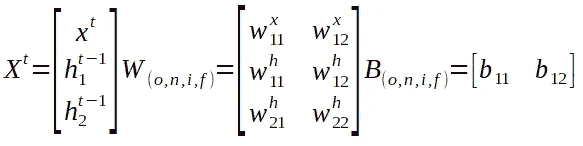

这是 LSTM 的正向传播。现在是时候了解网络如何反向传播，以及与 RNN 相比它是如何发光的了。

## LSTM 反向传播

LSTM 的改进学习允许用户使用具有数百个时间步长的序列来训练模型，这是 RNN 很难做到的。

在解释门时没有提到的是，它们的工作是决定存储在单元和隐藏状态中的信息的相关性，以便在单元之间反向传播时，传递的误差尽可能接近 1。这可以确保渐变不会消失或爆炸。

理解这一过程的另一种更简单的方式是，单元状态用稳定错误传播的信息连接单元内部的层，有点像 ResNet 所做的那样。

让我们通过反向传播计算来看看误差是如何保持恒定的。我们将从线性输出图层开始。

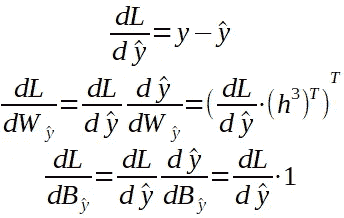

现在我们将讨论 LSTM 细胞的反向传播。但是首先让我们来看一下在一个单元格内我们必须走的路径。

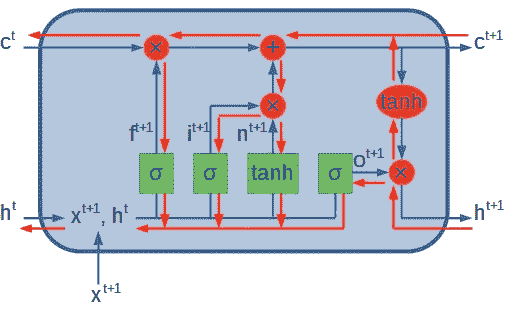

LSTM 细胞内的完全反向传播(红色箭头)。作者图。

正如你所看到的，路径是非常复杂的，这使得计算量大于 RNN。

下面你可以看到 LSTM 细胞的两种输出的反向传播，细胞状态和隐藏状态。你可以参考我在前面展示的方程来更好地理解我们正在经历的方程。

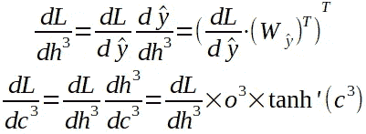

可以看到，通过单元状态向前传输的信息现在被 tanh’调制后反向传输。注意σ'和 tanh '中的撇(')代表这两个函数的一阶导数。

在接下来的步骤中，我们将返回每个门的参数。

**输出门:**

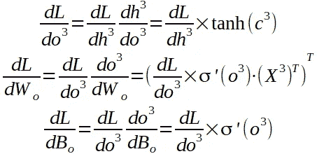

**新候选门:**

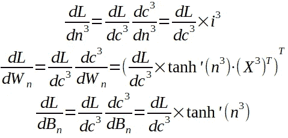

**输入门:**

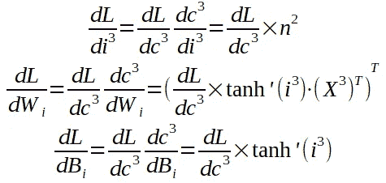

**忘门:**

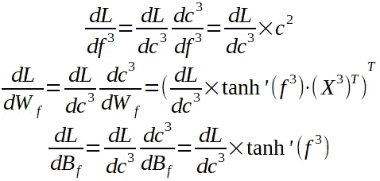

我们已经计算了单元内所有参数的梯度。然而，我们需要保持反向传播，直到最后一个细胞。让我们看看最后的步骤:

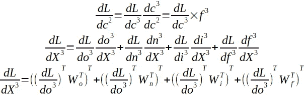

你可以看到，从单元状态 c 到状态 c 的信息很大程度上取决于输出门和遗忘门的输出。同时，输出和遗忘梯度取决于先前存储在单元状态中的信息。这些交互应该提供恒定的误差反向传播。

进一步回到全局输入(X ),我们将来自所有四个门的输入相加。

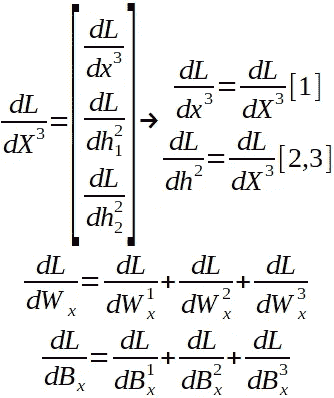

最后，我们从全局输入向量中分离出隐藏状态，遍历剩余的单元，并且将所有单元中关于参数的所有梯度加在一起。

## 结束语

这个故事的目的是理解为什么 LSTM 能够通过在细胞间的反向传播中保持恒定的误差流来处理比 RNN 更复杂的问题。

我们探讨了由于 RNN 对复杂序列处理不当而产生的问题，从而导致了爆炸和消失梯度。

然后我们通过探索 RNN 的梯度流来了解这些问题是如何发生的。

最后，我们介绍了 LSTM 及其正向传递，通过解构其反向传递，我们了解到单元状态受两个门单元的影响，这两个门单元负责确保恒定的误差回流。

值得一提的是，随着用 LSTM 进行的实验越来越多，这个网络停止学习的地方就有了一定程度的复杂性。一般来说，在它发生之前会有上千个时间步骤，这已经很好了。

这将导致 LSTM 的逐步淘汰，因为问题变得更加雄心勃勃，有利于一种新的网络，称为变压器或 BERT。你可能也听说过用于自然语言处理的 GTP-3。这些都是非常强大的网络，具有巨大的潜力。

然而，LSTM 肯定有它的影响，它是用独创性创造的，今天仍然有用。

感谢阅读！

## 参考

[1] Sepp Hochreiter 和 Jürgen Schmidhuber，《神经计算中的长短期记忆》，1997 年，DOI: 10.1162/neco.1997.9.8.1735