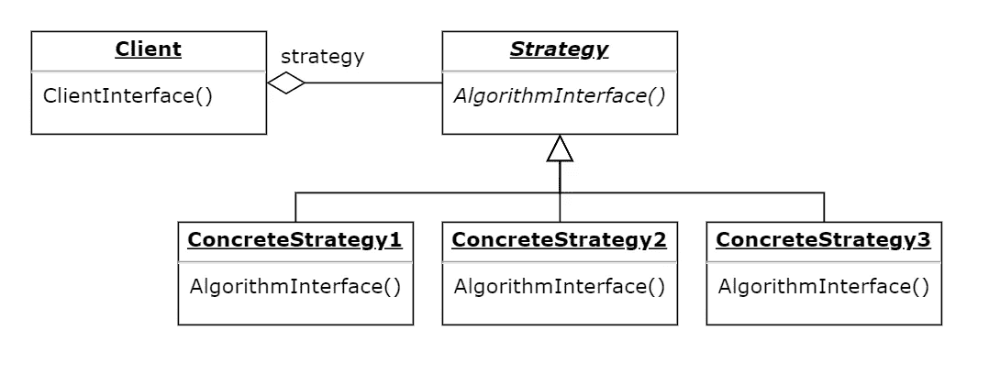
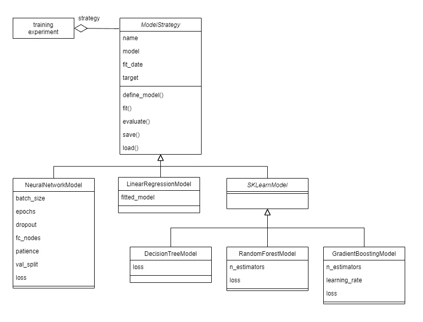

# 策略设计模式如何帮助您快速评估备选模型

> 原文：<https://towardsdatascience.com/how-the-strategy-design-pattern-can-help-you-quickly-evaluate-alternative-models-66e0f625016f?source=collection_archive---------54----------------------->

## 开发与各种模型无缝合作的机器学习实验。


图片由来自 [Pixabay](https://pixabay.com/?utm_source=link-attribution&amp;utm_medium=referral&amp;utm_campaign=image&amp;utm_content=2755908) 的 [Felix Mittermeier](https://pixabay.com/users/felixmittermeier-4397258/) 拍摄

# 动机

本文解释了机器学习实践者如何应用策略设计模式，以有效和可重用的方式评估模型的替代方案。

# 介绍

当解决应用机器学习问题时，考虑多种建模技术是常见的(也是明智的)。在定义了问题之后，习惯上要头脑风暴出一个“候选模型”的入围名单。在许多情况下，基线建模技术包括在这个列表中，以论证一种新方法的优势。

在应用机器学习项目中，实践者经常利用可信赖的开源包(例如 scikit-learn、TensorFlow、PyTorch)中可用的模型实现或组件。为了执行机器学习调查工作流中的典型活动，有必要独立地与这些库中的每一个进行交互。例如，序列化 TensorFlow 中定义的神经网络分类器不同于序列化 scikit-learn 中定义的随机森林分类器。在 TensorFlow 中，你会调用[*TF . keras . models . save _ model(模型，路径)*](https://www.tensorflow.org/api_docs/python/tf/keras/models/save_model)；而在 scikit-learn 中，建议使用内置的 Python 包“joblib”，调用 [*joblib.dump(model，path)*](https://joblib.readthedocs.io/en/latest/generated/joblib.dump.html) 。类似地，性能指标的计算涉及对可用于指标计算的 API 的不同调用。根据我的经验，用不同的候选模型构建更大的实验是相当麻烦的，这些模型需要不同的函数调用来完成相同的任务。

我们将看到一种称为“策略”的软件设计模式如何有助于实现可重用的机器学习实验，提高模型评估过程的效率。

# 战略设计模式

软件设计模式是为经常遇到的软件设计问题定义一种优雅方法的结构。它们是一类问题的简洁解决方案的蓝图，促进良好的设计实践，例如模块化和可重用性。面向对象的设计模式描述了类之间的成员和关系。策略设计模式是一种行为设计模式，它涉及到一系列算法的定义，这些算法可以被客户互换地调用[1]。客户端程序可以决定使用家族中的任何算法，因为它可以通过相同的接口与任何算法进行交互。下图展示了 Strategy 的基本思想——多个“具体的”算法实现了一个抽象接口。因此，客户端可以通过相同的接口与任何具体的算法进行交互。每个具体的算法对同一问题实现不同的解决方案，保持相同的接口。



描绘策略设计模式的 UML 图。*作者图片。*

# 候选模型是不同的策略

那么这种设计模式与评估候选机器学习模型有什么关系呢？我邀请你考虑一下，如果每个不同的建模方法都被封装成一个具体的策略，我们能做些什么。那么每一个“模型策略”对象都将拥有相同的接口，而不管它们实现中使用的方法或库。我们可以编写代码来与模型交互，而不考虑定义它们的技术。也许我可以在一个循环中遍历所有的模型类型，用同一行代码开始一个训练实验。

假设我们定义了一组对原型机器学习模型至关重要的核心操作。下面提出了这种操作的示范(非穷举)列表:

*   *定义*底层模型
*   *在某些数据集上拟合*模型
*   *根据一些数据评估*模型，计算性能指标
*   *将*模型保存到永久存储器中，以备后用
*   *从持久存储中加载*模型

我们可以定义一个包含这些方法的抽象基类，强制所有的子类用一个期望的签名实现这些方法。在 Python 中，我们可以使用[*ABC*](https://docs.python.org/3/library/abc.html)*包将抽象合并到我们的类实现中。*

```
***from** abc **import** ABCMeta, abstractmethod
from datetime import datetimeclass ModelStrategy(object):
   '''
   An abstract base class for defining models. The interface,
   to be implemented by subclasses, define standard model 
   operations
   '''
    __metaclass__ = ABCMeta def __init__(self, name):
      self.name = name
      self.target = 'y'
      self.train_date = datetime.now().strftime(**'%Y%m%d-%H%M%S'**) 

   [@abstractmethod](http://twitter.com/abstractmethod)
   def define_model(self):
      # Abstract method for model definition
      pass [@abstractmethod](http://twitter.com/abstractmethod)
   def fit(self, dataset):
      # Abstract method for model fitting
      pass [@abstractmethod](http://twitter.com/abstractmethod)
   def evaluate(self, dataset):
      # Abstract method for model evaluation
      return None [@abstractmethod](http://twitter.com/abstractmethod)
   def save(self, save_dir):
      # Abstract method for serializing the model
      return None [@abstractmethod](http://twitter.com/abstractmethod)
   def load(self, model_path):
      # Abstract method for restoring the model
      return*
```

*从上面的代码片段中可以观察到，我们的抽象基础模型类 *ModelStrategy* 包含了对 *define_model()、fit()、evaluate()、save()* 和 *load()* 的抽象定义。从 *ModelStrategy* 继承的所有类都必须实现这些方法。注意 *name* 属性的存在——所有子类都必须在其构造函数中接收该字段的值。现在，我们可以为我们希望评估的所有模型创建类，每个类都扩展了 *ModelStrategy* 基类。*

*为了说明的目的，假设我们的候选模型列表包括普通最小二乘(OLS)线性回归(特别是[*stats models*](https://www.statsmodels.org/stable/index.html)*实现)。让我们看看如何定义一个执行线性回归的具体策略类，同时符合上面指定的抽象接口。下面的代码片段演示了这个想法。**

```
**class LinearRegressionModel(ModelStrategy):
   '''
   An ordinary least squares (OLS) linear regression model
   ''' def __init__(self, hparams):
      self.fitted_model = None
      name = 'LinearRegression'
      super(LinearRegressionModel, self).__init__(hparams, name) def define_model(self):
      return None     # Need data to initialize this model def fit(self, dataset):
      '''
      Fit the OLS model
      :param dataset: preprocessed data to fit the model on
      '''
      self.model = sm.OLS(dataset[self.target],
                   dataset[dataset.columns[:-1]])
      self.fitted_model = self.model.fit() def evaluate(self, dataset):
      '''
      Calculate performance metrics on the test set
      :param dataset: preprocessed data to test the model on
      :return: Dict containing performance metrics and fit data
      '''
      test_df = dataset.copy()
      preds = 
          self.fitted_model.predict(test_df[test_df.columns[:-1]])
      metrics = {}
      metrics['MAE'] = mean_absolute_error(test_df[self.target],
                       preds)
      metrics['MSE'] = mean_squared_error(test_df[self.target],
                       preds, squared=True)
      metrics['RMSE'] = mean_squared_error(test_df[self.target],
                       preds, squared=False)
      return metrics def save(self, save_dir):
      '''
      Saves the model to disk
      :param save_dir: Directory in which to save the model
      '''
      if self.fitted_model:
         model_path = os.path.join(save_dir, 
                      self.name + self.fit_date + '.pickle')
      self.fitted_model.save(model_path) def load(self, model_path):
      '''
      Loads the model from disk
      :param model_path: Path to saved model
      '''
      if os.path.splitext(model_path)[1] != '.pickle':
         raise Exception('Path must have ".pickle" extension.')
      self.model = sm.load(model_path)
      return**
```

**我们在 OLS 的实现相当简单。在 *fit()* 调用中，我们通过调用 *sm 来初始化 OLS 模型对象。OLS()* ，将我们的数据集作为参数传递。我们将模型保存为一个名为 *self.model* 的类属性。事实上，实际的 OLS 模型是我们线性回归的具体策略类的一个属性。请注意，在 *evaluate()，*中，我们计算了一些标准的性能指标，将我们的模型预测与传递的数据集中的真实目标进行比较。**

# **一个简单的例子**

**到目前为止，我们已经讨论了如何使用策略设计模式来创建代表我们的候选模型的不同对象，每个对象都符合相同的接口。现在让我们看一个例子，如何在实践中使用 Strategy 来编写代码，以便不可思议地评估我们的候选模型。**

**考虑下面的类图。它是策略设计模式的实现，包含几个具体的模型策略，具有更复杂的关系。**

****

**一个 UML 类图，描述了一组候选模型的策略设计模式的实现。*图片作者。***

**和以前一样，我们有直接从*模型策略*基类继承的*线性回归模型*。我们也有一个神经网络模型的具体策略类。请注意， *NeuralNetworkModel* 类的属性对应于神经网络训练中使用的一些常见超参数。神经网络本身可以在 TensorFlow、PyTorch 或 scratch 中实现——这对客户端来说无关紧要(在上面被称为“训练实验”)。**

**读者可能会注意到上图中的一个特点。一个名为 *SKLearnModel* 的抽象类直接继承自基类，然而它有三个自己的子类。这就是面向对象编程的魅力所在。 *DecisionTreeModel、RandomForestModel、*和 *GradientBoostingModel* 类都是使用 scikit-learn 包定义的。因此，它们在 *ModelStrategy* 中核心方法的实现是相同的。为什么要在每个具体的策略类中为这些方法重写代码呢？通过在 SKLearnModel 抽象基类中捕获这些共性，它的子类必须仅仅定义是什么使它们独特。参见下面定义了 *RandomForestModel* 类的代码片段，并陶醉于它的简单性。**

```
**class RandomForestModel(SKLearnModel):
   '''
   A random forest regression model
   ''' def __init__(self, hparams):
      name = 'RandomForest'
      self.n_estimators = int(hparams.get('N_ESTIMATORS', 100))
      self.loss = hparams.get('LOSS', 'mse') if hparams.get('LOSS',
                  'mse') in ['mse', 'mae'] else 'mse'
      super(RandomForestModel, self).__init__(hparams, name) def define_model(self):
      return RandomForestRegressor(n_estimators=self.n_estimators,
                                   criterion=self.loss) def fit(self, dataset):
      super(RandomForestModel, self).fit(dataset)**
```

**根据我的经验，具体模型策略类的属性对应于模型的超参数。例如，上面的随机森林实现对于决策树估计器的数量( *n_estimators* )和损失函数的选择( *loss* )具有超参数。通常，我选择将超参数作为字典传递给具体模型类的构造函数。我经常在一个. yml 文件中维护这些字典的序列化，在运行训练实验时调整它们。另一个(不太灵活的)选择是将这些超参数硬编码为构造函数中的属性，避免将它们传递给构造函数。**

**当实现训练实验时，策略设计模式的真正力量变得显而易见。任何具体的模型策略都可以通过相同的 API 进行初始化和实验。查看适合模型的示例代码，而不管模型类型如何。调用者传递模型名和一个配置字典 *cfg* 。我通常从一个. yml 文件创建一个路径和超参数的可配置字典。通过定义从模型名称到类名的映射(下图中的*模型 _DEFS* ，我们可以与任何模型交互，只要我们指定它的名称。或者，我们可以遍历我们定义的模型的所有名称，并对它们进行实验(例如，简单训练、交叉验证、超参数优化)。**

```
**# Map model names to class definitions
MODELS_DEFS = {
 'LINEAR_REGRESSION': LinearRegressionModel,
 'RANDOM_FOREST': RandomForestModel,
 'DECISION_TREE': DecisionTreeModel,
 'GRADIENT_BOOSTING': GradientBoostingModel,
 'NEURAL_NETWORK': NeuralNetworkModel
}def fit_experiment(cfg, model_name):
   '''
   Fit a model and assess it on a test set.
   :param cfg: Project config
   :param model_name: Identifier of model to train
   :return: Results of model evaluation (includes performance
            metrics, other important model parameters)
   ''' # Define the model
   model_def = MODELS_DEFS.get(model_name.upper(), lambda: 
      "Invalid model name specified.")
   hparams = cfg['HPARAMS'].get(model_name.upper(), {})
   model = model_def(hparams) # Load data and split into training and test sets
   preprocessed_df = pd.read_csv(cfg['PATHS']['PREPROCESSED_DATA'])
   train_df, test_df = train_test_split(preprocessed_df,
                               test_size=cfg['TRAIN']['TEST_SPLIT']) # Train and evaluate model
   model.fit(train_df)
   test_metrics = model.evaluate(test_df) # Save the model object
   model.save(cfg['PATHS']['MODELS'])
   return test_metrics**
```

**实验者现在可以编写快速代码来实验任何已定义的建模技术，而不必担心与不同实现相对应的特定 API 的细节。要将另一个模型添加到花名册中，实验人员只需对基本模型策略进行子类化。**

**以这种方式实现建模备选方案的最后一个好处是，它们可以在未来的项目中重用。虽然最初可能会投入时间来开发每个模型的类，但可以通过提高后续内部应用机器学习项目的生产率来实现回报。**

# **结论**

**本文建议使用策略设计模式作为工具，以便快速评估一组候选模型。我写这篇文章是因为我发现这是在我自己的工作中评估多种建模方法的有效策略(双关语)。我希望你也能意识到它提供的节省劳动力和组织的好处。**

# **参考**

**[1] E. Gamma，R. Helm，R. Johnson，J. Vlissides，[设计模式:可重用面向对象软件的要素](http://www.uml.org.cn/c++/pdf/designpatterns.pdf) (1994)，皮尔森教育。**