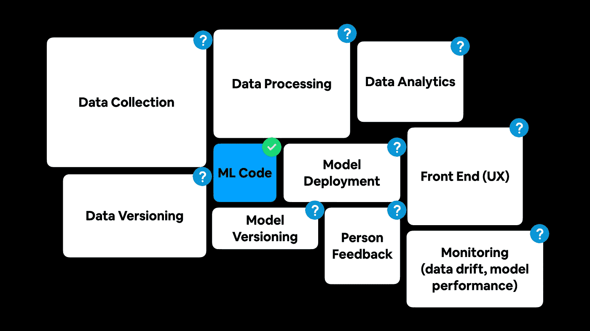
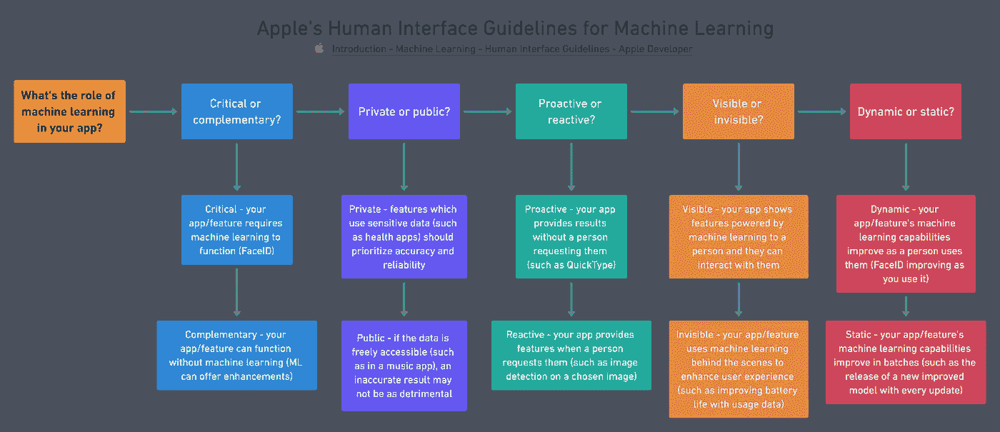
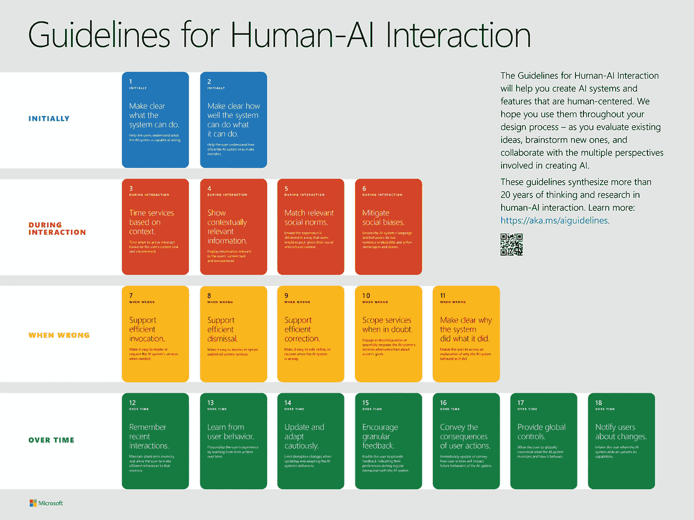
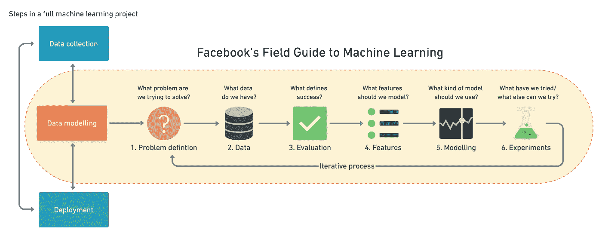
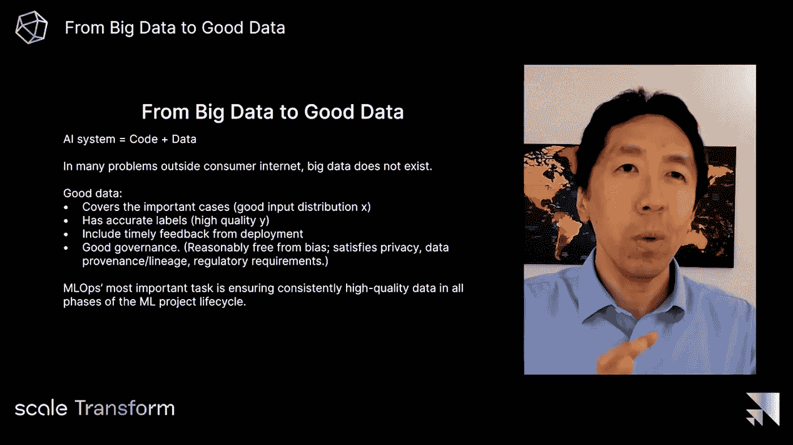

# 世界上最大的公司如何设计机器学习驱动的应用程序

> 原文：<https://towardsdatascience.com/how-the-worlds-biggest-companies-design-machine-learning-powered-applications-701f4114e089?source=collection_archive---------4----------------------->

## 认为机器学习可能对你的项目有帮助？这是最好的方法。

ML 代码只是拼图的一小部分。

经常有人问我:“我应该从事什么样的机器学习项目？”

我通常会回答“跟随你的好奇心”

为什么？

因为机器学习是实验性的，所以通过修补来解决问题对你最有利。通过尝试一些可能行不通的事情。

然而，机器学习项目不再是魔法作品。你正在阅读这篇文章的设备可能以你不知道的几种不同方式使用机器学习(见下面苹果的隐式机器学习)。

话虽如此，[本期 ML 月刊(2021 年 4 月版)](https://zerotomastery.io/blog/machine-learning-monthly-april-2021/)收集了世界范围内使用机器学习的公司的不同设计最佳实践。

通读之后，你会开始注意到事情的处理方式有很多重叠。这是好事。因为重叠部分可以用于您自己的项目。

随着模型和机器学习代码变得越来越可复制，你会注意到这里的一个首要主题:**机器学习是一个基础设施问题**。

这是你一直都知道的，“我如何以最快、最有效的方式将数据从一个地方转移到另一个地方？”

如果你正在考虑从事自己的机器学习项目，请通读下面的每一条指导方针，并尝试*了解更多*部分中的材料，但请记住，这些都不会取代你从自己的实验中获得的知识(指导方针、指南)。

> ***注:*** *我在整篇文章中交替使用了机器学习和人工智能(AI)这两个术语。你可以把“机器学习系统”读作“AI 系统”，反之亦然。*

# [苹果的机器学习人机界面指南](https://developer.apple.com/design/human-interface-guidelines/machine-learning/overview/introduction/)

我在图书馆的苹果 MacBook 上写下这些文字，在那里我可以看到至少 6 个其他的苹果标志。今天早上，我看到我前面的两个人用他们的 iPhones 支付他们的咖啡。

苹果设备无处不在。

它们都以许多不同的方式使用机器学习，以增强照片，延长电池寿命，通过 Siri 进行语音搜索，为快速输入提供建议。

[苹果的机器学习人机界面指南](https://developer.apple.com/design/human-interface-guidelines/machine-learning/overview/introduction/)分享了他们如何思考以及他们如何鼓励开发者考虑在他们的应用程序中使用机器学习。

他们从两个高层次的问题开始，并在此基础上进行分解:

1.  **机器学习在你的应用中有什么作用？**
2.  **什么是输入和输出？**

对于机器学习在你的应用中的作用，他们继续问，它是关键的(需要具备)还是补充的(最好具备)？是私立的还是公立的？是看得见还是看不见？动态还是静态？

对于输入和输出(我非常喜欢这种类比，因为它类似于 ML 模型的输入和输出)，他们讨论一个人将向你的系统输入什么，你的系统将向他们展示什么。

一个人会给一个模型**明确的反馈**吗？比如，他们会告诉你的模型是对还是错吗？还是你的系统收集了**隐性反馈**(除了使用应用程序，不需要用户做任何额外工作的反馈)？

当询问机器学习在你的应用/功能中扮演什么角色时要考虑的问题。**来源** : [苹果的机器学习人机界面指南](https://developer.apple.com/design/human-interface-guidelines/machine-learning/overview/roles/)。

# [谷歌的人和人工智能研究(一对)](https://pair.withgoogle.com/guidebook/)

谷歌的人工智能设计原则可以在他们的人与人工智能研究(PAIR)指南中找到。

结对指导手册还附带了一个[很棒的词汇表，里面有你在这个领域会遇到的许多不同的机器学习术语](https://pair.withgoogle.com/chapter/glossary/)(有很多)。它把设计一个人工智能项目分成六个部分。

## 用户需求+定义成功

*   人工智能的能力和使用你的服务的人的需求的交集在哪里？
*   你应该自动化(去掉一个痛苦的任务)还是用人工智能增强(改进)？
*   理想的结果是什么？

## 数据收集+评估

*   把一个人的需求变成数据需求(一切从数据开始)
*   你的数据从哪里来？(是否负责任地采购？)
*   构建、拟合和调整您的模型(好的模型始于好的数据)

## 心智模型(设定期望)

*   一个人相信你的 ML 系统能实现什么？

## 可解释性+信任

*   AI 系统是基于概率的(可能会给出奇怪的结果)，这怎么解释？
*   一个人应该了解 ML 模型如何做决策的哪些信息？(信心水平，“我们向您展示这个*，因为*您喜欢它…”)

## 反馈+控制

*   一个人如何提供反馈来帮助你的系统改进？

## 错误+优雅的失败

*   什么是“错误”，什么是“失败”？(无人驾驶汽车在绿灯时停下可能是一个*错误*，但闯红灯可能是一个*失败*)
*   ML 系统并不完美，你的系统最终会失败，当它失败时你会怎么做？

每个部分都有一张练习你所学内容的工作表。

通读指南(尤其是 PAIR)后，你会注意到一个趋势是**设定期望值**。坦率地说出您的系统的能力。如果一个人期望你的系统是神奇的(就像 ML 经常被描绘的那样)，但是没有意识到它的局限性，他们可能会失望。

# [微软的人机交互设计指南](https://www.microsoft.com/en-us/research/project/guidelines-for-human-ai-interaction/)

微软的人机交互设计指南分四个阶段解决这个问题:

1.  **最初**(一个人第一次使用你的系统应该知道什么？)
2.  **互动期间**(当一个人在使用你的服务时会发生什么？)
3.  **出错时**(你的系统出错了会怎么样？)
4.  **随着时间的推移**(随着时间的推移，你的系统如何改进？)

你会注意到微软的指导方针带你走进一个穿着你的 ML 系统的鞋子的人。我们再次看到一种趋势。

问题→创建解决方案(ML 或不 ML)→设定期望→允许反馈→有一个机制，当它是错误的时候→随着时间的推移改进(回到开始)。

微软的人机交互卡指南，从初始阶段开始，直到随着时间的推移，一个人与你的机器学习系统交互时该做什么。**来源:** [微软的人机交互指南](https://www.microsoft.com/en-us/research/project/guidelines-for-human-ai-interaction/)。

# [脸书机器学习领域指南](https://research.fb.com/blog/2018/05/the-facebook-field-guide-to-machine-learning-video-series/)

虽然以前的资源已经采取了整体 ML 系统的方法，但脸书的机器学习领域指南更侧重于事物的建模方面。

他们的视频系列将机器学习建模项目分为六个部分:

1.  **问题定义** —你想解决什么问题？
2.  **数据** —你有什么数据？
3.  **评价** —什么定义成功？
4.  **特征** —数据的哪些特征最符合您对成功的衡量标准？
5.  **模型** —什么模型最适合您的问题和数据？
6.  **实验**——你如何在前面的步骤上重复和改进？

但是，随着机器学习中建模方面的事情变得更容易获得(由于预先训练的模型、现有的代码库等)，记住机器学习的所有其他部分是很重要的。

我使用脸书的机器学习领域指南作为[零到精通数据科学和机器学习课程](https://dbourke.link/ZTMMLcourse)的大纲。你也可以在我的博客上阅读这些步骤的[扩展版。](https://www.mrdbourke.com/a-6-step-field-guide-for-building-machine-learning-projects/)

# [Spotify 设计 ML 驱动产品的 3 条原则](https://spotify.design/article/three-principles-for-designing-ml-powered-products)

你如何建立一个为全球 2.5 亿用户提供音乐的服务？

在你变魔术之前，你从手动开始(原则 3)，你不断地问正确的问题(原则 2)来识别使用你的服务的人在哪里面临摩擦(原则 1)。

上面这句话是对 [Spotify 设计机器学习驱动产品的三大原则](https://spotify.design/article/three-principles-for-designing-ml-powered-products)的文字游戏。

## 原则 1:识别摩擦并自动消除

在任何地方，一个人在使用你的服务时努力追求他们的目标都可以被认为是摩擦。

想象一下，一个人在 Spotify 上搜索新音乐，却找不到任何符合自己口味的东西。这样做可能会伤害某人的体验。

Spotify 意识到了这一点，并使用基于机器学习的推荐系统创建了 Discover Weekly(我目前正在听的)，这是一个每周都会更新新音乐的播放列表。

在我的情况下，看起来他们必须坚持他们的其他两个原则，同时建立它，因为这些轨道我听的是 bangers。

## 原则 2:问正确的问题

问吧。问吧。问吧。如果你不知道，你可能会在错误的方向设计产品。

就像上面的许多其他指导步骤挑战你从使用你的服务的人的角度思考一样，这是问正确问题的目标:找出你的客户有什么问题，看看你是否可以使用机器学习来解决它们。

## 原则 3:在使用魔法之前先使用手册

找到了摩擦源？

不用机器学习能解决吗？

从启发式(事情应该如何工作的想法)开始怎么样？

就像如果你是 Spotify，并试图建立一个某人感兴趣的新音乐的播放列表，你如何将一些东西归类为新的？

您的起始启发式规则可能是任何超过 30 天的内容都不会被归类为新内容。

在测试了多种启发和假设(一个手动过程)之后，你可以再次评估机器学习是否有帮助。因为你的实验，你会从一个非常消息灵通的角度这样做。

# 吴恩达《从大数据到好数据》

吴恩达[在 Scale 最近的会议](https://scale.com/events/transform/videos/big-data-to-good-data)上发表了一篇关于 ML 系统从大数据到好数据的移动的演讲。 [Roboflow 对要点](https://blog.roboflow.com/andrew-ng-scale-transform-conference/)做了一个很好的总结——所有这些都与我们上面讨论的内容有关。

我最喜欢的包括:

*   **开始部署是一个起点**而不是终点(缩小概念验证和生产差距)
*   **从大数据到好数据** (MLOps 最重要的任务是确保 ML 项目生命周期所有阶段的高质量数据，并非所有公司都能访问大数据)
*   **冻结你的代码库，迭代你的数据**(对于许多问题来说，模型是一个已解决的问题，数据是所需要的)

吴恩达谈到思考好数据和大数据的重要性。**来源:** [吴恩达在 Scale's Transform conference 上的《从大数据到好数据》演讲](https://scale.com/events/transform/videos/big-data-to-good-data)。

# 了解更多信息

以上都是关于如何*考虑*构建 ML 驱动系统的指导方针。但是他们不一定向你展示工具或者如何去做。

以下是我推荐的额外资源，可以填补上面留下的空白。

选择一个并通读/研究所有的材料/实验，同时构建你自己的 ML-powered 项目。

*   [**机器学习的工程最佳实践(软件工程 4 机器学习)**](https://se-ml.github.io/practices/) —关于使用机器学习组件开发软件系统的全面指南。
*   安德烈·布尔科夫的《机器学习工程》一书——上面讨论的许多指导方针和步骤的一站式商店，我把这本书放在我的桌子上，用作参考。
*   [**CS329s:机器学习系统设计**](https://stanford-cs329s.github.io/)——一门完整的斯坦福课程，涵盖了设计机器学习驱动的系统的所有步骤。由来自许多不同机器学习公司的工程师的 [Chip Huyen](https://huyenchip.com/) 带领嘉宾演讲([包括一个来自你的真实](https://youtu.be/fw6NMQrYc6w))。
*   [**全栈深度学习**](https://fullstackdeeplearning.com/) —机器学习并不是一个模型一旦建立起来就停止的(而且看了上面你就知道模型是整个系统的一小部分)。全栈深度学习引入了许多围绕模型构建的步骤，如数据存储、数据操作、数据版本化(注意对数据的强调)、模型部署以及实现它们的不同工具。
*   [**用 ML 制作的 MLOps 课程**](https://madewithml.com/courses/mlops/) — MLOps =机器学习操作。由悟空莫汉达斯以学徒的风格制作了“我将如何构建一个 ML 驱动的服务，你也可以如何做”。
*   [**LJ Miranda 关于数据科学家软件工程技能的杰出博客**](https://ljvmiranda921.github.io/notebook/2020/11/15/data-science-swe/)**——如果我要写一篇关于从构建模型(在笔记本上)到编写全栈代码的博客，那就是这篇了。**

**PS 你可以在 YouTube 上看到这篇文章的[视频版本。](https://youtu.be/Pp_OTo4SDD0)**

**[这篇文章最初出现在 2021 年 4 月的[机器学习月刊](https://zerotomastery.io/blog/machine-learning-monthly-april-2021/)上，这是我写的一份月度时事通讯，包含机器学习领域的最新和最棒的(但不总是最新的)。]**